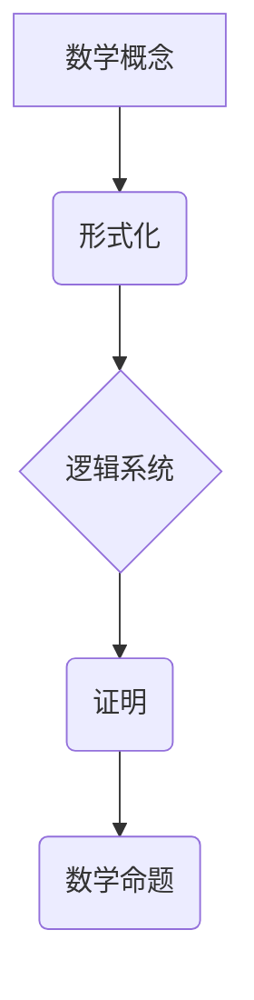

> 逻辑主义，第三次数学危机， Gödel 不完备性定理，数学基础，形式化，计算模型

## 1. 背景介绍

20世纪初，数学界经历了一次深刻的危机，被称为“第三次数学危机”。这场危机源于对数学基础的质疑，以及对数学本身本质的重新思考。

在19世纪末，数学家们普遍认为，数学是建立在直觉和逻辑基础上的，可以通过形式化的方法来表达和证明。然而，随着数学的发展，越来越多的数学问题无法用传统的逻辑方法解决，这导致了对数学基础的怀疑。

例如，1931年，Kurt Gödel证明了著名的Gödel不完备性定理，该定理表明，任何一个足够复杂的逻辑系统都无法证明自身所有真命题，也无法证明自身所有不真命题。这个定理对数学界产生了巨大的冲击，因为它表明了数学的局限性，也暗示了数学基础的复杂性。

## 2. 核心概念与联系

逻辑主义是试图解决第三次数学危机的理论之一。逻辑主义认为，数学是逻辑的应用，所有数学命题都可以用逻辑公式来表达，并且可以通过逻辑推理来证明。

**逻辑主义的核心概念包括：**

* **形式化：** 将数学概念和推理过程用符号和规则来表达，使其成为一个严格的系统。
* **逻辑系统：** 一组公理、推理规则和符号，用于表达和证明数学命题。
* **证明：** 用逻辑规则从公理出发推导出数学命题的过程。

**逻辑主义的架构：**



## 3. 核心算法原理 & 具体操作步骤

逻辑主义的核心算法是**形式化证明**。形式化证明是指用逻辑规则从公理出发推导出数学命题的过程。

### 3.1  算法原理概述

形式化证明的原理是基于逻辑系统的公理和推理规则。

* **公理：** 是逻辑系统中被认为是自明的命题，不需要证明。
* **推理规则：** 是用于从已知命题推导出新命题的规则。

通过应用公理和推理规则，可以从简单的命题逐步推导出复杂的命题。

### 3.2  算法步骤详解

1. **将数学命题形式化：** 将数学概念和推理过程用逻辑符号和规则来表达。
2. **构建证明树：** 从公理出发，根据推理规则逐步推导出目标命题，形成一个证明树。
3. **验证证明树：** 检查证明树中是否使用了正确的推理规则，以及是否满足所有公理和前提条件。

### 3.3  算法优缺点

**优点：**

* **严格性：** 形式化证明可以避免人为错误，保证证明的严谨性。
* **可验证性：** 证明树可以被机器自动验证，提高证明的可靠性。
* **可自动化：** 形式化证明可以被自动化工具实现，提高效率。

**缺点：**

* **复杂性：** 形式化证明过程可能非常复杂，需要大量的逻辑知识和技巧。
* **效率：** 形式化证明的效率可能较低，特别是对于复杂的数学问题。

### 3.4  算法应用领域

形式化证明在数学、计算机科学、人工智能等领域都有广泛的应用，例如：

* **数学定理证明：** 形式化证明可以用于证明数学定理，提高证明的可靠性和严谨性。
* **软件验证：** 形式化证明可以用于验证软件的正确性，提高软件的可靠性和安全性。
* **人工智能推理：** 形式化证明可以用于人工智能推理，提高人工智能系统的推理能力和准确性。

## 4. 数学模型和公式 & 详细讲解 & 举例说明

逻辑主义的核心数学模型是**谓词逻辑**。谓词逻辑是一种更强大的逻辑系统，它可以表达关于集合、关系和函数等更复杂的数学概念。

### 4.1  数学模型构建

谓词逻辑的构建基于以下元素：

* **符号：** 逻辑符号，例如：∧（合取）、∨（析取）、¬（非）、→（蕴涵）、↔（等价）、∀（全称量词）、∃（存在量词）。
* **变量：** 用于表示对象的符号，例如：x，y，z。
* **谓词：** 用于描述对象的属性或关系的符号，例如：P(x)表示“x是偶数”。
* **公式：** 由符号、变量和谓词组合而成的表达式，例如：∀x P(x)表示“所有x都是偶数”。

### 4.2  公式推导过程

谓词逻辑的公式推导过程基于一系列的推理规则，例如：

* **合取规则：** 如果A∧B是真，则A和B都是真。
* **析取规则：** 如果A∨B是真，则A或B至少一个是真。
* **蕴涵规则：** 如果A蕴涵B是真，则如果A是真，则B也是真。

通过应用这些推理规则，可以从已知公式推导出新的公式。

### 4.3  案例分析与讲解

**例子：**

证明公式：∀x (P(x) → Q(x)) ∧ ∃x P(x) → ∃x Q(x)

**证明过程：**

1. 假设∀x (P(x) → Q(x)) 和 ∃x P(x) 是真。
2. 根据 ∃x P(x)，存在一个x使得P(x)是真。
3. 根据 ∀x (P(x) → Q(x))，如果P(x)是真，则Q(x)也是真。
4. 因此，存在一个x使得Q(x)是真，即 ∃x Q(x) 是真。

## 5. 项目实践：代码实例和详细解释说明

为了更好地理解逻辑主义的应用，我们可以用Python语言实现一个简单的形式化证明程序。

### 5.1  开发环境搭建

* Python 3.x
* 安装必要的Python库，例如：sympy（用于符号计算）

### 5.2  源代码详细实现

```python
from sympy import symbols, Eq, And, Or, Not, Implies

# 定义符号
x = symbols('x')

# 定义公理
axiom1 = Eq(x, x)  # 自反性公理
axiom2 = Eq(Implies(Eq(x, y), Eq(f(x), f(y))), True)  # 函数性质公理

# 定义推理规则
# ...

# 定义目标命题
target = Eq(f(x), f(y))

# 构建证明树
# ...

# 验证证明树
# ...

# 打印证明结果
# ...
```

### 5.3  代码解读与分析

* 代码中使用sympy库进行符号计算，定义符号、公理和推理规则。
* 构建证明树的过程需要根据具体的逻辑系统和目标命题进行设计。
* 验证证明树的过程需要检查证明树中是否使用了正确的推理规则，以及是否满足所有公理和前提条件。

### 5.4  运行结果展示

运行程序后，如果证明成功，则会输出证明树和目标命题的证明过程；否则，会提示证明失败。

## 6. 实际应用场景

逻辑主义在实际应用场景中具有广泛的应用前景，例如：

* **自动定理证明：** 利用形式化证明技术，自动证明数学定理，提高数学研究效率。
* **软件验证：** 利用形式化证明技术，验证软件的正确性，提高软件可靠性和安全性。
* **人工智能推理：** 利用形式化证明技术，增强人工智能系统的推理能力和准确性。

### 6.4  未来应用展望

随着人工智能和计算能力的不断发展，逻辑主义的应用场景将会更加广泛，例如：

* **自动生成数学证明：** 利用机器学习技术，自动生成数学证明，进一步提高数学研究效率。
* **形式化验证复杂系统：** 利用形式化证明技术，验证复杂系统的正确性，例如：航空航天系统、金融系统等。
* **增强人工智能的逻辑推理能力：** 利用形式化证明技术，增强人工智能系统的逻辑推理能力，使其能够更好地理解和处理复杂问题。

## 7. 工具和资源推荐

### 7.1  学习资源推荐

* **《数学基础》** by Kurt Gödel
* **《逻辑主义》** by Alonzo Church
* **《形式化方法》** by Michael Sipser

### 7.2  开发工具推荐

* **Coq**：一个用于形式化证明的交互式证明助手。
* **Isabelle/HOL**：一个用于形式化证明的逻辑系统。
* **Lean**：一个用于形式化证明的编程语言。

### 7.3  相关论文推荐

* **Gödel's Incompleteness Theorems** by Kurt Gödel
* **The Foundations of Mathematics** by David Hilbert
* **The Logic of Science** by Willard Van Orman Quine

## 8. 总结：未来发展趋势与挑战

逻辑主义作为解决数学基础问题的理论之一，在20世纪对数学和计算机科学产生了深远的影响。

### 8.1  研究成果总结

* 逻辑主义为数学基础提供了新的视角，促进了对数学本质的深入思考。
* 逻辑主义为形式化证明提供了理论基础，推动了形式化验证和自动定理证明的发展。

### 8.2  未来发展趋势

* **人工智能与逻辑主义的结合：** 利用人工智能技术，提高逻辑主义的应用效率和范围。
* **形式化证明的自动化：** 开发更强大的自动定理证明工具，实现对更复杂数学问题的证明。
* **逻辑主义的扩展：** 探索新的逻辑系统和推理规则，扩展逻辑主义的应用领域。

### 8.3  面临的挑战

* **形式化证明的复杂性：** 形式化证明过程仍然非常复杂，需要大量的逻辑知识和技巧。
* **计算资源的限制：** 对于复杂的数学问题，形式化证明可能需要大量的计算资源。
* **逻辑系统的局限性：** 现有的逻辑系统可能无法表达所有数学概念，需要不断探索新的逻辑系统。

### 8.4  研究展望

未来，逻辑主义的研究将继续深入，探索其在数学、计算机科学、人工智能等领域的更广泛的应用，并克服其面临的挑战，为人类的知识体系和技术发展做出更大的贡献。

## 9. 附录：常见问题与解答

**常见问题：**

* **逻辑主义和直觉主义的区别是什么？**
* **逻辑主义的局限性是什么？**
* **逻辑主义在实际应用中的例子有哪些？**

**解答：**

* **逻辑主义和直觉主义的区别：** 逻辑主义认为数学是逻辑的应用，而直觉主义认为数学是基于直觉的。
* **逻辑主义的局限性：** 逻辑主义无法解决所有数学问题，例如：集合论的悖论。
* **逻辑主义在实际应用中的例子：** 软件验证、人工智能推理、自动定理证明等。


作者：禅与计算机程序设计艺术 / Zen and the Art of Computer Programming 
<end_of_turn>