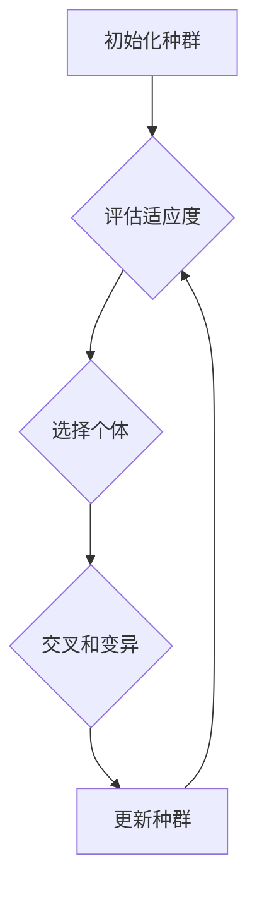

> 进化计算，遗传算法，自然选择，适应度函数，复杂性计算，优化问题

## 1. 背景介绍

在计算领域，我们不断追求更高效、更智能的算法来解决复杂问题。传统算法往往依赖于明确的规则和步骤，而面对复杂、多变的现实世界，这些算法可能显得力不从心。进化计算作为一种新兴的计算范式，借鉴了自然界生物进化机制，为解决复杂问题提供了新的思路和方法。

进化计算的核心思想是通过模拟自然选择和遗传机制，逐步优化解空间，最终找到最优或近似最优的解。这种方法具有强大的适应性，能够处理非线性、多模态、高维等复杂问题，在许多领域展现出巨大的应用潜力。

## 2. 核心概念与联系

### 2.1 进化计算的基本概念

进化计算的核心概念包括：

* **种群:**  进化计算中的个体集合，每个个体代表一个可能的解。
* **适应度函数:** 用于评估个体解的优劣，高适应度代表解更优。
* **选择:** 根据适应度函数，选择更优的个体进行繁殖。
* **交叉:** 从两个父代个体中选择部分基因进行交换，产生新的子代个体。
* **变异:** 在子代个体基因上随机进行改变，增加遗传多样性。

### 2.2 进化计算的流程

进化计算的流程通常包括以下步骤：

1. **初始化种群:**  随机生成初始种群，每个个体代表一个可能的解。
2. **评估适应度:**  计算每个个体的适应度值。
3. **选择个体:**  根据适应度值，选择部分个体进行繁殖。
4. **交叉和变异:**  对选中的个体进行交叉和变异操作，产生新的子代个体。
5. **更新种群:**  用新的子代个体替换部分老一代个体，形成新的种群。
6. **重复步骤2-5:**  重复以上步骤，直到达到终止条件，例如最大迭代次数或目标适应度值。



## 3. 核心算法原理 & 具体操作步骤

### 3.1 算法原理概述

遗传算法 (Genetic Algorithm, GA) 是一种进化计算算法，它通过模拟自然选择和遗传机制，逐步优化解空间，找到最优或近似最优的解。

遗传算法的基本原理是：

* **种群进化:**  算法从一个随机生成的种群开始，通过迭代过程不断优化种群，最终找到最优解。
* **适应度函数:**  适应度函数用于评估每个个体的优劣，高适应度代表解更优。
* **选择、交叉、变异:**  算法使用选择、交叉和变异操作来生成新的个体，并传递遗传信息。

### 3.2 算法步骤详解

1. **初始化种群:**  随机生成初始种群，每个个体代表一个可能的解。
2. **评估适应度:**  计算每个个体的适应度值。
3. **选择个体:**  根据适应度值，选择部分个体进行繁殖。常用的选择方法包括轮盘赌选择、锦标赛选择等。
4. **交叉操作:**  从两个父代个体中选择部分基因进行交换，产生新的子代个体。常用的交叉方法包括单点交叉、双点交叉等。
5. **变异操作:**  在子代个体基因上随机进行改变，增加遗传多样性。常用的变异方法包括随机变异、均匀变异等。
6. **更新种群:**  用新的子代个体替换部分老一代个体，形成新的种群。
7. **重复步骤2-6:**  重复以上步骤，直到达到终止条件，例如最大迭代次数或目标适应度值。

### 3.3 算法优缺点

**优点:**

* **适应性强:**  能够处理非线性、多模态、高维等复杂问题。
* **全局搜索能力:**  能够搜索整个解空间，找到全局最优解或近似最优解。
* **并行化能力:**  能够并行执行，提高计算效率。

**缺点:**

* **收敛速度慢:**  进化算法的收敛速度相对较慢。
* **参数设置困难:**  遗传算法需要设置多个参数，例如种群大小、交叉概率、变异概率等，参数设置不当会影响算法性能。
* **易陷入局部最优:**  进化算法可能陷入局部最优解，无法找到全局最优解。

### 3.4 算法应用领域

遗传算法广泛应用于以下领域：

* **优化问题:**  例如调度问题、资源分配问题、路径规划问题等。
* **机器学习:**  例如特征选择、模型参数优化等。
* **人工智能:**  例如机器人控制、游戏人工智能等。
* **工程设计:**  例如结构优化、电路设计等。

## 4. 数学模型和公式 & 详细讲解 & 举例说明

### 4.1 数学模型构建

遗传算法的数学模型可以描述为一个动态系统，其中种群随着迭代过程不断变化。

* **种群:**  用向量 $P = (p_1, p_2, ..., p_N)$ 表示，其中 $p_i$ 代表第 $i$ 个个体。
* **适应度函数:**  用函数 $f(p)$ 表示，其中 $p$ 代表个体，$f(p)$ 代表个体的适应度值。
* **选择概率:**  用函数 $s(p)$ 表示，其中 $p$ 代表个体，$s(p)$ 代表个体被选择的概率。

### 4.2 公式推导过程

选择概率通常根据适应度函数进行计算，常用的选择方法包括：

* **轮盘赌选择:**  选择概率与适应度值成正比。
* **锦标赛选择:**  随机选择多个个体进行比赛，胜者获得更高的选择概率。

交叉和变异操作的概率分别为 $c$ 和 $v$。

### 4.3 案例分析与讲解

假设我们有一个优化问题，目标是找到一个最大化函数 $f(x)$ 的值，其中 $x$ 是一个实数。我们可以使用遗传算法来解决这个问题。

1. **初始化种群:**  随机生成 $N$ 个个体，每个个体代表一个可能的解 $x_i$。
2. **评估适应度:**  计算每个个体的适应度值 $f(x_i)$。
3. **选择个体:**  使用轮盘赌选择方法选择 $N/2$ 个个体进行繁殖。
4. **交叉操作:**  对选中的个体进行单点交叉操作，产生新的子代个体。
5. **变异操作:**  在子代个体基因上随机进行改变，增加遗传多样性。
6. **更新种群:**  用新的子代个体替换部分老一代个体，形成新的种群。
7. **重复步骤2-6:**  重复以上步骤，直到达到终止条件，例如最大迭代次数或目标适应度值。

## 5. 项目实践：代码实例和详细解释说明

### 5.1 开发环境搭建

本项目使用 Python 语言进行开发，需要安装以下软件包：

* Python 3.x
* NumPy
* matplotlib

### 5.2 源代码详细实现

```python
import numpy as np
import matplotlib.pyplot as plt

# 定义适应度函数
def fitness_function(x):
    return x**2

# 定义遗传算法
def genetic_algorithm(population_size, generations, crossover_rate, mutation_rate):
    # 初始化种群
    population = np.random.rand(population_size)

    # 迭代计算
    for generation in range(generations):
        # 评估适应度
        fitness_values = fitness_function(population)

        # 选择个体
        selected_indices = np.random.choice(population_size, size=population_size, p=fitness_values / np.sum(fitness_values))

        # 交叉操作
        crossover_indices = np.random.rand(population_size // 2) < crossover_rate
        if np.any(crossover_indices):
            parents = population[selected_indices[crossover_indices]]
            offspring = np.zeros_like(parents)
            for i in range(0, population_size // 2, 2):
                offspring[i] = parents[i, :crossover_point]
                offspring[i + 1] = parents[i + 1, crossover_point:]
            population[selected_indices[crossover_indices]] = offspring

        # 变异操作
        mutation_indices = np.random.rand(population_size) < mutation_rate
        if np.any(mutation_indices):
            population[mutation_indices] += np.random.randn(population_size[mutation_indices])

    # 返回最佳解
    best_index = np.argmax(fitness_values)
    return population[best_index]

# 设置参数
population_size = 100
generations = 100
crossover_rate = 0.8
mutation_rate = 0.1

# 执行遗传算法
best_solution = genetic_algorithm(population_size, generations, crossover_rate, mutation_rate)

# 打印最佳解
print("最佳解:", best_solution)

# 绘制适应度曲线
fitness_values = np.array([fitness_function(population) for population in population])
plt.plot(fitness_values)
plt.xlabel("迭代次数")
plt.ylabel("适应度值")
plt.title("适应度曲线")
plt.show()
```

### 5.3 代码解读与分析

* **适应度函数:**  定义了需要优化的目标函数。
* **遗传算法函数:**  实现了遗传算法的核心逻辑，包括初始化种群、评估适应度、选择个体、交叉操作、变异操作和更新种群。
* **参数设置:**  设置了遗传算法的参数，例如种群大小、迭代次数、交叉概率和变异概率。
* **代码执行:**  执行遗传算法，并打印最佳解。
* **适应度曲线:**  绘制了适应度值随迭代次数的变化曲线，可以观察算法的收敛过程。

### 5.4 运行结果展示

运行代码后，会输出最佳解，并绘制适应度曲线。适应度曲线通常呈现上升趋势，表明算法在迭代过程中不断优化解空间，最终找到近似最优解。

## 6. 实际应用场景

### 6.1 优化问题

遗传算法广泛应用于各种优化问题，例如：

* **调度问题:**  例如车辆调度、任务调度等。
* **资源分配问题:**  例如机器资源分配、网络资源分配等。
* **路径规划问题:**  例如物流配送路径规划、机器人路径规划等。

### 6.2 机器学习

遗传算法可以用于机器学习领域，例如：

* **特征选择:**  选择最优特征子集，提高模型性能。
* **模型参数优化:**  优化模型参数，提高模型精度。
* **神经网络训练:**  加速神经网络训练，提高训练效率。

### 6.3 其他应用

遗传算法还可以应用于其他领域，例如：

* **工程设计:**  例如结构优化、电路设计等。
* **金融投资:**  例如股票投资组合优化、风险管理等。
* **生物信息学:**  例如蛋白质结构预测、基因序列分析等。

### 6.4 未来应用展望

随着人工智能和计算能力的不断发展，遗传算法的应用范围将更加广泛。未来，遗传算法可能在以下领域发挥更大的作用：

* **复杂系统优化:**  解决复杂系统中的优化问题，例如城市交通优化、能源管理优化等。
*