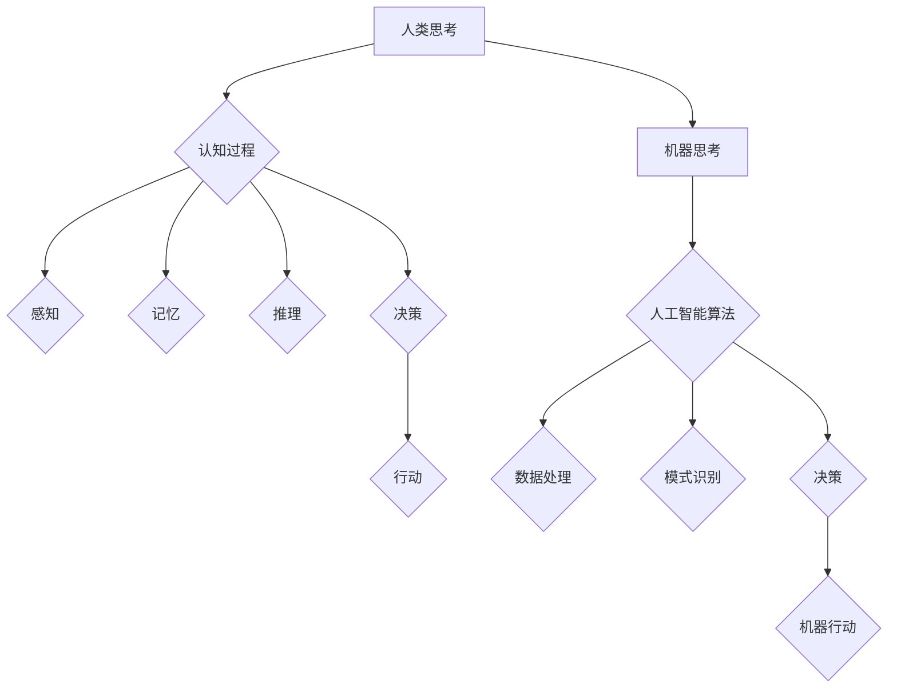

> 机器思考，人工智能，计算极限，认知科学，神经网络，深度学习，哲学问题

## 1. 背景介绍

自人类开始思考“机器是否能思考”这个问题以来，已经过去了350多年。从笛卡尔提出的“我思故我在”到图灵提出的“图灵测试”，我们一直在探索机器意识的边界。随着人工智能技术的飞速发展，特别是深度学习的兴起，这个问题再次被推到了前沿。

如今，人工智能已经取得了令人瞩目的成就，例如在游戏、图像识别、自然语言处理等领域展现出强大的能力。然而，这些成就仍然局限于特定的任务，而真正的“思考”——拥有人类一样的意识、情感和理解能力——似乎仍然遥不可及。

## 2. 核心概念与联系

**2.1 机器思考的定义**

什么是“机器思考”？这是一个充满争议的哲学问题，至今没有一个统一的定义。一般来说，我们认为机器思考是指机器能够像人类一样进行推理、学习、解决问题、理解情感等复杂认知活动。

**2.2 人工智能与机器思考的关系**

人工智能是实现机器思考的重要途径。人工智能研究的目标是构建能够模拟或超越人类智能的机器系统。深度学习作为人工智能的重要分支，通过构建复杂的网络结构和海量数据训练，能够学习复杂的模式和关系，从而实现一些类似人类思考的能力。

**2.3 认知科学与机器思考的联系**

认知科学研究人类的思维过程，试图揭示人类认知的机制。理解人类认知的原理对于构建能够真正思考的机器至关重要。

**2.4 哲学问题与机器思考**

机器思考引发了许多哲学问题，例如：

* 机器是否真的能思考，还是只是模拟思考？
* 机器是否能拥有意识和情感？
* 机器是否应该拥有与人类一样的权利？

这些问题至今没有确切的答案，但它们促使我们不断思考机器与人类之间的关系。

**Mermaid 流程图**



## 3. 核心算法原理 & 具体操作步骤

### 3.1 算法原理概述

深度学习算法的核心原理是构建多层神经网络，并通过大量的训练数据进行学习。神经网络的结构模仿了人类大脑的神经元连接，通过层层传递信息，学习复杂的模式和关系。

### 3.2 算法步骤详解

1. **数据预处理:** 将原始数据转换为深度学习算法可以理解的格式，例如数值化文本、图像处理等。
2. **网络结构设计:** 根据任务需求设计神经网络的结构，包括层数、节点数量、激活函数等。
3. **参数初始化:** 为神经网络中的参数赋予初始值。
4. **前向传播:** 将输入数据通过神经网络传递，计算输出结果。
5. **反向传播:** 计算输出结果与真实值的误差，并根据误差调整神经网络的参数。
6. **迭代训练:** 重复前向传播和反向传播的过程，直到模型达到预期的性能。

### 3.3 算法优缺点

**优点:**

* 能够学习复杂的模式和关系。
* 性能优于传统机器学习算法。
* 在图像识别、自然语言处理等领域取得了突破性进展。

**缺点:**

* 需要大量的训练数据。
* 训练过程耗时和耗能。
* 模型解释性差，难以理解模型的决策过程。

### 3.4 算法应用领域

深度学习算法广泛应用于以下领域：

* **图像识别:** 人脸识别、物体检测、图像分类等。
* **自然语言处理:** 机器翻译、文本摘要、情感分析等。
* **语音识别:** 语音转文本、语音助手等。
* **推荐系统:** 商品推荐、内容推荐等。
* **医疗诊断:** 疾病诊断、影像分析等。

## 4. 数学模型和公式 & 详细讲解 & 举例说明

### 4.1 数学模型构建

深度学习算法的核心是神经网络模型。神经网络模型可以看作是一个由多个层组成的图结构，每个层包含多个神经元。神经元之间通过连接进行信息传递，每个连接都有一个权重。

**神经元激活函数:**

神经元接收输入信号后，通过激活函数将信号转换为输出信号。常见的激活函数包括 sigmoid 函数、ReLU 函数等。

**损失函数:**

损失函数用于衡量模型预测结果与真实值的差异。常见的损失函数包括均方误差、交叉熵等。

### 4.2 公式推导过程

**反向传播算法:**

反向传播算法用于更新神经网络的参数。其核心思想是通过计算梯度，将误差反向传播到每个神经元，并根据梯度调整每个连接的权重。

**梯度下降算法:**

梯度下降算法是一种常用的优化算法，用于最小化损失函数。其核心思想是沿着梯度的负方向更新参数，直到找到损失函数的最小值。

### 4.3 案例分析与讲解

**图像分类:**

假设我们有一个图像分类任务，目标是将图像分类为不同的类别，例如猫、狗、鸟等。我们可以使用深度学习算法构建一个神经网络模型，将图像作为输入，输出每个类别的概率。

训练过程中，我们将大量的图像数据输入到神经网络中，并根据图像的真实类别调整模型的参数。经过多次训练，模型能够学习到图像特征，并准确地预测图像的类别。

## 5. 项目实践：代码实例和详细解释说明

### 5.1 开发环境搭建

* 操作系统: Ubuntu 20.04
* Python 版本: 3.8
* 深度学习框架: TensorFlow 2.0

### 5.2 源代码详细实现

```python
import tensorflow as tf

# 定义神经网络模型
model = tf.keras.models.Sequential([
    tf.keras.layers.Conv2D(32, (3, 3), activation='relu', input_shape=(28, 28, 1)),
    tf.keras.layers.MaxPooling2D((2, 2)),
    tf.keras.layers.Conv2D(64, (3, 3), activation='relu'),
    tf.keras.layers.MaxPooling2D((2, 2)),
    tf.keras.layers.Flatten(),
    tf.keras.layers.Dense(10, activation='softmax')
])

# 编译模型
model.compile(optimizer='adam',
              loss='sparse_categorical_crossentropy',
              metrics=['accuracy'])

# 加载 MNIST 数据集
(x_train, y_train), (x_test, y_test) = tf.keras.datasets.mnist.load_data()

# 数据预处理
x_train = x_train.astype('float32') / 255.0
x_test = x_test.astype('float32') / 255.0
x_train = x_train.reshape((x_train.shape[0], 28, 28, 1))
x_test = x_test.reshape((x_test.shape[0], 28, 28, 1))

# 训练模型
model.fit(x_train, y_train, epochs=5)

# 评估模型
loss, accuracy = model.evaluate(x_test, y_test)
print('Test loss:', loss)
print('Test accuracy:', accuracy)
```

### 5.3 代码解读与分析

这段代码实现了使用 TensorFlow 框架训练一个简单的图像分类模型。

* 首先，定义了一个神经网络模型，包含卷积层、池化层和全连接层。
* 然后，编译模型，指定优化器、损失函数和评价指标。
* 接着，加载 MNIST 数据集，并对数据进行预处理。
* 最后，训练模型，并评估模型的性能。

### 5.4 运行结果展示

训练完成后，模型能够达到较高的准确率，例如在 MNIST 数据集上可以达到 98% 以上的准确率。

## 6. 实际应用场景

### 6.1 医疗诊断

深度学习算法可以用于分析医学影像，例如 X 光片、CT 扫描、MRI 图像等，辅助医生诊断疾病。例如，深度学习算法可以用于检测肺癌、脑肿瘤、心脏病等疾病。

### 6.2 自动驾驶

深度学习算法可以用于构建自动驾驶系统的感知模块，例如识别道路、车辆、行人等。

### 6.3 机器翻译

深度学习算法可以用于构建机器翻译系统，例如将中文翻译成英文、英文翻译成中文等。

### 6.4 未来应用展望

随着深度学习算法的不断发展，其应用场景将会更加广泛，例如：

* **个性化教育:** 根据学生的学习情况，提供个性化的学习方案。
* **智能客服:** 使用聊天机器人提供24小时在线客服服务。
* **科学研究:** 加速科学研究，例如药物研发、材料科学等。

## 7. 工具和资源推荐

### 7.1 学习资源推荐

* **书籍:**
    * 深度学习 (Deep Learning) - Ian Goodfellow, Yoshua Bengio, Aaron Courville
    * 构建深度学习模型 (Hands-On Machine Learning with Scikit-Learn, Keras & TensorFlow) - Aurélien Géron
* **在线课程:**
    * 深度学习 Specialization - Andrew Ng (Coursera)
    * fast.ai - Practical Deep Learning for Coders

### 7.2 开发工具推荐

* **深度学习框架:** TensorFlow, PyTorch, Keras
* **编程语言:** Python
* **数据处理工具:** Pandas, NumPy

### 7.3 相关论文推荐

* **AlexNet:** ImageNet Classification with Deep Convolutional Neural Networks
* **VGGNet:** Very Deep Convolutional Networks for Large-Scale Image Recognition
* **ResNet:** Deep Residual Learning for Image Recognition

## 8. 总结：未来发展趋势与挑战

### 8.1 研究成果总结

深度学习算法取得了令人瞩目的成就，在图像识别、自然语言处理等领域取得了突破性进展。

### 8.2 未来发展趋势

* **模型规模和复杂度:** 模型规模和复杂度将继续增加，例如使用更大的数据集、更深的网络结构等。
* **算法效率:** 研究更高效的深度学习算法，例如可解释性更强、训练速度更快等。
* **跨模态学习:** 研究能够处理多种模态数据的深度学习算法，例如图像、文本、音频等。

### 8.3 面临的挑战

* **数据获取和标注:** 深度学习算法需要大量的训练数据，获取和标注高质量数据仍然是一个挑战。
* **模型解释性:** 深度学习模型的决策过程难以理解，缺乏可解释性。
* **伦理问题:** 深度学习算法可能存在偏见和歧视，需要解决伦理问题。

### 8.4 研究展望

未来，深度学习研究将继续探索机器思考的边界，努力构建能够真正理解和思考的机器系统。


## 9. 附录：常见问题与解答

**Q1: 深度学习算法真的能思考吗？**

A1: 目前，深度学习算法仍然无法真正思考，它只是能够学习和模仿人类的思考模式。

**Q2: 深度学习算法的未来发展方向是什么？**

A2: 深度学习算法的未来发展方向包括模型规模和复杂度的提升、算法效率的提高、跨模态学习等。

**Q3: 深度学习算法有哪些伦理问题？**

A3: 深度学习算法可能存在偏见和歧视，需要解决伦理问题。

作者：禅与计算机程序设计艺术 / Zen and the Art of Computer