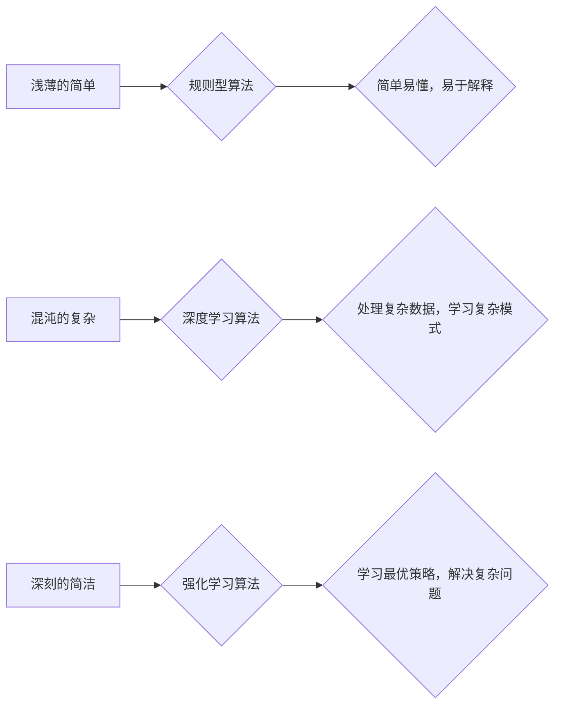

> 认知发展、人工智能、简单、复杂、简洁、深度学习、神经网络、算法、模型、应用

## 1. 背景介绍

在人工智能领域，我们不断追求更智能、更强大的模型，以期能够更好地理解和模拟人类的认知能力。然而，认知的本质是一个复杂而深奥的问题，它涉及到感知、记忆、推理、语言等多个方面。

从人类认知发展的角度来看，我们可以将认知过程分为三个阶段：

* **浅薄的简单:** 初始阶段，认知能力有限，主要依赖于简单的规则和模式识别。
* **混沌的复杂:** 随着知识和经验的积累，认知能力逐渐复杂化，但同时也变得更加难以理解和控制。
* **深刻的简洁:** 通过对复杂问题的深入理解和抽象，最终形成简洁、高效的认知模型。

这三个阶段并非严格的界限，而是认知发展的一个连续过程。

## 2. 核心概念与联系

### 2.1 认知发展阶段

* **浅薄的简单:** 

   * 认知能力有限，主要依赖于简单的规则和模式识别。
   * 例如，婴儿期对物体形状、颜色、声音的识别。
   * 算法：规则型算法，例如决策树、朴素贝叶斯等。

* **混沌的复杂:** 

   * 知识和经验的积累导致认知能力复杂化。
   * 难以用简单的规则和模式解释。
   * 例如，青少年期的抽象思维、情感理解等。
   * 算法：深度学习算法，例如卷积神经网络、循环神经网络等。

* **深刻的简洁:** 

   * 通过对复杂问题的深入理解和抽象，形成简洁、高效的认知模型。
   * 例如，专家级知识的掌握，能够快速解决复杂问题。
   * 算法：强化学习算法，例如Q学习、SARSA等。

### 2.2 算法与认知阶段的对应关系

| 认知阶段 | 算法类型 | 特点 |
|---|---|---|
| 浅薄的简单 | 规则型算法 | 简单易懂，易于解释 |
| 混沌的复杂 | 深度学习算法 | 能够处理复杂数据，学习复杂模式 |
| 深刻的简洁 | 强化学习算法 | 能够学习最优策略，解决复杂问题 |

**Mermaid 流程图**



## 3. 核心算法原理 & 具体操作步骤

### 3.1 算法原理概述

**规则型算法**

规则型算法是一种基于预先定义规则的算法，它通过一系列的条件判断和操作来实现目标。

**深度学习算法**

深度学习算法是一种基于多层神经网络的算法，它能够学习复杂数据中的隐藏模式。

**强化学习算法**

强化学习算法是一种基于试错学习的算法，它通过与环境交互来学习最优策略。

### 3.2 算法步骤详解

**规则型算法**

1. 定义规则集：根据问题特点，定义一系列的规则。
2. 输入数据：将输入数据与规则集进行匹配。
3. 决策输出：根据规则匹配结果，做出决策输出。

**深度学习算法**

1. 数据预处理：对输入数据进行清洗、转换等操作。
2. 网络结构设计：设计多层神经网络结构，包括输入层、隐藏层和输出层。
3. 训练模型：使用训练数据训练神经网络模型，调整网络参数。
4. 模型评估：使用测试数据评估模型性能。

**强化学习算法**

1. 环境建模：建立与环境交互的模型。
2. 策略选择：选择一个策略来指导动作选择。
3. 环境反馈：根据动作执行结果，获得环境反馈。
4. 策略更新：根据环境反馈，更新策略参数。

### 3.3 算法优缺点

**规则型算法**

* 优点：易于理解、解释、实现。
* 缺点：难以处理复杂数据、学习复杂模式。

**深度学习算法**

* 优点：能够处理复杂数据、学习复杂模式。
* 缺点：训练时间长、参数多、难以解释。

**强化学习算法**

* 优点：能够学习最优策略、解决复杂问题。
* 缺点：训练过程复杂、需要大量数据。

### 3.4 算法应用领域

**规则型算法**

* 医疗诊断
* 欺诈检测
* 自然语言处理

**深度学习算法**

* 图像识别
* 语音识别
* 机器翻译

**强化学习算法**

* 游戏人工智能
* 自动驾驶
* 机器人控制

## 4. 数学模型和公式 & 详细讲解 & 举例说明

### 4.1 数学模型构建

**规则型算法**

规则型算法可以用逻辑表达式来表示，例如：

```
IF (年龄 > 18) AND (收入 > 50000) THEN 贷款批准
```

**深度学习算法**

深度学习算法可以用神经网络模型来表示，例如：

```
y = f(W * x + b)
```

其中：

* y 是输出值
* x 是输入值
* W 是权重矩阵
* b 是偏置向量
* f 是激活函数

**强化学习算法**

强化学习算法可以用状态-动作-奖励模型来表示，例如：

```
R(s, a) = reward(s, a)
```

其中：

* R(s, a) 是状态 s 下执行动作 a 的奖励
* reward(s, a) 是环境反馈的奖励

### 4.2 公式推导过程

**深度学习算法**

深度学习算法的训练过程是通过反向传播算法来实现的，其核心公式是：

```
dW = -η * ∂L/∂W
db = -η * ∂L/∂b
```

其中：

* dW 是权重更新量
* db 是偏置更新量
* η 是学习率
* L 是损失函数

### 4.3 案例分析与讲解

**深度学习算法**

图像识别任务中，可以使用卷积神经网络来识别图像中的物体。卷积神经网络的结构包括多个卷积层、池化层和全连接层。

卷积层负责提取图像特征，池化层负责降低特征维度，全连接层负责分类。

训练过程中，使用大量标注好的图像数据，通过反向传播算法调整网络参数，使网络能够准确识别图像中的物体。

## 5. 项目实践：代码实例和详细解释说明

### 5.1 开发环境搭建

* 操作系统：Ubuntu 20.04
* Python 版本：3.8
* 深度学习框架：TensorFlow 2.0

### 5.2 源代码详细实现

```python
import tensorflow as tf

# 定义模型结构
model = tf.keras.models.Sequential([
    tf.keras.layers.Conv2D(32, (3, 3), activation='relu', input_shape=(28, 28, 1)),
    tf.keras.layers.MaxPooling2D((2, 2)),
    tf.keras.layers.Conv2D(64, (3, 3), activation='relu'),
    tf.keras.layers.MaxPooling2D((2, 2)),
    tf.keras.layers.Flatten(),
    tf.keras.layers.Dense(10, activation='softmax')
])

# 编译模型
model.compile(optimizer='adam',
              loss='sparse_categorical_crossentropy',
              metrics=['accuracy'])

# 加载数据集
(x_train, y_train), (x_test, y_test) = tf.keras.datasets.mnist.load_data()

# 数据预处理
x_train = x_train.astype('float32') / 255.0
x_test = x_test.astype('float32') / 255.0
x_train = x_train.reshape((x_train.shape[0], 28, 28, 1))
x_test = x_test.reshape((x_test.shape[0], 28, 28, 1))

# 训练模型
model.fit(x_train, y_train, epochs=5)

# 评估模型
loss, accuracy = model.evaluate(x_test, y_test)
print('Test loss:', loss)
print('Test accuracy:', accuracy)
```

### 5.3 代码解读与分析

这段代码实现了使用卷积神经网络进行手写数字识别任务。

首先，定义了模型结构，包括卷积层、池化层和全连接层。

然后，编译了模型，指定了优化器、损失函数和评价指标。

接着，加载了 MNIST 手写数字数据集，并对数据进行了预处理。

最后，训练了模型，并评估了模型性能。

### 5.4 运行结果展示

训练完成后，模型能够准确识别手写数字。

## 6. 实际应用场景

### 6.1 医疗诊断

深度学习算法可以用于分析医学图像，辅助医生诊断疾病。例如，可以用于识别肿瘤、骨折等。

### 6.2 欺诈检测

规则型算法可以用于检测金融交易中的欺诈行为。例如，可以根据交易金额、时间、地点等特征，判断交易是否异常。

### 6.3 自然语言处理

深度学习算法可以用于处理自然语言文本，例如，机器翻译、文本摘要、情感分析等。

### 6.4 未来应用展望

随着人工智能技术的不断发展，认知的渐进发展过程将更加清晰，算法将更加智能，应用场景将更加广泛。

## 7. 工具和资源推荐

### 7.1 学习资源推荐

* **书籍:**
    * 《深度学习》
    * 《强化学习：原理、算法和应用》
* **在线课程:**
    * Coursera 深度学习课程
    * Udacity 强化学习课程

### 7.2 开发工具推荐

* **Python:** 
* **TensorFlow:** 深度学习框架
* **PyTorch:** 深度学习框架
* **OpenAI Gym:** 强化学习环境

### 7.3 相关论文推荐

* 《ImageNet Classification with Deep Convolutional Neural Networks》
* 《Deep Reinforcement Learning: An Overview》

## 8. 总结：未来发展趋势与挑战

### 8.1 研究成果总结

认知的渐进发展过程是一个重要的研究方向，已经取得了一些成果。

例如，深度学习算法在图像识别、自然语言处理等领域取得了突破性进展。

### 8.2 未来发展趋势

未来，人工智能研究将更加注重认知能力的模拟，例如，

* **通用人工智能:** 开发能够像人类一样学习和解决各种问题的通用人工智能。
* **解释性人工智能:** 使人工智能模型更加透明可解释，能够解释其决策过程。
* **情感智能:** 开发能够理解和模拟人类情感的智能系统。

### 8.3 面临的挑战

* **数据获取和标注:** 训练人工智能模型需要大量数据，而获取和标注高质量数据是一个挑战。
* **计算资源:** 训练大型人工智能模型需要大量的计算资源，这对于资源有限的机构来说是一个障碍。
* **伦理问题:** 人工智能的快速发展也带来了伦理问题，例如，算法偏见、隐私保护等。

### 8.4 研究展望

未来，人工智能研究将继续朝着更智能、更安全、更可解释的方向发展。

## 9. 附录：常见问题与解答

**Q1: 深度学习算法和规则型算法有什么区别？**

**A1:** 深度学习算法能够学习复杂数据中的隐藏模式，而规则型算法只能根据预先定义的规则进行决策。