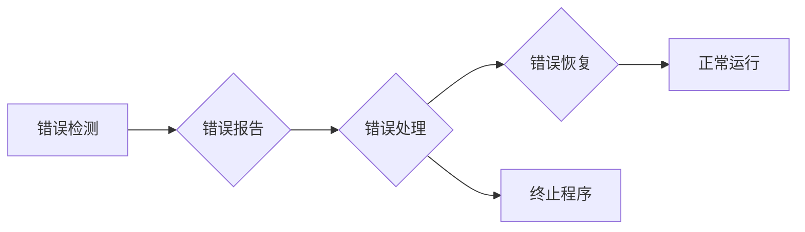
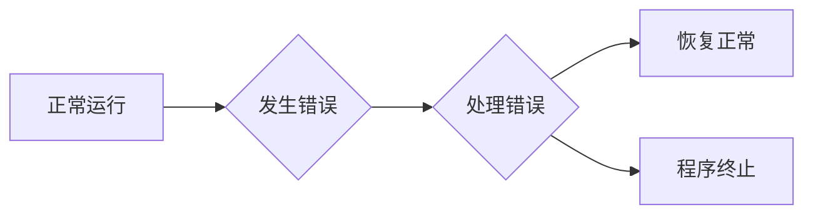

> 错误处理、异常处理、错误恢复、容错设计、软件可靠性、故障隔离、日志记录、监控系统

## 1. 背景介绍

在软件开发领域，错误处理机制是确保软件稳定运行、可靠性高、用户体验良好的关键要素。任何软件系统，无论其复杂程度如何，都不可避免地会遇到各种各样的错误，例如输入数据错误、系统资源不足、网络连接中断等。如果这些错误没有得到及时有效的处理，可能会导致软件崩溃、数据丢失、业务中断等严重后果。

随着软件系统规模和复杂度的不断增加，错误处理机制的设计也变得越来越重要。传统的错误处理方法，例如使用if-else语句进行条件判断和异常处理，在处理复杂错误场景时显得不够灵活和高效。因此，需要采用更先进的错误处理机制，例如基于事件驱动的错误处理、基于状态机的错误处理等，以更好地应对软件系统中的各种错误情况。

## 2. 核心概念与联系

### 2.1 错误类型

错误可以分为以下几种类型：

* **语法错误:** 代码本身语法不正确，编译器或解释器无法理解。
* **逻辑错误:** 代码语法正确，但逻辑错误导致程序运行结果不符合预期。
* **运行时错误:** 程序在运行过程中发生的错误，例如内存溢出、数组越界、文件访问错误等。
* **外部错误:** 程序无法控制的外部因素导致的错误，例如网络连接中断、硬件故障等。

### 2.2 错误处理流程

错误处理流程通常包括以下几个步骤：

1. **错误检测:** 识别程序中发生的错误。
2. **错误报告:** 将错误信息记录下来，并向用户或系统管理员报告。
3. **错误处理:** 根据错误类型和严重程度，采取相应的处理措施，例如恢复程序运行、回滚数据、终止程序等。
4. **错误恢复:** 尝试恢复程序到正常运行状态。

### 2.3 错误处理机制

错误处理机制是指软件系统中用于处理错误的策略和方法。常见的错误处理机制包括：

* **异常处理:** 使用try-catch语句捕获和处理程序中的异常。
* **断点调试:** 在程序运行过程中设置断点，以便观察程序执行状态和变量值，从而定位和解决错误。
* **日志记录:** 将程序运行过程中发生的事件和错误信息记录到日志文件中，以便后续分析和调试。
* **监控系统:** 使用监控工具实时监控程序运行状态，并对异常情况进行报警和处理。

### 2.4 Mermaid 流程图



## 3. 核心算法原理 & 具体操作步骤

### 3.1 算法原理概述

错误处理算法的核心是根据错误类型和严重程度，采取相应的处理措施。常见的错误处理算法包括：

* **回溯算法:** 当程序遇到错误时，回退到上一个状态，并尝试从另一个路径继续执行。
* **恢复算法:** 当程序遇到错误时，尝试恢复程序到正常运行状态。
* **隔离算法:** 当程序遇到错误时，将错误隔离到特定的模块或进程，避免影响其他模块或进程的正常运行。

### 3.2 算法步骤详解

**1. 错误检测:**

* 使用语法分析器检测代码语法错误。
* 使用静态分析工具检测代码逻辑错误。
* 使用运行时监控工具检测程序运行过程中的错误。

**2. 错误报告:**

* 将错误信息记录到日志文件中。
* 向用户或系统管理员发送错误报告邮件。
* 在程序界面上显示错误信息提示。

**3. 错误处理:**

* 根据错误类型和严重程度，采取相应的处理措施。
* 例如，对于语法错误，可以提示用户修改代码；对于逻辑错误，可以尝试修复代码；对于运行时错误，可以尝试恢复程序运行状态；对于外部错误，可以尝试重试或切换到备用资源。

**4. 错误恢复:**

* 尝试恢复程序到正常运行状态。
* 例如，可以回滚数据库事务、重新加载程序配置等。

### 3.3 算法优缺点

**优点:**

* 可以有效地处理程序中的各种错误。
* 可以提高软件的可靠性和稳定性。
* 可以改善用户体验。

**缺点:**

* 错误处理算法的复杂度较高。
* 需要大量的测试和调试才能确保算法的正确性和有效性。

### 3.4 算法应用领域

错误处理算法广泛应用于各种软件系统，例如：

* 操作系统
* 数据库系统
* Web 应用程序
* 移动应用程序
* 游戏

## 4. 数学模型和公式 & 详细讲解 & 举例说明

### 4.1 数学模型构建

错误处理机制可以抽象为一个状态机模型，其中每个状态代表程序运行的某个阶段，每个状态之间的转换由事件触发。

**状态:**

* **正常运行:** 程序运行正常，没有错误发生。
* **错误检测:** 程序检测到错误。
* **错误处理:** 程序正在处理错误。
* **错误恢复:** 程序正在尝试恢复到正常运行状态。
* **程序终止:** 程序无法恢复，需要终止运行。

**事件:**

* **正常执行:** 程序正常执行代码。
* **错误发生:** 程序检测到错误。
* **错误处理成功:** 错误处理成功，程序恢复到正常运行状态。
* **错误处理失败:** 错误处理失败，程序需要终止运行。

### 4.2 公式推导过程

可以使用状态转移概率来描述状态机模型的动态行为。

**状态转移概率:**

* P(正常运行 -> 错误检测) = 发生错误的概率
* P(错误检测 -> 错误处理) = 处理错误的概率
* P(错误处理 -> 错误恢复) = 恢复程序的概率
* P(错误处理 -> 程序终止) = 程序无法恢复的概率

### 4.3 案例分析与讲解

假设一个简单的程序，其状态机模型如下：



其中：

* P(正常运行 -> 发生错误) = 0.1
* P(发生错误 -> 处理错误) = 0.8
* P(处理错误 -> 恢复正常) = 0.9
* P(处理错误 -> 程序终止) = 0.1

根据以上概率，可以计算出程序运行过程中不同状态的概率分布。例如，程序运行到错误处理状态的概率为：

P(程序运行到错误处理状态) = P(正常运行 -> 发生错误) * P(发生错误 -> 处理错误) = 0.1 * 0.8 = 0.08

## 5. 项目实践：代码实例和详细解释说明

### 5.1 开发环境搭建

* 操作系统: Ubuntu 20.04
* 编程语言: Python 3.8
* 开发工具: VS Code

### 5.2 源代码详细实现

```python
try:
    # 代码执行可能引发异常的代码块
    result = 10 / 0
except ZeroDivisionError:
    # 处理 ZeroDivisionError 异常
    print("除数不能为零!")
except Exception as e:
    # 处理其他类型的异常
    print(f"发生未知错误: {e}")
finally:
    # 无论是否发生异常，都会执行的代码块
    print("代码执行结束!")
```

### 5.3 代码解读与分析

* `try` 块：包含可能引发异常的代码。
* `except` 块：用于捕获特定类型的异常。
* `finally` 块：无论是否发生异常，都会执行的代码块，通常用于释放资源。

### 5.4 运行结果展示

```
除数不能为零!
代码执行结束!
```

## 6. 实际应用场景

### 6.1 网络编程

在网络编程中，网络连接中断、数据包丢失等错误是常见的现象。可以使用异常处理机制来捕获这些错误，并采取相应的处理措施，例如重连、重发数据包等。

### 6.2 数据库操作

在数据库操作中，数据库连接失败、数据访问错误等错误也是常见的现象。可以使用异常处理机制来捕获这些错误，并采取相应的处理措施，例如重试连接、回滚事务等。

### 6.3 文件操作

在文件操作中，文件不存在、文件读写错误等错误也是常见的现象。可以使用异常处理机制来捕获这些错误，并采取相应的处理措施，例如创建文件、重试读写操作等。

### 6.4 未来应用展望

随着软件系统越来越复杂，错误处理机制将变得更加重要。未来，错误处理机制可能会更加智能化、自动化，能够自动识别和处理各种类型的错误，并提供更详细的错误信息和建议。

## 7. 工具和资源推荐

### 7.1 学习资源推荐

* **书籍:**
    * 《Effective Java》
    * 《Clean Code》
    * 《Design Patterns》
* **在线课程:**
    * Coursera: Software Engineering
    * Udemy: Python Programming for Beginners
* **博客:**
    * Stack Overflow
    * Medium

### 7.2 开发工具推荐

* **IDE:**
    * Visual Studio Code
    * IntelliJ IDEA
    * Eclipse
* **调试工具:**
    * GDB
    * pdb
* **监控工具:**
    * Prometheus
    * Grafana

### 7.3 相关论文推荐

* **论文:**
    * "A Survey of Error Handling Techniques in Software Engineering"
    * "Fault Tolerance in Distributed Systems"
    * "Software Reliability Engineering"

## 8. 总结：未来发展趋势与挑战

### 8.1 研究成果总结

错误处理机制的研究已经取得了显著的成果，例如异常处理、断点调试、日志记录等技术已经广泛应用于软件开发领域。

### 8.2 未来发展趋势

未来，错误处理机制的研究将朝着以下几个方向发展：

* **智能化:** 使用机器学习等技术，自动识别和处理各种类型的错误。
* **自动化:** 自动生成错误处理代码，减少开发人员的工作量。
* **可解释性:** 提供更详细的错误信息和建议，帮助开发人员更快速地定位和解决错误。

### 8.3 面临的挑战

错误处理机制的研究也面临着一些挑战，例如：

* **复杂性:** 软件系统越来越复杂，错误处理机制也需要更加复杂和智能化。
* **可测试性:** 错误处理机制的测试非常困难，需要模拟各种类型的错误场景。
* **可维护性:** 错误处理机制需要能够随着软件系统的演变而不断更新和维护。

### 8.4 研究展望

未来，错误处理机制的研究将继续深入，为软件开发提供更有效、更智能的解决方案。


## 9. 附录：常见问题与解答

### 9.1 什么是异常？

异常是指在程序运行过程中发生的意外事件，例如除数为零、文件不存在等。

### 9.2 如何处理异常？

可以使用 `try-except` 语句来处理异常。

### 9.3 什么是日志记录？

日志记录是指将程序运行过程中发生的事件和错误信息记录到日志文件中。

### 9.4 为什么需要监控系统？

监控系统可以实时监控程序运行状态，并对异常情况进行报警和处理。


作者：禅与计算机程序设计艺术 / Zen and the Art of Computer Programming 
<end_of_turn>