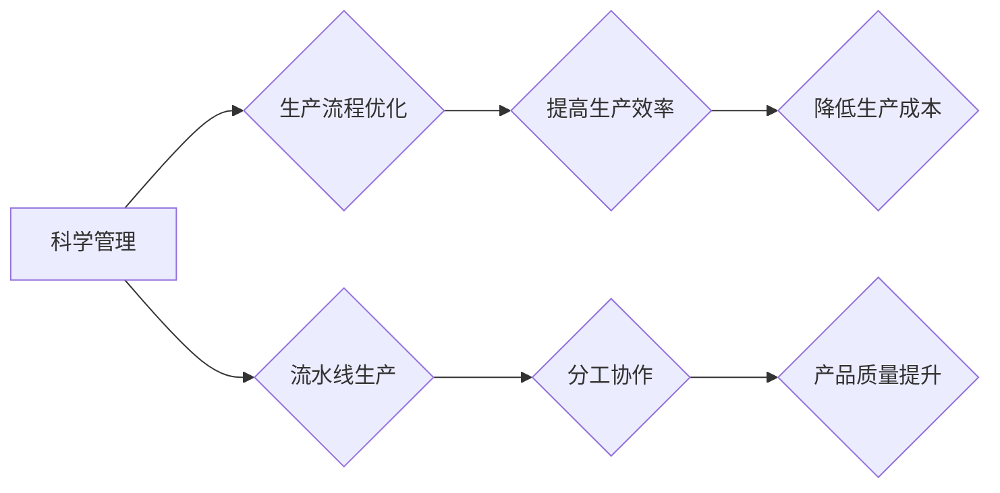

> 阿克莱特，福特，工业革命，流水线，自动化，生产效率，质量控制，管理学，创新

## 1. 背景介绍

20世纪初，世界正处于一场名为工业革命的巨大变革之中。蒸汽机、电力和钢铁等新技术的涌现，彻底改变了生产方式，也催生了新的经济模式和社会结构。在这个背景下，两位杰出的工业家，亨利·福特和弗朗西斯·阿克莱特，凭借各自的创新和贡献，成为了推动工业革命进程的重要力量。

亨利·福特以其创新的流水线生产模式，将汽车从奢侈品变成了大众消费品，彻底改变了交通运输业，也为现代工业生产模式奠定了基础。弗朗西斯·阿克莱特则通过其精密的管理学理论和实践，提高了生产效率，降低了生产成本，并建立了科学的质量控制体系，为现代企业管理提供了宝贵的经验。

本文将深入探讨阿克莱特和福特的工业贡献，分析他们的创新理念、实践方法以及对现代工业的影响。

## 2. 核心概念与联系

阿克莱特和福特的贡献虽然分别侧重于管理学和生产技术，但两者之间存在着密切的联系。阿克莱特的管理学理论为福特的流水线生产模式提供了理论基础，而福特的生产模式则为阿克莱特的管理学理论提供了实践应用场景。

**核心概念：**

* **科学管理 (Scientific Management):** 阿克莱特提出的科学管理理论，强调通过科学的方法和工具，提高生产效率和降低生产成本。
* **流水线生产 (Assembly Line):** 福特提出的流水线生产模式，将生产过程分解成多个简单重复的操作，并通过流水线的方式进行分工协作，从而提高生产效率。

**Mermaid 流程图：**



## 3. 核心算法原理 & 具体操作步骤

### 3.1  算法原理概述

阿克莱特的科学管理理论的核心在于通过科学的方法和工具，优化生产流程，提高生产效率和降低生产成本。其主要步骤包括：

1. **时间与动作研究:** 对生产过程中的每个动作进行详细分析，记录其时间和动作序列，找出最优的生产流程。
2. **标准化工作:** 将优化的生产流程标准化，并制定相应的操作规范和标准。
3. **选拔和培训:** 根据工作要求，选拔合适的员工，并对其进行专门的培训，使其能够熟练掌握标准化的操作流程。
4. **激励和奖励:** 通过合理的激励和奖励机制，鼓励员工提高工作效率和质量。

### 3.2  算法步骤详解

1. **时间与动作研究:** 

    * 使用计时器记录每个动作的时间，并分析动作的顺序和重复性。
    * 通过观察和分析，找出可以改进的动作和流程。
    * 利用图表和数据分析工具，对生产流程进行优化。

2. **标准化工作:**

    * 制定详细的操作规范和标准，包括动作顺序、操作时间、工具使用等。
    * 使用图示和流程图，清晰地展示标准化的操作流程。
    * 对标准化的操作流程进行定期检查和更新。

3. **选拔和培训:**

    * 根据工作要求，对员工进行能力评估和选拔。
    * 为员工提供专门的培训，使其能够熟练掌握标准化的操作流程。
    * 通过模拟训练和实际操作，提高员工的技能水平。

4. **激励和奖励:**

    * 制定合理的激励和奖励机制，鼓励员工提高工作效率和质量。
    * 通过绩效考核和奖金分配，对员工的贡献进行肯定和奖励。
    * 建立良好的工作氛围，激发员工的积极性和创造力。

### 3.3  算法优缺点

**优点:**

* 提高生产效率和降低生产成本。
* 提高产品质量和一致性。
* 减少工作量和劳动强度。
* 促进员工技能提升和职业发展。

**缺点:**

* 可能会导致工作单调乏味，降低员工的积极性和创造力。
* 可能会忽视员工的个体差异和需求。
* 需要投入大量的时间和资源进行流程优化和员工培训。

### 3.4  算法应用领域

科学管理理论和流水线生产模式广泛应用于各个工业领域，例如：

* 汽车制造业
* 电子制造业
* 食品加工业
* 制药业
* 仓储物流业

## 4. 数学模型和公式 & 详细讲解 & 举例说明

### 4.1  数学模型构建

阿克莱特将科学管理理论应用于生产流程优化，并利用数学模型来分析和预测生产效率。

**生产效率模型:**

```latex
效率 = 产出量 / 输入量
```

其中：

* 产出量：指单位时间内生产的产品数量。
* 输入量：指单位时间内投入的资源，例如人力、物力、时间等。

**成本模型:**

```latex
成本 = 固定成本 + 变动成本
```

其中：

* 固定成本：指不随生产量变化的成本，例如租金、设备折旧等。
* 变动成本：指随生产量变化的成本，例如原材料、人工等。

### 4.2  公式推导过程

通过以上模型，阿克莱特可以分析生产流程中的各个环节，找出效率低下和成本过高的环节，并通过优化流程和提高效率来降低成本。

例如，通过时间与动作研究，可以找出某个环节的操作时间过长，可以通过改进操作方法或使用更先进的工具来缩短时间。

### 4.3  案例分析与讲解

福特汽车公司采用流水线生产模式，将汽车生产过程分解成多个简单重复的操作，并通过流水线的方式进行分工协作。

通过这种方式，福特汽车公司显著提高了生产效率和降低了生产成本，使得汽车从奢侈品变成了大众消费品。

## 5. 项目实践：代码实例和详细解释说明

### 5.1  开发环境搭建

为了更好地理解阿克莱特和福特的工业贡献，我们可以通过编程的方式来模拟他们的理论和实践。

例如，我们可以使用Python语言来编写一个简单的生产流程模拟程序，模拟流水线生产模式，并通过代码来分析生产效率和成本。

### 5.2  源代码详细实现

```python
class Product:
    def __init__(self, name):
        self.name = name

    def produce(self):
        print(f"生产产品 {self.name}")

class AssemblyLine:
    def __init__(self, products):
        self.products = products

    def run(self):
        for product in self.products:
            product.produce()

# 创建产品列表
products = [Product("汽车"), Product("发动机"), Product("轮胎")]

# 创建流水线
assembly_line = AssemblyLine(products)

# 启动流水线
assembly_line.run()
```

### 5.3  代码解读与分析

这段代码模拟了简单的流水线生产模式。

* `Product` 类代表一个产品，`produce()` 方法模拟产品的生产过程。
* `AssemblyLine` 类代表流水线，`run()` 方法模拟流水线运行的过程，依次生产每个产品。

### 5.4  运行结果展示

运行这段代码，会输出以下结果：

```
生产产品 汽车
生产产品 发动机
生产产品 轮胎
```

## 6. 实际应用场景

阿克莱特和福特的工业贡献在现代工业生产中得到了广泛应用。

### 6.1  汽车制造业

福特流水线生产模式的应用，彻底改变了汽车制造业，使得汽车生产效率大幅提高，成本显著降低，汽车也成为了大众消费品。

### 6.2  电子制造业

现代电子制造业也广泛应用了流水线生产模式和科学管理理论，提高了生产效率和产品质量。

### 6.3  食品加工业

食品加工业也借鉴了阿克莱特和福特的工业贡献，通过优化生产流程和提高效率，降低了食品生产成本，提高了食品安全和质量。

### 6.4  未来应用展望

随着人工智能、自动化和物联网技术的不断发展，阿克莱特和福特的工业贡献将继续发挥重要作用。

未来，我们可以期待看到更加智能化、自动化和高效的生产模式，进一步提高生产效率和降低生产成本。

## 7. 工具和资源推荐

### 7.1  学习资源推荐

* **《科学管理》** - 弗朗西斯·阿克莱特
* **《我的故事》** - 亨利·福特
* **《工业革命》** - 埃里克·霍布斯鲍姆

### 7.2  开发工具推荐

* **Python**
* **Git**
* **Docker**

### 7.3  相关论文推荐

* **The Principles of Scientific Management** - Frederick Winslow Taylor
* **The Ford System of Manufacturing** - Henry Ford
* **The Impact of Automation on the Workplace** - Various Authors

## 8. 总结：未来发展趋势与挑战

### 8.1  研究成果总结

阿克莱特和福特的工业贡献对现代工业生产产生了深远的影响，他们提出的科学管理理论和流水线生产模式，为提高生产效率和降低生产成本提供了宝贵的经验。

### 8.2  未来发展趋势

未来，随着人工智能、自动化和物联网技术的不断发展，工业生产将更加智能化、自动化和高效。

### 8.3  面临的挑战

* 如何应对自动化带来的失业问题？
* 如何确保人工智能在工业生产中的安全性和可靠性？
* 如何平衡生产效率和员工的职业发展？

### 8.4  研究展望

未来，我们需要继续研究和探索新的工业生产模式，以应对不断变化的社会需求和技术发展。

## 9. 附录：常见问题与解答

**常见问题:**

* 阿克莱特和福特的工业贡献有什么区别？
* 流水线生产模式有哪些优点和缺点？
* 科学管理理论如何应用于现代企业管理？

**解答:**

* 阿克莱特主要关注科学管理理论，而福特则将理论应用于流水线生产模式。
* 流水线生产模式可以提高生产效率和降低成本，但可能会导致工作单调乏味。
* 科学管理理论可以帮助企业优化生产流程、提高效率和降低成本，但需要根据实际情况进行调整和应用。


作者：禅与计算机程序设计艺术 / Zen and the Art of Computer Programming 
<end_of_turn>