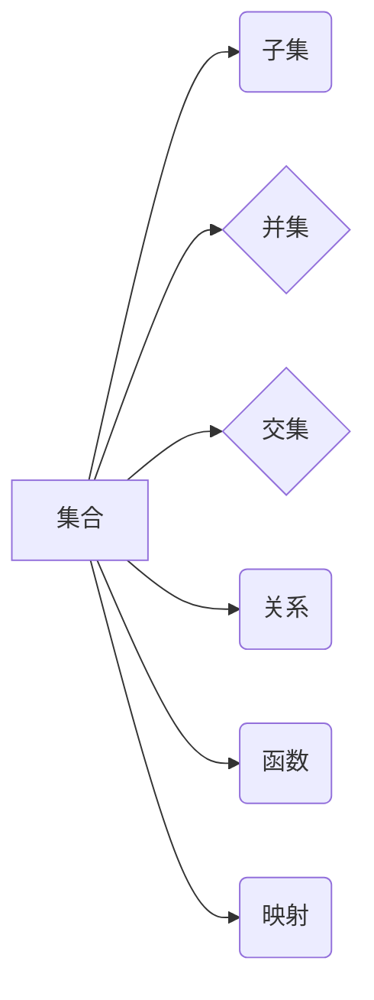

> 集合论, 逻辑, 关系, 函数, 映射, 拓扑, 泛函分析, 计算机科学

## 1. 背景介绍

集合论作为数学的基础理论，其简洁的语言和强大的表达能力，为描述和分析各种复杂系统提供了强大的工具。从古代的逻辑学到现代的计算机科学，集合论始终扮演着至关重要的角色。

随着计算机科学的发展，特别是人工智能和数据科学的蓬勃兴起，对集合论的理解和应用需求日益增长。 传统的集合论在处理无限集合和复杂关系时存在一定的局限性，因此，我们需要探索更深层次的集合论概念和工具，以更好地应对现代计算领域的挑战。

本篇文章将从集合论的基本概念出发，深入探讨其在计算机科学中的应用，并展望其未来发展趋势。

## 2. 核心概念与联系

### 2.1 集合

集合是数学中最基本的概念之一，它是一个包含特定对象的集合。例如，{1, 2, 3}是一个包含三个整数的集合。

### 2.2 子集

如果一个集合的所有元素都属于另一个集合，则称第一个集合是第二个集合的子集。例如，{1, 2}是{1, 2, 3}的子集。

### 2.3 并集和交集

两个集合的并集包含这两个集合的所有元素，而它们的交集包含这两个集合的公共元素。例如，{1, 2}和{2, 3}的并集是{1, 2, 3}，它们的交集是{2}。

### 2.4 关系

关系是将两个集合的元素配对起来的一种方式。例如，小于关系“<”是将两个整数配对起来的一种关系，如果一个整数小于另一个整数，则它们就构成一个关系对。

### 2.5 函数

函数是一种特殊的二元关系，它满足以下条件：

* 对于集合A中的每个元素，都存在唯一的集合B中的元素与其对应。

函数可以看作是将一个集合的元素映射到另一个集合的元素。

### 2.6 映射

映射是将一个集合的元素映射到另一个集合的元素的函数。

**核心概念与联系流程图**



## 3. 核心算法原理 & 具体操作步骤

### 3.1 算法原理概述

集合论算法通常用于处理集合之间的操作，例如并集、交集、差集等。这些算法通常基于集合论的基本概念和操作规则，并利用数据结构和算法设计技巧进行实现。

### 3.2 算法步骤详解

**并集算法**

1. 创建一个新的空集合。
2. 遍历第一个集合，将每个元素添加到新的集合中。
3. 遍历第二个集合，将每个元素添加到新的集合中。
4. 返回新的集合。

**交集算法**

1. 创建一个新的空集合。
2. 遍历第一个集合，对于每个元素，检查它是否也属于第二个集合。
3. 如果元素属于第二个集合，则将其添加到新的集合中。
4. 返回新的集合。

### 3.3 算法优缺点

**优点:**

* 算法简单易懂，易于实现。
* 能够高效地处理集合之间的基本操作。

**缺点:**

* 对于大型集合，算法效率可能较低。
* 无法处理更复杂的集合操作，例如集合的笛卡尔积等。

### 3.4 算法应用领域

集合论算法广泛应用于计算机科学各个领域，例如：

* **数据库管理:** 用于查询和操作数据库中的数据。
* **人工智能:** 用于知识表示和推理。
* **数据挖掘:** 用于数据聚类和分类。

## 4. 数学模型和公式 & 详细讲解 & 举例说明

### 4.1 数学模型构建

集合论的数学模型主要基于以下几个概念：

* **集合:** 用大括号{}表示，例如A = {1, 2, 3}。
* **元素:** 集合中的个体，例如1, 2, 3是集合A的元素。
* **子集:** 如果集合B的所有元素都属于集合A，则称B是A的子集，记作B ⊆ A。
* **并集:** 集合A和集合B的并集包含A和B的所有元素，记作A ∪ B。
* **交集:** 集合A和集合B的交集包含A和B的公共元素，记作A ∩ B。

### 4.2 公式推导过程

**子集关系:**

如果B ⊆ A，则对于集合A中的任意元素x，都有x ∈ B。

**并集关系:**

A ∪ B = {x | x ∈ A 或 x ∈ B}

**交集关系:**

A ∩ B = {x | x ∈ A 且 x ∈ B}

### 4.3 案例分析与讲解

**示例:**

设A = {1, 2, 3}，B = {2, 3, 4}。

* B是A的子集吗？否，因为B包含元素4，而4不属于A。
* A和B的并集是什么？A ∪ B = {1, 2, 3, 4}。
* A和B的交集是什么？A ∩ B = {2, 3}。

## 5. 项目实践：代码实例和详细解释说明

### 5.1 开发环境搭建

本示例使用Python语言进行实现，需要安装Python环境和相关库。

### 5.2 源代码详细实现

```python
# 集合操作示例

set1 = {1, 2, 3}
set2 = {2, 3, 4}

# 并集
union_set = set1 | set2
print("并集:", union_set)

# 交集
intersection_set = set1 & set2
print("交集:", intersection_set)

# 子集
is_subset = set1.issubset(set2)
print("set1是否是set2的子集:", is_subset)
```

### 5.3 代码解读与分析

* `set1` 和 `set2` 两个集合分别定义了不同的元素。
* `|` 和 `&` 操作符分别表示集合的并集和交集。
* `issubset()` 方法用于判断一个集合是否是另一个集合的子集。

### 5.4 运行结果展示

```
并集: {1, 2, 3, 4}
交集: {2, 3}
set1是否是set2的子集: False
```

## 6. 实际应用场景

### 6.1 数据处理

集合论在数据处理中广泛应用，例如：

* **去重:** 使用集合的交集操作可以去除重复数据。
* **数据聚类:** 使用集合的并集操作可以将具有相似特征的数据点聚类在一起。

### 6.2 图论

集合论是图论的基础理论，用于描述图的节点和边。

### 6.3 关系数据库

关系数据库使用集合论的概念来定义表和关系。

### 6.4 未来应用展望

随着人工智能和数据科学的发展，集合论在以下领域将有更广泛的应用：

* **知识图谱:** 集合论可以用于表示和推理知识图谱中的知识。
* **机器学习:** 集合论可以用于构建机器学习模型，例如支持向量机。
* **量子计算:** 集合论可以用于描述和操作量子比特。

## 7. 工具和资源推荐

### 7.1 学习资源推荐

* **《集合论导论》:**  
* **《数学基础》:**  
* **Khan Academy 集合论课程:**  

### 7.2 开发工具推荐

* **Python:**  
* **NumPy:**  
* **SciPy:**  

### 7.3 相关论文推荐

* **《集合论基础》:**  
* **《集合论在计算机科学中的应用》:**  

## 8. 总结：未来发展趋势与挑战

### 8.1 研究成果总结

集合论作为数学的基础理论，在计算机科学中发挥着至关重要的作用。本篇文章探讨了集合论的基本概念、算法原理、数学模型以及实际应用场景。

### 8.2 未来发展趋势

随着人工智能和数据科学的发展，集合论将继续在以下领域得到发展：

* **更复杂的集合操作:** 研究更复杂的集合操作，例如集合的笛卡尔积、幂集等。
* **无限集合的处理:** 研究处理无限集合的算法和方法。
* **集合论与其他学科的交叉:** 将集合论与其他学科，例如拓扑学、泛函分析等进行交叉研究。

### 8.3 面临的挑战

* **算法效率:** 对于大型集合，集合论算法的效率仍然是一个挑战。
* **理论基础:** 集合论的理论基础仍然存在一些未解之谜，需要进一步研究。
* **应用场景:** 集合论在某些领域应用的潜力尚未充分挖掘。

### 8.4 研究展望

未来，我们将继续深入研究集合论，探索其更深层次的应用，并推动其在计算机科学领域的进一步发展。

## 9. 附录：常见问题与解答

### 9.1 什么是空集？

空集是一个不包含任何元素的集合，用符号∅表示。

### 9.2 集合的元素可以重复吗？

集合中的元素可以重复，例如{1, 2, 2, 3}是一个包含重复元素的集合。

### 9.3 集合的运算满足什么性质？

集合的运算满足一些重要的性质，例如交换律、结合律、分配律等。

作者：禅与计算机程序设计艺术 / Zen and the Art of Computer Programming


<end_of_turn>