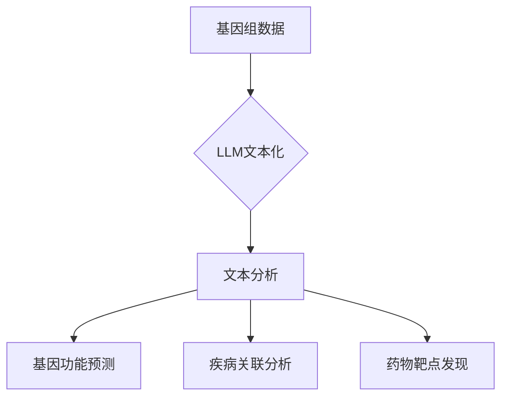

> AI LLM, 遗传学, 基因组学, 蛋白质结构预测, 药物研发, 深度学习, 自然语言处理

## 1. 背景介绍

遗传学作为生命科学的核心领域，致力于揭示遗传信息的传递、表达和变异规律，为理解生命现象、预防和治疗疾病提供了重要基础。近年来，随着基因组测序技术的飞速发展，人类获得了大量基因组数据，为遗传学研究提供了丰富的资源。然而，这些数据量庞大、结构复杂，传统的分析方法难以有效挖掘其中的潜在信息。

人工智能（AI）技术的快速发展为遗传学研究带来了新的机遇。特别是，大型语言模型（LLM）凭借其强大的文本处理能力和泛化能力，在生物信息学领域展现出巨大的潜力。LLM可以理解和处理复杂的生物学文本，例如基因序列、蛋白质结构、文献摘要等，并从中提取有价值的信息，为遗传学研究提供新的思路和方法。

## 2. 核心概念与联系

**2.1 核心概念**

* **大型语言模型（LLM）：** 训练于海量文本数据上的深度学习模型，能够理解和生成人类语言。
* **遗传学：** 研究遗传信息的传递、表达和变异规律的学科。
* **基因组学：** 研究基因组的结构、功能和演化。
* **蛋白质结构预测：** 预测蛋白质的三维结构，为理解蛋白质功能和设计药物提供重要信息。

**2.2 核心概念联系**

LLM可以将基因组数据、蛋白质结构信息等生物学数据转化为文本形式，并利用其强大的文本处理能力进行分析和挖掘。



## 3. 核心算法原理 & 具体操作步骤

**3.1 算法原理概述**

LLM在遗传学研究中的应用主要基于以下核心算法：

* **文本编码：** 将基因序列、蛋白质结构等生物学数据转化为数字向量，以便LLM进行处理。常用的编码方法包括词嵌入、序列编码等。
* **序列建模：** 利用LLM的序列建模能力，预测基因序列的结构、功能或疾病关联。
* **文本生成：** 基于LLM的文本生成能力，生成生物学文本，例如基因功能注释、蛋白质结构描述等。

**3.2 算法步骤详解**

1. **数据预处理：** 收集和清洗生物学数据，例如基因组序列、蛋白质结构、文献摘要等。
2. **数据编码：** 将生物学数据转化为数字向量，可以使用词嵌入、序列编码等方法。
3. **模型训练：** 利用LLM模型训练，训练数据包括编码后的生物学数据和相应的标签信息。
4. **模型评估：** 使用测试数据评估模型的性能，例如预测准确率、召回率等。
5. **模型应用：** 将训练好的模型应用于实际问题，例如基因功能预测、疾病关联分析、药物靶点发现等。

**3.3 算法优缺点**

**优点：**

* 能够处理海量生物学数据，挖掘潜在信息。
* 具有强大的文本处理能力，可以理解和生成生物学文本。
* 可以应用于多种遗传学研究问题。

**缺点：**

* 需要大量的训练数据，训练成本较高。
* 模型解释性较差，难以理解模型的决策过程。
* 对于新的生物学数据，模型的泛化能力可能有限。

**3.4 算法应用领域**

* **基因功能预测：** 利用LLM预测基因的功能，例如其参与的生物学过程、疾病关联等。
* **疾病关联分析：** 识别基因与疾病之间的关联，为疾病诊断和治疗提供线索。
* **药物靶点发现：** 预测药物的靶点，为药物研发提供新的方向。
* **蛋白质结构预测：** 利用LLM预测蛋白质的三维结构，为理解蛋白质功能和设计药物提供重要信息。

## 4. 数学模型和公式 & 详细讲解 & 举例说明

**4.1 数学模型构建**

LLM的训练过程本质上是一个优化问题，目标是找到一个模型参数，使得模型在训练数据上的预测性能达到最大。常用的数学模型包括：

* **Transformer模型：** Transformer模型是一种基于注意力机制的深度学习模型，能够有效处理序列数据，在自然语言处理领域取得了显著的成果。

**4.2 公式推导过程**

Transformer模型的训练过程涉及到以下公式：

* **损失函数：** 用于衡量模型预测结果与真实值的差异。常用的损失函数包括交叉熵损失函数、均方误差损失函数等。
* **梯度下降算法：** 用于更新模型参数，使得损失函数的值不断减小。

**4.3 案例分析与讲解**

例如，在基因功能预测任务中，我们可以使用Transformer模型将基因序列编码为数字向量，然后利用模型的序列建模能力预测基因的功能。训练数据包括基因序列和相应的功能标签信息。模型训练完成后，我们可以使用模型预测新的基因的功能。

## 5. 项目实践：代码实例和详细解释说明

**5.1 开发环境搭建**

* Python 3.7+
* PyTorch 1.7+
* Transformers 4.10+

**5.2 源代码详细实现**

```python
from transformers import AutoModelForSequenceClassification, AutoTokenizer

# 加载预训练模型和词典
model_name = "bert-base-uncased"
tokenizer = AutoTokenizer.from_pretrained(model_name)
model = AutoModelForSequenceClassification.from_pretrained(model_name, num_labels=2)

# 数据预处理
def preprocess_function(examples):
    inputs = [ex["text"] for ex in examples]
    model_inputs = tokenizer(inputs, padding="max_length", truncation=True)
    return model_inputs

# 模型训练
train_dataset = ...
val_dataset = ...
trainer = Trainer(
    model=model,
    args=training_args,
    train_dataset=train_dataset,
    eval_dataset=val_dataset,
)
trainer.train()

# 模型评估
results = trainer.evaluate()
print(results)

# 模型预测
new_text = "This is a new text."
inputs = tokenizer(new_text, return_tensors="pt")
outputs = model(**inputs)
```

**5.3 代码解读与分析**

* 代码首先加载预训练的BERT模型和词典。
* 然后定义数据预处理函数，将文本数据转化为模型可以理解的格式。
* 接着使用HuggingFace的Trainer类进行模型训练和评估。
* 最后使用训练好的模型对新的文本进行预测。

**5.4 运行结果展示**

训练完成后，我们可以使用模型对新的基因序列进行预测，例如预测其功能或疾病关联。模型的预测结果可以以文本形式展示，例如“该基因可能参与细胞分裂过程”或“该基因与癌症相关”。

## 6. 实际应用场景

**6.1 基因功能预测**

LLM可以用于预测基因的功能，例如其参与的生物学过程、疾病关联等。这对于理解基因的功能和作用机制具有重要意义。

**6.2 疾病关联分析**

LLM可以用于识别基因与疾病之间的关联，为疾病诊断和治疗提供线索。例如，可以利用LLM分析患者的基因组数据，预测其患病风险或潜在的治疗方案。

**6.3 药物靶点发现**

LLM可以用于预测药物的靶点，为药物研发提供新的方向。例如，可以利用LLM分析蛋白质结构和功能信息，预测哪些蛋白质是药物的潜在靶点。

**6.4 未来应用展望**

LLM在遗传学研究中的应用前景广阔，未来可能在以下方面得到进一步发展：

* **个性化医疗：** 利用LLM分析患者的基因组数据，为其提供个性化的医疗方案。
* **新药研发：** 利用LLM加速新药研发过程，例如预测药物的靶点、活性等。
* **农业育种：** 利用LLM提高作物的产量、抗病性等。

## 7. 工具和资源推荐

**7.1 学习资源推荐**

* **HuggingFace Transformers:** https://huggingface.co/docs/transformers/index
* **DeepMind AlphaFold:** https://deepmind.com/blog/alphafold-a-solution-to-a-50-year-old-problem/

**7.2 开发工具推荐**

* **Python:** https://www.python.org/
* **PyTorch:** https://pytorch.org/
* **Jupyter Notebook:** https://jupyter.org/

**7.3 相关论文推荐**

* **Attention Is All You Need:** https://arxiv.org/abs/1706.03762
* **BERT: Pre-training of Deep Bidirectional Transformers for Language Understanding:** https://arxiv.org/abs/1810.04805

## 8. 总结：未来发展趋势与挑战

**8.1 研究成果总结**

LLM在遗传学研究中的应用取得了显著的成果，例如在基因功能预测、疾病关联分析、药物靶点发现等方面展现出巨大的潜力。

**8.2 未来发展趋势**

未来，LLM在遗传学研究中的应用将朝着以下方向发展：

* **模型规模和性能的提升：** 训练更大规模的LLM模型，提高其预测性能。
* **多模态学习：** 将文本数据与其他类型的数据，例如基因组序列、蛋白质结构等进行融合，提高模型的理解能力。
* **可解释性增强：** 研究LLM的决策过程，提高模型的可解释性。

**8.3 面临的挑战**

LLM在遗传学研究中也面临一些挑战：

* **数据获取和标注：** 高质量的生物学数据是LLM训练的基础，但获取和标注这些数据成本较高。
* **模型解释性：** LLM的决策过程较为复杂，难以理解模型的决策机制。
* **伦理问题：** LLM在遗传学研究中的应用可能引发一些伦理问题，例如基因隐私保护等。

**8.4 研究展望**

未来，我们需要继续努力解决这些挑战，推动LLM在遗传学研究中的应用，为人类健康和福祉做出贡献。

## 9. 附录：常见问题与解答

**9.1 如何选择合适的LLM模型？**

选择合适的LLM模型取决于具体的应用场景。对于基因功能预测任务，可以使用预训练的生物学领域LLM模型，例如BioBERT。对于蛋白质结构预测任务，可以使用专门针对蛋白质结构预测训练的LLM模型，例如AlphaFold。

**9.2 如何处理生物学数据的噪声？**

生物学数据往往包含噪声，例如基因组测序错误、蛋白质结构预测误差等。在数据预处理阶段，可以使用多种方法来处理这些噪声，例如数据清洗、过滤、降噪等。

**9.3 如何评估LLM模型的性能？**

LLM模型的性能可以通过多种指标来评估，例如准确率、召回率、F1-score等。具体的评估指标需要根据具体的应用场景来选择。


作者：禅与计算机程序设计艺术 / Zen and the Art of Computer Programming 
<end_of_turn>