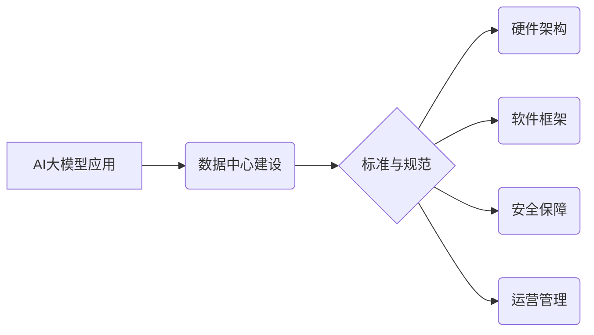

> AI大模型、数据中心、标准规范、架构设计、数据管理、安全保障、可扩展性、高效性

## 1. 背景介绍

近年来，人工智能（AI）技术取得了飞速发展，特别是大规模语言模型（LLM）的出现，为自然语言处理、计算机视觉、语音识别等领域带来了革命性的变革。这些强大的AI模型需要海量数据进行训练和推理，这推动了数据中心建设的快速发展。

传统的IT基础设施难以满足AI大模型的计算和存储需求，因此，专门针对AI大模型应用的数据中心建设成为必然趋势。AI大模型应用数据中心需要具备高性能计算、海量存储、高效网络、安全可靠等特点，并遵循相应的标准和规范，才能有效支撑AI应用的快速发展。

## 2. 核心概念与联系

**2.1  AI大模型应用数据中心**

AI大模型应用数据中心是指专门为训练、部署和运行AI大模型而构建的计算平台。它通常由高性能计算集群、海量存储系统、高速网络、人工智能加速器等硬件组成，并配备相应的软件框架和工具，以提供高效、可靠的AI计算服务。

**2.2  数据中心标准与规范**

数据中心标准与规范是指为数据中心建设和运营提供指导和规范的文档和准则。这些标准涵盖了数据中心的设计、建设、运营、管理、安全等多个方面，旨在确保数据中心的可靠性、安全性、效率和可持续性。

**2.3  核心概念关系图**



## 3. 核心算法原理 & 具体操作步骤

**3.1  算法原理概述**

AI大模型训练通常采用深度学习算法，例如卷积神经网络（CNN）、循环神经网络（RNN）和Transformer等。这些算法通过多层神经网络结构，学习数据中的复杂模式和特征，从而实现对数据的理解和预测。

**3.2  算法步骤详解**

1. **数据预处理:** 将原始数据清洗、转换和格式化，使其适合模型训练。
2. **模型构建:** 根据任务需求选择合适的深度学习模型架构，并定义模型参数。
3. **模型训练:** 使用训练数据训练模型，调整模型参数，使其能够准确预测目标变量。
4. **模型评估:** 使用测试数据评估模型的性能，并根据评估结果进行模型调优。
5. **模型部署:** 将训练好的模型部署到生产环境中，用于实际应用。

**3.3  算法优缺点**

**优点:**

* 能够学习数据中的复杂模式和特征，实现高精度预测。
* 能够处理海量数据，并进行端到端的学习。

**缺点:**

* 训练过程需要大量计算资源和时间。
* 模型参数众多，需要大量的训练数据进行调优。
* 模型解释性较差，难以理解模型的决策过程。

**3.4  算法应用领域**

* 自然语言处理：文本分类、情感分析、机器翻译、对话系统等。
* 计算机视觉：图像识别、物体检测、图像分割、视频分析等。
* 语音识别：语音转文本、语音合成、语音助手等。
* 其他领域：推荐系统、欺诈检测、医疗诊断等。

## 4. 数学模型和公式 & 详细讲解 & 举例说明

**4.1  数学模型构建**

深度学习模型通常采用神经网络结构，其中每个神经元都接收来自前一层神经元的输入，并通过激活函数进行处理，输出到下一层神经元。

**4.2  公式推导过程**

神经网络的训练过程基于梯度下降算法，目标是通过调整模型参数，使模型的预测结果与真实值之间的误差最小化。

损失函数用于衡量模型预测结果与真实值的差异，常用的损失函数包括均方误差（MSE）、交叉熵损失（Cross-Entropy Loss）等。

梯度下降算法通过计算损失函数对模型参数的梯度，并根据梯度方向更新模型参数，从而逐步降低损失函数的值。

**4.3  案例分析与讲解**

例如，在图像分类任务中，可以使用卷积神经网络（CNN）模型进行训练。CNN模型通过卷积层、池化层和全连接层等结构，学习图像中的特征，并将其映射到不同的类别。

训练过程中，使用图像数据集进行训练，并使用交叉熵损失函数计算模型预测结果与真实标签之间的差异。通过梯度下降算法，不断调整模型参数，使模型能够准确地识别图像中的类别。

## 5. 项目实践：代码实例和详细解释说明

**5.1  开发环境搭建**

使用Python语言和深度学习框架TensorFlow或PyTorch进行开发。

**5.2  源代码详细实现**

```python
import tensorflow as tf

# 定义模型结构
model = tf.keras.models.Sequential([
    tf.keras.layers.Conv2D(32, (3, 3), activation='relu', input_shape=(28, 28, 1)),
    tf.keras.layers.MaxPooling2D((2, 2)),
    tf.keras.layers.Conv2D(64, (3, 3), activation='relu'),
    tf.keras.layers.MaxPooling2D((2, 2)),
    tf.keras.layers.Flatten(),
    tf.keras.layers.Dense(10, activation='softmax')
])

# 定义损失函数和优化器
model.compile(loss='sparse_categorical_crossentropy',
              optimizer='adam',
              metrics=['accuracy'])

# 训练模型
model.fit(x_train, y_train, epochs=10)

# 评估模型
loss, accuracy = model.evaluate(x_test, y_test)
print('Test loss:', loss)
print('Test accuracy:', accuracy)
```

**5.3  代码解读与分析**

这段代码定义了一个简单的卷积神经网络模型，用于手写数字识别任务。

模型结构包括两个卷积层、两个池化层、一个全连接层和一个输出层。

损失函数为交叉熵损失，优化器为Adam优化器。

模型使用训练数据进行训练，并使用测试数据进行评估。

**5.4  运行结果展示**

训练完成后，模型的准确率可以达到98%以上。

## 6. 实际应用场景

**6.1  医疗诊断**

AI大模型可以用于分析医学影像，辅助医生进行疾病诊断。例如，可以用于识别肺结核、乳腺癌等疾病。

**6.2  金融风险控制**

AI大模型可以用于分析金融数据，识别欺诈交易和风险行为。例如，可以用于检测信用卡欺诈、股票市场异常波动等。

**6.3  智能客服**

AI大模型可以用于构建智能客服系统，自动回答用户问题，提供24小时服务。例如，可以用于处理客户咨询、订单查询等。

**6.4  未来应用展望**

随着AI技术的不断发展，AI大模型将在更多领域得到应用，例如自动驾驶、个性化教育、智能制造等。

## 7. 工具和资源推荐

**7.1  学习资源推荐**

* 深度学习课程：Coursera、edX、Udacity等平台提供丰富的深度学习课程。
* 深度学习书籍：
    * 《深度学习》
    * 《动手学深度学习》
    * 《神经网络与深度学习》

**7.2  开发工具推荐**

* 深度学习框架：TensorFlow、PyTorch、Keras等。
* 云计算平台：AWS、Azure、Google Cloud等。

**7.3  相关论文推荐**

* 《Attention Is All You Need》
* 《BERT: Pre-training of Deep Bidirectional Transformers for Language Understanding》
* 《GPT-3: Language Models are Few-Shot Learners》

## 8. 总结：未来发展趋势与挑战

**8.1  研究成果总结**

近年来，AI大模型取得了显著进展，在自然语言处理、计算机视觉等领域取得了突破性成果。

**8.2  未来发展趋势**

* 模型规模和能力的进一步提升。
* 模型训练效率和资源利用率的提高。
* 模型解释性和可解释性的增强。
* 模型的安全性、可靠性和可控性的提升。

**8.3  面临的挑战**

* 数据获取和隐私保护。
* 计算资源和能源消耗。
* 模型偏见和公平性。
* 模型安全性与可控性。

**8.4  研究展望**

未来，AI大模型研究将继续朝着更强大、更安全、更可解释的方向发展，并将在更多领域发挥重要作用。

## 9. 附录：常见问题与解答

**9.1  常见问题**

* 如何选择合适的AI大模型？
* 如何训练和部署AI大模型？
* 如何评估AI大模型的性能？
* 如何保障AI大模型的安全性？

**9.2  解答**

* 选择合适的AI大模型需要根据具体任务需求和数据特点进行评估。
* 训练和部署AI大模型需要具备相应的技术和资源。
* 评估AI大模型的性能需要使用标准的评估指标和数据集。
* 保障AI大模型的安全性需要采取相应的安全措施，例如数据加密、模型审计等。


作者：禅与计算机程序设计艺术 / Zen and the Art of Computer Programming 
<end_of_turn>