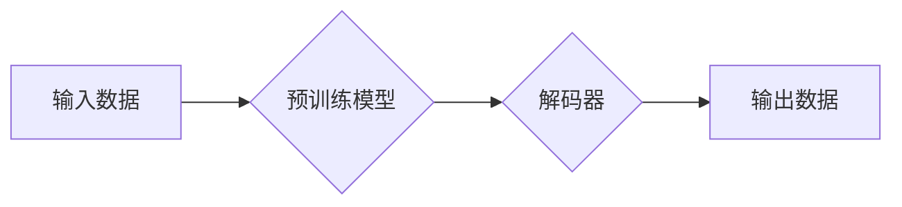

> AIGC, 生成式AI, 商业机会, 创新, 应用场景, 未来趋势

## 1. 背景介绍

近年来，人工智能（AI）技术取得了飞速发展，其中生成式AI（AIGC）作为其重要分支，展现出强大的创造力和应用潜力。AIGC能够根据输入的文本、代码、图像等数据，生成新的、原创的内容，例如文本、代码、图像、音频、视频等。

AIGC技术的出现，为各行各业带来了前所未有的机遇。它可以帮助企业自动化内容创作、提高效率、降低成本，并开拓新的商业模式。

## 2. 核心概念与联系

**2.1  生成式AI概述**

生成式AI是指能够根据输入数据生成新数据的AI模型。它利用深度学习算法，例如Transformer、GAN等，学习数据中的模式和规律，并根据这些模式生成新的数据。

**2.2  AIGC与传统AI的关系**

传统AI主要侧重于数据分析、预测和决策等任务，而AIGC则更注重内容的创造和生成。两者之间存在着密切的联系，传统AI技术为AIGC提供了数据处理、模式识别等基础，而AIGC则将AI技术应用于更具创造性的领域。

**2.3  AIGC的应用场景**

AIGC的应用场景非常广泛，包括：

* **内容创作:** 自动生成新闻报道、广告文案、社交媒体内容、剧本、诗歌等。
* **代码生成:** 根据自然语言描述生成代码，提高开发效率。
* **图像生成:** 生成逼真的图像、艺术作品、产品设计等。
* **音频生成:** 生成音乐、语音合成、音效等。
* **视频生成:** 生成视频剪辑、动画、特效等。

**2.4  AIGC的架构**



**2.5  AIGC的优势**

* **提高效率:** 自动化内容创作，节省人力成本和时间。
* **降低成本:** 减少人工创作的成本，提高生产效率。
* **创造新内容:** 生成全新的、原创的内容，激发创意。
* **个性化定制:** 根据用户需求生成个性化的内容。

## 3. 核心算法原理 & 具体操作步骤

**3.1  算法原理概述**

AIGC的核心算法主要包括：

* **Transformer:** 是一种深度学习模型，能够处理序列数据，例如文本和代码。它利用注意力机制，学习数据之间的关系，并生成新的序列数据。
* **GAN (Generative Adversarial Networks):** 是一种生成对抗网络，由生成器和判别器两部分组成。生成器试图生成逼真的数据，而判别器试图区分真实数据和生成数据。两者之间进行对抗训练，最终生成器能够生成逼真的数据。

**3.2  算法步骤详解**

**Transformer算法步骤:**

1. **输入数据处理:** 将输入数据转换为数字表示，例如词嵌入。
2. **编码器:** 利用多层Transformer模块，学习数据之间的关系。
3. **解码器:** 根据编码器的输出，生成新的序列数据。
4. **输出结果:** 将生成的序列数据转换为可读的形式，例如文本。

**GAN算法步骤:**

1. **初始化生成器和判别器:** 随机初始化生成器和判别器的参数。
2. **生成器训练:** 生成器根据随机噪声生成数据，并将其传递给判别器。
3. **判别器训练:** 判别器根据真实数据和生成数据，学习区分两者。
4. **对抗训练:** 生成器和判别器之间进行对抗训练，生成器试图生成更逼真的数据，而判别器试图更好地区分真实数据和生成数据。
5. **输出结果:** 当生成器能够生成逼真的数据时，训练结束。

**3.3  算法优缺点**

**Transformer算法:**

* **优点:** 能够处理长序列数据，学习数据之间的长距离依赖关系。
* **缺点:** 计算量大，训练时间长。

**GAN算法:**

* **优点:** 可以生成逼真的数据，适用于图像、音频等多模态数据生成。
* **缺点:** 训练过程不稳定，容易出现模式崩溃等问题。

**3.4  算法应用领域**

* **文本生成:** 自动生成新闻报道、小说、诗歌等。
* **图像生成:** 生成逼真的图像、艺术作品、产品设计等。
* **代码生成:** 根据自然语言描述生成代码。
* **音频生成:** 生成音乐、语音合成、音效等。

## 4. 数学模型和公式 & 详细讲解 & 举例说明

**4.1  数学模型构建**

AIGC模型通常基于深度学习框架，例如TensorFlow或PyTorch。模型的数学模型通常由多个神经网络层组成，例如卷积层、全连接层、注意力层等。

**4.2  公式推导过程**

AIGC模型的训练过程涉及到许多数学公式，例如损失函数、梯度下降算法等。这些公式的推导过程比较复杂，需要一定的数学基础。

**4.3  案例分析与讲解**

例如，在文本生成任务中，可以使用Transformer模型，其核心是注意力机制。注意力机制可以学习文本中不同词语之间的关系，并根据这些关系生成新的文本。

**举例说明:**

假设我们有一个句子：“The cat sat on the mat”。

使用注意力机制，模型可以学习到“cat”和“sat”之间的关系，以及“sat”和“mat”之间的关系。然后，根据这些关系，模型可以生成新的句子，例如：“The dog lay on the floor”。

## 5. 项目实践：代码实例和详细解释说明

**5.1  开发环境搭建**

AIGC项目开发通常需要使用Python语言和深度学习框架，例如TensorFlow或PyTorch。

**5.2  源代码详细实现**

```python
# 使用TensorFlow构建一个简单的文本生成模型
import tensorflow as tf

# 定义模型结构
model = tf.keras.Sequential([
    tf.keras.layers.Embedding(input_dim=10000, output_dim=128),
    tf.keras.layers.LSTM(units=128),
    tf.keras.layers.Dense(units=10000, activation='softmax')
])

# 编译模型
model.compile(optimizer='adam', loss='sparse_categorical_crossentropy', metrics=['accuracy'])

# 训练模型
model.fit(x_train, y_train, epochs=10)

# 生成文本
text = model.predict(x_test)
```

**5.3  代码解读与分析**

这段代码定义了一个简单的文本生成模型，它使用Embedding层将单词转换为向量表示，使用LSTM层学习文本序列的上下文关系，最后使用Dense层生成新的单词。

**5.4  运行结果展示**

训练完成后，模型可以根据输入的文本序列生成新的文本序列。

## 6. 实际应用场景

**6.1  内容创作**

* **新闻报道:** 自动生成新闻报道，例如财经新闻、体育新闻等。
* **广告文案:** 自动生成广告文案，例如产品描述、促销语等。
* **社交媒体内容:** 自动生成社交媒体内容，例如微博、微信朋友圈等。

**6.2  代码生成**

* **代码补全:** 根据代码上下文自动补全代码。
* **代码翻译:** 将代码从一种编程语言翻译成另一种编程语言。
* **代码生成:** 根据自然语言描述自动生成代码。

**6.3  图像生成**

* **产品设计:** 自动生成产品设计草图。
* **艺术作品:** 生成艺术作品，例如绘画、雕塑等。
* **图像修复:** 修复损坏的图像。

**6.4  未来应用展望**

AIGC技术的发展将带来更多新的应用场景，例如：

* **个性化教育:** 根据学生的学习情况生成个性化的学习内容。
* **虚拟助手:** 开发更智能的虚拟助手，能够理解和响应用户的自然语言指令。
* **医疗诊断:** 利用AIGC技术辅助医生进行医疗诊断。

## 7. 工具和资源推荐

**7.1  学习资源推荐**

* **书籍:**
    * 《Deep Learning》 by Ian Goodfellow, Yoshua Bengio, and Aaron Courville
    * 《Generative Deep Learning》 by David Foster
* **在线课程:**
    * Coursera: Deep Learning Specialization
    * Udacity: Deep Learning Nanodegree

**7.2  开发工具推荐**

* **TensorFlow:** https://www.tensorflow.org/
* **PyTorch:** https://pytorch.org/
* **Hugging Face Transformers:** https://huggingface.co/transformers/

**7.3  相关论文推荐**

* **Attention Is All You Need:** https://arxiv.org/abs/1706.03762
* **Generative Adversarial Networks:** https://arxiv.org/abs/1406.2661

## 8. 总结：未来发展趋势与挑战

**8.1  研究成果总结**

AIGC技术取得了显著的进展，能够生成高质量的文本、图像、代码等内容。

**8.2  未来发展趋势**

* **模型规模和能力提升:** 未来AIGC模型将更加强大，能够处理更复杂的任务。
* **多模态生成:** AIGC将能够生成多种模态的数据，例如文本、图像、音频、视频等。
* **个性化定制:** AIGC将能够根据用户的需求生成个性化的内容。

**8.3  面临的挑战**

* **数据安全和隐私:** AIGC模型需要大量的数据进行训练，如何保证数据安全和隐私是一个重要挑战。
* **算法可解释性:** AIGC模型的决策过程比较复杂，如何提高算法的可解释性是一个重要的研究方向。
* **伦理问题:** AIGC技术可能带来一些伦理问题，例如内容虚假、版权侵权等，需要引起重视。

**8.4  研究展望**

未来，AIGC技术将继续发展，并带来更多新的应用场景和商业机会。我们需要加强对AIGC技术的研究，并积极探索其应用，同时也要关注其带来的伦理问题，确保其健康发展。

## 9. 附录：常见问题与解答

**9.1  AIGC与传统AI的区别是什么？**

传统AI主要侧重于数据分析、预测和决策等任务，而AIGC则更注重内容的创造和生成。

**9.2  AIGC有哪些应用场景？**

AIGC的应用场景非常广泛，包括内容创作、代码生成、图像生成、音频生成等。

**9.3  如何学习AIGC技术？**

可以学习相关书籍、在线课程，并使用开源工具进行实践。

**9.4  AIGC技术有哪些挑战？**

AIGC技术面临着数据安全、算法可解释性和伦理问题等挑战。


作者：禅与计算机程序设计艺术 / Zen and the Art of Computer Programming 
<end_of_turn>