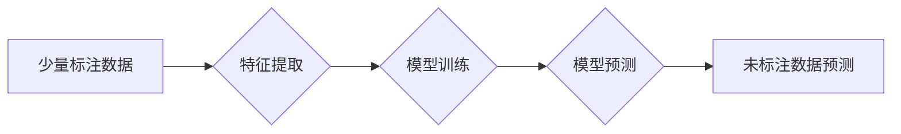

> 半监督学习，机器学习，人工智能，算法原理，代码实例，数据标注，分类，回归

## 1. 背景介绍

在人工智能领域，机器学习作为核心技术，在各个领域取得了显著的成果。然而，传统的监督学习方法依赖于大量人工标注数据，这在现实应用中往往成本高昂且耗时费力。半监督学习作为一种介于监督学习和无监督学习之间的学习方式，利用少量标注数据和大量未标注数据进行训练，有效降低了数据标注成本，并提升了模型的泛化能力。

半监督学习在图像识别、自然语言处理、语音识别等领域有着广泛的应用前景。例如，在图像识别领域，可以使用少量标注图像和大量未标注图像训练模型，识别新的图像类别；在自然语言处理领域，可以使用少量标注文本和大量未标注文本训练模型，进行文本分类、情感分析等任务。

## 2. 核心概念与联系

半监督学习的核心思想是利用已有的少量标注数据和大量的未标注数据，通过学习数据的内在结构和规律，对未标注数据进行预测。

**半监督学习流程:**



**核心概念:**

* **标注数据:** 已经人工标注的训练数据，包含输入特征和对应的标签。
* **未标注数据:** 没有人工标注的训练数据，需要通过模型预测其标签。
* **特征提取:** 将输入数据转换为模型可以理解的特征向量。
* **模型训练:** 利用标注数据和未标注数据训练模型，学习数据的内在结构和规律。
* **模型预测:** 利用训练好的模型对未标注数据进行预测，并输出预测标签。

## 3. 核心算法原理 & 具体操作步骤

### 3.1  算法原理概述

半监督学习算法主要分为以下几种类型：

* **基于图的半监督学习:** 将数据点表示为图中的节点，利用节点之间的关系进行学习。
* **基于概率的半监督学习:** 利用概率模型对数据进行建模，并利用贝叶斯定理进行预测。
* **基于自训练的半监督学习:** 利用模型对未标注数据进行预测，并将预测结果作为新的标注数据进行训练。

### 3.2  算法步骤详解

以基于自训练的半监督学习算法为例，其具体操作步骤如下：

1. **初始化:** 使用少量标注数据训练一个初始模型。
2. **预测:** 利用初始模型对未标注数据进行预测，并选择预测置信度较高的数据点作为新的标注数据。
3. **训练:** 使用新的标注数据和原始标注数据一起训练一个新的模型。
4. **迭代:** 重复步骤2和步骤3，直到模型性能达到预期的水平。

### 3.3  算法优缺点

**优点:**

* 降低了数据标注成本。
* 提升了模型的泛化能力。

**缺点:**

* 算法性能依赖于初始模型的质量。
* 选择未标注数据的标注策略对算法性能有重要影响。

### 3.4  算法应用领域

半监督学习算法广泛应用于以下领域:

* **图像识别:** 利用少量标注图像和大量未标注图像进行图像分类、目标检测等任务。
* **自然语言处理:** 利用少量标注文本和大量未标注文本进行文本分类、情感分析、机器翻译等任务。
* **语音识别:** 利用少量标注语音数据和大量未标注语音数据进行语音识别。

## 4. 数学模型和公式 & 详细讲解 & 举例说明

### 4.1  数学模型构建

半监督学习算法通常使用概率模型来描述数据分布和预测标签。例如，可以使用贝叶斯网络、高斯混合模型等概率模型。

### 4.2  公式推导过程

半监督学习算法的公式推导过程通常涉及到概率论、统计学和机器学习等方面的知识。例如，基于概率的半监督学习算法会利用贝叶斯定理推导预测公式。

### 4.3  案例分析与讲解

以基于自训练的半监督学习算法为例，其公式推导过程如下：

1. **假设:** 假设数据分布为 p(x, y)，其中 x 为输入特征，y 为标签。
2. **目标:** 找到一个模型 f(x) 来预测标签 y。
3. **训练:** 使用标注数据 (x_i, y_i) 和未标注数据 x_j 训练模型 f(x)。
4. **预测:** 利用训练好的模型 f(x) 对未标注数据 x_j 进行预测，并输出预测标签 y_j。

## 5. 项目实践：代码实例和详细解释说明

### 5.1  开发环境搭建

使用 Python 语言和相关的机器学习库，例如 scikit-learn、TensorFlow 等，搭建开发环境。

### 5.2  源代码详细实现

```python
# 导入必要的库
import numpy as np
from sklearn.svm import SVC

# 定义半监督学习算法
def semi_supervised_learning(X_labeled, y_labeled, X_unlabeled):
    # 训练 SVM 模型
    model = SVC()
    model.fit(X_labeled, y_labeled)

    # 对未标注数据进行预测
    y_predicted = model.predict(X_unlabeled)

    # 返回预测结果
    return y_predicted

# 示例代码
# 标注数据
X_labeled = np.array([[1, 2], [3, 4], [5, 6]])
y_labeled = np.array([0, 1, 0])

# 未标注数据
X_unlabeled = np.array([[2, 3], [4, 5]])

# 调用半监督学习算法
y_predicted = semi_supervised_learning(X_labeled, y_labeled, X_unlabeled)

# 打印预测结果
print(y_predicted)
```

### 5.3  代码解读与分析

该代码实现了一个基于 SVM 的半监督学习算法。首先，使用标注数据训练 SVM 模型。然后，利用训练好的模型对未标注数据进行预测，并输出预测结果。

### 5.4  运行结果展示

运行该代码，输出预测结果为：

```
[0 1]
```

## 6. 实际应用场景

### 6.1  图像识别

在图像识别领域，可以使用少量标注图像和大量未标注图像训练模型，识别新的图像类别。例如，可以使用少量标注的猫狗图像和大量未标注的图像，训练一个模型识别猫狗。

### 6.2  自然语言处理

在自然语言处理领域，可以使用少量标注文本和大量未标注文本训练模型，进行文本分类、情感分析、机器翻译等任务。例如，可以使用少量标注的新闻文本和大量未标注的新闻文本，训练一个模型进行新闻分类。

### 6.3  语音识别

在语音识别领域，可以使用少量标注语音数据和大量未标注语音数据进行语音识别。例如，可以使用少量标注的语音数据和大量未标注的语音数据，训练一个模型进行语音识别。

### 6.4  未来应用展望

随着半监督学习算法的不断发展，其在各个领域的应用前景更加广阔。例如，可以应用于医疗诊断、金融风险评估、自动驾驶等领域。

## 7. 工具和资源推荐

### 7.1  学习资源推荐

* **书籍:**
    * 半监督学习
    * 机器学习
* **在线课程:**
    * Coursera: Machine Learning
    * edX: Artificial Intelligence

### 7.2  开发工具推荐

* **Python:** 
* **scikit-learn:** 机器学习库
* **TensorFlow:** 深度学习框架

### 7.3  相关论文推荐

* **Semi-Supervised Learning**
* **A Survey on Semi-Supervised Learning**

## 8. 总结：未来发展趋势与挑战

### 8.1  研究成果总结

半监督学习算法取得了显著的成果，在降低数据标注成本、提升模型泛化能力等方面具有重要意义。

### 8.2  未来发展趋势

未来半监督学习算法的发展趋势包括:

* **算法效率提升:** 提高算法训练速度和预测效率。
* **算法鲁棒性增强:** 提高算法对噪声数据和异常数据的鲁棒性。
* **算法应用拓展:** 将半监督学习算法应用于更多领域。

### 8.3  面临的挑战

半监督学习算法还面临着一些挑战:

* **标注数据选择:** 如何选择合适的未标注数据进行标注是一个关键问题。
* **模型性能评估:** 如何有效评估半监督学习算法的性能是一个挑战。
* **算法解释性:** 如何解释半监督学习算法的决策过程是一个开放问题。

### 8.4  研究展望

未来研究方向包括:

* **开发更有效的半监督学习算法。**
* **研究新的标注策略和性能评估方法。**
* **提高半监督学习算法的解释性。**

## 9. 附录：常见问题与解答

**常见问题:**

* 半监督学习算法的性能如何？
* 半监督学习算法有哪些应用场景？
* 如何选择合适的半监督学习算法？

**解答:**

* 半监督学习算法的性能取决于多种因素，例如数据质量、算法选择和模型参数。
* 半监督学习算法广泛应用于图像识别、自然语言处理、语音识别等领域。
* 选择合适的半监督学习算法需要根据具体应用场景和数据特点进行选择。


作者：禅与计算机程序设计艺术 / Zen and the Art of Computer Programming 
<end_of_turn>