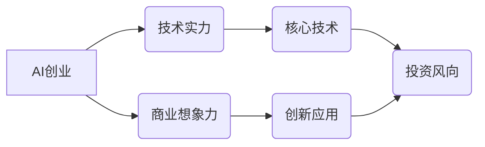

> AI创业,投资风向,技术实力,商业想象力,深度学习,自然语言处理,计算机视觉,数据分析,商业模式

## 1. 背景介绍

人工智能（AI）正以惊人的速度发展，其应用领域不断拓展，从自动驾驶到医疗诊断，从个性化推荐到金融风险控制，AI正在深刻地改变着我们的生活和工作方式。伴随着AI技术的快速发展，涌现出一批AI创业公司，这些公司致力于将AI技术应用于各个行业，创造新的价值。

然而，AI创业投资市场也面临着新的挑战。早期投资热潮逐渐褪去，投资者更加理性，对AI创业公司的投资门槛也随之提高。在这样的背景下，如何判断AI创业公司的投资价值，成为投资者关注的焦点。

## 2. 核心概念与联系

**2.1 AI创业**

AI创业是指利用人工智能技术开发新产品、新服务或新商业模式的创业活动。AI创业公司通常拥有以下特点：

* **核心技术：** 拥有领先的人工智能技术，例如深度学习、自然语言处理、计算机视觉等。
* **创新应用：** 将AI技术应用于特定行业或领域，解决实际问题，创造新的价值。
* **商业模式：** 拥有可行的商业模式，能够实现盈利和可持续发展。

**2.2 投资风向**

AI创业投资风向是指投资者对特定AI领域的投资偏好和趋势。投资风向受多种因素影响，例如技术发展、市场需求、政策支持等。

**2.3 技术实力与商业想象力**

在AI创业投资中，技术实力和商业想象力是两个关键因素。

* **技术实力：** 指AI创业公司拥有的核心技术水平和研发能力。强大的技术实力是AI创业公司成功的基石。
* **商业想象力：** 指AI创业公司对未来市场趋势的洞察力和对AI技术的应用场景的创新能力。商业想象力决定了AI创业公司的发展方向和市场竞争力。

**2.4 核心概念关系图**



## 3. 核心算法原理 & 具体操作步骤

**3.1 算法原理概述**

深度学习是人工智能领域的重要分支，其核心是利用多层神经网络模拟人类大脑的学习过程。深度学习算法能够从海量数据中自动提取特征，并进行模式识别和预测。

**3.2 算法步骤详解**

1. **数据预处理：** 将原始数据进行清洗、转换和格式化，使其适合深度学习算法的训练。
2. **网络结构设计：** 根据具体任务需求，设计多层神经网络的结构，包括神经元数量、连接方式和激活函数等。
3. **参数初始化：** 为神经网络中的参数进行随机初始化。
4. **前向传播：** 将输入数据通过神经网络层层传递，最终得到输出结果。
5. **反向传播：** 计算输出结果与真实值的误差，并根据误差反向调整神经网络参数。
6. **梯度下降：** 利用梯度下降算法不断优化神经网络参数，降低误差。
7. **模型评估：** 使用测试数据评估模型的性能，并根据评估结果进行模型调整和优化。

**3.3 算法优缺点**

**优点：**

* **自动特征提取：** 深度学习算法能够自动从数据中提取特征，无需人工特征工程。
* **高精度：** 深度学习算法在许多任务中能够达到很高的精度。
* **可扩展性：** 深度学习算法能够处理海量数据，并随着数据量的增加而提高精度。

**缺点：**

* **数据依赖：** 深度学习算法需要大量的训练数据才能达到较好的性能。
* **计算资源消耗：** 深度学习算法的训练过程需要大量的计算资源。
* **可解释性差：** 深度学习模型的决策过程难以解释，缺乏透明度。

**3.4 算法应用领域**

深度学习算法广泛应用于以下领域：

* **计算机视觉：** 图像识别、物体检测、图像分割、人脸识别等。
* **自然语言处理：** 文本分类、情感分析、机器翻译、对话系统等。
* **语音识别：** 语音转文本、语音合成等。
* **推荐系统：** 商品推荐、内容推荐等。
* **医疗诊断：** 影像分析、疾病预测等。

## 4. 数学模型和公式 & 详细讲解 & 举例说明

**4.1 数学模型构建**

深度学习模型通常采用多层感知机（MLP）或卷积神经网络（CNN）等结构。

**4.2 公式推导过程**

深度学习模型的训练过程基于梯度下降算法，其核心公式包括：

* **损失函数：** 用于衡量模型预测结果与真实值的误差。常见的损失函数包括均方误差（MSE）、交叉熵损失（Cross-Entropy Loss）等。
* **梯度：** 用于计算损失函数对模型参数的导数，指示参数调整的方向。
* **学习率：** 用于控制参数更新的步长，影响模型收敛速度。

**4.3 案例分析与讲解**

以图像分类为例，假设我们使用CNN模型进行训练，目标是将图像分类为不同的类别。

* **损失函数：** 使用交叉熵损失函数，计算模型预测概率与真实标签之间的差异。
* **梯度：** 通过反向传播算法计算损失函数对模型参数的梯度。
* **学习率：** 设置合适的学习率，控制参数更新的步长。

通过迭代训练，模型参数不断更新，最终达到较低的损失值，实现图像分类任务。

## 5. 项目实践：代码实例和详细解释说明

**5.1 开发环境搭建**

使用Python语言和深度学习框架TensorFlow或PyTorch进行开发。

**5.2 源代码详细实现**

```python
import tensorflow as tf

# 定义模型结构
model = tf.keras.models.Sequential([
    tf.keras.layers.Conv2D(32, (3, 3), activation='relu', input_shape=(28, 28, 1)),
    tf.keras.layers.MaxPooling2D((2, 2)),
    tf.keras.layers.Conv2D(64, (3, 3), activation='relu'),
    tf.keras.layers.MaxPooling2D((2, 2)),
    tf.keras.layers.Flatten(),
    tf.keras.layers.Dense(10, activation='softmax')
])

# 编译模型
model.compile(optimizer='adam',
              loss='sparse_categorical_crossentropy',
              metrics=['accuracy'])

# 加载数据集
(x_train, y_train), (x_test, y_test) = tf.keras.datasets.mnist.load_data()

# 数据预处理
x_train = x_train.astype('float32') / 255.0
x_test = x_test.astype('float32') / 255.0
x_train = x_train.reshape((x_train.shape[0], 28, 28, 1))
x_test = x_test.reshape((x_test.shape[0], 28, 28, 1))

# 训练模型
model.fit(x_train, y_train, epochs=5)

# 评估模型
loss, accuracy = model.evaluate(x_test, y_test)
print('Test loss:', loss)
print('Test accuracy:', accuracy)
```

**5.3 代码解读与分析**

代码首先定义了CNN模型的结构，包括卷积层、池化层和全连接层。然后，使用Adam优化器和交叉熵损失函数编译模型。接着，加载MNIST数据集并进行数据预处理。最后，训练模型并评估模型性能。

**5.4 运行结果展示**

训练完成后，模型能够准确识别MNIST数据集中的手写数字。

## 6. 实际应用场景

**6.1 自动驾驶**

深度学习算法在自动驾驶领域应用广泛，例如：

* **图像识别：** 识别道路标志、交通信号灯、行人、车辆等。
* **路径规划：** 根据周围环境信息规划行驶路径。
* **决策控制：** 根据感知信息做出驾驶决策，例如加速、减速、转向等。

**6.2 医疗诊断**

深度学习算法在医疗诊断领域具有巨大的潜力，例如：

* **图像分析：** 辅助医生诊断疾病，例如癌症、心血管疾病等。
* **疾病预测：** 根据患者的医疗记录和基因信息预测疾病风险。
* **药物研发：** 辅助药物研发，例如发现新的药物靶点和药物候选物。

**6.3 金融风险控制**

深度学习算法可以用于金融风险控制，例如：

* **欺诈检测：** 识别信用卡欺诈、网络钓鱼等欺诈行为。
* **信用评分：** 根据客户的信用历史和行为数据评估信用风险。
* **投资决策：** 利用市场数据和金融指标进行投资决策。

**6.4 未来应用展望**

随着人工智能技术的不断发展，深度学习算法将在更多领域得到应用，例如：

* **个性化教育：** 根据学生的学习情况提供个性化的学习方案。
* **智能客服：** 利用自然语言处理技术提供智能客服服务。
* **工业自动化：** 利用机器视觉和机器人技术实现工业自动化。

## 7. 工具和资源推荐

**7.1 学习资源推荐**

* **书籍：**
    * 深度学习
    * 人工智能：一种现代方法
* **在线课程：**
    * Coursera深度学习课程
    * Udacity深度学习工程师课程

**7.2 开发工具推荐**

* **深度学习框架：** TensorFlow、PyTorch、Keras
* **编程语言：** Python
* **云计算平台：** AWS、Google Cloud、Azure

**7.3 相关论文推荐**

* **AlexNet：** ImageNet Classification with Deep Convolutional Neural Networks
* **VGGNet：** Very Deep Convolutional Networks for Large-Scale Image Recognition
* **ResNet：** Deep Residual Learning for Image Recognition

## 8. 总结：未来发展趋势与挑战

**8.1 研究成果总结**

近年来，深度学习算法取得了显著的进展，在图像识别、自然语言处理、语音识别等领域取得了突破性成果。

**8.2 未来发展趋势**

* **模型规模和复杂度提升：** 模型参数量和层数将继续增加，提升模型的表达能力和泛化能力。
* **算法效率优化：** 研究更有效的训练算法和硬件加速技术，降低模型训练成本和时间。
* **跨模态学习：** 研究融合不同模态数据（例如文本、图像、音频）的深度学习模型，提升模型的理解能力和应用场景。

**8.3 面临的挑战**

* **数据获取和标注：** 深度学习算法需要大量的训练数据，数据获取和标注成本较高。
* **模型可解释性：** 深度学习模型的决策过程难以解释，缺乏透明度，难以获得用户的信任。
* **伦理和安全问题：** 深度学习算法可能存在偏见和歧视问题，需要关注伦理和安全问题。

**8.4 研究展望**

未来，深度学习研究将继续朝着更强大、更智能、更安全的方向发展，为人类社会带来更多福祉。

## 9. 附录：常见问题与解答

**9.1 如何选择合适的深度学习框架？**

选择深度学习框架需要根据具体项目需求和个人经验进行选择。TensorFlow和PyTorch是目前最流行的深度学习框架，各有优缺点。

**9.2 如何处理深度学习模型的过拟合问题？**

过拟合是指模型在训练数据上表现很好，但在测试数据上表现较差。处理过拟合问题的方法包括：

* **