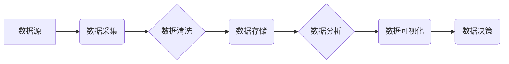

> AI创业, 数据管理, 数据架构, 数据质量, 数据安全, 数据可视化, 数据治理

## 1. 背景介绍

人工智能（AI）技术近年来发展迅速，已渗透到各个行业，为企业带来了巨大的机遇。然而，AI技术的应用离不开海量数据的支撑。数据成为了新时代的“石油”，其价值和重要性日益凸显。

对于AI创业公司而言，数据管理是成功的关键因素。高效、可靠的数据管理体系能够为AI模型的训练和应用提供高质量的数据，从而提升模型的准确性和效率。同时，数据管理也关系到数据的安全、隐私和合规性，是企业可持续发展的基石。

然而，许多AI创业公司在数据管理方面面临着诸多挑战：

* **数据孤岛问题：** 数据分散在不同的系统和平台，难以整合和共享。
* **数据质量问题：** 数据不完整、不准确、不一致，难以满足AI模型的训练需求。
* **数据安全问题：** 数据泄露、数据篡改等安全风险日益突出。
* **数据治理问题：** 缺乏统一的数据管理规范和流程，难以保证数据质量和安全。

## 2. 核心概念与联系

数据管理的核心概念包括数据架构、数据质量、数据安全、数据可视化和数据治理。

**数据架构**是指企业数据资源的组织结构和管理方式，包括数据模型、数据存储、数据传输等方面。

**数据质量**是指数据的准确性、完整性、一致性和及时性等方面。

**数据安全**是指保护数据免受未经授权的访问、使用、修改或销毁等威胁。

**数据可视化**是指将数据以图形、图表等形式呈现出来，以便于理解和分析。

**数据治理**是指制定和实施数据管理的策略、标准和流程，以确保数据质量、安全和合规性。

这些核心概念相互关联，共同构成了数据管理的完整体系。

**数据管理架构**



## 3. 核心算法原理 & 具体操作步骤

### 3.1  算法原理概述

数据管理的核心算法包括数据清洗算法、数据压缩算法、数据加密算法等。

* **数据清洗算法**用于处理数据中的脏数据，例如缺失值、重复值、错误值等。常见的算法包括：
    * 缺失值填充算法：例如平均值填充、中位数填充、KNN填充等。
    * 重复值删除算法：例如去重算法、分组算法等。
    * 错误值修正算法：例如正则表达式匹配、字典匹配等。

* **数据压缩算法**用于减少数据的存储空间和传输带宽。常见的算法包括：
    * Huffman编码
    * Lempel-Ziv算法
    * Run-length编码

* **数据加密算法**用于保护数据的机密性。常见的算法包括：
    * AES算法
    * RSA算法
    * DES算法

### 3.2  算法步骤详解

以数据清洗算法为例，详细说明其操作步骤：

1. **数据收集:** 从各种数据源收集数据。
2. **数据预处理:** 对数据进行格式转换、编码转换等预处理操作。
3. **缺失值处理:** 使用缺失值填充算法填充缺失值。
4. **重复值处理:** 使用重复值删除算法删除重复值。
5. **错误值修正:** 使用错误值修正算法修正错误值。
6. **数据验证:** 对清洗后的数据进行验证，确保数据质量。
7. **数据存储:** 将清洗后的数据存储到数据库或文件系统中。

### 3.3  算法优缺点

**数据清洗算法**

* **优点:** 可以有效地提高数据质量，为后续的分析和应用提供可靠的数据基础。
* **缺点:** 算法的复杂度较高，需要专业的技术人员进行操作和维护。

**数据压缩算法**

* **优点:** 可以有效地减少数据的存储空间和传输带宽，降低存储成本和网络传输费用。
* **缺点:** 压缩算法可能会导致数据丢失，需要根据实际情况选择合适的算法。

**数据加密算法**

* **优点:** 可以有效地保护数据的机密性，防止数据泄露和篡改。
* **缺点:** 加密算法可能会降低数据的处理速度，需要权衡安全性和性能之间的 trade-off。

### 3.4  算法应用领域

数据管理算法广泛应用于各个领域，例如：

* **金融行业:** 用于处理金融交易数据、客户数据等，提高风险管理和客户服务水平。
* **医疗行业:** 用于处理患者数据、医疗影像数据等，辅助医生诊断和治疗。
* **电商行业:** 用于处理商品数据、用户数据等，提高商品推荐和个性化服务水平。
* **互联网行业:** 用于处理用户行为数据、网站流量数据等，优化网站运营和用户体验。

## 4. 数学模型和公式 & 详细讲解 & 举例说明

### 4.1  数学模型构建

数据管理的数学模型可以用来描述数据之间的关系、数据流动的过程以及数据质量的评估指标。

例如，可以构建一个数据流模型，用图论的方式表示数据从源头到目的地的流动路径，以及每个节点的数据处理过程。

### 4.2  公式推导过程

数据质量评估指标的计算公式可以根据具体的业务需求进行设计。

例如，数据完整性的评估指标可以定义为：

```latex
完整性 = (完整数据量 / 总数据量) * 100%
```

其中，完整数据量是指不包含缺失值的有效数据量，总数据量是指所有数据量。

### 4.3  案例分析与讲解

假设一个电商平台需要评估其商品信息的完整性。

* 总数据量为1000条。
* 缺失商品价格的数据量为100条。

则商品信息的完整性为：

```latex
完整性 = (1000 - 100) / 1000 * 100% = 90%
```

## 5. 项目实践：代码实例和详细解释说明

### 5.1  开发环境搭建

* 操作系统：Linux
* 编程语言：Python
* 数据存储：MySQL

### 5.2  源代码详细实现

```python
# 数据清洗脚本

import pandas as pd

# 读取数据
data = pd.read_csv('product_info.csv')

# 填充缺失的商品价格
data['price'].fillna(data['price'].mean(), inplace=True)

# 删除重复的商品信息
data.drop_duplicates(inplace=True)

# 保存清洗后的数据
data.to_csv('cleaned_product_info.csv', index=False)
```

### 5.3  代码解读与分析

* 使用pandas库读取CSV文件中的商品信息。
* 使用`fillna()`方法填充缺失的商品价格，使用平均值填充。
* 使用`drop_duplicates()`方法删除重复的商品信息。
* 使用`to_csv()`方法将清洗后的数据保存到新的CSV文件。

### 5.4  运行结果展示

运行脚本后，将生成一个名为`cleaned_product_info.csv`的文件，其中包含了清洗后的商品信息。

## 6. 实际应用场景

数据管理在AI创业公司中有着广泛的应用场景：

* **AI模型训练:** AI模型需要大量的训练数据，数据管理可以确保训练数据的高质量和可靠性。
* **数据分析:** 数据分析可以帮助企业了解用户行为、市场趋势等，为决策提供依据。
* **个性化服务:** 数据管理可以帮助企业收集和分析用户的个人信息，提供个性化的产品和服务。
* **风险管理:** 数据管理可以帮助企业识别和管理数据安全风险，保护企业资产和用户隐私。

### 6.4  未来应用展望

随着AI技术的不断发展，数据管理将变得更加重要。未来，数据管理将朝着以下方向发展：

* **自动化:** 数据管理流程将更加自动化，减少人工干预。
* **智能化:** 数据管理系统将更加智能化，能够自动识别和处理数据质量问题。
* **云化:** 数据管理将更加云化，数据存储和处理将更加灵活和便捷。

## 7. 工具和资源推荐

### 7.1  学习资源推荐

* **书籍:**
    * 《数据科学实战》
    * 《数据挖掘：概念与技术》
    * 《数据工程》
* **在线课程:**
    * Coursera上的数据科学课程
    * edX上的数据工程课程
    * Udemy上的数据分析课程

### 7.2  开发工具推荐

* **数据处理工具:**
    * Apache Spark
    * Apache Hadoop
    * Apache Kafka
* **数据存储工具:**
    * MySQL
    * PostgreSQL
    * MongoDB
* **数据可视化工具:**
    * Tableau
    * Power BI
    * Qlik Sense

### 7.3  相关论文推荐

* 《数据管理在人工智能时代的角色》
* 《数据质量评估方法综述》
* 《数据安全与隐私保护》

## 8. 总结：未来发展趋势与挑战

### 8.1  研究成果总结

数据管理在AI创业公司中扮演着至关重要的角色，它为AI模型的训练和应用提供了高质量的数据基础，并保障了数据的安全、隐私和合规性。

### 8.2  未来发展趋势

数据管理将朝着自动化、智能化、云化方向发展，并与AI技术更加紧密地结合。

### 8.3  面临的挑战

数据管理面临着数据孤岛、数据质量、数据安全等挑战，需要不断探索新的技术和方法来解决这些问题。

### 8.4  研究展望

未来，数据管理的研究将更加注重数据治理、数据可解释性和数据伦理等方面，以更好地服务于AI技术的应用和发展。

## 9. 附录：常见问题与解答

* **问题:** 如何解决数据孤岛问题？
* **解答:** 可以通过数据集成技术，将分散的数据整合到统一的数据平台。

* **问题:** 如何提高数据质量？
* **解答:** 可以通过数据清洗、数据标准化、数据验证等方法提高数据质量。

* **问题:** 如何保障数据安全？
* **解答:** 可以通过数据加密、数据访问控制、数据备份等措施保障数据安全。


作者：禅与计算机程序设计艺术 / Zen and the Art of Computer Programming 
<end_of_turn>