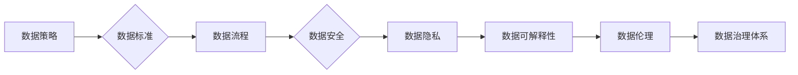

> AI大模型，数据挑战，数据治理，数据安全，数据隐私，数据标注，数据可解释性，数据伦理

## 1. 背景介绍

人工智能（AI）技术近年来发展迅速，特别是大规模语言模型（LLM）的出现，如GPT-3、LaMDA等，展现出强大的文本生成、理解和翻译能力，为各行各业带来了革命性的变革。然而，AI大模型的训练和应用离不开海量数据，而数据本身也面临着诸多挑战，例如数据质量、数据安全、数据隐私、数据可解释性等。

对于创业者而言，如何有效应对这些数据挑战，是构建可持续发展AI业务的关键。本文将深入探讨AI大模型创业中面临的数据挑战，并提出相应的解决方案，帮助创业者更好地利用数据资源，构建成功的AI产品和服务。

## 2. 核心概念与联系

**2.1 数据驱动型AI**

数据驱动型AI是指利用海量数据训练和优化AI模型，使其能够学习和理解复杂模式，从而实现更精准、更智能的决策和预测。

**2.2 数据治理**

数据治理是指对数据生命周期进行全面的管理和控制，包括数据质量、数据安全、数据隐私、数据可访问性等方面。

**2.3 数据安全**

数据安全是指保护数据免受未经授权的访问、使用、披露或破坏。

**2.4 数据隐私**

数据隐私是指个人信息在收集、使用、存储和处理过程中受到保护的权利。

**2.5 数据可解释性**

数据可解释性是指能够理解AI模型的决策过程，并解释其背后的逻辑和原因。

**2.6 数据伦理**

数据伦理是指在收集、使用和处理数据时，遵循道德规范和社会责任。

**2.7 数据标注**

数据标注是指对数据进行人工标记和分类，为AI模型提供训练数据。

**2.8 数据挑战**

AI大模型创业中面临的主要数据挑战包括：

* 数据质量问题：数据不完整、不准确、不一致等问题会影响AI模型的训练效果。
* 数据安全问题：数据泄露、数据篡改等问题会损害企业声誉和用户信任。
* 数据隐私问题：未经用户同意收集和使用个人信息会违反法律法规和伦理规范。
* 数据可解释性问题：难以理解AI模型的决策过程，导致缺乏信任和可控性。
* 数据伦理问题：数据收集、使用和处理过程中可能存在偏见、歧视等问题，引发社会争议。

**2.9 数据治理体系**

为了有效应对数据挑战，企业需要建立完善的数据治理体系，包括数据策略、数据标准、数据流程、数据安全、数据隐私、数据可解释性、数据伦理等方面。

**Mermaid 流程图**



## 3. 核心算法原理 & 具体操作步骤

**3.1 算法原理概述**

深度学习算法是训练AI大模型的核心技术之一。深度学习算法通过多层神经网络结构，模拟人脑的学习机制，从海量数据中学习特征和模式。

**3.2 算法步骤详解**

1. **数据预处理:** 将原始数据进行清洗、转换、编码等操作，使其符合模型训练的要求。
2. **模型构建:** 根据任务需求，选择合适的深度学习模型架构，例如卷积神经网络（CNN）、循环神经网络（RNN）、Transformer等。
3. **模型训练:** 使用训练数据，通过反向传播算法，调整模型参数，使模型的预测结果与真实值尽可能接近。
4. **模型评估:** 使用测试数据，评估模型的性能，例如准确率、召回率、F1-score等。
5. **模型部署:** 将训练好的模型部署到生产环境中，用于实际应用。

**3.3 算法优缺点**

**优点:**

* 能够学习复杂数据模式，实现高精度预测。
* 可处理海量数据，具有强大的泛化能力。

**缺点:**

* 训练成本高，需要大量计算资源和时间。
* 模型解释性差，难以理解模型的决策过程。
* 容易受到数据偏差的影响，导致模型存在偏见。

**3.4 算法应用领域**

深度学习算法广泛应用于图像识别、自然语言处理、语音识别、机器翻译、推荐系统等领域。

## 4. 数学模型和公式 & 详细讲解 & 举例说明

**4.1 数学模型构建**

深度学习模型通常采用多层神经网络结构，每个神经元接收多个输入信号，并通过激活函数进行处理，输出一个信号。

**4.2 公式推导过程**

深度学习模型的训练过程基于梯度下降算法，通过不断调整模型参数，使模型的损失函数最小化。损失函数通常采用均方误差（MSE）或交叉熵（Cross-Entropy）等。

**4.3 案例分析与讲解**

例如，在图像分类任务中，可以使用卷积神经网络（CNN）模型。CNN模型通过卷积层和池化层提取图像特征，然后通过全连接层进行分类。

**举例说明:**

假设我们有一个图像分类任务，需要将图像分类为猫和狗两类。我们可以使用一个简单的CNN模型，包含两层卷积层、两层池化层和一层全连接层。

**4.3.1 卷积层:**

卷积层使用卷积核对图像进行卷积操作，提取图像特征。

**4.3.2 池化层:**

池化层对卷积层的输出进行降维操作，减少计算量并提高模型鲁棒性。

**4.3.3 全连接层:**

全连接层将池化层的输出进行分类，输出猫和狗的概率。

**4.3.4 损失函数:**

我们使用交叉熵损失函数来衡量模型的预测结果与真实标签之间的差异。

**4.3.5 梯度下降:**

我们使用梯度下降算法来更新模型参数，使损失函数最小化。

## 5. 项目实践：代码实例和详细解释说明

**5.1 开发环境搭建**

使用Python语言和深度学习框架TensorFlow或PyTorch搭建开发环境。

**5.2 源代码详细实现**

```python
# 使用TensorFlow构建一个简单的CNN模型
import tensorflow as tf

# 定义模型结构
model = tf.keras.models.Sequential([
    tf.keras.layers.Conv2D(32, (3, 3), activation='relu', input_shape=(28, 28, 1)),
    tf.keras.layers.MaxPooling2D((2, 2)),
    tf.keras.layers.Conv2D(64, (3, 3), activation='relu'),
    tf.keras.layers.MaxPooling2D((2, 2)),
    tf.keras.layers.Flatten(),
    tf.keras.layers.Dense(10, activation='softmax')
])

# 编译模型
model.compile(optimizer='adam',
              loss='sparse_categorical_crossentropy',
              metrics=['accuracy'])

# 训练模型
model.fit(x_train, y_train, epochs=5)

# 评估模型
loss, accuracy = model.evaluate(x_test, y_test)
print('Test loss:', loss)
print('Test accuracy:', accuracy)
```

**5.3 代码解读与分析**

这段代码定义了一个简单的CNN模型，用于图像分类任务。模型包含两层卷积层、两层池化层和一层全连接层。

**5.4 运行结果展示**

训练完成后，模型可以用于预测新的图像类别。

## 6. 实际应用场景

**6.1 图像识别:**

AI大模型可以用于识别物体、场景、人脸等，应用于安防监控、医疗诊断、自动驾驶等领域。

**6.2 自然语言处理:**

AI大模型可以用于文本分类、情感分析、机器翻译、对话系统等，应用于客服机器人、搜索引擎、内容创作等领域。

**6.3 语音识别:**

AI大模型可以用于语音识别、语音合成、语音助手等，应用于智能家居、语音搜索、语音控制等领域。

**6.4 其他应用场景:**

AI大模型还可以应用于推荐系统、欺诈检测、金融分析、药物研发等领域。

**6.5 未来应用展望**

随着AI技术的不断发展，AI大模型的应用场景将更加广泛，例如：

* 更智能的虚拟助手
* 更精准的医疗诊断
* 更安全的金融交易
* 更个性化的教育体验

## 7. 工具和资源推荐

**7.1 学习资源推荐**

* **书籍:**
    * 深度学习
    * 人工智能：一种现代方法
* **在线课程:**
    * Coursera深度学习课程
    * Udacity深度学习课程
* **开源项目:**
    * TensorFlow
    * PyTorch

**7.2 开发工具推荐**

* **深度学习框架:** TensorFlow, PyTorch
* **数据处理工具:** Pandas, NumPy
* **可视化工具:** Matplotlib, Seaborn

**7.3 相关论文推荐**

* Attention Is All You Need
* BERT: Pre-training of Deep Bidirectional Transformers for Language Understanding
* GPT-3: Language Models are Few-Shot Learners

## 8. 总结：未来发展趋势与挑战

**8.1 研究成果总结**

近年来，AI大模型取得了显著进展，在图像识别、自然语言处理等领域取得了突破性成果。

**8.2 未来发展趋势**

* 模型规模和能力将继续提升
* 模型训练效率将得到提高
* 模型解释性和可控性将得到加强
* 模型应用场景将更加广泛

**8.3 面临的挑战**

* 数据质量和安全问题
* 计算资源需求
* 模型偏见和伦理问题

**8.4 研究展望**

未来研究将重点关注解决上述挑战，开发更安全、更可靠、更可解释的AI大模型，推动AI技术向更广泛的领域应用。

## 9. 附录：常见问题与解答

**9.1 如何选择合适的深度学习模型？**

选择合适的深度学习模型需要根据具体的任务需求和数据特点进行选择。

**9.2 如何解决数据质量问题？**

可以通过数据清洗、数据转换、数据标注等方法解决数据质量问题。

**9.3 如何保证模型的安全性？**

可以通过数据加密、模型安全评估、攻击防御等方法保证模型的安全性。

**9.4 如何解决模型的偏见问题？**

可以通过数据多样化、模型公平性评估、算法调优等方法解决模型的偏见问题。


作者：禅与计算机程序设计艺术 / Zen and the Art of Computer Programming 
<end_of_turn>