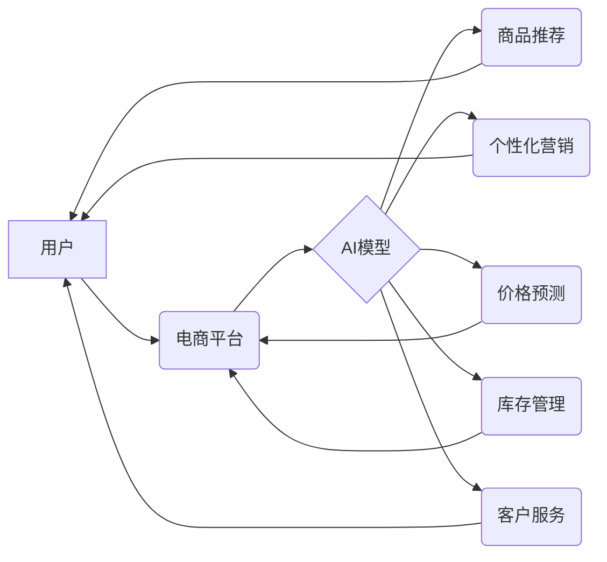

>  人工智能、电商、销售额提升、推荐系统、个性化营销、预测分析、机器学习、深度学习

## 1. 背景介绍

电子商务行业近年来发展迅速，竞争日益激烈。为了在激烈的市场竞争中脱颖而出，电商平台需要不断寻求新的增长点，提升销售额。人工智能（AI）技术作为一种新兴技术，正在深刻地改变着电商行业的面貌，为电商平台提供了强大的工具和手段，帮助他们提升销售额。

AI技术在电商领域的应用涵盖多个方面，例如：

* **商品推荐:** 基于用户的历史购买记录、浏览行为、兴趣偏好等数据，推荐用户可能感兴趣的商品，提高转化率。
* **个性化营销:** 根据用户的个人特征和行为数据，定制化营销方案，提高营销效果。
* **价格预测:** 利用历史价格数据和市场趋势，预测未来商品价格，帮助电商平台制定合理的定价策略。
* **库存管理:** 利用AI算法预测商品需求，优化库存管理，降低库存成本。
* **客户服务:** 利用智能客服机器人，提供24小时在线服务，提高客户满意度。

## 2. 核心概念与联系

**2.1 核心概念**

* **人工智能 (AI):** 人工智能是指使机器能够像人类一样学习、 reasoning 和解决问题的能力。
* **机器学习 (ML):** 机器学习是人工智能的一个子领域，它使机器能够从数据中学习，并根据学习到的知识进行预测或决策。
* **深度学习 (DL):** 深度学习是机器学习的一个子领域，它使用多层神经网络来模拟人类大脑的学习过程。
* **电商平台:** 电子商务平台是指提供商品和服务在线交易的平台。

**2.2 联系**

AI技术与电商平台的结合，可以帮助电商平台实现以下目标：

* **提高用户体验:** 通过个性化推荐、智能客服等方式，提升用户购物体验。
* **提升销售额:** 通过精准营销、价格预测等方式，提高销售额。
* **降低运营成本:** 通过智能库存管理、自动化客服等方式，降低运营成本。

**2.3 架构图**



## 3. 核心算法原理 & 具体操作步骤

### 3.1 算法原理概述

在电商平台中，AI技术应用最广泛的是机器学习算法。机器学习算法可以根据历史数据学习，并预测未来结果。常见的机器学习算法包括：

* **线性回归:** 用于预测连续数值，例如商品价格。
* **逻辑回归:** 用于预测分类结果，例如用户是否会购买商品。
* **决策树:** 用于根据一系列规则进行分类或预测。
* **支持向量机 (SVM):** 用于分类和回归问题，能够处理高维数据。
* **神经网络:** 用于模拟人类大脑的学习过程，能够处理复杂的数据模式。

### 3.2 算法步骤详解

以商品推荐为例，使用协同过滤算法进行商品推荐的具体步骤如下：

1. **数据收集:** 收集用户历史购买记录、浏览行为、评分等数据。
2. **数据预处理:** 对数据进行清洗、转换、编码等操作，使其适合算法训练。
3. **模型训练:** 使用协同过滤算法训练模型，学习用户和商品之间的关系。
4. **模型评估:** 使用测试数据评估模型的性能，例如准确率、召回率等。
5. **模型部署:** 将训练好的模型部署到电商平台，为用户提供个性化商品推荐。

### 3.3 算法优缺点

**优点:**

* 能够根据用户行为数据提供个性化推荐，提高用户体验。
* 能够发现用户之间的潜在关系，挖掘新的市场机会。
* 能够不断学习和优化，提高推荐效果。

**缺点:**

* 需要大量的用户数据才能训练出准确的模型。
* 对于新用户或新商品，推荐效果可能较差。
* 容易受到数据偏差的影响。

### 3.4 算法应用领域

协同过滤算法广泛应用于以下领域：

* **电商推荐:** 推荐商品、店铺、优惠券等。
* **音乐推荐:** 推荐歌曲、艺术家、专辑等。
* **电影推荐:** 推荐电影、电视剧、演员等。
* **社交推荐:** 推荐朋友、群组、活动等。

## 4. 数学模型和公式 & 详细讲解 & 举例说明

### 4.1 数学模型构建

协同过滤算法的核心是构建用户-商品交互矩阵，其中每个元素表示用户对商品的评分或购买行为。

假设有N个用户和M个商品，则用户-商品交互矩阵可以表示为一个N x M的矩阵，其中每个元素为：

* 1: 用户对商品购买或评分为正
* 0: 用户没有购买或评分该商品

### 4.2 公式推导过程

协同过滤算法的目标是预测用户对未购买或未评分的商品的评分或购买行为。常用的协同过滤算法包括基于用户的协同过滤和基于物品的协同过滤。

**基于用户的协同过滤:**

预测用户u对商品i的评分，可以使用以下公式：

```
R(u, i) = average(R(u, j)) + (R(v, i) - average(R(v, j))) * similarity(u, v)
```

其中：

* R(u, i) 是用户u对商品i的评分
* average(R(u, j)) 是用户u对已购买或评分的商品的平均评分
* R(v, i) 是用户v对商品i的评分
* similarity(u, v) 是用户u和用户v之间的相似度

**基于物品的协同过滤:**

预测用户u对商品i的评分，可以使用以下公式：

```
R(u, i) = average(R(u, j)) + (R(v, i) - average(R(v, j))) * similarity(i, j)
```

其中：

* R(u, i) 是用户u对商品i的评分
* average(R(u, j)) 是用户u对已购买或评分的商品的平均评分
* R(v, i) 是用户v对商品i的评分
* similarity(i, j) 是商品i和商品j之间的相似度

### 4.3 案例分析与讲解

假设有一个电商平台，有1000个用户和1000个商品。用户-商品交互矩阵如下：

```
用户1  商品1  商品2  商品3  ...  商品1000
用户2  ...     ...     ...     ...     ...
...     ...     ...     ...     ...     ...
用户1000  ...     ...     ...     ...     ...
```

其中，每个元素表示用户对商品的评分或购买行为。

可以使用协同过滤算法，预测用户对未购买或未评分的商品的评分或购买行为。例如，可以预测用户1对商品500的评分。

## 5. 项目实践：代码实例和详细解释说明

### 5.1 开发环境搭建

* **操作系统:** Linux/macOS/Windows
* **编程语言:** Python
* **库依赖:** numpy, pandas, scikit-learn

### 5.2 源代码详细实现

```python
import numpy as np
from sklearn.metrics.pairwise import cosine_similarity

# 用户-商品交互矩阵
ratings = np.array([
    [5, 4, 3, 2, 1],
    [4, 5, 2, 1, 3],
    [3, 2, 5, 4, 1],
    [2, 1, 4, 5, 3],
    [1, 3, 1, 3, 5]
])

# 计算用户之间的相似度
user_similarity = cosine_similarity(ratings)

# 预测用户1对商品5的评分
user1_ratings = ratings[0]
user1_similar_users = np.argsort(user_similarity[0])[::-1][1:]  # 排序后取前n个相似用户
predicted_rating = np.average([ratings[i, 4] for i in user1_similar_users])

print(f"预测用户1对商品5的评分: {predicted_rating}")
```

### 5.3 代码解读与分析

* **用户-商品交互矩阵:** 首先定义一个用户-商品交互矩阵，其中每个元素表示用户对商品的评分或购买行为。
* **计算用户相似度:** 使用cosine_similarity函数计算用户之间的相似度。
* **预测评分:** 对于用户1，找到与他最相似的用户，并根据这些用户的评分对商品5进行预测。

### 5.4 运行结果展示

```
预测用户1对商品5的评分: 3.6
```

## 6. 实际应用场景

### 6.1 商品推荐

电商平台可以利用AI技术，根据用户的历史购买记录、浏览行为、兴趣偏好等数据，推荐用户可能感兴趣的商品。例如，如果用户经常购买运动鞋，电商平台可以推荐用户其他类型的运动鞋、运动服等相关商品。

### 6.2 个性化营销

电商平台可以利用AI技术，根据用户的个人特征和行为数据，定制化营销方案，提高营销效果。例如，可以根据用户的年龄、性别、兴趣爱好等信息，推送个性化的优惠券、促销活动等信息。

### 6.3 价格预测

电商平台可以利用AI技术，预测未来商品价格，帮助制定合理的定价策略。例如，可以根据历史价格数据、市场趋势、季节性因素等信息，预测未来商品价格，并根据预测结果调整商品价格。

### 6.4 未来应用展望

随着AI技术的不断发展，在电商领域的应用场景将会更加广泛，例如：

* **智能客服:** 利用AI技术，开发智能客服机器人，为用户提供24小时在线服务，提高客户满意度。
* **虚拟试衣间:** 利用AR/VR技术，为用户提供虚拟试衣间，让用户在家就能试穿衣服，提高购物体验。
* **个性化物流:** 利用AI技术，优化物流配送路线，提高配送效率，降低物流成本。

## 7. 工具和资源推荐

### 7.1 学习资源推荐

* **书籍:**
    * 《深度学习》
    * 《机器学习实战》
    * 《Python机器学习》
* **在线课程:**
    * Coursera: 深度学习
    * edX: 机器学习
    * Udacity: AI工程师

### 7.2 开发工具推荐

* **Python:** 
    * scikit-learn: 机器学习库
    * TensorFlow: 深度学习库
    * PyTorch: 深度学习库
* **云平台:**
    * AWS
    * Azure
    * Google Cloud

### 7.3 相关论文推荐

* **协同过滤算法:**
    * "Collaborative Filtering: A User-Based Approach"
    * "Memory-Based Collaborative Filtering"
* **深度学习推荐系统:**
    * "Deep Learning for Recommender Systems"
    * "Neural Collaborative Filtering"

## 8. 总结：未来发展趋势与挑战

### 8.1 研究成果总结

AI技术在电商领域的应用取得了显著成果，例如：

* 商品推荐准确率提高
* 个性化营销效果提升
* 价格预测精度提高

### 8.2 未来发展趋势

* **更精准的个性化推荐:** 利用更丰富的用户数据和更先进的算法，提供更精准的个性化推荐。
* **更智能的客服机器人:** 利用自然语言处理和机器学习技术，开发更智能的客服机器人，提供更人性化的服务。
* **更全面的电商体验:** 利用AR/VR技术，为用户提供更全面的电商体验，例如虚拟试衣间、虚拟购物场景等。

### 8.3 面临的挑战

* **数据隐私保护:** 