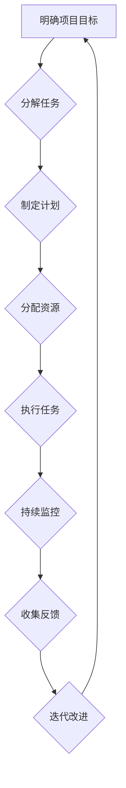

> 项目管理, 编程, 深度学习,  人工智能,  技术领导力,  创新,  执行力

## 1. 背景介绍

在当今科技飞速发展的时代，人工智能（AI）正以惊人的速度改变着世界。作为AI领域的领军人物，Andrej Karpathy 凭借其卓越的编程能力、深厚的理论基础和敏锐的洞察力，在计算机视觉、深度学习等领域取得了令人瞩目的成就。他不仅是一位杰出的研究者，也是一位经验丰富的项目经理和技术领导者。

本文将探讨 Andrej Karpathy 的成功经验，分析他如何自信地承担项目，并将其成功推向市场。我们将从他的项目管理理念、编程技巧、技术领导力以及对创新和执行力的重视等方面进行深入探讨，希望能为广大开发者和技术爱好者提供一些启发和借鉴。

## 2. 核心概念与联系

Andrej Karpathy 的项目管理理念的核心在于 **清晰的目标、有效的沟通、敏捷迭代和持续改进**。

**Mermaid 流程图：**



**核心概念原理和架构：**

* **明确项目目标:**  项目的第一步是明确目标，并将其分解成可管理的子任务。
* **分解任务:** 将大型项目分解成更小的、更易于处理的任务，以便更好地管理和分配资源。
* **制定计划:**  根据任务分解结果，制定详细的项目计划，包括时间安排、资源分配和风险评估等。
* **分配资源:**  根据计划，合理分配人力、物力和财力等资源，确保项目顺利进行。
* **执行任务:**  按照计划执行任务，并及时跟踪进度和质量。
* **持续监控:**  持续监控项目进展，及时发现问题并采取措施解决。
* **收集反馈:**  定期收集项目成员和相关利益方的反馈，了解项目进展情况和潜在问题。
* **迭代改进:**  根据反馈信息，不断改进项目计划和执行方式，提高项目效率和质量。

## 3. 核心算法原理 & 具体操作步骤

Andrej Karpathy 在深度学习领域的研究成果显著，他开发了许多重要的算法和模型，例如：

* **ImageNet 识别模型:**  他领导的团队开发了 ImageNet 识别模型，该模型在图像识别任务上取得了突破性的进展。
* **Convolutional Neural Networks (CNNs):**  他深入研究了卷积神经网络 (CNNs) 的结构和训练方法，并提出了许多改进方案。
* **Generative Adversarial Networks (GANs):**  他积极探索生成对抗网络 (GANs) 的应用，并在图像生成、文本生成等领域取得了成果。

**3.1 算法原理概述**

深度学习算法的核心是利用多层神经网络来模拟人类大脑的学习过程。这些网络由大量的节点（神经元）组成，每个节点都连接到其他节点，并通过权重来控制信息传递。通过训练，网络可以学习到输入数据和输出数据的映射关系，从而实现各种任务，例如图像识别、语音识别、自然语言处理等。

**3.2 算法步骤详解**

深度学习算法的训练过程通常包括以下步骤：

1. **数据预处理:**  将原始数据转换为深度学习模型可以理解的格式，例如将图像转换为像素矩阵，将文本转换为词向量等。
2. **模型构建:**  根据任务需求，选择合适的深度学习模型架构，并设置模型参数。
3. **模型训练:**  使用训练数据训练模型，通过调整模型参数，使模型的预测结果与真实值尽可能接近。
4. **模型评估:**  使用测试数据评估模型的性能，例如计算准确率、召回率、F1-score等指标。
5. **模型调优:**  根据评估结果，调整模型参数或架构，以提高模型性能。

**3.3 算法优缺点**

**优点:**

* **高精度:** 深度学习算法在许多任务上可以达到很高的精度，甚至超过人类水平。
* **自动化特征提取:**  深度学习模型可以自动学习数据中的特征，无需人工特征工程。
* **可扩展性:**  深度学习模型可以处理海量数据，并可以并行训练，提高训练效率。

**缺点:**

* **数据依赖:**  深度学习算法需要大量的训练数据才能达到较好的性能。
* **计算资源消耗:**  训练深度学习模型需要大量的计算资源，例如GPU。
* **可解释性差:**  深度学习模型的决策过程比较复杂，难以解释其决策依据。

**3.4 算法应用领域**

深度学习算法在各个领域都有广泛的应用，例如：

* **计算机视觉:**  图像识别、物体检测、图像分割、人脸识别等。
* **自然语言处理:**  文本分类、情感分析、机器翻译、对话系统等。
* **语音识别:**  语音转文本、语音助手等。
* **医疗诊断:**  疾病诊断、影像分析等。
* **金融预测:**  股票预测、风险评估等。

## 4. 数学模型和公式 & 详细讲解 & 举例说明

深度学习算法的数学基础是微积分、线性代数和概率论。

**4.1 数学模型构建**

深度学习模型通常由多个层组成，每一层都包含多个神经元。每个神经元接收来自上一层的输入信号，并通过激活函数进行处理，输出到下一层。

**4.2 公式推导过程**

深度学习模型的训练过程是通过优化模型参数来最小化损失函数的过程。损失函数衡量模型预测结果与真实值的差距。常用的优化算法包括梯度下降法、动量法、Adam 算法等。

**4.3 案例分析与讲解**

例如，在图像识别任务中，深度学习模型会将图像转换为特征向量，然后将特征向量输入到分类器中进行分类。分类器通常是一个多层感知机 (MLP)，其输出层包含多个神经元，每个神经元对应一个类别。

**举例说明:**

假设我们有一个图像识别模型，用于识别猫和狗的图片。模型的输入是一个 28x28 的灰度图像，输出层包含两个神经元，分别对应猫和狗的类别。

训练过程中，模型会根据训练数据的标签，调整模型参数，使模型的输出结果与真实标签尽可能接近。

## 5. 项目实践：代码实例和详细解释说明

**5.1 开发环境搭建**

深度学习项目通常需要使用 Python 语言和相关的深度学习框架，例如 TensorFlow、PyTorch 等。

**5.2 源代码详细实现**

以下是一个简单的图像分类模型的代码示例，使用 TensorFlow 框架实现：

```python
import tensorflow as tf

# 定义模型结构
model = tf.keras.models.Sequential([
    tf.keras.layers.Flatten(input_shape=(28, 28)),
    tf.keras.layers.Dense(128, activation='relu'),
    tf.keras.layers.Dense(10, activation='softmax')
])

# 编译模型
model.compile(optimizer='adam',
              loss='sparse_categorical_crossentropy',
              metrics=['accuracy'])

# 训练模型
model.fit(x_train, y_train, epochs=5)

# 评估模型
loss, accuracy = model.evaluate(x_test, y_test)
print('Test loss:', loss)
print('Test accuracy:', accuracy)
```

**5.3 代码解读与分析**

这段代码定义了一个简单的多层感知机 (MLP) 模型，用于图像分类任务。

* `tf.keras.models.Sequential` 创建了一个顺序模型，即层级结构。
* `tf.keras.layers.Flatten` 将输入图像转换为一维向量。
* `tf.keras.layers.Dense` 定义全连接层，每个神经元连接到上一层的所有神经元。
* `activation='relu'` 使用 ReLU 激活函数。
* `activation='softmax'` 使用 softmax 激活函数，将输出转换为概率分布。
* `model.compile` 编译模型，指定优化器、损失函数和评估指标。
* `model.fit` 训练模型，使用训练数据进行训练。
* `model.evaluate` 评估模型，使用测试数据计算损失和准确率。

**5.4 运行结果展示**

训练完成后，模型可以用来预测新的图像类别。

## 6. 实际应用场景

深度学习算法在各个领域都有广泛的应用，例如：

* **医疗诊断:**  深度学习算法可以用于辅助医生诊断疾病，例如癌症、糖尿病等。
* **金融预测:**  深度学习算法可以用于预测股票价格、风险评估等。
* **自动驾驶:**  深度学习算法可以用于识别道路场景、预测车辆运动等，实现自动驾驶功能。
* **人脸识别:**  深度学习算法可以用于识别人脸，用于身份验证、安全监控等。

**6.4 未来应用展望**

随着深度学习算法的不断发展，其应用场景将更加广泛，例如：

* **个性化教育:**  深度学习算法可以根据学生的学习情况，提供个性化的学习方案。
* **智能客服:**  深度学习算法可以用于开发智能客服系统，自动回答用户问题。
* **药物研发:**  深度学习算法可以用于加速药物研发过程，例如预测药物的有效性、安全性等。

## 7. 工具和资源推荐

**7.1 学习资源推荐**

* **课程:**  Coursera、edX、Udacity 等平台提供深度学习相关的课程。
* **书籍:**  《深度学习》、《动手学深度学习》等书籍。
* **博客:**  Andrej Karpathy 的博客、机器之心、AI 算法等博客。

**7.2 开发工具推荐**

* **深度学习框架:**  TensorFlow、PyTorch、Keras 等。
* **编程语言:**  Python。
* **数据处理工具:**  Pandas、NumPy 等。

**7.3 相关论文推荐**

* **ImageNet 识别模型:**  Krizhevsky, Alex, Ilya Sutskever, and Geoffrey E. Hinton. "Imagenet classification with deep convolutional neural networks." Advances in neural information processing systems. 2012.
* **Convolutional Neural Networks (CNNs):**  LeCun, Yann, Léon Bottou, Yoshua Bengio, and Patrick Haffner. "Gradient-based learning applied to document recognition." Proceedings of the IEEE 86.11 (1998): 2278-2324.
* **Generative Adversarial Networks (GANs):**  Goodfellow, Ian J., Jean Pouget-Abadie, Mehdi Mirza, Bing Xu, David Warde-Farley, Sherjil Ozair, Aaron Courville, and Yoshua Bengio. "Generative adversarial nets." Advances in neural information processing systems. 2014.

## 8. 总结：未来发展趋势与挑战

**8.1 研究成果总结**

Andrej Karpathy 的研究成果对深度学习领域产生了深远的影响，他开发了许多重要的算法和模型，推动了深度学习技术的进步。

**8.2 未来发展趋势**

未来深度学习的发展趋势包括：

* **模型规模的扩大:**  更大的模型可以学习更复杂的特征，从而提高模型性能。
* **模型效率的提升:**  研究更高效的训练算法和模型架构，降低模型训练和推理的成本。
* **模型解释性的增强:**  研究更易于理解的深度学习模型，提高模型的可解释性。
* **跨模态学习:**  研究能够处理多种模态数据的深度学习模型，例如图像、文本、音频等。

**8.3 面临的挑战**

深度学习技术还面临着一些挑战，例如：

* **数据获取和标注:**  深度学习算法需要大量的训练数据，获取和标注这些数据成本很高。
* **模型可解释性:**  深度学习模型的决策过程比较复杂，难以解释其决策依据。
* **公平性和