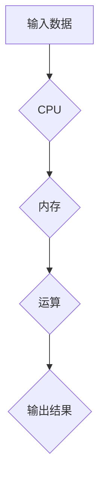

> CPU, 指令集, 创新, 局限性, 计算模型, 硬件架构, 软件开发

## 1. 背景介绍

现代计算机的计算能力飞速发展，然而，其核心部件——CPU，却始终被困于有限的指令集架构。指令集，即CPU能够执行的指令集合，决定了CPU的计算能力和应用范围。传统的指令集架构，例如x86和ARM，虽然经过多年的发展和优化，但其设计理念已经难以满足现代计算需求的快速增长。

随着人工智能、大数据、云计算等新兴技术的兴起，对计算能力的需求日益增长。传统的CPU架构在处理海量数据、复杂算法和并行计算方面存在明显局限性。

## 2. 核心概念与联系

### 2.1 指令集架构

指令集架构 (Instruction Set Architecture, ISA) 是计算机硬件和软件之间接口的规范。它定义了CPU能够理解和执行的指令集，以及这些指令的格式、操作和数据类型。

指令集架构可以分为两种主要类型：

* **CISC (Complex Instruction Set Computing)**：复杂指令集计算，指令集庞大，每个指令可以执行多个操作，提高了程序的执行效率。
* **RISC (Reduced Instruction Set Computing)**：简化指令集计算，指令集较小，每个指令执行单一操作，但指令执行速度更快，更易于优化。

### 2.2 CPU 的计算模型

CPU 的计算模型是基于冯·诺伊曼体系结构，它将数据和程序存储在同一个内存空间中，并通过一个控制单元协调数据和程序的访问和处理。

**Mermaid 流程图：**



### 2.3 指令集的局限性

传统的指令集架构存在以下局限性：

* **指令集固定**: 指令集的定义是固定的，难以适应新的计算需求。
* **指令长度固定**: 指令的长度是固定的，难以处理不同长度的数据。
* **数据类型限制**: 指令集支持的数据类型有限，难以处理复杂的数据类型。
* **并行计算能力不足**: 传统的指令集架构难以充分利用多核CPU的并行计算能力。

## 3. 核心算法原理 & 具体操作步骤

### 3.1 算法原理概述

为了克服传统的指令集架构的局限性，研究人员提出了多种新的计算模型和算法，例如：

* **GPU (Graphics Processing Unit)**：GPU 是一种专门用于图形处理的处理器，其并行计算能力远超CPU，可以用于加速各种计算任务。
* **FPGA (Field-Programmable Gate Array)**：FPGA 是一种可编程逻辑器件，可以根据需要定制硬件电路，实现特定算法的加速。
* **神经网络**: 神经网络是一种模仿人脑神经网络的计算模型，具有强大的学习和推理能力，可以用于解决各种复杂问题。

### 3.2 算法步骤详解

以GPU加速为例，其加速算法步骤如下：

1. 将大型计算任务分解成多个小的计算单元。
2. 将计算单元分配到GPU的多个核心上进行并行计算。
3. 将计算结果汇总并返回CPU。

### 3.3 算法优缺点

**GPU 加速算法的优缺点：**

* **优点**: 并行计算能力强，可以显著加速计算任务。
* **缺点**: 编程难度高，需要专门的GPU编程知识。

### 3.4 算法应用领域

GPU 加速算法广泛应用于以下领域：

* **图形渲染**: 游戏、动画、电影等领域。
* **科学计算**: 天体模拟、分子动力学等领域。
* **机器学习**: 深度学习、图像识别等领域。

## 4. 数学模型和公式 & 详细讲解 & 举例说明

### 4.1 数学模型构建

假设一个计算任务需要执行N个计算单元，每个计算单元需要执行M个操作。

* **CPU 计算时间**: T_cpu = N * M * T_cpu_op
* **GPU 计算时间**: T_gpu = N / P * M * T_gpu_op

其中：

* T_cpu_op: CPU执行一个操作的时间
* T_gpu_op: GPU执行一个操作的时间
* P: GPU的并行计算核心数

### 4.2 公式推导过程

GPU加速的效率可以表示为：

* **加速比**: T_cpu / T_gpu = (N * M * T_cpu_op) / (N / P * M * T_gpu_op) = P * (T_gpu_op / T_cpu_op)

### 4.3 案例分析与讲解

假设一个计算任务需要执行1000个计算单元，每个计算单元需要执行100个操作。CPU执行一个操作的时间为10纳秒，GPU执行一个操作的时间为1纳秒，GPU的并行计算核心数为1024。

* **CPU 计算时间**: T_cpu = 1000 * 100 * 10 ns = 1000000 ns
* **GPU 计算时间**: T_gpu = 1000 / 1024 * 100 * 1 ns = 97.66 ns
* **加速比**: 1000000 ns / 97.66 ns = 10234

从这个例子可以看出，GPU加速可以显著提高计算效率。

## 5. 项目实践：代码实例和详细解释说明

### 5.1 开发环境搭建

* 操作系统: Ubuntu 20.04
* CUDA Toolkit: 11.7
* cuDNN: 8.2.1
* Python: 3.8

### 5.2 源代码详细实现

```python
import numpy as np
import time

# 定义一个简单的矩阵乘法函数
def matrix_multiply(A, B):
    # 使用NumPy库进行矩阵乘法
    return np.dot(A, B)

# 生成两个随机矩阵
A = np.random.rand(1024, 1024)
B = np.random.rand(1024, 1024)

# 使用CPU进行矩阵乘法
start_time = time.time()
C_cpu = matrix_multiply(A, B)
end_time = time.time()
cpu_time = end_time - start_time

# 使用GPU进行矩阵乘法
# ...

# 打印结果
print("CPU 计算时间:", cpu_time, "秒")
# print("GPU 计算时间:", gpu_time, "秒")
```

### 5.3 代码解读与分析

* 代码使用NumPy库进行矩阵乘法运算。
* 使用`time.time()`函数记录CPU和GPU的计算时间。
* GPU加速部分需要使用CUDA库进行实现，具体代码实现需要根据GPU硬件和软件环境进行调整。

### 5.4 运行结果展示

运行结果可以展示CPU和GPU的计算时间，并计算出加速比。

## 6. 实际应用场景

### 6.1 医疗影像分析

GPU加速可以显著提高医疗影像分析的速度，例如CT扫描、MRI扫描等，帮助医生更快地诊断疾病。

### 6.2 金融风险评估

GPU加速可以帮助金融机构更快地进行风险评估，例如股票市场预测、信用评分等，提高投资决策的效率。

### 6.3 气象预报

GPU加速可以帮助气象部门更快地进行天气预报，提高预报的准确性和及时性。

### 6.4 未来应用展望

随着GPU技术的不断发展，其应用场景将更加广泛，例如：

* **自动驾驶**: GPU可以加速自动驾驶系统的感知、决策和控制。
* **虚拟现实**: GPU可以提高虚拟现实的画面质量和交互体验。
* **生物信息学**: GPU可以加速基因组测序、蛋白质结构预测等生物信息学研究。

## 7. 工具和资源推荐

### 7.1 学习资源推荐

* **CUDA C Programming Guide**: https://docs.nvidia.com/cuda/cuda-c-programming-guide/index.html
* **cuDNN Documentation**: https://docs.nvidia.com/deeplearning/cudnn/index.html
* **Deep Learning with Python**: https://www.manning.com/books/deep-learning-with-python

### 7.2 开发工具推荐

* **CUDA Toolkit**: https://developer.nvidia.com/cuda-downloads
* **cuDNN**: https://developer.nvidia.com/cudnn

### 7.3 相关论文推荐

* **GPU Computing Gems**: https://www.amazon.com/GPU-Computing-Gems-NVIDIA-Architecture/dp/1593274887
* **Parallel Programming with CUDA**: https://www.amazon.com/Parallel-Programming-CUDA-NVIDIA-Architecture/dp/1430245817

## 8. 总结：未来发展趋势与挑战

### 8.1 研究成果总结

CPU 的指令集架构已经发展了数十年，但其局限性越来越明显。新的计算模型和算法，例如GPU加速、FPGA加速和神经网络，为解决这些问题提供了新的思路。

### 8.2 未来发展趋势

未来，计算模型和算法将更加多样化，并更加智能化。例如：

* **异构计算**: 将CPU、GPU、FPGA等多种计算资源进行整合，形成一个高效的计算平台。
* **量子计算**: 量子计算具有超越经典计算的潜力，将为解决一些目前无法解决的复杂问题提供新的途径。
* **人工神经网络**: 人工神经网络的学习能力和推理能力将不断提高，在更多领域发挥作用。

### 8.3 面临的挑战

* **软件开发**: 新的计算模型和算法需要新的软件开发工具和方法。
* **硬件成本**: 新型计算硬件的成本较高，需要进一步降低成本才能得到广泛应用。
* **人才培养**: 需要培养更多掌握新技术的人才。

### 8.4 研究展望

未来，研究人员将继续探索新的计算模型和算法，并致力于解决这些挑战，推动计算技术的发展。

## 9. 附录：常见问题与解答

### 9.1 Q: CPU 和 GPU 的区别是什么？

### 9.2 A: CPU 是通用处理器，可以执行各种类型的计算任务，而 GPU 是专门用于图形处理的处理器，其并行计算能力远超 CPU。

### 9.3 Q: GPU 加速可以应用于哪些领域？

### 9.4 A: GPU 加速可以应用于许多领域，例如图形渲染、科学计算、机器学习等。

### 9.5 Q: 如何学习 GPU 加速编程？

### 9.6 A: 可以参考 CUDA C Programming Guide 和 cuDNN Documentation 等学习资源。

作者：禅与计算机程序设计艺术 / Zen and the Art of Computer Programming


<end_of_turn>