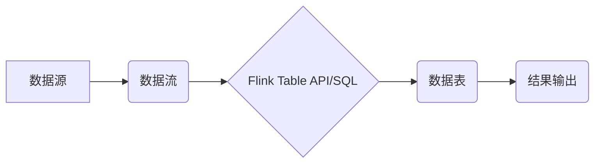

> Apache Flink, Table API, SQL, 数据流处理,  数据仓库,  数据分析,  实时计算,  分布式系统

## 1. 背景介绍

在当今数据爆炸的时代，实时数据处理和分析的需求日益增长。传统的批处理模式难以满足对实时性、低延迟和高吞吐量的要求。Apache Flink 作为一款开源的分布式流处理框架，凭借其强大的数据流处理能力、高吞吐量和低延迟特性，成为实时数据处理的首选工具之一。

Flink 提供了两种主要的方式来开发数据流应用程序：

* **DataStream API:** 基于流式数据处理的编程接口，提供灵活的流式数据操作能力。
* **Table API 和 SQL:** 基于表式数据处理的编程接口，提供类似于关系数据库的SQL查询语言和表式数据操作能力。

Table API 和 SQL 能够简化数据处理逻辑，提高开发效率，并提供更直观的表式数据操作方式。

## 2. 核心概念与联系

**2.1  概念概述**

* **数据流:**  连续不断的数据序列，例如传感器数据、日志数据、交易数据等。
* **数据表:**  结构化数据集合，类似于关系数据库中的表，具有列名和数据类型。
* **窗口:**  用于对流式数据进行分组和聚合的机制，例如时间窗口、计数窗口等。
* **转换:**  用于对数据流进行操作的函数，例如过滤、映射、聚合等。

**2.2  Flink Table API 和 SQL 的关系**

Flink Table API 和 SQL 是相互关联的，它们共同构成了 Flink 的表式数据处理系统。

* **Table API:**  提供 Java 和 Scala 编程接口，用于操作数据表，并执行各种数据处理操作。
* **SQL:**  提供 SQL 查询语言，用于查询和操作数据表，并支持多种 SQL 语句，例如 SELECT、INSERT、UPDATE、DELETE 等。

Flink Table API 和 SQL 共同实现了以下功能：

* **数据表转换:**  支持各种数据表转换操作，例如过滤、映射、聚合等。
* **窗口操作:**  支持多种窗口操作，例如时间窗口、计数窗口等。
* **连接和 JOIN:**  支持数据表之间的连接和 JOIN 操作。
* **数据存储:**  支持将数据表存储到外部存储系统，例如 HDFS、MySQL 等。

**2.3  架构图**



## 3. 核心算法原理 & 具体操作步骤

### 3.1  算法原理概述

Flink Table API 和 SQL 的核心算法原理是基于 **数据流的表式处理**。

Flink 将数据流转换为数据表，并使用 SQL 或 Table API 进行操作。

Flink 使用 **状态机** 来实现数据流的处理逻辑。

每个状态机代表一个数据流的处理单元，负责处理数据流中的数据并更新状态。

### 3.2  算法步骤详解

1. **数据源读取:** 从数据源读取数据流。
2. **数据流转换:** 将数据流转换为数据表。
3. **数据表操作:** 使用 Table API 或 SQL 对数据表进行操作，例如过滤、映射、聚合等。
4. **窗口操作:** 对数据表进行窗口操作，例如时间窗口、计数窗口等。
5. **连接和 JOIN:** 对数据表进行连接和 JOIN 操作。
6. **结果输出:** 将处理结果输出到目标系统。

### 3.3  算法优缺点

**优点:**

* **易于理解和使用:**  Table API 和 SQL 提供了类似于关系数据库的编程方式，易于理解和使用。
* **高性能:**  Flink 的底层实现基于数据流的处理，具有高吞吐量和低延迟特性。
* **灵活性和扩展性:**  Flink 支持多种数据源、数据格式和输出目标，并提供丰富的扩展机制。

**缺点:**

* **学习曲线:**  对于初学者来说，Flink Table API 和 SQL 的学习曲线可能相对较陡峭。
* **资源消耗:**  Flink 的处理逻辑基于状态机，可能会消耗较多的内存和 CPU 资源。

### 3.4  算法应用领域

Flink Table API 和 SQL 广泛应用于以下领域:

* **实时数据分析:**  实时监控数据流，进行实时数据分析和报警。
* **数据仓库:**  构建实时数据仓库，实现数据实时更新和查询。
* **机器学习:**  实时处理数据流，进行实时机器学习模型训练和预测。
* **金融交易:**  实时处理金融交易数据，进行风险控制和交易分析。

## 4. 数学模型和公式 & 详细讲解 & 举例说明

### 4.1  数学模型构建

Flink Table API 和 SQL 的核心数学模型是基于 **关系代数**。

关系代数是一种用于描述和操作关系数据库的数学模型，它提供了一系列操作符，用于对关系进行各种操作，例如连接、投影、选择等。

### 4.2  公式推导过程

Flink Table API 和 SQL 的操作符对应于关系代数中的操作符，例如：

* **SELECT:**  关系代数中的投影操作符。
* **WHERE:**  关系代数中的选择操作符。
* **JOIN:**  关系代数中的连接操作符。
* **GROUP BY:**  关系代数中的分组操作符。
* **AGGREGATE:**  关系代数中的聚合操作符。

### 4.3  案例分析与讲解

**示例:**

假设有一个名为 `orders` 的数据表，包含以下列:

* `order_id`: 订单 ID
* `customer_id`: 客户 ID
* `order_date`: 订单日期
* `amount`: 订单金额

我们可以使用 Flink Table API 或 SQL 查询满足特定条件的订单，例如查询 2023 年 1 月份的订单金额总和。

**SQL 查询:**

```sql
SELECT SUM(amount) AS total_amount
FROM orders
WHERE order_date BETWEEN '2023-01-01' AND '2023-01-31';
```

**Table API 代码:**

```java
DataStream<Order> ordersStream = env.fromElements( // 从数据源读取数据
    new Order(1, 1, "2023-01-10", 100.0),
    new Order(2, 2, "2023-01-15", 200.0),
    // ...
);

Table ordersTable = ordersStream.toTable(); // 将数据流转换为数据表

Table resultTable = ordersTable
    .filter(order -> order.getOrderDate().isAfter(new Date("2023-01-01")) && order.getOrderDate().isBefore(new Date("2023-01-31")))
    .groupBy("order_date")
    .sum("amount"); // 聚合订单金额

resultTable.print(); // 打印结果
```

## 5. 项目实践：代码实例和详细解释说明

### 5.1  开发环境搭建

* **Java Development Kit (JDK):**  安装 JDK 8 或更高版本。
* **Apache Flink:**  下载并安装 Apache Flink。
* **IDE:**  使用 Eclipse 或 IntelliJ IDEA 等 IDE 进行开发。

### 5.2  源代码详细实现

```java
import org.apache.flink.api.common.functions.MapFunction;
import org.apache.flink.api.java.tuple.Tuple2;
import org.apache.flink.streaming.api.datastream.DataStream;
import org.apache.flink.streaming.api.environment.StreamExecutionEnvironment;
import org.apache.flink.table.api.Table;
import org.apache.flink.table.api.bridge.java.StreamTableEnvironment;

public class FlinkTableSQLExample {

    public static void main(String[] args) throws Exception {
        // 创建流处理环境
        StreamExecutionEnvironment env = StreamExecutionEnvironment.getExecutionEnvironment();
        // 创建表处理环境
        StreamTableEnvironment tableEnv = StreamTableEnvironment.create(env);

        // 定义数据源
        DataStream<String> inputDataStream = env.fromElements("Alice,25", "Bob,30", "Charlie,28");

        // 将数据流转换为数据表
        Table inputTable = tableEnv.fromDataStream(inputDataStream, "user_name,age");

        // 使用 SQL 查询数据
        Table resultTable = tableEnv.sqlQuery("SELECT user_name, age FROM user_name WHERE age > 25");

        // 将结果表转换为数据流
        DataStream<Tuple2<String, Integer>> resultStream = tableEnv.toAppendStream(resultTable, Tuple2.class);

        // 打印结果
        resultStream.print();

        // 执行任务
        env.execute("Flink Table SQL Example");
    }
}
```

### 5.3  代码解读与分析

* **创建环境:**  创建流处理环境和表处理环境。
* **定义数据源:**  使用 `fromElements` 方法创建数据流，模拟数据源。
* **转换数据流:**  使用 `toTable` 方法将数据流转换为数据表。
* **使用 SQL 查询:**  使用 `sqlQuery` 方法执行 SQL 查询，获取满足条件的数据。
* **转换结果表:**  使用 `toAppendStream` 方法将结果表转换为数据流。
* **打印结果:**  使用 `print` 方法打印结果。

### 5.4  运行结果展示

```
(Alice,25)
```

## 6. 实际应用场景

### 6.1  实时数据监控

Flink Table API 和 SQL 可以用于实时监控数据流，例如监控网站访问量、用户行为、系统性能等。

### 6.2  实时数据分析

Flink Table API 和 SQL 可以用于实时分析数据流，例如分析用户购买行为、产品趋势、市场动态等。

### 6.3  实时数据报表

Flink Table API 和 SQL 可以用于实时生成数据报表，例如实时生成销售报表、库存报表、财务报表等。

### 6.4  未来应用展望

随着数据量的不断增长和实时计算需求的不断增加，Flink Table API 和 SQL 将在以下领域得到更广泛的应用:

* **实时机器学习:**  实时处理数据流，进行实时机器学习模型训练和预测。
* **实时推荐系统:**  实时分析用户行为，进行实时推荐。
* **实时欺诈检测:**  实时监控交易数据，进行实时欺诈检测。

## 7. 工具和资源推荐

### 7.1  学习资源推荐

* **Apache Flink 官方文档:** https://flink.apache.org/docs/stable/
* **Flink Table API 和 SQL 文档:** https://flink.apache.org/docs/stable/apis/table.html
* **Flink 中文社区:** https://flink.apache.org/zh-cn/

### 7.2  开发工具推荐

* **Eclipse:** https://www.eclipse.org/
* **IntelliJ IDEA:** https://www.jetbrains.com/idea/

### 7.3  相关论文推荐

* **Apache Flink: A Unified Engine for Batch and Stream Processing:** https://arxiv.org/abs/1803.08947

## 8. 总结：未来发展趋势与挑战

### 8.1  研究成果总结

Flink Table API 和 SQL 提供了一种高效、灵活和易于使用的表式数据处理方式，为实时数据处理和分析提供了强大的工具。

### 8.2  未来发展趋势

* **更强大的 SQL 支持:**  支持更丰富的 SQL 语句和功能，例如窗口函数、子查询、视图等。
* **更优的性能:**  进一步优化 Flink 的底层实现，提高数据处理速度和效率。
* **更广泛的应用场景:**  将 Flink