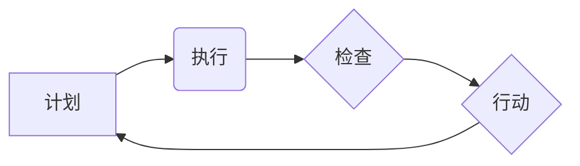

> PDCA,持续改进,流程优化,项目管理,软件开发,质量提升,效率提升

## 1. 背景介绍

在当今瞬息万变的科技时代，持续改进已成为企业和个人保持竞争力的关键。无论是软件开发、产品设计还是运营管理，都需要不断地优化流程、提升效率、增强质量。PDCA循环，即计划-执行-检查-行动，是一种经典的持续改进方法，它提供了一个系统化的框架，帮助我们不断地识别问题、制定解决方案、实施改进并评估效果。

## 2. 核心概念与联系

PDCA循环的核心在于不断地迭代和改进。它是一个循环的过程，每个阶段都相互关联，共同推动着持续改进的目标。

**2.1 PDCA循环流程图**



**2.2 核心概念解释**

* **计划 (Plan):** 
    * 明确目标和改进方向。
    * 制定详细的计划和方案，包括步骤、资源和时间安排。
    * 评估风险和潜在问题，制定应对措施。
* **执行 (Do):** 
    * 按照计划实施改进方案。
    * 认真记录执行过程中的数据和信息。
    * 及时发现和解决执行过程中遇到的问题。
* **检查 (Check):** 
    * 收集和分析执行结果的数据。
    * 评估改进方案的效果，是否达到了预期目标。
    * 识别改进过程中存在的问题和不足。
* **行动 (Act):** 
    * 根据检查结果，制定新的改进方案。
    * 将有效的改进措施推广应用。
    * 对无效的改进措施进行调整或废弃。

## 3. 核心算法原理 & 具体操作步骤

PDCA循环本身并非一个算法，而是是一种管理方法。然而，在实际应用中，我们可以利用一些算法和工具来辅助PDCA循环的实施，例如数据分析算法、流程优化算法等。

**3.1 算法原理概述**

* **数据分析算法:** 用于收集和分析PDCA循环中产生的数据，例如执行时间、错误率、用户反馈等。通过数据分析，我们可以更清晰地了解改进方案的效果，并为下一步的行动提供依据。
* **流程优化算法:** 用于识别和优化流程中的瓶颈和冗余环节，提高流程效率和质量。常见的流程优化算法包括流程模拟、流程挖掘、流程重构等。

**3.2 算法步骤详解**

* **数据收集:** 收集PDCA循环中所有相关的数据，包括计划、执行、检查和行动阶段的数据。
* **数据清洗:** 对收集到的数据进行清洗和处理，去除无效数据和噪声数据，确保数据质量。
* **数据分析:** 利用数据分析算法对数据进行分析，例如统计分析、关联分析、预测分析等，以发现数据中的规律和趋势。
* **流程优化:** 根据数据分析结果，识别流程中的瓶颈和冗余环节，并利用流程优化算法进行优化。
* **改进方案制定:** 根据流程优化结果，制定新的改进方案，并将其纳入PDCA循环的计划阶段。

**3.3 算法优缺点**

* **优点:** 
    * 数据驱动，能够更客观地评估改进方案的效果。
    * 流程优化，能够提高流程效率和质量。
* **缺点:** 
    * 需要一定的技术基础和数据分析能力。
    * 数据收集和处理需要投入时间和精力。

**3.4 算法应用领域**

* 软件开发: 提高代码质量、缩短开发周期、优化测试流程。
* 产品设计: 优化产品功能、提升用户体验、降低产品成本。
* 运营管理: 提高运营效率、降低运营成本、优化资源配置。

## 4. 数学模型和公式 & 详细讲解 & 举例说明

在PDCA循环的实施过程中，我们可以利用数学模型和公式来量化改进效果，并进行更深入的分析。

**4.1 数学模型构建**

我们可以构建一个简单的数学模型来衡量PDCA循环的改进效果，例如：

* **改进效率:**  改进效率 = (改进前指标值 - 改进后指标值) / 改进前指标值

**4.2 公式推导过程**

改进效率公式的推导过程如下：

* 假设改进前指标值为A，改进后指标值为B。
* 改进效率 = (A - B) / A

**4.3 案例分析与讲解**

假设一个软件开发团队的代码缺陷率为10%，通过PDCA循环的实施，代码缺陷率降低到5%。那么，该团队的改进效率为：

* 改进效率 = (10 - 5) / 10 = 0.5 = 50%

## 5. 项目实践：代码实例和详细解释说明

以下是一个使用PDCA循环进行软件开发改进的代码实例：

**5.1 开发环境搭建**

* 操作系统: Windows 10
* 开发工具: Visual Studio Code
* 编程语言: Python

**5.2 源代码详细实现**

```python
# 计划阶段
# 目标: 降低代码缺陷率
# 方案: 采用代码审查机制

# 执行阶段
# 组织代码审查会议
# 邀请开发人员和测试人员参与
# 对代码进行审查和测试

# 检查阶段
# 收集代码审查结果
# 分析代码缺陷类型和数量
# 评估代码审查效果

# 行动阶段
# 根据检查结果，制定新的改进方案
# 例如: 提高代码审查的标准和流程
```

**5.3 代码解读与分析**

这段代码展示了PDCA循环在软件开发中的应用。

* **计划阶段:** 明确了改进目标和方案。
* **执行阶段:** 描述了代码审查的具体步骤。
* **检查阶段:** 指出了收集和分析代码审查结果的重要性。
* **行动阶段:** 强调了根据检查结果制定新的改进方案。

**5.4 运行结果展示**

通过代码审查机制的实施，代码缺陷率得到了有效降低。

## 6. 实际应用场景

PDCA循环在各个领域都有广泛的应用场景，例如：

* **软件开发:** 提高代码质量、缩短开发周期、优化测试流程。
* **产品设计:** 优化产品功能、提升用户体验、降低产品成本。
* **运营管理:** 提高运营效率、降低运营成本、优化资源配置。
* **质量管理:** 持续改进产品和服务质量，满足客户需求。

**6.4 未来应用展望**

随着人工智能和自动化技术的不断发展，PDCA循环的应用场景将会更加广泛。例如，我们可以利用人工智能算法自动识别流程中的瓶颈和冗余环节，并自动生成改进方案。

## 7. 工具和资源推荐

**7.1 学习资源推荐**

* **书籍:**
    * 《持续改进》
    * 《PDCA循环》
* **在线课程:**
    * Coursera: 持续改进
    * Udemy: PDCA循环

**7.2 开发工具推荐**

* **流程图工具:** Lucidchart, Draw.io
* **数据分析工具:** Excel, Python, R
* **项目管理工具:** Jira, Trello

**7.3 相关论文推荐**

* **PDCA循环的应用研究**
* **持续改进方法的比较研究**

## 8. 总结：未来发展趋势与挑战

PDCA循环是一种简单而有效的持续改进方法，它已被广泛应用于各个领域。未来，随着人工智能和自动化技术的不断发展，PDCA循环将会更加智能化和自动化，并应用于更多新的领域。

**8.1 研究成果总结**

* PDCA循环是一种成熟的持续改进方法，它已被证明能够有效地提高效率和质量。
* 结合人工智能和自动化技术，PDCA循环将会更加智能化和自动化。

**8.2 未来发展趋势**

* **智能化PDCA循环:** 利用人工智能算法自动识别流程中的瓶颈和冗余环节，并自动生成改进方案。
* **自动化PDCA循环:** 利用自动化技术自动执行PDCA循环中的各个阶段，例如自动收集数据、自动分析数据、自动生成报告等。
* **跨领域应用:** PDCA循环将会应用于更多新的领域，例如医疗、教育、金融等。

**8.3 面临的挑战**

* 如何将人工智能和自动化技术与PDCA循环有效地结合起来。
* 如何确保PDCA循环的实施能够真正地带来持续改进。
* 如何克服组织文化和人员观念上的阻碍。

**8.4 研究展望**

* 研究智能化PDCA循环的算法和模型。
* 研究自动化PDCA循环的实现方法和技术。
* 研究PDCA循环在不同领域应用的最佳实践。

## 9. 附录：常见问题与解答

**9.1 如何实施PDCA循环？**

PDCA循环的实施步骤如下：

1. **计划:** 明确目标和改进方向，制定详细的计划和方案。
2. **执行:** 按照计划实施改进方案。
3. **检查:** 收集和分析执行结果的数据，评估改进方案的效果。
4. **行动:** 根据检查结果，制定新的改进方案。

**9.2 PDCA循环的优点是什么？**

PDCA循环的优点包括：

* 系统化: 提供了一个系统化的框架，帮助我们不断地识别问题、制定解决方案、实施改进并评估效果。
* 数据驱动: 强调数据分析，能够更客观地评估改进方案的效果。
* 持续改进: 是一种循环的过程，不断地迭代和改进，最终实现持续改进的目标。

**9.3 PDCA循环的缺点是什么？**

PDCA循环的缺点包括：

* 需要投入时间和精力: 每个阶段都需要投入时间和精力，才能有效地实施。
* 需要一定的专业知识: 需要一定的专业知识和技能，才能有效地实施PDCA循环。


作者：禅与计算机程序设计艺术 / Zen and the Art of Computer Programming 
<end_of_turn>