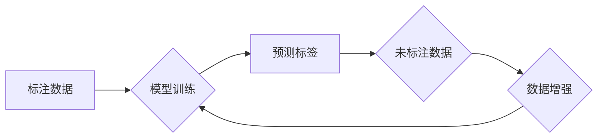

> 半监督学习，半监督分类，标签扩增，迁移学习，数据标注，深度学习，机器学习

## 1. 背景介绍

在机器学习领域，训练模型通常需要大量的标注数据。然而，获取高质量标注数据的成本高昂且耗时，这成为了许多机器学习任务的瓶颈。半监督学习 (Semi-Supervised Learning) 应运而生，它利用少量标注数据和大量未标注数据来训练模型，从而降低对标注数据的依赖。

半监督学习在图像识别、自然语言处理、语音识别等领域展现出巨大的潜力。它能够有效地利用现有标注数据，同时扩展模型的训练规模，从而提高模型的性能。

## 2. 核心概念与联系

半监督学习的核心思想是利用未标注数据的结构信息来辅助标注数据的学习。

**流程图：**



**核心概念：**

* **标注数据:** 已知标签的数据，用于训练模型的初始阶段。
* **未标注数据:** 未知标签的数据，用于辅助模型学习和提高性能。
* **模型训练:** 利用标注数据和未标注数据训练模型，学习数据的特征和规律。
* **预测标签:** 模型对未标注数据进行预测，生成可能的标签。
* **数据增强:** 通过对未标注数据进行变换，例如旋转、缩放、翻转等，生成新的数据样本，扩大训练数据集规模。

## 3. 核心算法原理 & 具体操作步骤

### 3.1  算法原理概述

半监督学习算法主要分为两大类：

* **基于图的算法:** 将数据点表示为图中的节点，节点之间的关系表示为边，利用图的结构信息进行学习。
* **基于概率的算法:** 将数据点表示为概率分布，利用概率模型学习数据的分布规律。

### 3.2  算法步骤详解

以基于图的算法为例，其具体步骤如下：

1. **构建图:** 将数据点表示为图中的节点，节点之间的关系表示为边。
2. **计算节点相似度:** 利用距离度量或其他相似度计算方法，计算节点之间的相似度。
3. **构建图结构:** 根据节点相似度，构建图的结构，例如使用k-最近邻算法构建k-近邻图。
4. **传播标签:** 利用图结构，将标注数据的标签传播到未标注的数据点。
5. **训练模型:** 利用传播后的标签数据，训练分类模型。

### 3.3  算法优缺点

**优点:**

* 可以有效利用未标注数据，提高模型性能。
* 相对监督学习，需要的标注数据量更少。

**缺点:**

* 算法的性能依赖于图结构的构建和标签传播策略。
* 对于噪声数据或不规则数据，算法效果可能较差。

### 3.4  算法应用领域

* **图像识别:** 利用未标注图像数据，提高图像分类和目标检测的性能。
* **自然语言处理:** 利用未标注文本数据，提高文本分类、情感分析和机器翻译的性能。
* **语音识别:** 利用未标注语音数据，提高语音识别和语音合成性能。

## 4. 数学模型和公式 & 详细讲解 & 举例说明

### 4.1  数学模型构建

半监督学习的数学模型通常基于概率图模型或深度学习模型。

**概率图模型:**

概率图模型可以表示数据的概率分布，并利用贝叶斯定理进行推理。

**深度学习模型:**

深度学习模型可以学习数据的复杂特征，并利用反向传播算法进行训练。

### 4.2  公式推导过程

半监督学习的公式推导过程通常涉及到最大似然估计、贝叶斯推理和梯度下降等方法。

**最大似然估计:**

最大似然估计的目标是找到模型参数，使得模型能够最大化地生成观测到的数据。

**贝叶斯推理:**

贝叶斯推理利用贝叶斯定理，根据先验知识和观测数据，更新模型参数的概率分布。

**梯度下降:**

梯度下降算法用于优化模型参数，使其能够最小化损失函数。

### 4.3  案例分析与讲解

以图像分类为例，半监督学习模型可以利用标注图像数据和未标注图像数据进行训练。

**案例分析:**

假设我们有一个包含100张标注图像和1000张未标注图像的数据集。

**讲解:**

我们可以使用半监督学习算法，例如图卷积网络 (Graph Convolutional Network)，将标注图像数据和未标注图像数据作为输入，训练模型。

## 5. 项目实践：代码实例和详细解释说明

### 5.1  开发环境搭建

* Python 3.6+
* TensorFlow 2.0+
* PyTorch 1.0+
* 其他必要的库，例如 NumPy、Scikit-learn 等。

### 5.2  源代码详细实现

```python
# 导入必要的库
import tensorflow as tf

# 定义模型结构
class SemiSupervisedModel(tf.keras.Model):
    def __init__(self, num_classes):
        super(SemiSupervisedModel, self).__init__()
        # 定义模型层
        self.conv1 = tf.keras.layers.Conv2D(32, (3, 3), activation='relu')
        self.pool1 = tf.keras.layers.MaxPooling2D((2, 2))
        self.conv2 = tf.keras.layers.Conv2D(64, (3, 3), activation='relu')
        self.pool2 = tf.keras.layers.MaxPooling2D((2, 2))
        self.flatten = tf.keras.layers.Flatten()
        self.dense1 = tf.keras.layers.Dense(128, activation='relu')
        self.dense2 = tf.keras.layers.Dense(num_classes, activation='softmax')

    def call(self, x):
        # 模型前向传播
        x = self.conv1(x)
        x = self.pool1(x)
        x = self.conv2(x)
        x = self.pool2(x)
        x = self.flatten(x)
        x = self.dense1(x)
        x = self.dense2(x)
        return x

# 实例化模型
model = SemiSupervisedModel(num_classes=10)

# 定义损失函数和优化器
loss_fn = tf.keras.losses.CategoricalCrossentropy()
optimizer = tf.keras.optimizers.Adam()

# 训练模型
# ...

```

### 5.3  代码解读与分析

* **模型结构:** 代码定义了一个简单的卷积神经网络模型，用于图像分类任务。
* **损失函数:** 使用交叉熵损失函数，用于衡量模型预测结果与真实标签之间的差异。
* **优化器:** 使用Adam优化器，用于更新模型参数。
* **训练过程:** 训练过程需要使用标注数据和未标注数据，并利用半监督学习算法进行训练。

### 5.4  运行结果展示

训练完成后，可以评估模型的性能，例如使用准确率、召回率和F1-score等指标。

## 6. 实际应用场景

### 6.1  图像识别

* **医学图像分析:** 利用未标注的医学图像数据，提高疾病诊断的准确率。
* **自动驾驶:** 利用未标注的道路场景图像数据，提高自动驾驶系统的安全性。

### 6.2  自然语言处理

* **文本分类:** 利用未标注的文本数据，提高文本分类的准确率。
* **机器翻译:** 利用未标注的文本数据，提高机器翻译的质量。

### 6.3  语音识别

* **语音助手:** 利用未标注的语音数据，提高语音助手的识别准确率。
* **语音搜索:** 利用未标注的语音数据，提高语音搜索的效率。

### 6.4  未来应用展望

随着半监督学习算法的不断发展，其应用场景将会更加广泛。

## 7. 工具和资源推荐

### 7.1  学习资源推荐

* **书籍:**
    * "Semi-Supervised Learning" by Stephen Lafferty
    * "Pattern Recognition and Machine Learning" by Christopher Bishop
* **在线课程:**
    * Coursera: "Machine Learning" by Andrew Ng
    * Udacity: "Deep Learning"

### 7.2  开发工具推荐

* **TensorFlow:** https://www.tensorflow.org/
* **PyTorch:** https://pytorch.org/
* **Scikit-learn:** https://scikit-learn.org/

### 7.3  相关论文推荐

* "Semi-Supervised Learning" by Stephen Lafferty, Andrew McCallum, Fernando Pereira, and Michael Jordan
* "Graph-Based Semi-Supervised Learning" by Jianbo Shi and Jitendra Malik
* "Deep Semi-Supervised Learning" by  

## 8. 总结：未来发展趋势与挑战

### 8.1  研究成果总结

半监督学习在近年来取得了显著的进展，其算法和应用场景不断扩展。

### 8.2  未来发展趋势

* **更有效的半监督学习算法:** 研究更有效的半监督学习算法，提高模型的性能和鲁棒性。
* **更广泛的应用场景:** 将半监督学习应用到更多领域，例如推荐系统、自然语言生成等。
* **结合其他机器学习技术:** 将半监督学习与其他机器学习技术，例如迁移学习和强化学习，进行结合，提高模型的性能。

### 8.3  面临的挑战

* **数据质量:** 半监督学习算法对数据质量要求较高，噪声数据或不规则数据会影响模型性能。
* **算法复杂度:** 一些半监督学习算法的复杂度较高，训练时间较长。
* **理论解释:** 半监督学习算法的理论解释尚不完善，需要进一步的研究。

### 8.4  研究展望

未来，半监督学习将继续是一个重要的研究方向，其发展将推动机器学习技术的进步，并为解决实际问题提供新的解决方案。

## 9. 附录：常见问题与解答

* **什么是半监督学习？**

半监督学习是一种机器学习方法，它利用少量标注数据和大量未标注数据来训练模型。

* **半监督学习的优势是什么？**

半监督学习可以有效利用未标注数据，降低对标注数据的依赖，从而提高模型性能。

* **半监督学习有哪些应用场景？**

半监督学习在图像识别、自然语言处理、语音识别等领域都有广泛的应用。

* **如何选择合适的半监督学习算法？**

选择合适的半监督学习算法需要考虑数据的特点、任务类型和模型性能等因素。

* **如何评估半监督学习模型的性能？**

可以使用准确率、召回率和F1-score等指标来评估半监督学习模型的性能。


作者：禅与计算机程序设计艺术 / Zen and the Art of Computer Programming 
<end_of_turn>