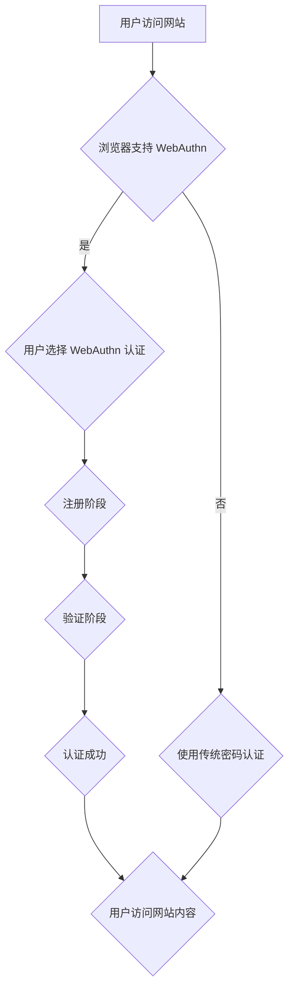

> WebAuthn, FIDO, 生物识别, 密码管理, 安全认证,  Web API,  PKCE,  密码泄露

## 1. 背景介绍

随着互联网的快速发展，用户在网络上的活动日益频繁，随之而来的网络安全威胁也日益严峻。传统的密码认证方式已经难以满足现代网络安全的需求，密码泄露、钓鱼攻击等安全事件频发，给用户带来了巨大的安全风险。为了解决这些问题，Web Authentication（WebAuthn）标准应运而生。

WebAuthn 是一种基于 FIDO（Fast IDentity Online）协议的开放标准，旨在提供一种更安全、更便捷的网络身份验证方式。它利用硬件安全模块（如指纹传感器、面部识别传感器等）来生成和验证用户身份，无需依赖传统的密码，有效地降低了密码泄露和身份盗用的风险。

## 2. 核心概念与联系

WebAuthn 核心概念包括：

* **FIDO 协议:**  FIDO 是一种基于开放标准的认证协议，旨在提供一种跨平台、跨设备的安全身份验证方式。
* **Web API:** WebAuthn 通过 Web API 接口与浏览器和应用程序进行交互，实现身份验证功能。
* **注册和验证流程:** WebAuthn 认证流程包括注册和验证两个阶段。注册阶段用户将自己的身份信息绑定到设备上，验证阶段用户使用设备进行身份验证。
* **密码泄露保护:** WebAuthn 利用硬件安全模块生成和存储用户身份信息，即使密码泄露，也无法被攻击者利用。

**Mermaid 流程图:**



## 3. 核心算法原理 & 具体操作步骤

### 3.1  算法原理概述

WebAuthn 认证流程基于公钥密码学原理，利用椭圆曲线密码学（ECC）算法生成和验证用户身份信息。

* **公钥加密:** 用户的私钥用于加密身份信息，公钥用于解密身份信息。
* **数字签名:** 用户使用私钥对身份信息进行数字签名，验证者使用公钥验证签名。

### 3.2  算法步骤详解

1. **注册阶段:**
    * 用户选择使用 WebAuthn 认证。
    * 浏览器与认证服务器进行交互，获取公钥和注册信息。
    * 用户使用设备（如指纹传感器）进行生物识别验证。
    * 认证服务器生成一个随机数，并将其加密后发送给用户设备。
    * 用户设备使用私钥解密随机数，并生成一个数字签名。
    * 用户设备将数字签名发送给认证服务器。
    * 认证服务器验证数字签名，并将用户身份信息绑定到设备上。

2. **验证阶段:**
    * 用户访问网站并选择使用 WebAuthn 认证。
    * 浏览器与认证服务器进行交互，获取用户身份信息。
    * 用户使用设备（如指纹传感器）进行生物识别验证。
    * 用户设备生成一个随机数，并将其加密后发送给浏览器。
    * 浏览器使用用户设备的公钥解密随机数，并生成一个数字签名。
    * 浏览器将数字签名发送给认证服务器。
    * 认证服务器验证数字签名，并确认用户身份。

### 3.3  算法优缺点

**优点:**

* **安全性高:** 利用硬件安全模块生成和存储用户身份信息，有效降低了密码泄露和身份盗用的风险。
* **用户体验好:** 无需记忆密码，只需使用设备进行生物识别验证即可完成身份认证。
* **跨平台支持:** WebAuthn 是一种开放标准，支持多种操作系统和设备。

**缺点:**

* **设备依赖:** 需要用户拥有支持 WebAuthn 的设备。
* **部署成本:** 需要对网站和应用程序进行修改，以支持 WebAuthn 认证。

### 3.4  算法应用领域

WebAuthn 认证技术广泛应用于以下领域:

* **金融服务:** 在线银行、支付平台等。
* **社交媒体:** 用户登录、账户安全等。
* **企业内部网络:** 用户身份验证、访问控制等。
* **云计算:** 用户身份认证、资源访问控制等。

## 4. 数学模型和公式 & 详细讲解 & 举例说明

### 4.1  数学模型构建

WebAuthn 认证流程基于椭圆曲线密码学（ECC）算法，其数学模型主要包括：

* **椭圆曲线群:**  ECC 算法使用一个椭圆曲线上的点集作为密码学基础。
* **点加法:**  椭圆曲线上的两个点可以进行加法运算，得到一个新的点。
* **点乘:**  一个点可以与一个整数进行乘法运算，得到一个新的点。

### 4.2  公式推导过程

* **点加法公式:**  P + Q = R，其中 P、Q、R 分别为椭圆曲线上的三个点。
* **点乘公式:**  kP = R，其中 k 为整数，P、R 分别为椭圆曲线上的两个点。

### 4.3  案例分析与讲解

假设 Alice 使用 WebAuthn 认证登录网站，其私钥为 d，公钥为 Q。

1. 认证服务器生成一个随机数 r，并将其加密后发送给 Alice 的设备。
2. Alice 的设备使用私钥 d 对 r 进行解密，并生成一个数字签名 s。
3. Alice 的设备将数字签名 s 发送给认证服务器。
4. 认证服务器使用 Alice 的公钥 Q 验证数字签名 s。

验证过程可以使用以下公式进行计算：

```
v = hash(r || s || Q)
if v == s * Q:
    认证成功
else:
    认证失败
```

其中，hash() 为哈希函数，|| 表示字符串连接。

## 5. 项目实践：代码实例和详细解释说明

### 5.1  开发环境搭建

* **操作系统:**  Windows、macOS、Linux
* **浏览器:**  Chrome、Firefox、Edge
* **开发工具:**  Node.js、npm

### 5.2  源代码详细实现

```javascript
// 注册阶段
async function register() {
  const credential = await navigator.credentials.create({
    publicKey: {
      challenge: challenge, // 认证服务器生成的挑战
      name: 'My WebAuthn Credential', // 凭证名称
      displayName: 'My Display Name', // 凭证显示名称
      icon: 'https://example.com/icon.png', // 凭证图标
    },
  });
  console.log('Credential created:', credential);
}

// 验证阶段
async function authenticate() {
  const credential = await navigator.credentials.get({
    publicKey: {
      challenge: challenge, // 认证服务器生成的挑战
      allowCredentials: [
        {
          id: credentialId, // 凭证 ID
        },
      ],
    },
  });
  console.log('Credential retrieved:', credential);
}
```

### 5.3  代码解读与分析

* `navigator.credentials.create()` 方法用于注册 WebAuthn 凭证。
* `navigator.credentials.get()` 方法用于验证 WebAuthn 凭证。
* `challenge` 参数用于确保认证过程的安全性。
* `allowCredentials` 参数用于指定可用于验证的凭证。

### 5.4  运行结果展示

成功注册和验证 WebAuthn 凭证后，浏览器会提示用户使用设备进行生物识别验证。验证成功后，用户即可访问网站内容。

## 6. 实际应用场景

### 6.1  金融服务

WebAuthn 可用于银行、支付平台等金融服务场景，提供更安全的账户登录和交易验证。

### 6.2  社交媒体

WebAuthn 可用于社交媒体平台，提供更便捷的用户登录和账户安全保护。

### 6.3  企业内部网络

WebAuthn 可用于企业内部网络，提供更安全的员工身份验证和访问控制。

### 6.4  未来应用展望

WebAuthn 认证技术未来将应用于更多领域，例如物联网、区块链等，为用户提供更安全、更便捷的数字身份验证体验。

## 7. 工具和资源推荐

### 7.1  学习资源推荐

* **WebAuthn 官方规范:** https://www.w3.org/TR/webauthn/
* **FIDO Alliance 网站:** https://fidoalliance.org/
* **WebAuthn 教程:** https://developer.mozilla.org/en-US/docs/Web/API/Web_Authentication_API

### 7.2  开发工具推荐

* **WebAuthn 测试工具:** https://www.webauthn.io/
* **WebAuthn 认证库:** https://github.com/webauthn/webauthn-js

### 7.3  相关论文推荐

* **Web Authentication: An Introduction:** https://www.w3.org/TR/webauthn-intro/
* **FIDO2 Authentication Protocol:** https://fidoalliance.org/specs/fido-v2.1/fido-authentication-protocol-v2.1.pdf

## 8. 总结：未来发展趋势与挑战

### 8.1  研究成果总结

WebAuthn 认证技术已成为现代网络安全的重要组成部分，为用户提供了更安全、更便捷的数字身份验证体验。

### 8.2  未来发展趋势

* **更广泛的应用场景:** WebAuthn 将应用于更多领域，例如物联网、区块链等。
* **更强大的安全性:** WebAuthn 将不断改进安全性，抵御新的网络攻击。
* **更便捷的用户体验:** WebAuthn 将更加简化用户操作，提高用户体验。

### 8.3  面临的挑战

* **设备兼容性:** 需要确保 WebAuthn 认证技术能够在各种设备上运行。
* **用户接受度:** 需要提高用户对 WebAuthn 认证技术的了解和接受度。
* **标准化和规范化:** 需要不断完善 WebAuthn 标准和规范，确保其安全性、可靠性和可扩展性。

### 8.4  研究展望

未来，WebAuthn 认证技术将继续发展和完善，为用户提供更安全、更便捷的数字身份验证体验。

## 9. 附录：常见问题与解答

**Q1: WebAuthn 是否支持所有浏览器？**

A1: WebAuthn 现已支持主流浏览器，例如 Chrome、Firefox、Edge 等。

**Q2: WebAuthn 是否需要安装额外的软件？**

A2: 不需要，WebAuthn 是基于 Web API 的标准，无需安装额外的软件。

**Q3: WebAuthn 是否比传统的密码更安全？**

A3: 是的，WebAuthn 利用硬件安全模块生成和存储用户身份信息，有效降低了密码泄露和身份盗用的风险。


作者：禅与计算机程序设计艺术 / Zen and the Art of Computer Programming 
<end_of_turn>