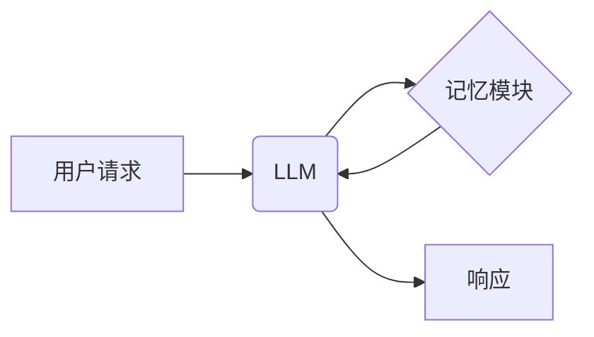

> LangChain, 记忆模块, 语言模型, 应用程序, 数据持久化, 知识图谱, 检索式API

## 1. 背景介绍

近年来，大型语言模型（LLM）在自然语言处理领域取得了显著进展，展现出强大的文本生成、理解和对话能力。然而，LLM通常缺乏记忆能力，无法记住之前的对话上下文或外部知识，这限制了其在实际应用中的表现。为了解决这个问题，LangChain 框架引入了记忆模块，赋予 LLM 持久性记忆，使其能够更好地理解和响应用户请求。

## 2. 核心概念与联系

记忆模块是 LangChain 框架中用于存储和检索信息的组件。它允许 LLM 在对话过程中保留上下文信息，并根据历史记录做出更准确和一致的响应。

**核心概念：**

* **LLM:** 大型语言模型，例如 GPT-3、LaMDA 等，能够理解和生成人类语言。
* **记忆模块:** 用于存储和检索信息的组件，可以是文本文件、数据库、知识图谱等。
* **上下文:** LLM 在处理用户请求时所参考的历史信息。

**架构图：**



## 3. 核心算法原理 & 具体操作步骤

### 3.1  算法原理概述

记忆模块的核心算法是基于键值存储和检索的。用户请求会被转换为键，记忆模块会根据键查找对应的值，并将值作为上下文信息传递给 LLM。

### 3.2  算法步骤详解

1. **存储信息:** 当用户发出请求时，将请求信息和对应的响应信息存储到记忆模块中。
2. **检索信息:** 当用户发出新的请求时，将请求信息作为键，从记忆模块中检索对应的历史信息。
3. **上下文拼接:** 将检索到的历史信息与当前请求信息拼接在一起，作为 LLM 的上下文信息。
4. **LLM 处理:** LLM 使用上下文信息生成响应。

### 3.3  算法优缺点

**优点:**

* **增强记忆能力:** 允许 LLM 记住之前的对话上下文，提供更连贯和一致的响应。
* **扩展知识库:** 可以将外部知识库连接到记忆模块，丰富 LLM 的知识储备。
* **个性化体验:** 可以根据用户的历史交互记录，提供个性化的服务和推荐。

**缺点:**

* **存储成本:** 存储大量历史信息需要消耗一定的存储空间和计算资源。
* **检索效率:** 当记忆模块规模庞大时，检索信息的速度可能会降低。
* **隐私安全:** 需要妥善处理用户隐私信息，避免泄露敏感数据。

### 3.4  算法应用领域

* **聊天机器人:** 构建更智能、更自然的对话体验。
* **虚拟助理:** 提供更精准、更个性化的服务。
* **教育领域:** 辅助学习、提供个性化辅导。
* **医疗领域:** 记录病历、辅助诊断。

## 4. 数学模型和公式 & 详细讲解 & 举例说明

### 4.1  数学模型构建

记忆模块可以抽象为一个键值存储结构，其中键代表用户请求或事件，值代表对应的响应信息或上下文。

**数学模型:**

```
M = { (k, v) | k ∈ K, v ∈ V }
```

其中：

* M 表示记忆模块
* K 表示键集
* V 表示值集

### 4.2  公式推导过程

检索信息的过程可以表示为以下公式：

```
v = M[k]
```

其中：

* v 表示根据键 k 检索到的值
* M[k] 表示记忆模块中键 k 对应的值

### 4.3  案例分析与讲解

**例子:**

假设用户向聊天机器人发送了以下请求：

* **用户请求:** 今天天气怎么样？

聊天机器人将请求信息作为键存储到记忆模块中，并根据天气预报API获取对应的响应信息，例如：

* **响应信息:** 今天天气晴朗，温度约为25摄氏度。

当用户再次询问天气时，聊天机器人会从记忆模块中检索到之前的请求和响应信息，并将其作为上下文信息传递给 LLM，从而生成更准确和相关的响应。

## 5. 项目实践：代码实例和详细解释说明

### 5.1  开发环境搭建

* Python 3.7+
* LangChain 0.0.20+
* 其他依赖库：transformers, openai

### 5.2  源代码详细实现

```python
from langchain.memory import ConversationBufferMemory
from langchain.llms import OpenAI

# 初始化 LLM 和记忆模块
llm = OpenAI(temperature=0)
memory = ConversationBufferMemory()

# 创建对话代理
agent = Agent(
    llm=llm,
    memory=memory,
    tools=[],
)

# 用户交互
while True:
    user_input = input("用户: ")
    response = agent.run(user_input)
    print("代理: ", response)
```

### 5.3  代码解读与分析

* **ConversationBufferMemory:** 这是一个简单的记忆模块，它使用一个缓冲区来存储对话历史记录。
* **OpenAI:** 这是一个使用 OpenAI API 的 LLM。
* **Agent:** 这是一个使用 LLM 和记忆模块的对话代理。

### 5.4  运行结果展示

当用户输入问题时，代理会根据历史记录生成相应的回答。例如，如果用户先问“今天天气怎么样？”，然后问“明天天气预报”，代理会根据之前的回答提供更准确的预测。

## 6. 实际应用场景

### 6.1  聊天机器人

记忆模块可以使聊天机器人更加智能和自然，能够记住用户之前的对话内容，提供更个性化的服务。

### 6.2  虚拟助理

记忆模块可以帮助虚拟助理更好地理解用户的需求，并根据历史记录提供更精准的帮助。

### 6.3  教育领域

记忆模块可以用于个性化学习辅导，根据学生的学习记录和问题提供针对性的帮助。

### 6.4  未来应用展望

随着 LLM 和记忆模块技术的不断发展，其应用场景将会更加广泛，例如：

* **医疗诊断:** 辅助医生诊断疾病，提供个性化的治疗方案。
* **法律咨询:** 提供法律咨询服务，根据用户的法律问题提供相关法律法规和案例分析。
* **金融分析:** 分析金融数据，提供投资建议。

## 7. 工具和资源推荐

### 7.1  学习资源推荐

* **LangChain 官方文档:** https://python.langchain.com/docs/
* **HuggingFace Transformers:** https://huggingface.co/docs/transformers/index

### 7.2  开发工具推荐

* **Python:** https://www.python.org/
* **Jupyter Notebook:** https://jupyter.org/

### 7.3  相关论文推荐

* **LangChain: Towards General-Purpose Language Model Applications:** https://arxiv.org/abs/2204.08522

## 8. 总结：未来发展趋势与挑战

### 8.1  研究成果总结

记忆模块是 LLM 应用的重要组成部分，它能够增强 LLM 的记忆能力和知识储备，使其在实际应用中表现更加出色。

### 8.2  未来发展趋势

* **更强大的记忆机制:** 研究更先进的记忆机制，例如基于神经网络的记忆模块，提高记忆容量和检索效率。
* **多模态记忆:** 将文本、图像、音频等多模态信息整合到记忆模块中，构建更全面的知识表示。
* **联邦学习:** 利用联邦学习技术，在不泄露用户隐私的情况下，构建共享的记忆模块，提升模型性能。

### 8.3  面临的挑战

* **存储成本:** 存储大量历史信息需要消耗大量的存储空间和计算资源。
* **隐私安全:** 需要妥善处理用户隐私信息，避免泄露敏感数据。
* **模型复杂度:** 构建更强大的记忆模块需要更高的模型复杂度，这可能会导致训练和推理成本增加。

### 8.4  研究展望

未来，记忆模块的研究将继续朝着更智能、更安全、更高效的方向发展，为 LLM 的应用提供更强大的支持。

## 9. 附录：常见问题与解答

**Q1: 如何选择合适的记忆模块？**

**A1:** 选择记忆模块需要根据具体的应用场景和需求进行考虑。例如，对于简单的对话机器人，可以使用 ConversationBufferMemory；对于需要存储大量历史信息的应用，可以使用基于数据库的记忆模块。

**Q2: 如何保证记忆模块的隐私安全？**

**A2:** 在设计记忆模块时，需要考虑数据加密、访问控制等安全措施，确保用户隐私信息得到保护。

**Q3: 如何优化记忆模块的检索效率？**

**A3:** 可以使用索引技术、分片存储等方法来优化记忆模块的检索效率。


作者：禅与计算机程序设计艺术 / Zen and the Art of Computer Programming 
<end_of_turn>