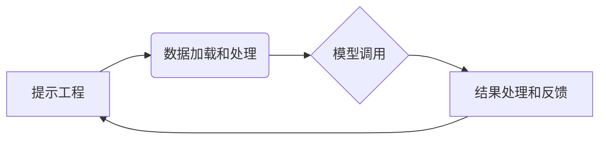

> LangChain, 链式调用, 大语言模型, 应用场景, 编程实践, 核心算法, 数学模型

## 1. 背景介绍

近年来，大语言模型（LLM）的快速发展，为人工智能领域带来了革命性的变革。这些强大的模型能够理解和生成人类语言，展现出令人惊叹的文本生成、翻译、问答等能力。然而，LLM 的应用场景远不止于此。通过将多个 LLM 或其他 AI 组件串联起来，我们可以构建更复杂、更智能的应用系统，这就是所谓的“链式调用”。

LangChain 是一个专门为构建链式调用应用而设计的开源框架。它提供了一系列工具和组件，帮助开发者轻松地连接、组合和管理不同的 LLM 和数据源，从而构建出更强大的 AI 应用。

## 2. 核心概念与联系

LangChain 的核心概念是“链”，它可以理解为一个由多个步骤或组件组成的序列。每个步骤或组件都代表一个特定的任务或功能，例如：

* **提示工程 (Prompt Engineering):**  设计有效的输入提示，引导 LLM 生成期望的输出。
* **数据加载和处理 (Data Loading and Processing):** 从各种数据源加载和处理数据，为 LLM 提供上下文信息。
* **模型调用 (Model Calling):** 调用不同的 LLM 进行文本生成、分类、翻译等操作。
* **结果处理和反馈 (Result Processing and Feedback):** 处理 LLM 的输出结果，并将其反馈到后续步骤。

这些步骤可以按照不同的顺序组合，形成不同的链式调用流程。

**LangChain 架构流程图:**



## 3. 核心算法原理 & 具体操作步骤

### 3.1  算法原理概述

LangChain 的核心算法原理是基于**链式调用**和**状态管理**。

* **链式调用:** 将多个 AI 组件串联起来，每个组件负责完成特定的任务，并将结果传递给下一个组件。
* **状态管理:** 在链式调用过程中，需要维护一个状态变量，记录每个组件的执行结果和上下文信息，以便后续组件能够根据状态做出相应的决策。

### 3.2  算法步骤详解

1. **定义链式调用流程:** 首先需要明确链式调用流程的各个步骤，以及每个步骤需要使用的 AI 组件。
2. **创建链对象:** 使用 LangChain 的 API 创建一个链对象，并指定链式调用流程的各个步骤。
3. **设置状态变量:** 在链对象中设置一个状态变量，用于存储每个步骤的执行结果和上下文信息。
4. **执行链式调用:** 调用链对象的执行方法，启动链式调用流程。
5. **处理结果:** 在链式调用完成后，处理最终的输出结果。

### 3.3  算法优缺点

**优点:**

* **灵活性和可扩展性:** 可以根据不同的应用场景灵活地组合和配置不同的 AI 组件。
* **代码复用性:** 可以将常用的链式调用流程封装成组件，方便复用。
* **易于维护:** 链式调用流程清晰易懂，方便维护和调试。

**缺点:**

* **性能瓶颈:** 如果链式调用流程过于复杂，可能会导致性能瓶颈。
* **状态管理复杂:** 需要谨慎管理状态变量，避免出现状态不一致的情况。

### 3.4  算法应用领域

LangChain 的链式调用算法在以下领域具有广泛的应用场景:

* **聊天机器人:** 通过串联多个 LLM 和知识库，构建更智能、更自然的聊天机器人。
* **文本生成:** 将多个 LLM 结合使用，生成更长、更复杂的文本内容。
* **问答系统:** 通过链式调用，将用户的问题与知识库进行匹配，并生成准确的答案。
* **代码生成:** 利用 LLM 和代码库，生成代码片段或完整的程序。

## 4. 数学模型和公式 & 详细讲解 & 举例说明

### 4.1  数学模型构建

在 LangChain 中，链式调用过程可以抽象为一个图结构，其中每个节点代表一个 AI 组件，边代表组件之间的连接关系。

我们可以使用图论中的概念来描述链式调用过程，例如：

* **节点:**  每个节点代表一个 AI 组件，例如 LLM、数据源、转换器等。
* **边:**  每个边代表组件之间的连接关系，例如模型调用、数据传递等。
* **路径:**  从起点节点到终点节点的路径代表一个特定的链式调用流程。

### 4.2  公式推导过程

我们可以使用图论中的算法来分析链式调用过程，例如：

* **最短路径算法:**  找到从起点节点到终点节点的最短路径，即最优的链式调用流程。
* **拓扑排序算法:**  对链式调用流程进行排序，确保每个组件在依赖关系满足的前提下执行。

### 4.3  案例分析与讲解

例如，我们构建一个简单的问答系统，需要将用户的问题与知识库进行匹配，并生成答案。我们可以使用以下链式调用流程：

1. **用户输入问题:** 用户输入一个问题。
2. **文本预处理:** 对用户的问题进行文本预处理，例如去除停用词、分词等。
3. **查询知识库:** 将预处理后的问题查询知识库，找到相关的答案。
4. **生成答案:** 将查询到的答案进行格式化，生成最终的回答。

我们可以使用图论中的算法来分析这个链式调用流程，例如：

* **最短路径算法:**  可以找到从用户输入问题到生成答案的最短路径，即最优的回答流程。
* **拓扑排序算法:**  可以对链式调用流程进行排序，确保每个步骤在依赖关系满足的前提下执行。

## 5. 项目实践：代码实例和详细解释说明

### 5.1  开发环境搭建

1. 安装 Python 3.7 或更高版本。
2. 安装 LangChain 库：`pip install langchain`
3. 安装其他依赖库，例如 OpenAI 库：`pip install openai`

### 5.2  源代码详细实现

```python
from langchain.llms import OpenAI
from langchain.chains import ConversationChain
from langchain.memory import ConversationBufferMemory

# 初始化 OpenAI LLM
llm = OpenAI(temperature=0.7)

# 初始化对话内存
memory = ConversationBufferMemory()

# 创建对话链
conversation = ConversationChain(
    llm=llm,
    memory=memory,
    prompt=f"你好，我是你的聊天机器人。请问有什么可以帮到您？"
)

# 与用户进行对话
while True:
    user_input = input("您:")
    response = conversation.run(user_input)
    print("机器人:", response)
```

### 5.3  代码解读与分析

* **初始化 LLM 和内存:**  代码首先初始化 OpenAI LLM 和对话内存，用于存储对话历史信息。
* **创建对话链:**  使用 `ConversationChain` 类创建对话链，并将 LLM 和内存作为参数传入。
* **与用户进行对话:**  代码使用循环结构与用户进行对话，每次循环获取用户输入，并使用对话链生成响应。

### 5.4  运行结果展示

当运行代码时，用户可以与聊天机器人进行对话，机器人会根据对话历史信息生成相应的回复。

## 6. 实际应用场景

### 6.1  聊天机器人

LangChain 可以用于构建更智能、更自然的聊天机器人，例如：

* **客服机器人:**  自动回答客户常见问题，提高客服效率。
* **教育机器人:**  为学生提供个性化的学习辅导。
* **娱乐机器人:**  与用户进行趣味对话，提供娱乐体验。

### 6.2  文本生成

LangChain 可以用于生成各种类型的文本内容，例如：

* **文章写作:**  根据关键词生成新闻报道、博客文章等。
* **故事创作:**  根据用户提供的主题和情节生成故事。
* **诗歌创作:**  根据用户提供的韵律和主题生成诗歌。

### 6.3  问答系统

LangChain 可以用于构建更准确、更智能的问答系统，例如：

* **知识问答系统:**  根据用户的问题从知识库中查找答案。
* **搜索引擎问答:**  根据用户的问题从搜索结果中提取答案。
* **专家问答系统:**  连接专家知识库，提供专业领域的问题解答。

### 6.4  未来应用展望

LangChain 的应用场景还在不断扩展，未来可能会应用于以下领域:

* **代码生成:**  根据用户需求生成代码片段或完整的程序。
* **数据分析:**  利用 LLM 分析文本数据，提取关键信息。
* **个性化推荐:**  根据用户的兴趣爱好，推荐个性化的内容。

## 7. 工具和资源推荐

### 7.1  学习资源推荐

* **LangChain 官方文档:** https://python.langchain.com/docs/
* **LangChain GitHub 仓库:** https://github.com/langchain-org/langchain
* **Hugging Face Transformers:** https://huggingface.co/docs/transformers/index

### 7.2  开发工具推荐

* **VS Code:** https://code.visualstudio.com/
* **PyCharm:** https://www.jetbrains.com/pycharm/

### 7.3  相关论文推荐

* **Chain-of-Thought Prompting Elicits Reasoning in Large Language Models:** https://arxiv.org/abs/2106.05760
* **Prompt Engineering for Large Language Models:** https://arxiv.org/abs/2207.06211

## 8. 总结：未来发展趋势与挑战

### 8.1  研究成果总结

LangChain 框架为构建链式调用应用提供了强大的工具和组件，促进了 LLM 应用的创新和发展。

### 8.2  未来发展趋势

* **更强大的链式调用模型:**  研究更复杂的链式调用模型，能够处理更复杂的任务和场景。
* **更智能的链式调用策略:**  开发更智能的链式调用策略，能够自动选择最优的链式调用流程。
* **更广泛的应用场景:**  将 LangChain 应用于更多领域，例如医疗、金融、教育等。

### 8.3  面临的挑战

* **链式调用效率:**  如何提高链式调用效率，避免性能瓶颈。
* **状态管理复杂性:**  如何更有效地管理链式调用过程中的状态变量，避免状态不一致。
* **可解释性:**  如何提高链式调用过程的可解释性，方便开发者理解和调试。

### 8.4  研究展望

未来，LangChain 框架将继续发展和完善，为构建更智能、更强大的 AI 应用提供更强大的工具和支持。


## 9. 附录：常见问题与解答

**Q1: 如何选择合适的 LLM 用于 LangChain 应用？**

**A1:**  选择 LLM 需要根据应用场景和需求进行考虑。例如，对于需要生成高质量文本的应用，可以选择 GPT-3 等强大的文本生成模型。对于需要进行对话的应用，可以选择对话型 LLM，例如 LaMDA。

**Q2: 如何管理链式调用过程中的状态变量？**

**A2:**  LangChain 提供了多种内存组件，可以用于存储和管理状态变量。例如，ConversationBufferMemory 可以用于存储对话历史信息，而SQLDatabaseMemory 可以用于存储持久化的状态信息。

**Q3: 如何提高链式调用效率？**

**A3:**  可以尝试以下方法提高链式调用效率：

* 使用更快的 LLM 模型。
* 优化链式调用流程，减少不必要的步骤。
* 使用并行处理技术，加速链式调用过程。


作者：禅与计算机程序设计艺术 / Zen and the Art of Computer Programming 
<end_of_turn>