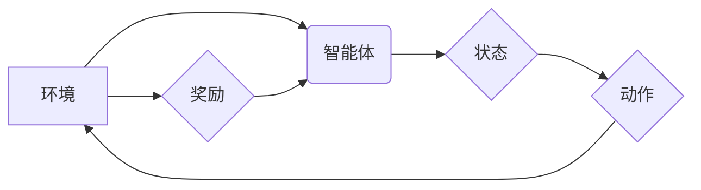

> 强化学习，金融市场预测，深度学习，强化信号，策略优化，风险管理

## 1. 背景介绍

金融市场，一个充满机遇与挑战的领域，其复杂性和不确定性一直是学者和从业者们研究的焦点。传统的金融预测模型往往依赖于历史数据和统计分析，难以捕捉市场中的非线性变化和突发事件。近年来，随着深度学习和强化学习等人工智能技术的快速发展，金融市场预测迎来了新的曙光。

强化学习（Reinforcement Learning，RL）作为一种模仿人类学习的机器学习方法，通过智能体与环境的交互，学习最优策略以最大化奖励。其强大的泛化能力和适应性使其在金融市场预测中展现出巨大的潜力。

## 2. 核心概念与联系

**2.1 强化学习的基本概念**

强化学习的核心在于智能体与环境的交互过程。智能体通过与环境的交互，获得奖励或惩罚信号，并根据这些信号调整其策略，最终学习到最优策略以最大化累积奖励。

* **智能体 (Agent):**  决策者，例如交易机器人。
* **环境 (Environment):**  智能体所处的外部世界，例如金融市场。
* **状态 (State):**  环境的当前状态，例如市场价格、交易量等。
* **动作 (Action):**  智能体可以采取的行动，例如买入、卖出、持有等。
* **奖励 (Reward):**  智能体采取行动后获得的反馈信号，例如利润或损失。
* **策略 (Policy):**  智能体根据当前状态选择动作的规则。

**2.2 强化学习与金融市场预测的联系**

在金融市场预测中，智能体可以视为交易机器人，环境为金融市场，状态为市场数据，动作为交易指令，奖励为交易收益。通过强化学习算法，智能体可以学习到最优的交易策略，从而实现自动交易和风险管理。

**2.3 强化学习在金融市场预测中的应用场景**

* **股票预测:**  预测股票价格走势，实现股票投资决策。
* **期货交易:**  预测期货价格走势，进行期货交易。
* **风险管理:**  识别和评估金融风险，制定风险控制策略。
* **资产配置:**  优化资产组合，提高投资收益。

**2.4  强化学习架构图**



## 3. 核心算法原理 & 具体操作步骤

**3.1 算法原理概述**

强化学习算法的核心是通过智能体与环境的交互，不断更新策略，以最大化累积奖励。常见的强化学习算法包括：

* **Q-学习:**  通过构建Q表，学习状态-动作对的价值函数，选择最大价值的行动。
* **SARSA:**  与Q-学习类似，但更新策略时使用当前状态和采取的动作的价值函数。
* **Deep Q-Network (DQN):**  使用深度神经网络来逼近Q函数，适用于高维状态空间。
* **Policy Gradient:**  直接优化策略，通过梯度上升算法更新策略参数。

**3.2 算法步骤详解**

以Q-学习为例，其具体操作步骤如下：

1. 初始化Q表，将所有状态-动作对的价值函数设置为0。
2. 智能体从初始状态开始，随机选择一个动作。
3. 智能体执行动作，获得下一个状态和奖励。
4. 更新Q表：

```
Q(s, a) = Q(s, a) + α * [r + γ * max(Q(s', a')) - Q(s, a)]
```

其中：

* s：当前状态
* a：当前动作
* r：获得的奖励
* s'：下一个状态
* γ：折扣因子，控制未来奖励的权重
* α：学习率，控制学习速度

5. 重复步骤2-4，直到智能体学习到最优策略。

**3.3 算法优缺点**

**优点:**

* 能够学习复杂决策策略。
* 适应性强，能够应对动态变化的环境。
* 不需要明确的奖励函数，可以利用环境反馈进行学习。

**缺点:**

* 训练时间长，需要大量的样本数据。
* 容易陷入局部最优解。
* 对于高维状态空间，算法效率较低。

**3.4 算法应用领域**

强化学习算法广泛应用于以下领域：

* 机器人控制
* 游戏人工智能
* 自然语言处理
* 自动驾驶
* 金融市场预测

## 4. 数学模型和公式 & 详细讲解 & 举例说明

**4.1 数学模型构建**

在强化学习中，我们通常使用马尔可夫决策过程（MDP）来建模智能体与环境的交互。MDP由以下五个要素组成：

* 状态空间 S：所有可能的系统状态的集合。
* 动作空间 A：智能体在每个状态下可以采取的所有动作的集合。
* 转移概率矩阵 P：描述从一个状态到另一个状态的概率分布。
* 奖励函数 R：描述智能体在每个状态采取每个动作后获得的奖励。
* 折扣因子 γ：控制未来奖励的权重。

**4.2 公式推导过程**

Q-学习算法的目标是学习状态-动作对的价值函数 Q(s, a)，该函数表示在状态 s 下采取动作 a 后获得的累积奖励期望。

Q-学习算法的更新规则如下：

```
Q(s, a) = Q(s, a) + α * [r + γ * max(Q(s', a')) - Q(s, a)]
```

其中：

* α：学习率
* r：获得的奖励
* γ：折扣因子
* s'：下一个状态
* a'：在下一个状态 s' 下采取的动作

**4.3 案例分析与讲解**

假设我们有一个简单的强化学习问题，智能体在一个环境中移动，目标是到达终点。环境由一个二维网格组成，每个格子代表一个状态。智能体可以向四个方向移动（上、下、左、右）。到达终点时获得奖励，否则获得0奖励。

我们可以使用Q-学习算法来训练智能体学习最优的移动策略。通过不断地与环境交互，智能体会更新每个状态-动作对的价值函数，最终学习到最优的移动策略，从而能够到达终点。

## 5. 项目实践：代码实例和详细解释说明

**5.1 开发环境搭建**

* Python 3.x
* TensorFlow 或 PyTorch
* NumPy
* Matplotlib

**5.2 源代码详细实现**

```python
import numpy as np

# 定义环境
class Environment:
    def __init__(self):
        self.state = (0, 0)  # 初始状态
        self.goal = (4, 4)  # 目标状态

    def step(self, action):
        # 根据动作更新状态
        if action == 0:  # 上
            self.state = (self.state[0] - 1, self.state[1])
        elif action == 1:  # 下
            self.state = (self.state[0] + 1, self.state[1])
        elif action == 2:  # 左
            self.state = (self.state[0], self.state[1] - 1)
        elif action == 3:  # 右
            self.state = (self.state[0], self.state[1] + 1)

        # 判断是否到达目标状态
        if self.state == self.goal:
            return self.state, 1, True
        else:
            return self.state, 0, False

# 定义Q学习算法
class QLearning:
    def __init__(self, env, alpha=0.1, gamma=0.9, epsilon=0.1):
        self.env = env
        self.alpha = alpha  # 学习率
        self.gamma = gamma  # 折扣因子
        self.epsilon = epsilon  # 探索率
        self.q_table = np.zeros((env.state[0], env.state[1], 4))  # Q表

    def choose_action(self, state):
        # 根据epsilon-greedy策略选择动作
        if np.random.uniform(0, 1) < self.epsilon:
            return np.random.choice(4)
        else:
            return np.argmax(self.q_table[state[0], state[1]])

    def learn(self, num_episodes):
        for episode in range(num_episodes):
            state = self.env.state
            done = False
            while not done:
                action = self.choose_action(state)
                next_state, reward, done = self.env.step(action)
                self.q_table[state[0], state[1], action] += self.alpha * (
                    reward + self.gamma * np.max(self.q_table[next_state[0], next_state[1]]) - self.q_table[state[0], state[1], action]
                )
                state = next_state

# 实例化环境和Q学习算法
env = Environment()
ql = QLearning(env)

# 训练Q学习算法
ql.learn(num_episodes=1000)

# 测试最优策略
state = env.state
while True:
    action = ql.choose_action(state)
    next_state, reward, done = env.step(action)
    print(f"状态: {state}, 动作: {action}, 奖励: {reward}")
    state = next_state
    if done:
        break
```

**5.3 代码解读与分析**

* **环境类 (Environment):** 定义了环境的规则，包括状态空间、动作空间、转移概率和奖励函数。
* **Q学习类 (QLearning):** 实现Q-学习算法，包括初始化Q表、选择动作、更新Q表等方法。
* **训练过程:** 使用循环迭代的方式，让智能体与环境交互，不断更新Q表，直到学习到最优策略。
* **测试过程:** 使用训练好的Q表，模拟智能体在环境中的行为，并输出其决策和奖励。

**5.4 运行结果展示**

运行代码后，会输出智能体在环境中的行动轨迹和相应的奖励。最终，智能体应该能够学习到最优的移动策略，到达目标状态。

## 6. 实际应用场景

**6.1 股票预测**

强化学习可以用于预测股票价格走势，帮助投资者做出更明智的投资决策。例如，可以训练一个智能体学习从历史股票数据中提取特征，并预测未来股票价格的涨跌。

**6.2 期货交易**

强化学习可以用于期货交易，帮助交易员制定更有效的交易策略。例如，可以训练一个智能体学习从市场数据中识别交易机会，并自动执行交易指令。

**6.3 风险管理**

强化学习可以用于识别和评估金融风险，帮助金融机构制定更有效的风险控制策略。例如，可以训练一个智能体学习识别潜在的违约风险，并采取相应的措施降低风险。

**6.4 资产配置**

强化学习可以用于优化资产组合，帮助投资者提高投资收益。例如，可以训练一个智能体学习根据投资者的风险偏好和目标收益率，构建最优的资产组合。

**6.5 未来应用展望**

随着人工智能技术的不断发展，强化学习在金融市场预测中的应用前景广阔。未来，强化学习可能被应用于更复杂的金融场景，例如：

* 个性化金融服务
* 自动化投资管理
* 金融欺诈检测
* 量化投资策略

## 7. 工具和资源推荐

**7.1 学习资源推荐**

* **