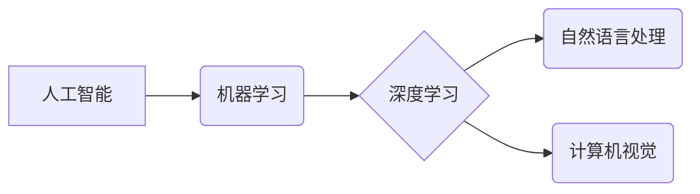

>  人工智能、机器学习、深度学习、编程、算法、数据结构、软件架构、自主学习

## 1. 背景介绍

在当今科技飞速发展的时代，人工智能（AI）已经渗透到生活的方方面面，从智能手机的语音助手到自动驾驶汽车，AI技术的应用日益广泛。然而，传统的教育机构往往难以跟上这一步伐，对AI相关技能的重视程度不足，导致许多学生在毕业后缺乏应对未来挑战所需的技能。

面对这种情况，自主学习显得尤为重要。只有主动学习，才能掌握最新的技术知识和技能，并为未来的职业发展打下坚实的基础。

## 2. 核心概念与联系

### 2.1  人工智能（AI）

人工智能是指模拟人类智能行为的计算机系统。它涵盖了广泛的领域，包括机器学习、深度学习、自然语言处理、计算机视觉等。

### 2.2  机器学习（ML）

机器学习是人工智能的一个子领域，它通过算法使计算机能够从数据中学习，并根据学习到的知识进行预测或决策。

### 2.3  深度学习（DL）

深度学习是机器学习的一个子领域，它使用多层神经网络来模拟人类大脑的学习过程，能够处理更复杂的数据，并取得更优异的性能。

**核心概念与联系流程图**



## 3. 核心算法原理 & 具体操作步骤

### 3.1  算法原理概述

深度学习算法的核心是多层神经网络。神经网络由许多相互连接的神经元组成，每个神经元接收来自其他神经元的输入，并根据权重进行计算，最终输出一个信号。

### 3.2  算法步骤详解

1. **数据预处理:** 将原始数据转换为深度学习算法可以理解的格式。
2. **网络结构设计:** 根据任务需求设计神经网络的结构，包括层数、神经元数量、激活函数等。
3. **参数初始化:** 为神经网络中的权重和偏置赋予初始值。
4. **前向传播:** 将输入数据通过神经网络进行计算，得到输出结果。
5. **反向传播:** 计算输出结果与真实值的误差，并根据误差调整神经网络的参数。
6. **迭代训练:** 重复前向传播和反向传播的过程，直到模型性能达到预期的水平。

### 3.3  算法优缺点

**优点:**

* 能够处理复杂的数据，并取得优异的性能。
* 自动学习特征，无需人工特征工程。
* 泛化能力强，能够应用于不同的任务。

**缺点:**

* 训练数据量大，需要大量的计算资源。
* 训练过程复杂，需要专业的知识和经验。
* 模型解释性差，难以理解模型的决策过程。

### 3.4  算法应用领域

深度学习算法广泛应用于以下领域:

* **图像识别:** 人脸识别、物体检测、图像分类等。
* **自然语言处理:** 机器翻译、文本摘要、情感分析等。
* **语音识别:** 语音转文本、语音助手等。
* **推荐系统:** 商品推荐、内容推荐等。
* **医疗诊断:** 疾病诊断、影像分析等。

## 4. 数学模型和公式 & 详细讲解 & 举例说明

### 4.1  数学模型构建

深度学习算法的核心是神经网络，其数学模型可以表示为多层感知机（MLP）。

**MLP模型结构:**

```
输入层 -> 隐藏层1 -> 隐藏层2 -> ... -> 隐藏层n -> 输出层
```

其中，每个层包含多个神经元，神经元之间通过权重连接。

### 4.2  公式推导过程

**激活函数:**

神经网络中的激活函数用于引入非线性，使模型能够学习更复杂的映射关系。常用的激活函数包括 sigmoid 函数、ReLU 函数等。

**损失函数:**

损失函数用于衡量模型预测结果与真实值的差异。常用的损失函数包括均方误差（MSE）、交叉熵损失等。

**梯度下降算法:**

梯度下降算法用于更新神经网络的参数，使其朝着最小化损失函数的方向进行调整。

### 4.3  案例分析与讲解

**举例说明:**

假设我们有一个简单的 MLP 模型，用于分类手写数字。模型输入是一个 28x28 的图像，输出是一个 10 维的向量，代表 10 个数字的概率。

**损失函数:**

我们使用交叉熵损失函数来衡量模型预测结果与真实值的差异。

**梯度下降算法:**

我们使用随机梯度下降算法来更新模型的参数。

## 5. 项目实践：代码实例和详细解释说明

### 5.1  开发环境搭建

* Python 3.x
* TensorFlow 或 PyTorch 深度学习框架
* Jupyter Notebook 或 VS Code 开发环境

### 5.2  源代码详细实现

```python
import tensorflow as tf

# 定义模型结构
model = tf.keras.models.Sequential([
    tf.keras.layers.Flatten(input_shape=(28, 28)),
    tf.keras.layers.Dense(128, activation='relu'),
    tf.keras.layers.Dense(10, activation='softmax')
])

# 编译模型
model.compile(optimizer='adam',
              loss='sparse_categorical_crossentropy',
              metrics=['accuracy'])

# 训练模型
model.fit(x_train, y_train, epochs=10)

# 评估模型
loss, accuracy = model.evaluate(x_test, y_test)
print('Test loss:', loss)
print('Test accuracy:', accuracy)
```

### 5.3  代码解读与分析

* **模型结构:** 模型由两层全连接层组成，第一层有 128 个神经元，使用 ReLU 激活函数，第二层有 10 个神经元，使用 softmax 激活函数，用于输出 10 个数字的概率。
* **编译模型:** 使用 Adam 优化器、交叉熵损失函数和准确率作为评估指标。
* **训练模型:** 使用训练数据训练模型 10 个 epochs。
* **评估模型:** 使用测试数据评估模型的性能。

### 5.4  运行结果展示

训练完成后，模型的准确率会随着 epochs 的增加而提高。

## 6. 实际应用场景

深度学习算法在各个领域都有广泛的应用场景，例如:

* **图像识别:** 自动驾驶汽车、人脸识别、医学影像分析等。
* **自然语言处理:** 机器翻译、聊天机器人、文本摘要等。
* **语音识别:** 语音助手、语音转文本等。
* **推荐系统:** 商品推荐、内容推荐等。

### 6.4  未来应用展望

随着深度学习算法的不断发展，其应用场景将会更加广泛，例如:

* **个性化教育:** 根据学生的学习情况提供个性化的学习方案。
* **医疗诊断:** 更准确地诊断疾病，并提供个性化的治疗方案。
* **科学研究:** 加速科学研究的进程，例如药物研发、材料科学等。

## 7. 工具和资源推荐

### 7.1  学习资源推荐

* **在线课程:** Coursera、edX、Udacity 等平台提供深度学习相关的在线课程。
* **书籍:** 《深度学习》、《动手学深度学习》等书籍。
* **博客:** TensorFlow、PyTorch 等框架的官方博客。

### 7.2  开发工具推荐

* **TensorFlow:** Google 开发的开源深度学习框架。
* **PyTorch:** Facebook 开发的开源深度学习框架。
* **Keras:** TensorFlow 上的深度学习 API。

### 7.3  相关论文推荐

* **《ImageNet Classification with Deep Convolutional Neural Networks》**
* **《Deep Residual Learning for Image Recognition》**
* **《Attention Is All You Need》**

## 8. 总结：未来发展趋势与挑战

### 8.1  研究成果总结

深度学习算法取得了显著的成果，在图像识别、自然语言处理等领域取得了突破性的进展。

### 8.2  未来发展趋势

* **模型效率:** 提高模型的训练速度和推理效率。
* **模型解释性:** 增强模型的解释性，使其决策过程更加透明。
* **数据安全:** 解决深度学习算法对数据安全性的挑战。

### 8.3  面临的挑战

* **数据获取:** 深度学习算法需要大量的训练数据，获取高质量的数据是一个挑战。
* **计算资源:** 训练深度学习模型需要大量的计算资源，成本较高。
* **伦理问题:** 深度学习算法的应用可能带来伦理问题，例如算法偏见、隐私泄露等。

### 8.4  研究展望

未来，深度学习算法将继续发展，并在更多领域发挥重要作用。

## 9. 附录：常见问题与解答

**常见问题:**

* **深度学习算法的训练过程如何进行？**
* **如何选择合适的深度学习框架？**
* **如何解决深度学习算法的过拟合问题？**

**解答:**

* 深度学习算法的训练过程包括数据预处理、网络结构设计、参数初始化、前向传播、反向传播和迭代训练等步骤。
* 选择合适的深度学习框架取决于具体的应用场景和个人喜好。
* 为了解决深度学习算法的过拟合问题，可以采用正则化技术、数据增强技术、交叉验证等方法。


作者：禅与计算机程序设计艺术 / Zen and the Art of Computer Programming 
<end_of_turn>