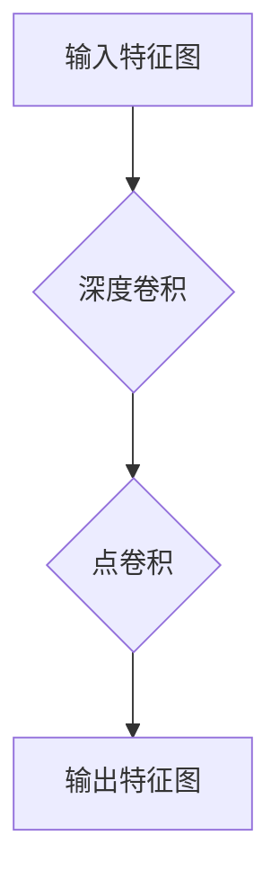

> 深度可分离卷积，大模型开发，微调，卷积神经网络，深度学习，计算机视觉

## 1. 背景介绍

深度学习在近年来取得了令人瞩目的成就，尤其是在计算机视觉领域。卷积神经网络（CNN）作为深度学习的核心架构之一，在图像识别、目标检测、图像分割等任务中表现出色。然而，随着模型规模的不断扩大，训练和部署这些大型模型带来了巨大的计算成本和资源消耗。为了解决这个问题，深度可分离卷积（Depthwise Separable Convolution，DSC）应运而生。

DSC是一种高效的卷积操作，它将传统的深度卷积分解为两个更简单的操作：深度卷积和点卷积。这种分解不仅可以显著减少模型参数量和计算复杂度，还能有效提高模型的训练速度和推理效率。因此，DSC在许多大模型开发和微调场景中得到了广泛应用。

## 2. 核心概念与联系

### 2.1 深度卷积

深度卷积是指对输入特征图的每个通道分别进行卷积操作。传统的深度卷积使用一个共享权重的卷积核对所有通道进行卷积，这会导致大量的参数和计算量。

### 2.2 点卷积

点卷积是指对每个输入特征图上的每个像素进行独立的加权求和操作。点卷积的计算量相对较小，并且可以学习到更精细的特征表示。

### 2.3 深度可分离卷积

DSC将传统的深度卷积分解为两个步骤：

1. **深度卷积:** 对每个输入通道分别进行卷积操作，使用一个共享权重的卷积核。
2. **点卷积:** 对深度卷积的结果进行点卷积操作，使用一个新的权重矩阵。

这种分解可以显著减少模型参数量和计算复杂度。

**Mermaid 流程图**



## 3. 核心算法原理 & 具体操作步骤

### 3.1 算法原理概述

深度可分离卷积的核心思想是将传统的深度卷积分解为两个更简单的操作：深度卷积和点卷积。深度卷积操作对每个输入通道分别进行卷积，而点卷积操作则对深度卷积的结果进行线性组合。这种分解可以显著减少模型参数量和计算复杂度。

### 3.2 算法步骤详解

1. **输入:** 一个输入特征图，其形状为 (H, W, C)，其中 H 和 W 分别表示高度和宽度，C 表示通道数。
2. **深度卷积:** 对每个输入通道分别进行卷积操作，使用一个共享权重的卷积核。卷积核的大小为 (K, K)，步长为 S，填充为 P。深度卷积操作的结果是一个新的特征图，其形状为 (H', W', C)。
3. **点卷积:** 对深度卷积的结果进行点卷积操作，使用一个新的权重矩阵。点卷积操作的输入形状为 (H', W', C)，输出形状为 (H', W', M)，其中 M 表示输出通道数。
4. **输出:** 一个新的特征图，其形状为 (H', W', M)。

### 3.3 算法优缺点

**优点:**

* **参数量减少:** DSC 可以显著减少模型参数量，因为深度卷积和点卷积分别使用较小的卷积核和权重矩阵。
* **计算复杂度降低:** DSC 的计算复杂度也比传统的深度卷积低，因为深度卷积和点卷积的操作分别比较简单。
* **训练速度提升:** 由于参数量和计算复杂度降低，DSC 可以显著提升模型的训练速度。

**缺点:**

* **精度损失:** DSC 可能导致一定的精度损失，因为深度卷积和点卷积的分解可能会丢失一些重要的特征信息。

### 3.4 算法应用领域

DSC 在许多大模型开发和微调场景中得到了广泛应用，例如：

* **图像分类:** DSC 可以用于构建更轻量级的图像分类模型，例如 MobileNet 和 Xception。
* **目标检测:** DSC 可以用于构建更快的目标检测模型，例如 SSD 和 YOLOv3。
* **图像分割:** DSC 可以用于构建更有效的图像分割模型，例如 U-Net 和 DeepLab。

## 4. 数学模型和公式 & 详细讲解 & 举例说明

### 4.1 数学模型构建

设输入特征图为 X ∈ R^(H×W×C)，卷积核大小为 K×K，步长为 S，填充为 P。深度可分离卷积的输出可以表示为：

```latex
Y = DepthwiseSepConv(X) = PointwiseConv(DepthwiseConv(X))
```

其中：

* DepthwiseConv(X) 表示深度卷积操作，对每个输入通道分别进行卷积。
* PointwiseConv( ) 表示点卷积操作，对深度卷积的结果进行线性组合。

### 4.2 公式推导过程

深度卷积操作的公式为：

```latex
Y_{i,j,k} = \sum_{m=0}^{K-1} \sum_{n=0}^{K-1} X_{i \cdot S + m, j \cdot S + n, l} \cdot W_{m,n,l,k}
```

其中：

* Y_{i,j,k} 表示输出特征图的第 i 行、第 j 列、第 k 个通道的值。
* X_{i \cdot S + m, j \cdot S + n, l} 表示输入特征图的第 (i \cdot S + m) 行、第 (j \cdot S + n) 列、第 l 个通道的值。
* W_{m,n,l,k} 表示深度卷积核的第 m 行、第 n 列、第 l 个输入通道、第 k 个输出通道的值。

点卷积操作的公式为：

```latex
Y_{i,j,k} = \sum_{l=0}^{C-1} Z_{i,j,l} \cdot W_{l,k}
```

其中：

* Z_{i,j,l} 表示深度卷积操作的结果的第 i 行、第 j 列、第 l 个通道的值。
* W_{l,k} 表示点卷积核的第 l 个输入通道、第 k 个输出通道的值。

### 4.3 案例分析与讲解

假设输入特征图的形状为 (28, 28, 3)，卷积核大小为 3×3，步长为 1，填充为 1。

1. **深度卷积:** 对每个输入通道分别进行卷积操作，得到一个新的特征图，其形状为 (28, 28, 3)。
2. **点卷积:** 对深度卷积的结果进行点卷积操作，使用一个新的权重矩阵，得到一个新的特征图，其形状为 (28, 28, 16)。

## 5. 项目实践：代码实例和详细解释说明

### 5.1 开发环境搭建

* Python 3.6+
* TensorFlow 2.0+
* Keras

### 5.2 源代码详细实现

```python
import tensorflow as tf

def depthwise_separable_conv(inputs, num_filters):
    """
    深度可分离卷积层
    """
    # 深度卷积
    x = tf.keras.layers.DepthwiseConv2D(kernel_size=3, strides=1, padding='same')(inputs)
    # 点卷积
    x = tf.keras.layers.Conv2D(num_filters, kernel_size=1, strides=1, padding='same')(x)
    return x

# 实例化模型
model = tf.keras.models.Sequential([
    tf.keras.layers.Input(shape=(28, 28, 3)),
    depthwise_separable_conv(inputs, num_filters=16),
    # ... 其他层
])

# 编译模型
model.compile(optimizer='adam',
              loss='categorical_crossentropy',
              metrics=['accuracy'])

# 训练模型
model.fit(x_train, y_train, epochs=10)
```

### 5.3 代码解读与分析

* `depthwise_separable_conv` 函数实现了深度可分离卷积操作。
* `DepthwiseConv2D` 层执行深度卷积操作。
* `Conv2D` 层执行点卷积操作。
* 模型实例化使用 `Sequential` 模型，并包含一个深度可分离卷积层和其他层。
* 模型编译使用 Adam 优化器、分类交叉熵损失函数和准确率指标。
* 模型训练使用训练数据 `x_train` 和标签 `y_train`，训练 10 个 epochs。

### 5.4 运行结果展示

训练完成后，可以评估模型的性能，例如在测试集上的准确率。

## 6. 实际应用场景

### 6.1  图像分类

DSC 可以用于构建更轻量级的图像分类模型，例如 MobileNet 和 Xception。这些模型在移动设备和嵌入式系统上表现出色，因为它们具有较小的参数量和计算复杂度。

### 6.2  目标检测

DSC 可以用于构建更快的目标检测模型，例如 SSD 和 YOLOv3。这些模型在实时目标检测任务中非常有效，例如自动驾驶和视频监控。

### 6.3  图像分割

DSC 可以用于构建更有效的图像分割模型，例如 U-Net 和 DeepLab。这些模型在医学图像分割、卫星图像分析等领域具有广泛应用。

### 6.4  未来应用展望

随着深度学习技术的不断发展，DSC 将在更多领域得到应用，例如：

* **自然语言处理:** DSC 可以用于构建更轻量级的自然语言处理模型，例如文本分类和机器翻译。
* **语音识别:** DSC 可以用于构建更有效的语音识别模型，例如语音助手和语音搜索。
* **三维重建:** DSC 可以用于构建更快速的3D重建模型，例如自动驾驶和虚拟现实。

## 7. 工具和资源推荐

### 7.1 学习资源推荐

* **论文:**
    * "Xception: Deep Learning with Depthwise Separable Convolutions"
    * "MobileNetV2: Inverted Residuals and Linear Bottlenecks"
* **博客:**
    * https://blog.keras.io/building-powerful-image-classification-models-with-keras.html
    * https://towardsdatascience.com/depthwise-separable-convolutions-in-mobile-net-and-xception-a-detailed-explanation-a3999999999a

### 7.2 开发工具推荐

* **TensorFlow:** https://www.tensorflow.org/
* **Keras:** https://keras.io/
* **PyTorch:** https://pytorch.org/

### 7.3 相关论文推荐

* "MobileNetV3: Architectures and Mobile Efficiency"
* "EfficientNet: Rethinking Model Scaling for Convolutional Neural Networks"

## 8. 总结：未来发展趋势与挑战

### 8.1 研究成果总结

深度可分离卷积是一种高效的卷积操作，它可以显著减少模型参数量和计算复杂度，同时保持良好的性能。DSC 在图像分类、目标检测、图像分割等领域得到了广泛应用，并推动了大模型开发和微调的进步。

### 8.2 未来发展趋势

* **更有效的深度可分离卷积结构:** 研究人员将继续探索更有效的深度可分离卷积结构，例如混合深度可分离卷积和传统卷积，以进一步提高模型性能和效率。
* **深度可分离卷积的应用扩展:** DSC 将在更多领域得到应用，例如自然语言处理、语音识别和三维重建。
* **深度可分离卷积的硬件加速:** 硬件厂商将开发专门的深度可分离卷积加速器，以进一步提升模型的训练和推理速度。

### 8.3 面临的挑战

* **精度损失:** DSC 可能导致一定的精度损失，需要进一步研究如何减小