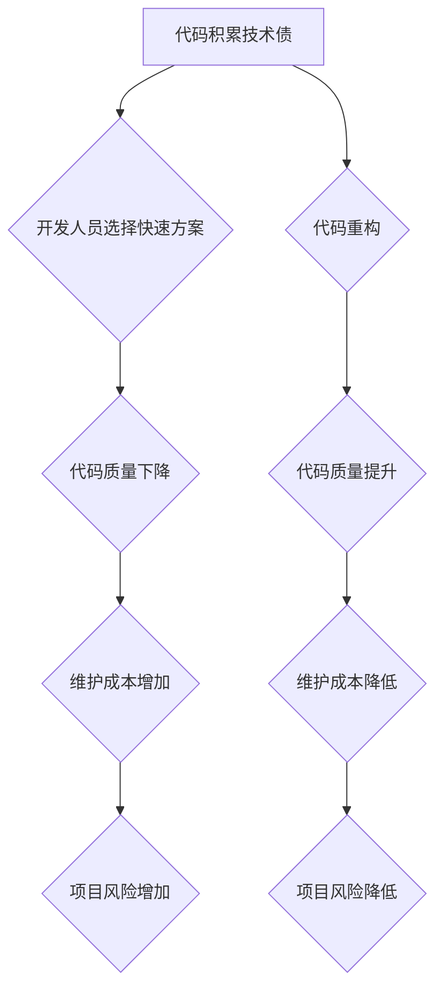

> 代码重构，技术债，代码质量，软件架构，代码优化，持续交付，敏捷开发

## 1. 背景介绍

在软件开发领域，代码质量是至关重要的因素。高质量的代码不仅易于理解、维护和扩展，还能提高软件的可靠性和性能。然而，随着软件项目的不断发展，代码往往会积累各种问题，例如代码冗余、逻辑混乱、设计缺陷等，这些问题会导致代码难以维护，开发效率低下，甚至影响软件的稳定性。

技术债（Technical Debt）是指在软件开发过程中为了更快地交付功能而采取的快捷方案，这些方案虽然能够满足短期需求，但会带来长期的维护成本和风险。技术债的积累就像负债一样，如果不及时偿还，会逐渐累积，最终导致软件项目难以持续发展。

代码重构（Code Refactoring）是一种改善代码内部结构和设计，而又不改变其外部行为的技术。它可以帮助我们消除代码中的技术债，提高代码质量，并为未来的开发工作打下坚实的基础。

## 2. 核心概念与联系

**2.1 代码重构**

代码重构是指对现有代码进行修改，以改善其内部结构和设计，而又不改变其外部行为。它是一种持续的过程，需要在开发过程中不断进行，以保持代码的质量和可维护性。

**2.2 技术债**

技术债是指在软件开发过程中为了更快地交付功能而采取的快捷方案，这些方案虽然能够满足短期需求，但会带来长期的维护成本和风险。

**2.3 代码质量**

代码质量是指代码的易读性、可维护性、可扩展性和可靠性等方面的综合表现。高质量的代码易于理解、修改和扩展，并且能够可靠地执行其功能。

**2.4 代码重构与技术债的关系**

代码重构可以帮助我们偿还技术债。通过重构代码，我们可以消除代码中的冗余、重复和混乱，提高代码的结构性和可读性，从而降低技术债的积累。

**2.5 代码重构与代码质量的关系**

代码重构是提高代码质量的重要手段。通过重构代码，我们可以消除代码中的缺陷和问题，提高代码的结构性和可维护性，从而提升代码质量。

**Mermaid 流程图**



## 3. 核心算法原理 & 具体操作步骤

### 3.1 算法原理概述

代码重构算法的核心原理是通过一系列的代码变换，来改善代码的内部结构和设计，而又不改变其外部行为。这些变换可以包括：

* **提取方法：** 将代码块提取为独立的方法，提高代码的复用性和可读性。
* **重命名变量和方法：** 使用更清晰、更具描述性的名称，提高代码的可读性和理解性。
* **移除冗余代码：** 删除重复或不必要的代码，提高代码的简洁性和可维护性。
* **替换代码结构：** 将代码结构从一个模式转换为另一个模式，例如将循环转换为递归，提高代码的效率和可读性。

### 3.2 算法步骤详解

1. **识别代码问题：** 首先需要识别代码中的问题，例如代码冗余、逻辑混乱、设计缺陷等。可以使用代码分析工具、代码审查等方法来识别代码问题。
2. **制定重构方案：** 根据识别出的代码问题，制定相应的重构方案。方案应该明确重构的目标、步骤和预期效果。
3. **执行重构操作：** 根据重构方案，逐个执行代码变换操作，例如提取方法、重命名变量等。
4. **测试重构结果：** 重构完成后，需要进行测试，以确保重构后的代码仍然能够正常运行，并且没有引入新的问题。
5. **文档更新：** 重构完成后，需要更新代码文档，以反映代码的最新状态。

### 3.3 算法优缺点

**优点：**

* 提高代码质量：代码重构可以消除代码中的缺陷和问题，提高代码的结构性和可维护性。
* 降低维护成本：高质量的代码更容易维护，可以降低维护成本。
* 提高开发效率：代码重构可以提高代码的可读性和理解性，从而提高开发效率。

**缺点：**

* 需要时间和精力：代码重构需要投入时间和精力，可能会影响开发进度。
* 需要专业知识：代码重构需要一定的编程经验和代码设计知识。
* 可能引入新的问题：如果重构操作不当，可能会引入新的问题。

### 3.4 算法应用领域

代码重构技术广泛应用于各种软件开发领域，例如：

* **Web 开发：** 重构网站代码，提高网站性能和可维护性。
* **移动应用开发：** 重构移动应用代码，提高应用性能和用户体验。
* **企业级软件开发：** 重构企业级软件代码，提高软件的稳定性和可靠性。

## 4. 数学模型和公式 & 详细讲解 & 举例说明

### 4.1 数学模型构建

代码重构的数学模型可以抽象为一个优化问题，目标是找到一种代码变换方案，使得代码的质量指标达到最大化。

其中，代码质量指标可以包括：

* **代码复杂度：** 指代码的逻辑结构和流程的复杂程度。
* **代码可读性：** 指代码的易读性和理解性。
* **代码可维护性：** 指代码的易于修改和扩展的程度。
* **代码可靠性：** 指代码的稳定性和安全性。

### 4.2 公式推导过程

由于代码质量指标的定义和计算方法多种多样，因此没有一个通用的数学公式可以精确地量化代码质量。

但是，我们可以使用一些数学模型和算法来评估代码质量，例如：

* **代码复杂度计算公式：**

```
代码复杂度 = cyclomatic complexity + code length
```

其中，cyclomatic complexity 是代码的循环复杂度，code length 是代码的长度。

* **代码可读性评估算法：**

可以使用自然语言处理技术和机器学习算法来评估代码的可读性，例如：

* **代码可维护性评估模型：**

可以使用代码分析工具和统计方法来评估代码的可维护性，例如：代码修改频率、代码缺陷数量等。

### 4.3 案例分析与讲解

例如，我们可以使用代码复杂度计算公式来评估代码的复杂程度。如果代码的cyclomatic complexity 和 code length 都较高，则说明代码的复杂程度较高，需要进行重构以降低代码复杂度。

## 5. 项目实践：代码实例和详细解释说明

### 5.1 开发环境搭建

* 操作系统：Windows/macOS/Linux
* 开发工具：IntelliJ IDEA/Eclipse/VS Code
* 编程语言：Java/Python/C++

### 5.2 源代码详细实现

```java
// 原始代码
public class Order {
    private int orderId;
    private String customerName;
    private double totalPrice;

    public Order(int orderId, String customerName, double totalPrice) {
        this.orderId = orderId;
        this.customerName = customerName;
        this.totalPrice = totalPrice;
    }

    public int getOrderId() {
        return orderId;
    }

    public String getCustomerName() {
        return customerName;
    }

    public double getTotalPrice() {
        return totalPrice;
    }

    public void setTotalPrice(double totalPrice) {
        this.totalPrice = totalPrice;
    }
}
```

```java
// 重构后的代码
public class Order {
    private int orderId;
    private String customerName;
    private double totalPrice;

    public Order(int orderId, String customerName, double totalPrice) {
        this.orderId = orderId;
        this.customerName = customerName;
        this.totalPrice = totalPrice;
    }

    public int getOrderId() {
        return orderId;
    }

    public String getCustomerName() {
        return customerName;
    }

    public double getTotalPrice() {
        return totalPrice;
    }

    public void setTotalPrice(double totalPrice) {
        this.totalPrice = totalPrice;
    }

    public void updateTotalPrice(double newTotalPrice) {
        this.totalPrice = newTotalPrice;
    }
}
```

### 5.3 代码解读与分析

原始代码中，`setTotalPrice` 方法直接修改了 `totalPrice` 的值，没有考虑到业务逻辑的完整性。重构后的代码中，添加了一个 `updateTotalPrice` 方法，该方法可以根据业务逻辑修改 `totalPrice` 的值，例如：

* 计算折扣后的价格
* 添加运费
* 调整价格

### 5.4 运行结果展示

重构后的代码可以更好地满足业务需求，并且更加易于维护和扩展。

## 6. 实际应用场景

### 6.1 代码重构在软件开发中的应用

代码重构在软件开发中应用广泛，例如：

* **维护老代码：** 重构老代码可以提高代码的可读性和可维护性，降低维护成本。
* **添加新功能：** 在添加新功能时，可以进行代码重构，以确保新功能与现有代码的集成性。
* **提高代码质量：** 代码重构可以消除代码中的缺陷和问题，提高代码质量。

### 6.2 代码重构在不同软件开发阶段的应用

代码重构可以应用于软件开发的不同阶段，例如：

* **需求分析阶段：** 在需求分析阶段，可以进行代码重构，以确保代码结构符合需求。
* **设计阶段：** 在设计阶段，可以进行代码重构，以确保代码设计符合最佳实践。
* **开发阶段：** 在开发阶段，可以进行代码重构，以提高代码质量和可维护性。
* **测试阶段：** 在测试阶段，可以进行代码重构，以提高代码的测试覆盖率。

### 6.3 代码重构的最佳实践

* **小步重构：** 将重构任务分解成小的步骤，每次只进行少量修改。
* **测试驱动开发：** 在进行重构之前，编写测试用例，确保重构后的代码仍然能够正常运行。
* **代码审查：** 将重构后的代码进行代码审查，以确保代码质量和可读性。
* **文档更新：** 重构完成后，更新代码文档，以反映代码的最新状态。

### 6.4 未来应用展望

随着软件开发技术的不断发展，代码重构技术也将不断得到改进和完善。未来，代码重构技术可能会更加智能化和自动化，能够自动识别代码问题并进行自动重构。

## 7. 工具和资源推荐

### 7.1 学习资源推荐

* **书籍：**
    * 《代码重构》
    * 《重构：改善既有代码的设计》
* **在线课程：**
    * Udemy
    * Coursera
* **博客和论坛：**
    * Refactoring.guru
    * Stack Overflow

### 7.2 开发工具推荐

* **代码分析工具：** SonarQube, PMD, FindBugs
* **代码重构工具：** IntelliJ IDEA, Eclipse, VS Code

### 7.3 相关论文推荐

* **论文：**
    * "Refactoring: Improving the Design of Existing Code"
    * "A Survey of Code Refactoring Techniques"

## 8. 总结：未来发展趋势与挑战

### 8.1 研究成果总结

代码重构技术已经取得了显著的成果，能够有效地提高代码质量和可维护性。

### 8.2 未来发展趋势

未来，代码重构技术将朝着以下方向发展：

* **智能化：** 代码重构工具将更加智能化，能够自动识别代码问题并进行自动重构。
* **自动化：** 代码重构过程将更加自动化，减少人工干预。
* **协作化：** 代码重构