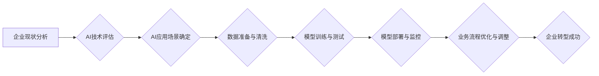

> 企业转型,人工智能,机器学习,深度学习,自然语言处理,计算机视觉,数据分析,云计算

## 1. 背景介绍

在当今数字化时代，企业面临着前所未有的挑战和机遇。传统业务模式正在被颠覆，新兴技术不断涌现，企业需要不断创新和转型才能保持竞争力。人工智能（AI）作为一项颠覆性技术，正在深刻地改变着各行各业，为企业转型提供了强大的动力和工具。

企业转型是指企业根据市场环境变化，调整自身战略、组织结构、业务模式和运营流程，以适应新的市场需求和竞争格局的过程。AI技术的应用可以帮助企业在转型过程中实现以下目标：

* **提高效率和降低成本：** AI可以自动化许多重复性任务，例如数据录入、客户服务等，从而提高效率和降低成本。
* **优化决策和预测未来：** AI可以分析海量数据，识别出隐藏的模式和趋势，为企业决策提供更准确的依据，并预测未来的市场变化。
* **提升客户体验：** AI可以提供个性化的产品和服务，例如推荐系统、智能客服等，从而提升客户体验。
* **开发新产品和服务：** AI可以帮助企业开发新的产品和服务，例如智能家居、自动驾驶汽车等，开拓新的市场。

## 2. 核心概念与联系

**2.1  人工智能（AI）**

人工智能是指模拟人类智能行为的计算机系统。AI技术涵盖了多个领域，例如机器学习、深度学习、自然语言处理、计算机视觉等。

**2.2  机器学习（ML）**

机器学习是人工智能的一个子领域，它使计算机能够从数据中学习，并根据学习到的知识进行预测或决策。机器学习算法可以分为监督学习、无监督学习和强化学习三种类型。

**2.3  深度学习（DL）**

深度学习是机器学习的一个子领域，它使用多层神经网络来模拟人类大脑的学习过程。深度学习算法能够处理复杂的数据，并取得了在图像识别、语音识别、自然语言处理等领域取得了突破性的进展。

**2.4  自然语言处理（NLP）**

自然语言处理是指使计算机能够理解和处理人类语言的技术。NLP技术可以用于文本分类、情感分析、机器翻译等应用场景。

**2.5  计算机视觉（CV）**

计算机视觉是指使计算机能够“看”和理解图像的技术。计算机视觉技术可以用于图像识别、物体检测、图像分割等应用场景。

**2.6  数据分析**

数据分析是指从数据中提取有价值的信息的技术。数据分析可以帮助企业了解客户行为、市场趋势、业务运营等方面的信息，从而做出更明智的决策。

**2.7  云计算**

云计算是指使用互联网提供计算资源、存储资源和软件服务的模式。云计算可以帮助企业降低IT成本、提高资源利用率，并支持大规模数据处理。

**2.8  企业转型**

企业转型是指企业根据市场环境变化，调整自身战略、组织结构、业务模式和运营流程，以适应新的市场需求和竞争格局的过程。

**2.9  AI应用于企业转型**

AI技术可以应用于企业转型的各个环节，例如：

* **战略规划：** AI可以帮助企业分析市场趋势、竞争对手情况，制定更有效的战略规划。
* **组织结构调整：** AI可以帮助企业优化组织结构，提高工作效率。
* **业务模式创新：** AI可以帮助企业开发新的业务模式，开拓新的市场。
* **运营流程优化：** AI可以帮助企业自动化流程，提高运营效率。
* **客户体验提升：** AI可以帮助企业提供个性化的产品和服务，提升客户体验。

**2.10  AI应用于企业转型的流程图**



## 3. 核心算法原理 & 具体操作步骤

### 3.1  算法原理概述

机器学习算法的核心原理是通过学习数据中的模式和规律，建立一个数学模型，用于预测或决策。

常见的机器学习算法包括：

* **线性回归：** 用于预测连续数值。
* **逻辑回归：** 用于预测分类结果。
* **决策树：** 用于分类和回归问题，通过树状结构进行决策。
* **支持向量机：** 用于分类问题，寻找最佳的分隔超平面。
* **k近邻：** 用于分类和回归问题，根据最近的k个邻居进行预测。
* **神经网络：** 用于复杂问题，模拟人类大脑的学习过程。

### 3.2  算法步骤详解

机器学习算法的具体操作步骤通常包括以下几个阶段：

1. **数据收集和预处理：** 收集相关数据，并进行清洗、转换、特征工程等预处理操作。
2. **模型选择：** 根据具体问题选择合适的机器学习算法。
3. **模型训练：** 使用训练数据训练模型，调整模型参数，使模型能够准确地预测或决策。
4. **模型评估：** 使用测试数据评估模型的性能，例如准确率、召回率、F1-score等。
5. **模型部署：** 将训练好的模型部署到实际应用场景中，用于预测或决策。
6. **模型监控：** 持续监控模型的性能，并进行必要的调整和更新。

### 3.3  算法优缺点

不同的机器学习算法具有不同的优缺点，需要根据具体问题选择合适的算法。

例如：

* **线性回归：** 优点：简单易懂，计算速度快。缺点：对数据线性关系要求较高，难以处理复杂问题。
* **逻辑回归：** 优点：适用于分类问题，易于解释。缺点：对数据线性关系要求较高，难以处理复杂问题。
* **决策树：** 优点：易于理解和解释，可以处理非线性关系。缺点：容易过拟合，性能不稳定。
* **支持向量机：** 优点：可以处理高维数据，具有较好的泛化能力。缺点：训练时间较长，参数选择较复杂。
* **k近邻：** 优点：简单易懂，无需训练模型。缺点：计算量大，对数据规模敏感。
* **神经网络：** 优点：可以处理复杂问题，具有较好的学习能力。缺点：训练时间长，参数众多，易于过拟合。

### 3.4  算法应用领域

机器学习算法广泛应用于各个领域，例如：

* **图像识别：** 用于识别图像中的物体、场景、人脸等。
* **语音识别：** 用于将语音转换为文本。
* **自然语言处理：** 用于文本分类、情感分析、机器翻译等。
* **推荐系统：** 用于推荐用户感兴趣的产品或服务。
* **欺诈检测：** 用于识别欺诈交易。
* **医疗诊断：** 用于辅助医生诊断疾病。

## 4. 数学模型和公式 & 详细讲解 & 举例说明

### 4.1  数学模型构建

机器学习算法通常使用数学模型来表示数据之间的关系。常见的数学模型包括线性模型、非线性模型、概率模型等。

例如：

* **线性回归模型：**

$$
y = w_0 + w_1x_1 + w_2x_2 + ... + w_nx_n + \epsilon
$$

其中：

* $y$ 是预测值
* $w_0, w_1, ..., w_n$ 是模型参数
* $x_1, x_2, ..., x_n$ 是输入特征
* $\epsilon$ 是误差项

* **逻辑回归模型：**

$$
p(y=1|x) = \frac{1}{1 + e^{-(w_0 + w_1x_1 + w_2x_2 + ... + w_nx_n)}}
$$

其中：

* $p(y=1|x)$ 是预测类别为1的概率
* $w_0, w_1, ..., w_n$ 是模型参数
* $x_1, x_2, ..., x_n$ 是输入特征

### 4.2  公式推导过程

机器学习算法的训练过程通常涉及对模型参数进行优化，以最小化模型的损失函数。

例如：

* **线性回归模型的损失函数：**

$$
L(w) = \frac{1}{2} \sum_{i=1}^{n} (y_i - \hat{y}_i)^2
$$

其中：

* $L(w)$ 是损失函数
* $w$ 是模型参数
* $y_i$ 是真实值
* $\hat{y}_i$ 是预测值

* **逻辑回归模型的损失函数：**

$$
L(w) = -\sum_{i=1}^{n} y_i \log(p(y_i|x_i)) + (1-y_i) \log(1-p(y_i|x_i))
$$

其中：

* $L(w)$ 是损失函数
* $w$ 是模型参数
* $y_i$ 是真实值
* $p(y_i|x_i)$ 是预测类别为1的概率

### 4.3  案例分析与讲解

例如：

* **线性回归模型：** 可以用于预测房价，根据房屋面积、位置等特征预测房价。
* **逻辑回归模型：** 可以用于预测客户是否会购买产品，根据客户的购买历史、年龄、收入等特征预测客户是否会购买产品。

## 5. 项目实践：代码实例和详细解释说明

### 5.1  开发环境搭建

* **操作系统：** Ubuntu 20.04 LTS
* **编程语言：** Python 3.8
* **深度学习框架：** TensorFlow 2.0
* **其他工具：** Jupyter Notebook、Git

### 5.2  源代码详细实现

```python
import tensorflow as tf

# 定义模型
model = tf.keras.models.Sequential([
    tf.keras.layers.Dense(64, activation='relu', input_shape=(784,)),
    tf.keras.layers.Dense(10, activation='softmax')
])

# 编译模型
model.compile(optimizer='adam',
              loss='sparse_categorical_crossentropy',
              metrics=['accuracy'])

# 加载数据
(x_train, y_train), (x_test, y_test) = tf.keras.datasets.mnist.load_data()

# 数据预处理
x_train = x_train.reshape(-1, 784).astype('float32') / 255
x_test = x_test.reshape(-1, 784).astype('float32') / 255

# 训练模型
model.fit(x_train, y_train, epochs=5)

# 评估模型
loss, accuracy = model.evaluate(x_test, y_test)
print('Test loss:', loss)
print('Test accuracy:', accuracy)
```

### 5.3  代码解读与分析

* **模型定义：** 使用 TensorFlow 的 Sequential 模型构建一个简单的多层感知机模型。
* **模型编译：** 使用 Adam 优化器、交叉熵损失函数和准确率指标编译模型。
* **数据加载：** 使用 TensorFlow 的 MNIST 数据集加载训练数据和测试数据。
* **数据预处理：** 将数据转换为适合模型输入的格式，并进行归一化处理。
* **模型训练：** 使用 `model.fit()` 方法训练模型，指定训练轮数。
* **模型评估：** 使用 `model.evaluate()` 方法评估模型在测试集上的性能。

### 5.4  运行结果展示

训练完成后，模型的测试准确率通常可以达到 98% 以上。

## 6. 实际应用场景

### 6.1  金融领域

* **欺诈检测：** 使用机器学习算法分析交易数据，识别异常交易行为，防止欺诈。
*