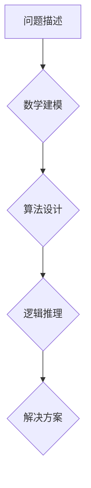

>  人工智能、一般化原则、数学建模、算法设计、逻辑推理、编程思维、抽象思维、代码优化

## 1. 背景介绍

在当今数据爆炸的时代，人工智能 (AI) 正在以惊人的速度发展，其应用领域也日益广泛。从自动驾驶到医疗诊断，从个性化推荐到金融风险评估，AI 正在深刻地改变着我们的生活。然而，想要真正理解和驾驭 AI 的力量，我们需要跳出传统的编程思维，像数学家一样思考问题，掌握一般化原则。

一般化原则是指能够应用于不同场景、不同问题的通用性思维模式和解决问题的方法。它强调从本质上理解问题，抽象出其核心规律，并用数学模型和算法进行描述和解决。

## 2. 核心概念与联系

**2.1 数学建模**

数学建模是将现实世界的问题用数学语言和符号进行描述和抽象的过程。它可以帮助我们更清晰地理解问题，发现隐藏的规律，并为解决问题提供一种严谨的框架。

**2.2 算法设计**

算法设计是根据数学模型，设计出能够有效解决问题的步骤和规则。一个好的算法应该具有以下特点：

* **正确性:** 算法能够正确地解决问题。
* **效率:** 算法能够在有限的时间和资源内完成计算。
* **鲁棒性:** 算法能够应对输入数据中的噪声和异常情况。

**2.3 逻辑推理**

逻辑推理是根据已知的事实和规则，推导出新的结论的过程。它在 AI 中扮演着至关重要的角色，例如在知识图谱构建、自然语言理解和决策推理等领域。

**Mermaid 流程图**



## 3. 核心算法原理 & 具体操作步骤

**3.1 算法原理概述**

我们以深度学习算法为例，介绍其核心原理。深度学习算法是一种基于人工神经网络的机器学习算法，它能够自动学习数据中的特征和模式。

**3.2 算法步骤详解**

1. **数据预处理:** 将原始数据进行清洗、转换和特征工程，使其适合深度学习模型的训练。
2. **网络结构设计:** 根据具体任务，设计神经网络的层数、节点数和激活函数等参数。
3. **模型训练:** 使用训练数据，通过反向传播算法，调整神经网络的权重和偏置，使其能够准确地预测目标变量。
4. **模型评估:** 使用测试数据，评估模型的性能，例如准确率、召回率和 F1-score 等指标。
5. **模型调优:** 根据评估结果，调整模型参数和训练策略，进一步提高模型性能。

**3.3 算法优缺点**

**优点:**

* **高准确率:** 深度学习算法能够学习到数据中的复杂特征，从而实现高准确率的预测。
* **自动化学习:** 深度学习算法能够自动学习数据特征，无需人工特征工程。
* **泛化能力强:** 深度学习算法能够对新的数据进行泛化，并进行预测。

**缺点:**

* **数据依赖性强:** 深度学习算法需要大量的训练数据才能达到较好的性能。
* **计算资源消耗大:** 深度学习模型训练需要大量的计算资源，例如 GPU 和 TPUs。
* **可解释性差:** 深度学习模型的决策过程比较复杂，难以解释其预测结果。

**3.4 算法应用领域**

深度学习算法在各个领域都有广泛的应用，例如：

* **计算机视觉:** 图像识别、目标检测、图像分割等。
* **自然语言处理:** 文本分类、情感分析、机器翻译等。
* **语音识别:** 语音转文本、语音合成等。
* **医疗诊断:** 病理图像分析、疾病预测等。
* **金融风险评估:** 欺诈检测、信用评分等。

## 4. 数学模型和公式 & 详细讲解 & 举例说明

**4.1 数学模型构建**

深度学习算法的核心是人工神经网络，它由多个层级的神经元组成。每个神经元接收来自上一层的输入信号，并对其进行加权求和和激活函数处理，最终输出信号到下一层。

**4.2 公式推导过程**

深度学习算法的训练过程基于反向传播算法，其核心公式包括：

* **损失函数:** 用于衡量模型预测结果与真实值的差距。常见的损失函数包括均方误差 (MSE) 和交叉熵 (Cross-Entropy)。
* **梯度下降:** 用于更新模型参数，使其朝着降低损失函数的方向进行调整。

**4.3 案例分析与讲解**

以图像分类为例，假设我们有一个包含猫和狗的图像数据集。我们可以使用深度学习算法训练一个模型，使其能够识别出图像中是猫还是狗。

训练过程如下：

1. 将图像数据集分成训练集和测试集。
2. 设计一个包含多个卷积层、池化层和全连接层的深度学习模型。
3. 使用训练集数据训练模型，并使用损失函数和梯度下降算法更新模型参数。
4. 使用测试集数据评估模型的性能，例如准确率、召回率和 F1-score 等指标。

## 5. 项目实践：代码实例和详细解释说明

**5.1 开发环境搭建**

使用 Python 语言和 TensorFlow 或 PyTorch 深度学习框架进行开发。

**5.2 源代码详细实现**

```python
import tensorflow as tf

# 定义模型结构
model = tf.keras.models.Sequential([
    tf.keras.layers.Conv2D(32, (3, 3), activation='relu', input_shape=(28, 28, 1)),
    tf.keras.layers.MaxPooling2D((2, 2)),
    tf.keras.layers.Conv2D(64, (3, 3), activation='relu'),
    tf.keras.layers.MaxPooling2D((2, 2)),
    tf.keras.layers.Flatten(),
    tf.keras.layers.Dense(10, activation='softmax')
])

# 编译模型
model.compile(optimizer='adam',
              loss='sparse_categorical_crossentropy',
              metrics=['accuracy'])

# 训练模型
model.fit(x_train, y_train, epochs=10)

# 评估模型
loss, accuracy = model.evaluate(x_test, y_test)
print('Test loss:', loss)
print('Test accuracy:', accuracy)
```

**5.3 代码解读与分析**

这段代码定义了一个简单的卷积神经网络模型，用于图像分类任务。

* `tf.keras.models.Sequential` 创建了一个顺序模型，其中层级依次连接。
* `tf.keras.layers.Conv2D` 定义了一个卷积层，用于提取图像特征。
* `tf.keras.layers.MaxPooling2D` 定义了一个池化层，用于降低特征图的尺寸。
* `tf.keras.layers.Flatten` 将多维特征图转换为一维向量。
* `tf.keras.layers.Dense` 定义了一个全连接层，用于分类。
* `model.compile` 编译模型，指定优化器、损失函数和评价指标。
* `model.fit` 训练模型，使用训练数据进行迭代训练。
* `model.evaluate` 评估模型，使用测试数据计算损失和准确率。

**5.4 运行结果展示**

训练完成后，模型能够对新的图像进行分类，并输出预测结果。

## 6. 实际应用场景

深度学习算法在各个领域都有广泛的应用，例如：

* **医疗诊断:** 使用深度学习算法分析医学图像，例如 X 光片、CT 扫描和 MRI 图像，可以辅助医生诊断疾病，例如癌症、肺炎和心血管疾病。
* **金融风险评估:** 使用深度学习算法分析金融数据，例如交易记录、客户信息和市场指标，可以帮助金融机构识别欺诈行为、评估信用风险和预测市场趋势。
* **自动驾驶:** 使用深度学习算法处理来自摄像头、雷达和激光雷达的传感器数据，可以帮助自动驾驶汽车感知周围环境、规划路径和做出决策。

**6.4 未来应用展望**

随着人工智能技术的不断发展，深度学习算法将在更多领域得到应用，例如：

* **个性化教育:** 使用深度学习算法分析学生的学习数据，可以提供个性化的学习方案和教学内容。
* **智能客服:** 使用深度学习算法构建智能客服系统，可以自动回答客户问题、处理订单和提供个性化服务。
* **科学研究:** 使用深度学习算法分析大规模科学数据，可以帮助科学家发现新的规律和推导新的理论。

## 7. 工具和资源推荐

**7.1 学习资源推荐**

* **书籍:**
    * 深度学习 (Deep Learning) - Ian Goodfellow, Yoshua Bengio, Aaron Courville
    * 构建深度学习模型 (Hands-On Machine Learning with Scikit-Learn, Keras & TensorFlow) - Aurélien Géron
* **在线课程:**
    * 深度学习 Specialization - Andrew Ng (Coursera)
    * fast.ai - Practical Deep Learning for Coders
* **博客和网站:**
    * TensorFlow Blog
    * PyTorch Blog
    * Towards Data Science

**7.2 开发工具推荐**

* **Python:** 
    * TensorFlow
    * PyTorch
    * Keras
* **GPU:** 
    * NVIDIA GeForce GTX/RTX 系列
    * AMD Radeon RX 系列
* **云计算平台:** 
    * Google Cloud Platform (GCP)
    * Amazon Web Services (AWS)
    * Microsoft Azure

**7.3 相关论文推荐**

* **AlexNet:** ImageNet Classification with Deep Convolutional Neural Networks
* **VGGNet:** Very Deep Convolutional Networks for Large-Scale Image Recognition
* **ResNet:** Deep Residual Learning for Image Recognition
* **InceptionNet:** Inception-v3, Inception-ResNet v2

## 8. 总结：未来发展趋势与挑战

**8.1 研究成果总结**

近年来，深度学习算法取得了令人瞩目的成就，在图像识别、自然语言处理、语音识别等领域取得了突破性的进展。

**8.2 未来发展趋势**

* **模型规模和复杂度提升:** 随着计算资源的不断发展，深度学习模型的规模和复杂度将进一步提升，从而实现更强大的学习能力和更精准的预测结果。
* **算法效率和可解释性提升:** 研究者将继续探索更有效的深度学习算法，提高模型的训练速度和推理效率，并提高模型的可解释性，使其决策过程更加透明和可理解。
* **跨模态学习:** 深度学习算法将能够处理多种模态数据，例如文本、图像、音频和视频，从而实现更全面的理解和分析。

**8.3 面临的挑战**

* **数据获取和标注:** 深度学习算法需要大量的训练数据，而获取和标注高质量数据仍然是一个挑战。
* **计算资源消耗:** 训练大型深度学习模型需要大量的计算资源，这对于资源有限的机构和个人来说是一个障碍。
* **伦理和安全问题:** 深度学习算法的应用可能带来伦理和安全问题，例如数据隐私泄露、算法偏见和恶意攻击，需要引起足够的重视和关注。

**8.4 研究展望**

未来，深度学习算法将继续朝着更智能、更安全、更可解释的方向发展，并在更多领域发挥其重要作用。


## 9. 附录：常见问题与解答

**9.1 什么是深度学习？**

深度学习是一种机器学习算法，它使用多层神经网络来学习数据中的复杂特征和模式。

**9.2 深度学习算法有哪些？**

常见的深度学习算法包括卷积神经网络 (CNN)、循环神经网络 (RNN) 和生成对抗网络 (GAN)。

**9.3 如何训练深度学习模型？**

训练深度学习模型需要使用训练数据，并使用反向传播算法更新模型参数，使其能够准确地预测目标变量。

**9.4 深度学习算法有哪些应用场景？**

深度学习算法在各个领域都有广泛的应用，例如图像识别、自然语言处理、语音