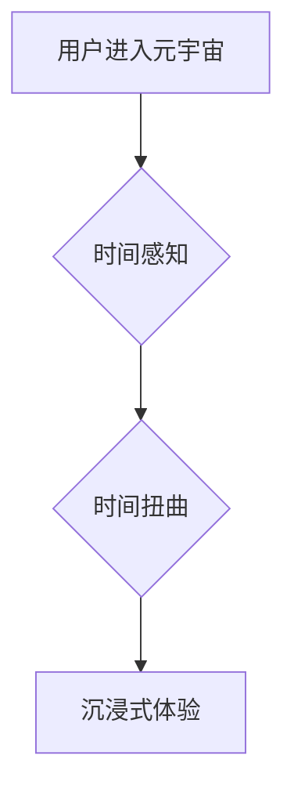

> 元宇宙、时间概念、物理局限、虚拟现实、时间流逝、时间扭曲、时间旅行、时间感知、沉浸式体验

## 1. 背景介绍

元宇宙的概念近年来备受关注，它被描绘成一个由虚拟现实、增强现实和互联网连接而成的沉浸式数字世界。在这个虚拟世界中，用户可以创建虚拟身份，与他人互动，参与各种活动，甚至拥有虚拟财产。然而，元宇宙的构建并非仅仅是技术上的挑战，更重要的是需要解决一些深刻的哲学问题，其中之一便是时间概念。

传统的时间概念是基于物理世界的，它遵循着线性、单向的流逝规律。但在元宇宙中，时间概念可能面临着重大的挑战和重新定义。虚拟世界不受物理世界的限制，时间流逝的速度可以被人为控制，甚至可以实现时间旅行等概念。

## 2. 核心概念与联系

### 2.1 时间感知与虚拟现实

在虚拟现实环境中，时间感知会受到多种因素的影响，例如：

* **渲染帧率:** 渲染帧率越高，用户对时间的感知越接近现实世界。
* **交互方式:** 用户的交互方式也会影响时间感知，例如，快速移动或进行复杂操作会使时间流逝得更快。
* **环境设计:** 环境设计可以利用视觉、音频等元素来暗示时间流逝，例如，日夜交替、天气变化等。

### 2.2 时间扭曲与虚拟世界

元宇宙中的时间可以被扭曲和操控，例如：

* **时间加速/减速:** 用户可以设置虚拟世界的时速，使其比现实世界快或慢。
* **时间暂停/回放:** 用户可以暂停虚拟世界的时钟，或者回放已发生事件。
* **时间旅行:** 理论上，元宇宙可以实现时间旅行，用户可以穿越到过去或未来。

**Mermaid 流程图**



## 3. 核心算法原理 & 具体操作步骤

### 3.1  算法原理概述

实现元宇宙中时间概念的扭曲和操控需要复杂的算法支持。以下是一些常用的算法原理：

* **时间插值算法:** 用于在时间轴上生成虚拟时间点，实现时间加速/减速的效果。
* **时间循环算法:** 用于实现时间暂停/回放的功能，将时间轴循环播放。
* **时间旅行算法:** 这是一个更复杂的算法，需要考虑时间悖论等问题，目前尚处于理论研究阶段。

### 3.2  算法步骤详解

以时间加速算法为例，其具体步骤如下：

1. **获取真实时间:** 从系统获取当前的真实时间戳。
2. **计算虚拟时间:** 根据用户设置的加速倍数，计算虚拟时间戳。
3. **生成虚拟事件:** 根据虚拟时间戳，生成虚拟事件，并将其插入到虚拟时间轴中。
4. **渲染虚拟世界:** 根据虚拟时间轴上的事件，渲染虚拟世界，并根据时间流逝的速度更新场景。

### 3.3  算法优缺点

* **优点:** 可以实现时间流逝的速度控制，增强用户体验。
* **缺点:** 可能会导致时间感知混乱，影响用户对虚拟世界的认知。

### 3.4  算法应用领域

* **游戏:** 可以实现游戏中的时间加速/减速功能，例如，快速过剧情或加速游戏进度。
* **教育:** 可以用于模拟历史事件或未来场景，帮助用户更好地理解时间概念。
* **医疗:** 可以用于模拟疾病发展过程，帮助医生制定治疗方案。

## 4. 数学模型和公式 & 详细讲解 & 举例说明

### 4.1  数学模型构建

时间加速算法可以利用以下数学模型：

* **虚拟时间 = 真实时间 * 加速倍数**

其中：

* **虚拟时间:** 虚拟世界的当前时间戳。
* **真实时间:** 系统获取的当前时间戳。
* **加速倍数:** 用户设置的时间加速倍数。

### 4.2  公式推导过程

该公式的推导过程非常简单，它基于时间流逝的线性关系。

### 4.3  案例分析与讲解

假设用户设置了时间加速倍数为 2，则虚拟时间将是真实时间的两倍。例如，如果真实时间为 10:00，则虚拟时间将为 12:00。

## 5. 项目实践：代码实例和详细解释说明

### 5.1  开发环境搭建

本示例使用 Python 语言和 Pygame 库进行开发。

### 5.2  源代码详细实现

```python
import pygame
import time

# 初始化 Pygame
pygame.init()

# 设置窗口大小
screen_width = 800
screen_height = 600
screen = pygame.display.set_mode((screen_width, screen_height))

# 设置标题
pygame.display.set_caption("时间加速示例")

# 设置时间加速倍数
speed_factor = 2

# 游戏循环
running = True
while running:
    # 处理事件
    for event in pygame.event.get():
        if event.type == pygame.QUIT:
            running = False

    # 获取真实时间
    real_time = time.time()

    # 计算虚拟时间
    virtual_time = real_time * speed_factor

    # 更新场景
    # ...

    # 更新显示
    pygame.display.flip()

# 退出 Pygame
pygame.quit()
```

### 5.3  代码解读与分析

* 代码首先初始化 Pygame 库，并设置窗口大小和标题。
* 然后设置时间加速倍数，该值可以根据用户需求进行调整。
* 游戏循环中，首先处理事件，例如用户关闭窗口。
* 然后获取真实时间，并根据时间加速倍数计算虚拟时间。
* 最后更新场景和显示，实现时间加速的效果。

### 5.4  运行结果展示

运行该代码后，用户将看到一个窗口，其中场景会以加速的速度变化。

## 6. 实际应用场景

### 6.1  游戏开发

* **加速游戏进度:** 在某些游戏中，玩家可以设置时间加速倍数，快速过剧情或加速游戏进度。
* **创造特殊效果:** 时间加速可以用于创造一些特殊的视觉效果，例如，快速移动的物体或扭曲的时间空间。

### 6.2  教育培训

* **模拟历史事件:** 可以利用时间加速功能，模拟历史事件的发生过程，帮助学生更好地理解历史。
* **演示科学原理:** 可以演示一些科学原理，例如，时间膨胀效应或相对论。

### 6.3  医疗保健

* **模拟疾病发展:** 可以模拟疾病的发展过程，帮助医生制定治疗方案。
* **进行虚拟手术训练:** 可以利用时间加速功能，加速虚拟手术的进行，帮助医生进行手术训练。

### 6.4  未来应用展望

随着元宇宙技术的不断发展，时间概念的应用场景将会更加广泛。未来，我们可能能够：

* **实现时间旅行:** 虽然目前还处于理论研究阶段，但未来或许能够实现时间旅行，让我们能够穿越到过去或未来。
* **定制时间流逝:** 用户可以根据自己的需求，定制时间流逝的速度，例如，在工作时加速时间流逝，在休闲时减速时间流逝。
* **创造新的时间体验:** 元宇宙可以创造全新的时间体验，例如，无限循环的时间空间或暂停时间的能力。

## 7. 工具和资源推荐

### 7.1  学习资源推荐

* **书籍:**
    * 《元宇宙：下一代互联网》
    * 《虚拟现实技术》
    * 《时间旅行：科学与哲学》
* **在线课程:**
    * Coursera: 虚拟现实与增强现实
    * edX: 元宇宙与未来技术

### 7.2  开发工具推荐

* **Unity:** 游戏引擎，支持虚拟现实开发。
* **Unreal Engine:** 游戏引擎，支持虚拟现实开发。
* **Blender:** 3D建模软件，可以用于创建元宇宙场景。

### 7.3  相关论文推荐

* **The Metaverse: A New Paradigm for Human Interaction**
* **Time Travel: A Philosophical and Scientific Exploration**
* **Virtual Reality and the Future of Education**

## 8. 总结：未来发展趋势与挑战

### 8.1  研究成果总结

元宇宙中的时间概念是一个充满挑战和机遇的领域。通过算法和技术手段，我们可以实现时间流逝的速度控制，创造全新的时间体验。

### 8.2  未来发展趋势

未来，元宇宙中的时间概念将会更加丰富和复杂，我们将看到：

* **更逼真的时间感知:** 随着技术的进步，用户对虚拟时间感知将会更加逼真。
* **更灵活的时间操控:** 用户将能够更加灵活地操控虚拟时间，例如，暂停、回放、快进等。
* **新的时间体验:** 元宇宙将创造全新的时间体验，例如，无限循环的时间空间或暂停时间的能力。

### 8.3  面临的挑战

实现元宇宙中的时间概念也面临着一些挑战：

* **时间悖论:** 时间旅行可能会导致时间悖论，需要找到解决方法。
* **时间感知混乱:** 过度操控时间可能会导致用户对时间感知混乱。
* **伦理问题:** 时间概念的操控可能会引发一些伦理问题，需要进行深入探讨。

### 8.4  研究展望

元宇宙中的时间概念是一个充满无限可能的领域，未来需要更多的研究和探索，以更好地理解时间，并创造更加丰富多彩的虚拟世界。

## 9. 附录：常见问题与解答

### 9.1  Q: 元宇宙中的时间概念是否会影响现实世界的时间？

**A:** 目前，元宇宙中的时间概念不会影响现实世界的时间。元宇宙是一个虚拟世界，其时间流逝不受现实世界的影响。

### 9.2  Q: 如何避免在元宇宙中时间感知混乱？

**A:** 在元宇宙中使用时间加速功能时，需要适度控制时间流逝的速度，避免长时间处于加速状态，从而避免时间感知混乱。

### 9.3  Q: 元宇宙中的时间旅行是否可能实现？

**A:** 目前，时间旅行仍然是一个理论上的概念，其实现需要突破现有的物理定律。


作者：禅与计算机程序设计艺术 / Zen and the Art of Computer Programming 


<end_of_turn>