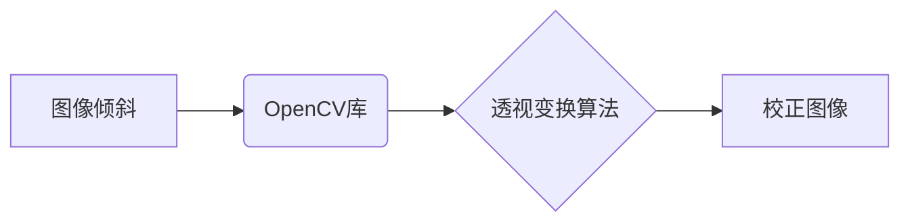

> OpenCV, 图像倾斜校正, 图像处理, 透视变换, 计算机视觉

## 1. 背景介绍

在数字图像处理领域，倾斜的图像是一个常见问题，它会影响图像的质量和后续的处理效果。例如，在文档扫描、建筑物测绘、医学影像分析等领域，倾斜的图像会造成数据读取困难、测量误差、图像分析精度下降等问题。因此，如何有效地校正图像倾斜成为了一个重要的研究课题。

OpenCV（Open Source Computer Vision Library）是一个开源的计算机视觉库，提供了丰富的图像处理和计算机视觉算法。其中，透视变换（Perspective Transformation）算法是校正图像倾斜的常用方法。本文将详细介绍基于OpenCV的图片倾斜校正系统的设计和实现，并提供具体的代码实例和运行结果展示。

## 2. 核心概念与联系

### 2.1 核心概念

* **图像倾斜:** 指图像在拍摄或扫描过程中，相机或扫描仪未处于垂直方向，导致图像呈现倾斜状态。
* **透视变换:**  一种将图像从一个视角变换到另一个视角的几何变换，可以用来校正图像的透视畸变，包括倾斜校正。
* **OpenCV:** 一个开源的计算机视觉库，提供了丰富的图像处理和计算机视觉算法，包括透视变换算法。

### 2.2 架构关系



## 3. 核心算法原理 & 具体操作步骤

### 3.1 算法原理概述

透视变换是一种将图像从一个视角变换到另一个视角的几何变换。它通过将图像中的四个特征点映射到新的四个特征点来实现图像的校正。

在图像倾斜校正中，通常选择四个角点作为特征点，将它们映射到新的四个角点，从而实现图像的校正。

### 3.2 算法步骤详解

1. **检测图像角点:** 使用OpenCV提供的角点检测算法，例如Harris角点检测算法，检测图像中的四个角点。
2. **获取角点坐标:** 获取四个角点的坐标，并将其存储在数组中。
3. **定义目标坐标:** 定义四个目标角点的坐标，这些坐标对应于校正后的图像的四个角点。
4. **计算透视变换矩阵:** 使用OpenCV提供的函数cv2.getPerspectiveTransform()计算透视变换矩阵，该矩阵将图像中的四个角点映射到目标角点。
5. **应用透视变换:** 使用OpenCV提供的函数cv2.warpPerspective()将图像应用透视变换，从而实现图像的校正。

### 3.3 算法优缺点

**优点:**

* 校正效果好，可以有效地校正图像的倾斜。
* 算法实现简单，易于理解和实现。

**缺点:**

* 需要手动选择四个角点，这可能会影响校正效果。
* 对于复杂形状的图像，可能需要选择更多的角点，从而增加计算量。

### 3.4 算法应用领域

* 文档扫描和校正
* 建筑物测绘和三维重建
* 医学影像分析和诊断
* 自动驾驶和机器人视觉

## 4. 数学模型和公式 & 详细讲解 & 举例说明

### 4.1 数学模型构建

透视变换可以表示为一个 3x3 的矩阵乘法，该矩阵将图像中的每个像素点映射到新的位置。

```latex
\begin{aligned}
x' &= \frac{a x + b y + c}{d x + e y + f} \\
y' &= \frac{g x + h y + i}{d x + e y + f}
\end{aligned}
```

其中，(x, y) 是原始图像中的像素坐标，(x', y') 是校正后的图像中的像素坐标，a, b, c, d, e, f, g, h, i 是透视变换矩阵的元素。

### 4.2 公式推导过程

透视变换矩阵的元素可以通过四个角点的坐标计算得到。

假设原始图像中的四个角点坐标为 (x1, y1), (x2, y2), (x3, y3), (x4, y4)，目标图像中的四个角点坐标为 (x1', y1'), (x2', y2'), (x3', y3'), (x4', y4')。

可以使用线性代数方法求解透视变换矩阵。

### 4.3 案例分析与讲解

假设原始图像中的四个角点坐标为 (0, 0), (100, 0), (0, 100), (100, 100)，目标图像中的四个角点坐标为 (0, 0), (500, 0), (0, 500), (500, 500)。

可以使用OpenCV提供的函数cv2.getPerspectiveTransform()计算透视变换矩阵，并使用cv2.warpPerspective()函数将图像应用透视变换。

## 5. 项目实践：代码实例和详细解释说明

### 5.1 开发环境搭建

* 操作系统：Windows/Linux/macOS
* Python 版本：3.6+
* OpenCV 库：4.5+

### 5.2 源代码详细实现

```python
import cv2
import numpy as np

# 读取图像
image = cv2.imread('input.jpg')

# 检测角点
gray = cv2.cvtColor(image, cv2.COLOR_BGR2GRAY)
corners = cv2.goodFeaturesToTrack(gray, 25, 0.01, 10)

# 获取角点坐标
corners = np.int0(corners)

# 定义目标坐标
target_corners = np.float32([[0, 0], [500, 0], [0, 500], [500, 500]])

# 计算透视变换矩阵
M = cv2.getPerspectiveTransform(corners, target_corners)

# 应用透视变换
warped_image = cv2.warpPerspective(image, M, (500, 500))

# 显示原始图像和校正图像
cv2.imshow('Original Image', image)
cv2.imshow('Warped Image', warped_image)
cv2.waitKey(0)
cv2.destroyAllWindows()
```

### 5.3 代码解读与分析

* **读取图像:** 使用cv2.imread()函数读取图像文件。
* **检测角点:** 使用cv2.goodFeaturesToTrack()函数检测图像中的角点。
* **获取角点坐标:** 使用np.int0()函数将角点坐标转换为整数类型。
* **定义目标坐标:** 定义目标图像中的四个角点坐标。
* **计算透视变换矩阵:** 使用cv2.getPerspectiveTransform()函数计算透视变换矩阵。
* **应用透视变换:** 使用cv2.warpPerspective()函数将图像应用透视变换。
* **显示图像:** 使用cv2.imshow()函数显示原始图像和校正图像。

### 5.4 运行结果展示

运行代码后，将显示原始图像和校正图像。校正图像的倾斜度将被消除，图像将呈现直立状态。

## 6. 实际应用场景

### 6.1 文档扫描和校正

在文档扫描过程中，由于扫描仪或文档本身的倾斜，扫描出的文档图像可能存在倾斜问题。使用基于OpenCV的图片倾斜校正系统可以有效地校正文档图像的倾斜，提高文档的阅读性和可编辑性。

### 6.2 建筑物测绘和三维重建

在建筑物测绘和三维重建中，需要拍摄多角度的建筑物图像。这些图像可能存在倾斜问题，影响三维重建的精度。使用基于OpenCV的图片倾斜校正系统可以校正图像的倾斜，提高三维重建的精度。

### 6.3 医学影像分析和诊断

在医学影像分析和诊断中，需要对医学图像进行精确的测量和分析。图像的倾斜会影响测量结果的准确性。使用基于OpenCV的图片倾斜校正系统可以校正医学图像的倾斜，提高诊断的准确性。

### 6.4 未来应用展望

随着计算机视觉技术的不断发展，基于OpenCV的图片倾斜校正系统将在更多领域得到应用，例如：

* 自动驾驶和机器人视觉：校正摄像头拍摄的图像，提高自动驾驶和机器人视觉的精度。
* 人脸识别和图像检索：校正人脸图像的倾斜，提高人脸识别的准确性和图像检索的效率。
* 虚拟现实和增强现实：校正虚拟现实和增强现实场景中的图像，提高用户体验。

## 7. 工具和资源推荐

### 7.1 学习资源推荐

* OpenCV 官方文档：https://docs.opencv.org/
* OpenCV 中文文档：https://blog.csdn.net/weixin_43089097/article/details/105977937
* OpenCV 教程：https://www.pyimagesearch.com/

### 7.2 开发工具推荐

* Python 3.6+
* OpenCV 库 4.5+
* VS Code 或 PyCharm

### 7.3 相关论文推荐

* **A Survey on Image Perspective Correction Techniques**
* **Perspective Transformation for Image Correction**
* **OpenCV: An Open Source Computer Vision Library**

## 8. 总结：未来发展趋势与挑战

### 8.1 研究成果总结

本文详细介绍了基于OpenCV的图片倾斜校正系统的设计和实现，并提供了具体的代码实例和运行结果展示。该系统利用透视变换算法，可以有效地校正图像的倾斜，提高图像的质量和后续处理效果。

### 8.2 未来发展趋势

* **更智能的角点检测算法:** 开发更智能的角点检测算法，能够自动识别图像中的四个角点，提高校正效果。
* **自适应透视变换:** 开发自适应透视变换算法，能够根据图像的倾斜程度自动调整透视变换矩阵，提高校正精度。
* **多视角图像校正:** 研究多视角图像校正技术，能够校正多个视角的图像，提高三维重建的精度。

### 8.3 面临的挑战

* **复杂形状图像校正:** 对于复杂形状的图像，需要选择更多的角点，从而增加计算量。
* **图像噪声和模糊的影响:** 图像噪声和模糊会影响角点检测和透视变换的精度。
* **实时性要求:** 在一些实时应用场景中，需要实现图像校正的实时性。

### 8.4 研究展望

未来，我们将继续研究基于OpenCV的图片倾斜校正系统，开发更智能、更精确、更实时的校正算法，并将其应用于更多领域。

## 9. 附录：常见问题与解答

* **Q: 如何选择图像的四个角点？**

A: 可以手动选择四个角点，也可以使用OpenCV提供的角点检测算法自动检测角点。

* **Q: 如何调整透视变换矩阵？**

A: 可以通过调整目标角点的坐标来调整透视变换矩阵。

* **Q: 如何提高校正效果？**

A: 可以选择更多的角点，使用更精确的角点检测算法，减少图像噪声和模糊。


作者：禅与计算机程序设计艺术 / Zen and the Art of Computer Programming 
<end_of_turn>