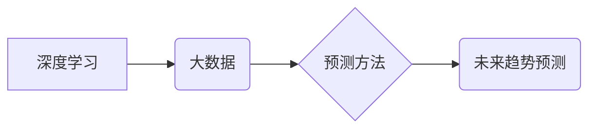

> 深度学习，大数据，预测方法，机器学习，神经网络，数据挖掘，时间序列分析

## 1. 背景介绍

随着信息技术的飞速发展，海量数据正在各个领域爆发式增长。如何有效地挖掘数据中的潜在价值，并将其转化为可行动的洞察力，成为当今社会面临的重大挑战。预测分析作为一种重要的数据挖掘技术，能够帮助我们预见未来趋势，做出更明智的决策。传统的预测方法，例如统计建模和回归分析，在处理复杂非线性关系时往往表现不足。而深度学习作为一种新型机器学习方法，凭借其强大的学习能力和非线性建模能力，在预测分析领域展现出巨大的潜力。

深度学习算法能够自动学习数据中的特征表示，并建立复杂的映射关系，从而实现对复杂现象的精准预测。近年来，深度学习在各个领域取得了显著的成果，例如图像识别、自然语言处理、语音识别等。在预测分析领域，深度学习也取得了令人瞩目的进展，例如股票价格预测、天气预报、客户行为预测等。

## 2. 核心概念与联系

**2.1 深度学习**

深度学习是一种基于人工神经网络的机器学习方法。它由多层神经元组成，每层神经元之间通过连接权重进行信息传递。通过训练，深度学习模型能够自动学习数据中的特征表示，并建立复杂的映射关系。

**2.2 大数据**

大数据是指海量、高速、多样化的数据。其特点是：

* **海量：** 数据量巨大，难以用传统方法处理。
* **高速：** 数据产生和更新速度快。
* **多样化：** 数据类型多种多样，包括结构化数据、非结构化数据和半结构化数据。

**2.3 预测方法**

预测方法是指利用历史数据预测未来趋势的技术。常见的预测方法包括：

* **统计建模：** 基于统计学原理，建立数学模型进行预测。
* **回归分析：** 建立线性或非线性回归模型，预测连续变量。
* **时间序列分析：** 分析时间序列数据，预测未来值。
* **机器学习：** 利用机器学习算法，从数据中学习预测模型。

**2.4 核心概念关系图**



## 3. 核心算法原理 & 具体操作步骤

### 3.1 算法原理概述

深度学习在预测分析中的核心算法主要包括：

* **多层感知机 (MLP)：** 是一种基本的深度学习模型，由多个全连接层组成。
* **卷积神经网络 (CNN)：** 擅长处理图像数据，能够自动学习图像特征。
* **循环神经网络 (RNN)：** 擅长处理序列数据，能够捕捉时间序列中的依赖关系。

这些算法通过训练，能够学习数据中的复杂模式和关系，从而实现对未来趋势的预测。

### 3.2 算法步骤详解

**3.2.1 数据预处理**

* 数据清洗：去除数据中的缺失值、异常值和重复数据。
* 数据转换：将数据转换为深度学习模型可以处理的格式。
* 数据特征工程：提取数据中的特征，并进行转换和编码。

**3.2.2 模型构建**

* 选择合适的深度学习模型，例如 MLP、CNN 或 RNN。
* 定义模型的结构，包括层数、神经元数量和激活函数。
* 初始化模型参数。

**3.2.3 模型训练**

* 使用训练数据训练模型，调整模型参数，使模型的预测性能达到最佳。
* 使用验证集评估模型的性能，并进行模型调参。

**3.2.4 模型评估**

* 使用测试集评估模型的性能，并计算模型的预测精度、召回率、F1-score 等指标。

**3.2.5 模型部署**

* 将训练好的模型部署到生产环境中，用于对新数据进行预测。

### 3.3 算法优缺点

**优点：**

* 能够处理复杂非线性关系。
* 自动学习数据特征，无需人工特征工程。
* 预测精度高。

**缺点：**

* 训练数据量大，训练时间长。
* 模型参数多，容易过拟合。
* 缺乏可解释性。

### 3.4 算法应用领域

* 股票价格预测
* 天气预报
* 客户行为预测
* 疾病诊断
* 欺诈检测

## 4. 数学模型和公式 & 详细讲解 & 举例说明

### 4.1 数学模型构建

深度学习模型的数学基础是神经网络。神经网络由多个层组成，每层包含多个神经元。每个神经元接收来自上一层的输入信号，并通过激活函数进行处理，输出到下一层。

**4.1.1 神经网络结构**

一个简单的多层感知机 (MLP) 可以表示为：

```
输入层 -> 隐藏层 -> 输出层
```

其中，输入层接收原始数据，隐藏层进行特征提取和学习，输出层输出预测结果。

**4.1.2 激活函数**

激活函数的作用是引入非线性，使神经网络能够学习复杂关系。常见的激活函数包括：

* **Sigmoid函数：** 将输入映射到 (0, 1) 之间。
* **ReLU函数：** 对输入进行线性变换，并对负值进行截断。
* **tanh函数：** 将输入映射到 (-1, 1) 之间。

**4.1.3 损失函数**

损失函数用于衡量模型预测结果与真实值的差异。常见的损失函数包括：

* **均方误差 (MSE)：** 计算预测值与真实值之间的平方差。
* **交叉熵损失 (Cross-Entropy Loss)：** 用于分类任务，计算预测概率分布与真实概率分布之间的差异。

### 4.2 公式推导过程

**4.2.1 前向传播**

前向传播是指将输入数据通过神经网络传递，得到预测结果的过程。

假设神经网络有 L 层，第 l 层有 N_l 个神经元，则前向传播过程可以表示为：

```
z_l = W_l * a_{l-1} + b_l
a_l = f(z_l)
```

其中：

* z_l 是第 l 层神经元的输入值。
* W_l 是第 l 层神经元的权重矩阵。
* a_{l-1} 是第 l-1 层神经元的输出值。
* b_l 是第 l 层神经元的偏置向量。
* f() 是激活函数。

**4.2.2 反向传播**

反向传播是指根据损失函数对模型参数进行更新的过程。

反向传播算法的核心思想是利用链式法则，计算每个参数对损失函数的梯度，并根据梯度进行参数更新。

### 4.3 案例分析与讲解

**4.3.1 股票价格预测**

可以使用深度学习模型预测股票价格。

* 数据：历史股票价格、交易量、新闻数据等。
* 模型：RNN 或 LSTM。
* 损失函数：MSE。

**4.3.2 天气预报**

可以使用深度学习模型预测天气状况。

* 数据：历史气象数据、卫星图像、雷达数据等。
* 模型：CNN 或 RNN。
* 损失函数：交叉熵损失。

## 5. 项目实践：代码实例和详细解释说明

### 5.1 开发环境搭建

* Python 3.x
* TensorFlow 或 PyTorch
* Jupyter Notebook

### 5.2 源代码详细实现

```python
import tensorflow as tf

# 定义模型
model = tf.keras.models.Sequential([
    tf.keras.layers.Dense(64, activation='relu', input_shape=(10,)),
    tf.keras.layers.Dense(32, activation='relu'),
    tf.keras.layers.Dense(1)
])

# 编译模型
model.compile(optimizer='adam', loss='mse')

# 训练模型
model.fit(X_train, y_train, epochs=100)

# 评估模型
loss = model.evaluate(X_test, y_test)
print('Loss:', loss)

# 预测
predictions = model.predict(X_new)
```

### 5.3 代码解读与分析

* **模型定义:** 使用 Keras API 定义一个简单的多层感知机模型。
* **模型编译:** 使用 Adam 优化器和均方误差损失函数编译模型。
* **模型训练:** 使用训练数据训练模型，设置训练轮数为 100。
* **模型评估:** 使用测试数据评估模型的性能，计算损失值。
* **模型预测:** 使用新数据预测结果。

### 5.4 运行结果展示

运行结果将显示模型的损失值和预测结果。

## 6. 实际应用场景

### 6.1 股票价格预测

深度学习模型可以分析历史股票价格、交易量、新闻数据等信息，预测未来股票价格走势。

### 6.2 天气预报

深度学习模型可以利用历史气象数据、卫星图像、雷达数据等信息，预测未来天气状况。

### 6.3 客户行为预测

深度学习模型可以分析客户的购买历史、浏览记录、社交行为等信息，预测客户未来的购买行为。

### 6.4 未来应用展望

深度学习在预测分析领域具有巨大的潜力，未来将应用于更多领域，例如：

* 疾病诊断
* 欺诈检测
* 交通流量预测
* 自然灾害预警

## 7. 工具和资源推荐

### 7.1 学习资源推荐

* **书籍:**
    * Deep Learning by Ian Goodfellow, Yoshua Bengio, and Aaron Courville
    * Hands-On Machine Learning with Scikit-Learn, Keras & TensorFlow by Aurélien Géron
* **在线课程:**
    * Coursera: Deep Learning Specialization
    * Udacity: Deep Learning Nanodegree

### 7.2 开发工具推荐

* **TensorFlow:** 开源深度学习框架
* **PyTorch:** 开源深度学习框架
* **Keras:** 高级深度学习API

### 7.3 相关论文推荐

* **AlexNet:** ImageNet Classification with Deep Convolutional Neural Networks
* **LSTM:** Long Short-Term Memory
* **BERT:** Pre-training of Deep Bidirectional Transformers for Language Understanding

## 8. 总结：未来发展趋势与挑战

### 8.1 研究成果总结

深度学习在预测分析领域取得了显著的成果，能够处理复杂非线性关系，并实现高精度预测。

### 8.2 未来发展趋势

* **模型更深更复杂:** 研究更深更复杂的深度学习模型，例如 Transformer、Generative Adversarial Networks (GANs)。
* **数据更丰富更多样:** 利用更多类型的数据，例如文本、图像、视频，进行预测分析。
* **解释性更强:** 研究更具解释性的深度学习模型，以便更好地理解模型的决策过程。

### 8.3 面临的挑战

* **数据质量:** 深度学习模型对数据质量要求很高，需要高质量、大规模的数据进行训练。
* **计算资源:** 训练深度学习模型需要大量的计算资源，例如 GPU。
* **可解释性:** 深度学习模型的决策过程往往难以解释，这限制了其在一些领域应用的推广。

### 8.4 研究展望

未来，深度学习在预测分析领域将继续发展，并应用于更多领域。研究者将继续探索更深更复杂的模型，利用更多类型的数据，并提高模型的可解释性。


## 9. 附录：常见问题与解答

**9.1 如何选择合适的深度学习模型？**

选择合适的深度学习模型取决于具体的预测任务和数据特点。例如，对于图像数据，CNN 是一种常用的选择；对于序列数据，RNN 或 LSTM 是一种常用的选择。

**9.2 如何处理缺失数据？**

常用的处理缺失数据的策略包括：删除缺失数据、用均值或中位数填充缺失数据、使用插值方法填充缺失数据。

**9.3 如何防止模型过拟合？**

