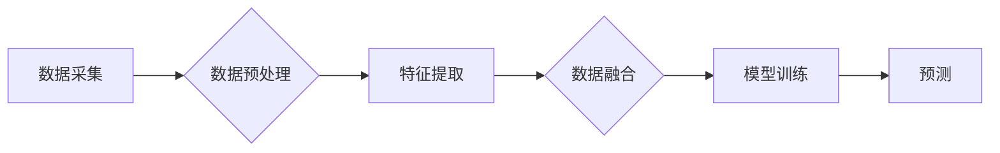

> 多模态AI、医疗诊断、深度学习、图像识别、自然语言处理、数据融合

## 1. 背景介绍

医疗诊断是临床实践的核心环节，准确的诊断对于患者的治疗和预后至关重要。传统医疗诊断主要依赖医生的经验和临床表现，但受限于医生的主观判断、经验不足和信息获取的局限性，有时难以做出准确的诊断。近年来，人工智能（AI）技术飞速发展，为医疗诊断领域带来了新的机遇。

多模态AI，即利用多种不同类型的数据（如图像、文本、音频等）进行分析和学习，在医疗诊断领域展现出巨大的潜力。多模态AI可以整合不同来源的信息，提供更全面的诊断依据，提高诊断的准确性和效率。

## 2. 核心概念与联系

**2.1 多模态AI的概念**

多模态AI是指利用多种不同类型的数据进行分析和学习的AI系统。这些数据类型可以包括图像、文本、音频、视频等。多模态AI系统能够理解和整合不同模态的信息，从而获得更深入的理解和洞察。

**2.2 多模态AI在医疗诊断中的应用**

在医疗诊断领域，多模态AI可以整合多种数据类型，例如：

* **图像数据:** X光片、CT扫描、MRI扫描等
* **文本数据:** 病历、医学报告、研究论文等
* **音频数据:** 患者的语音、心电图等

通过对这些数据进行分析和学习，多模态AI可以辅助医生进行以下诊断任务：

* **疾病识别:** 识别各种疾病，例如癌症、心血管疾病、神经系统疾病等
* **风险预测:** 预测患者患病的风险，例如糖尿病、心梗等
* **治疗方案推荐:** 根据患者的病情和特征，推荐合适的治疗方案

**2.3 多模态AI架构**

多模态AI系统通常由以下几个模块组成：

* **数据采集模块:** 收集来自不同来源的多模态数据
* **数据预处理模块:** 对收集到的数据进行清洗、转换和格式化
* **特征提取模块:** 从不同模态的数据中提取特征
* **数据融合模块:** 将不同模态的特征融合在一起
* **模型训练模块:** 利用融合后的特征训练机器学习模型
* **预测模块:** 利用训练好的模型对新的数据进行预测

**Mermaid 流程图**



## 3. 核心算法原理 & 具体操作步骤

**3.1 算法原理概述**

多模态AI在医疗诊断中的核心算法主要包括：

* **深度学习:** 深度学习算法能够自动学习数据中的特征，并进行复杂的模式识别。在多模态AI中，深度学习算法可以用于提取不同模态数据的特征，并进行融合。
* **迁移学习:** 迁移学习是指将预先训练好的模型应用于新的任务。在医疗诊断领域，可以利用在其他领域训练好的深度学习模型，将其迁移到医疗诊断任务中，提高模型的性能。
* **强化学习:** 强化学习是一种基于奖励机制的机器学习算法。在医疗诊断领域，可以利用强化学习算法训练模型，使其能够在诊断过程中不断学习和改进。

**3.2 算法步骤详解**

**步骤1：数据收集和预处理**

* 收集来自不同来源的多模态数据，例如图像、文本、音频等。
* 对收集到的数据进行清洗、转换和格式化，例如去除噪声、标准化数据等。

**步骤2：特征提取**

* 利用深度学习算法或其他特征提取方法，从不同模态的数据中提取特征。
* 例如，对于图像数据，可以使用卷积神经网络（CNN）提取特征；对于文本数据，可以使用循环神经网络（RNN）提取特征。

**步骤3：数据融合**

* 将不同模态的特征融合在一起，形成一个综合的特征向量。
* 数据融合方法有很多种，例如加权平均、拼接、注意力机制等。

**步骤4：模型训练**

* 利用融合后的特征向量，训练机器学习模型，例如支持向量机（SVM）、逻辑回归等。
* 可以使用迁移学习技术，将预先训练好的模型应用于新的任务，提高模型的性能。

**步骤5：模型评估和优化**

* 利用测试数据评估模型的性能，例如准确率、召回率、F1-score等。
* 根据评估结果，对模型进行优化，例如调整模型参数、增加训练数据等。

**3.3 算法优缺点**

**优点:**

* 可以整合多种数据类型，提供更全面的诊断依据。
* 能够自动学习数据中的特征，提高诊断的准确性和效率。
* 可以帮助医生更快地做出诊断，提高医疗服务的质量。

**缺点:**

* 需要大量的训练数据，数据标注成本较高。
* 模型的解释性较差，难以理解模型的决策过程。
* 存在数据偏差和算法偏见的问题，需要进行充分的测试和验证。

**3.4 算法应用领域**

多模态AI在医疗诊断领域具有广泛的应用前景，例如：

* **癌症诊断:** 利用图像、基因组数据等进行癌症的早期诊断和分级。
* **心血管疾病诊断:** 利用心电图、血压、影像数据等进行心血管疾病的诊断和风险评估。
* **神经系统疾病诊断:** 利用脑电图、磁共振成像等进行神经系统疾病的诊断和治疗方案推荐。

## 4. 数学模型和公式 & 详细讲解 & 举例说明

**4.1 数学模型构建**

多模态AI的数学模型通常基于深度学习框架，例如TensorFlow或PyTorch。模型的结构可以根据不同的任务和数据类型进行设计。

**4.2 公式推导过程**

深度学习模型的训练过程基于梯度下降算法，目标是最小化模型的损失函数。损失函数通常是预测值与真实值的差值，例如均方误差（MSE）或交叉熵损失（Cross-Entropy Loss）。

**4.3 案例分析与讲解**

例如，在图像和文本联合诊断疾病的任务中，可以构建一个多模态卷积神经网络（CNN-RNN）模型。

* CNN部分用于提取图像特征，RNN部分用于处理文本特征。
* 两个部分的特征通过注意力机制进行融合，最终输出疾病诊断结果。

**举例说明:**

假设我们有一个图像和文本数据对，图像表示患者的X光片，文本表示患者的病历信息。

* CNN提取图像特征，例如肿瘤的大小、形状等。
* RNN提取文本特征，例如患者的症状、病史等。
* 注意力机制根据图像和文本特征的关联性，赋予不同的权重，最终融合特征进行疾病诊断。

## 5. 项目实践：代码实例和详细解释说明

**5.1 开发环境搭建**

* 操作系统：Ubuntu 20.04
* Python版本：3.8
* 深度学习框架：TensorFlow 2.0

**5.2 源代码详细实现**

```python
import tensorflow as tf

# 定义CNN模型
def build_cnn_model():
    model = tf.keras.models.Sequential([
        tf.keras.layers.Conv2D(32, (3, 3), activation='relu', input_shape=(224, 224, 3)),
        tf.keras.layers.MaxPooling2D((2, 2)),
        tf.keras.layers.Conv2D(64, (3, 3), activation='relu'),
        tf.keras.layers.MaxPooling2D((2, 2)),
        tf.keras.layers.Flatten(),
        tf.keras.layers.Dense(128, activation='relu'),
        tf.keras.layers.Dense(1, activation='sigmoid')
    ])
    return model

# 定义RNN模型
def build_rnn_model():
    model = tf.keras.models.Sequential([
        tf.keras.layers.Embedding(10000, 128),
        tf.keras.layers.LSTM(128),
        tf.keras.layers.Dense(1, activation='sigmoid')
    ])
    return model

# 构建多模态模型
def build_multimodal_model():
    cnn_model = build_cnn_model()
    rnn_model = build_rnn_model()
    # ... 融合CNN和RNN模型的输出 ...
    return multimodal_model

# 训练模型
multimodal_model = build_multimodal_model()
multimodal_model.compile(optimizer='adam', loss='binary_crossentropy', metrics=['accuracy'])
multimodal_model.fit(x_train, y_train, epochs=10)

```

**5.3 代码解读与分析**

* 代码首先定义了CNN和RNN模型的构建函数。
* 然后，构建了多模态模型，将CNN和RNN模型的输出进行融合。
* 最后，使用Adam优化器和二分类交叉熵损失函数训练模型。

**5.4 运行结果展示**

训练完成后，可以利用测试数据评估模型的性能，例如准确率、召回率、F1-score等。

## 6. 实际应用场景

**6.1 医疗影像诊断**

多模态AI可以辅助医生诊断各种疾病，例如癌症、心血管疾病、神经系统疾病等。

* 例如，可以利用X光片、CT扫描、MRI扫描等影像数据，结合患者的病历信息，进行疾病的早期诊断和分级。

**6.2 疾病风险预测**

多模态AI可以根据患者的个人信息、生活习惯、病史等数据，预测患者患病的风险。

* 例如，可以利用患者的基因组数据、生活习惯数据、家族病史等信息，预测患者患糖尿病、心梗等疾病的风险。

**6.3 个性化治疗方案推荐**

多模态AI可以根据患者的病情和特征，推荐合适的治疗方案。

* 例如，可以利用患者的基因组数据、影像数据、临床表现等信息，推荐个性化的癌症治疗方案。

**6.4 未来应用展望**

多模态AI在医疗诊断领域具有巨大的潜力，未来将有更多应用场景出现，例如：

* **远程医疗诊断:** 利用多模态AI，医生可以远程诊断患者的病情，提高医疗服务的覆盖范围。
* **辅助手术:** 利用多模态AI，医生可以获得更清晰的患者内部结构信息，提高手术的精准度和安全性。
* **药物研发:** 利用多模态AI，可以加速药物研发过程，开发出更有效的药物。

## 7. 工具和资源推荐

**7.1 学习资源推荐**

* **书籍:**
    * Deep Learning by Ian Goodfellow, Yoshua Bengio, and Aaron Courville
    * Hands-On Machine Learning with Scikit-Learn, Keras & TensorFlow by Aurélien Géron
* **在线课程:**
    * TensorFlow官方教程: https://www.tensorflow.org/tutorials
    * Coursera深度学习课程: https://www.coursera.org/specializations/deep-learning

**7.2 开发工具推荐**

* **深度学习框架:** TensorFlow, PyTorch, Keras
* **数据处理工具:** Pandas, NumPy
* **可视化工具:** Matplotlib, Seaborn

**7.3 相关论文推荐**

* **多模态学习综述:**
    * Multimodal Learning: A Survey by Xiaolong Wang et al.
* **多模态AI在医疗诊断中的应用:**
    * Multimodal Deep Learning for Medical Image Analysis by Jianming Liang et al.

## 8. 总结：未来发展趋势与挑战

**8.1 研究成果总结**

近年来，多模态AI在医疗诊断领域取得了显著的进展，例如：

* 提高了疾病诊断的准确性和效率
* 辅助医生做出更精准的治疗方案
* 推动了远程医疗和个性化医疗的发展

**8.2 未来发展趋势**

* **模型复杂度提升:** 未来将开发更复杂、更强大的多模态AI模型，能够