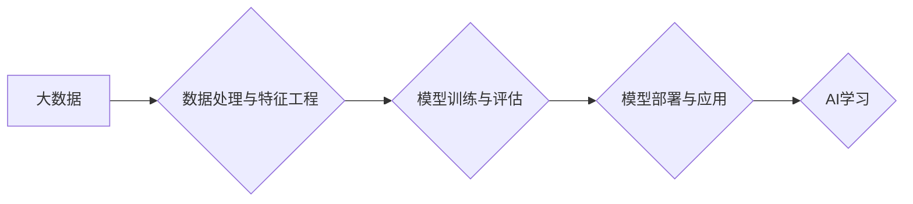

> 大数据、人工智能、机器学习、深度学习、数据驱动、算法优化、未来趋势

## 1. 背景介绍

人工智能（AI）正以惊人的速度发展，其核心驱动力之一是大数据。随着互联网、物联网和移动技术的蓬勃发展，海量数据正在以指数级增长。这些数据蕴藏着丰富的知识和模式，为AI学习提供了宝贵的燃料。大数据驱动AI学习，使得AI模型能够从海量数据中学习，不断提升其性能和智能水平。

传统的AI学习方法依赖于人工特征工程，需要专家手动提取数据的特征，这不仅耗时费力，而且难以捕捉数据的复杂关系。而大数据驱动AI学习则通过机器学习和深度学习算法，自动从数据中学习特征，从而实现更精准、更智能的决策和预测。

## 2. 核心概念与联系

**2.1 大数据**

大数据是指规模庞大、结构复杂、速度快、多样化的数据。其特征通常被总结为“五V”：

* **Volume（体积）**: 数据量巨大，难以用传统方法处理。
* **Velocity（速度）**: 数据生成和更新速度快，需要实时处理。
* **Variety（多样性）**: 数据类型多样，包括结构化数据、非结构化数据和半结构化数据。
* **Veracity（真实性）**: 数据质量参差不齐，需要进行清洗和验证。
* **Value（价值）**: 数据蕴藏着潜在的价值，需要进行挖掘和分析。

**2.2 人工智能**

人工智能是指模拟人类智能的计算机系统。其目标是使机器能够像人类一样学习、推理、解决问题和做出决策。

**2.3 机器学习**

机器学习是人工智能的一个子领域，它通过算法使计算机能够从数据中学习，无需明确编程。机器学习算法可以分为监督学习、无监督学习和强化学习三种类型。

**2.4 深度学习**

深度学习是机器学习的一个子领域，它使用多层神经网络来模拟人类大脑的学习过程。深度学习算法能够从复杂的数据中学习更深层次的特征，从而实现更精准的预测和识别。

**2.5 数据驱动AI学习**

数据驱动AI学习是指利用大数据来训练和优化AI模型。通过海量数据的训练，AI模型能够学习到更复杂的模式和规律，从而提高其性能和智能水平。

**2.6 数据处理与特征工程**

在数据驱动AI学习中，数据处理和特征工程是至关重要的步骤。数据处理包括数据清洗、数据转换和数据整合等操作，目的是确保数据的质量和一致性。特征工程则是指从原始数据中提取有用的特征，这些特征可以用于训练AI模型。

**2.7 模型训练与评估**

模型训练是指使用训练数据来训练AI模型，使其能够学习到数据的模式和规律。模型评估则是指使用测试数据来评估模型的性能，例如准确率、召回率和F1-score等指标。

**2.8 模型部署与应用**

模型部署是指将训练好的AI模型部署到实际应用环境中，例如云平台、边缘设备或嵌入式系统。模型应用是指利用部署的AI模型进行预测、识别、决策等任务。

**Mermaid 流程图**



## 3. 核心算法原理 & 具体操作步骤

### 3.1 算法原理概述

深度学习算法的核心是多层神经网络。神经网络由多个层组成，每层包含多个神经元。神经元之间通过连接进行信息传递，每个连接都有一个权重。通过训练，神经网络可以调整权重，从而学习到数据的模式和规律。

深度学习算法的优势在于：

* **自动特征提取**: 深度学习算法能够自动从数据中学习特征，无需人工特征工程。
* **学习复杂模式**: 深度学习算法能够学习到复杂的数据模式，例如图像、文本和语音等。
* **高准确率**: 深度学习算法在许多任务中都取得了很高的准确率。

### 3.2 算法步骤详解

1. **数据预处理**: 将原始数据进行清洗、转换和整合，使其适合深度学习算法的训练。
2. **网络结构设计**: 根据任务需求设计神经网络的结构，包括层数、神经元数量和激活函数等。
3. **参数初始化**: 为神经网络的参数（权重和偏置）进行随机初始化。
4. **前向传播**: 将输入数据通过神经网络进行前向传播，得到输出结果。
5. **损失函数计算**: 计算模型输出与真实值的差异，即损失函数的值。
6. **反向传播**: 根据损失函数的梯度，反向传播误差，更新神经网络的参数。
7. **迭代训练**: 重复步骤4-6，直到模型性能达到预期的水平。
8. **模型评估**: 使用测试数据评估模型的性能，例如准确率、召回率和F1-score等指标。
9. **模型部署**: 将训练好的模型部署到实际应用环境中。

### 3.3 算法优缺点

**优点**:

* 自动特征提取
* 学习复杂模式
* 高准确率

**缺点**:

* 训练时间长
* 计算资源消耗大
* 数据依赖性强

### 3.4 算法应用领域

深度学习算法在许多领域都有广泛的应用，例如：

* **计算机视觉**: 图像识别、物体检测、图像分割
* **自然语言处理**: 文本分类、情感分析、机器翻译
* **语音识别**: 语音转文本、语音合成
* **推荐系统**: 商品推荐、内容推荐
* **医疗诊断**: 病情预测、疾病诊断

## 4. 数学模型和公式 & 详细讲解 & 举例说明

### 4.1 数学模型构建

深度学习模型的数学基础是神经网络。神经网络由多个层组成，每层包含多个神经元。每个神经元接收来自上一层的输入信号，并通过激活函数进行处理，输出到下一层。

**神经元模型**:

$$
y = f(w^T x + b)
$$

其中：

* $y$ 是神经元的输出
* $x$ 是输入向量
* $w$ 是权重向量
* $b$ 是偏置
* $f$ 是激活函数

**激活函数**:

激活函数的作用是将神经元的输入映射到输出，并引入非线性。常用的激活函数包括：

* **Sigmoid函数**:

$$
f(x) = \frac{1}{1 + e^{-x}}
$$

* **ReLU函数**:

$$
f(x) = max(0, x)
$$

* **tanh函数**:

$$
f(x) = \frac{e^x - e^{-x}}{e^x + e^{-x}}
$$

### 4.2 公式推导过程

深度学习模型的训练过程是通过优化损失函数来实现的。损失函数衡量模型预测结果与真实值的差异。常用的损失函数包括：

* **均方误差 (MSE)**:

$$
L = \frac{1}{n} \sum_{i=1}^{n} (y_i - \hat{y}_i)^2
$$

其中：

* $L$ 是损失函数值
* $n$ 是样本数量
* $y_i$ 是真实值
* $\hat{y}_i$ 是模型预测值

* **交叉熵损失 (Cross-Entropy Loss)**:

$$
L = - \sum_{i=1}^{n} y_i \log(\hat{y}_i) + (1 - y_i) \log(1 - \hat{y}_i)
$$

其中：

* $L$ 是损失函数值
* $n$ 是样本数量
* $y_i$ 是真实值
* $\hat{y}_i$ 是模型预测值

通过梯度下降算法，可以更新模型参数，使得损失函数值最小化。

### 4.3 案例分析与讲解

**图像分类**:

假设我们有一个图像分类任务，目标是将图像分类为不同的类别，例如猫、狗、鸟等。我们可以使用卷积神经网络 (CNN) 来解决这个问题。CNN 是一种专门用于处理图像数据的深度学习算法。

CNN 的结构包括卷积层、池化层和全连接层。卷积层使用卷积核来提取图像特征，池化层用来降低特征图的维度，全连接层用来进行分类。

训练 CNN 模型时，我们需要使用大量的图像数据，并将其标记为不同的类别。然后，我们可以使用梯度下降算法来优化模型参数，使得模型能够准确地将图像分类为不同的类别。

## 5. 项目实践：代码实例和详细解释说明

### 5.1 开发环境搭建

* **操作系统**: Ubuntu 18.04
* **编程语言**: Python 3.6
* **深度学习框架**: TensorFlow 2.0
* **其他工具**: Jupyter Notebook

### 5.2 源代码详细实现

```python
import tensorflow as tf

# 定义模型结构
model = tf.keras.models.Sequential([
    tf.keras.layers.Conv2D(32, (3, 3), activation='relu', input_shape=(28, 28, 1)),
    tf.keras.layers.MaxPooling2D((2, 2)),
    tf.keras.layers.Conv2D(64, (3, 3), activation='relu'),
    tf.keras.layers.MaxPooling2D((2, 2)),
    tf.keras.layers.Flatten(),
    tf.keras.layers.Dense(10, activation='softmax')
])

# 编译模型
model.compile(optimizer='adam',
              loss='sparse_categorical_crossentropy',
              metrics=['accuracy'])

# 加载数据集
(x_train, y_train), (x_test, y_test) = tf.keras.datasets.mnist.load_data()

# 数据预处理
x_train = x_train.astype('float32') / 255.0
x_test = x_test.astype('float32') / 255.0
x_train = x_train.reshape((x_train.shape[0], 28, 28, 1))
x_test = x_test.reshape((x_test.shape[0], 28, 28, 1))

# 训练模型
model.fit(x_train, y_train, epochs=5)

# 评估模型
loss, accuracy = model.evaluate(x_test, y_test)
print('Test loss:', loss)
print('Test accuracy:', accuracy)
```

### 5.3 代码解读与分析

这段代码实现了使用 TensorFlow 框架训练一个简单的卷积神经网络来进行手写数字识别。

* **模型结构**: 代码定义了一个简单的 CNN 模型，包括两个卷积层、两个池化层和一个全连接层。
* **模型编译**: 代码使用 Adam 优化器、交叉熵损失函数和准确率作为评估指标来编译模型。
* **数据加载**: 代码使用 MNIST 数据集来训练和评估模型。
* **数据预处理**: 代码将图像数据转换为浮点数，并将其reshape成适合 CNN 模型的格式。
* **模型训练**: 代码使用 `model.fit()` 函数训练模型，训练 epochs 为 5。
* **模型评估**: 代码使用 `model.evaluate()` 函数评估模型在测试集上的性能。

### 5.4 运行结果展示

运行这段代码后，会输出模型在测试集上的损失值和准确率。通常情况下，训练好的模型的准确率可以达到 98% 以上。

## 6. 实际应用场景

### 6.1 医疗诊断

深度学习算法可以用于辅助医生进行疾病诊断，例如：

* **图像分析**: 使用 CNN 分析医学影像，例如 X 光片、CT 扫描和 MRI 图像，识别肿瘤、骨折和其他异常。
* **病历分析**: 使用自然语言处理 (NLP) 分析病历文本，识别疾病症状、诊断和治疗方案。

### 6.2 金融风险管理

深度学习算法可以用于识别金融