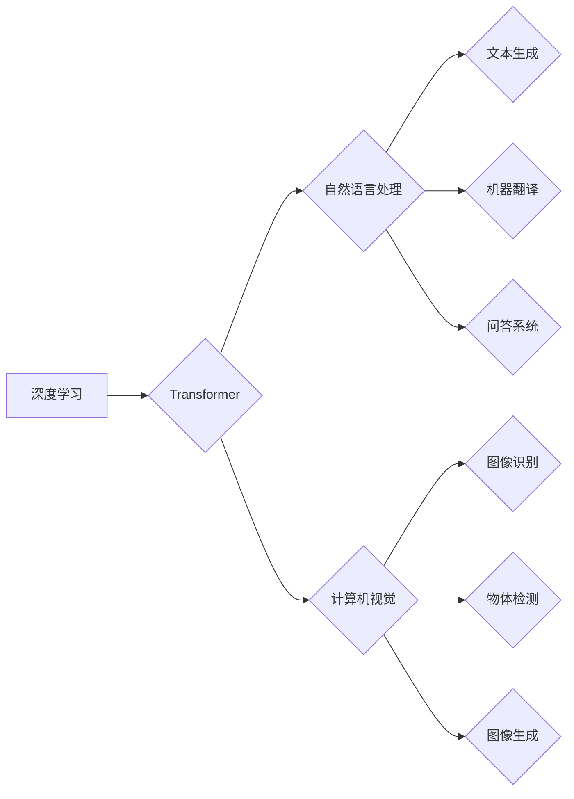

> 大模型、深度学习、Transformer、自然语言处理、计算机视觉、市场推广、商业应用

## 1. 背景介绍

近年来，人工智能（AI）技术取得了飞速发展，其中大模型作为AI领域的重要突破口，展现出强大的学习和推理能力，在自然语言处理、计算机视觉、语音识别等领域取得了显著成果。大模型的出现，标志着人工智能进入了一个新的时代，其技术创新和市场推广将深刻地影响着我们的生活和工作。

大模型是指参数规模庞大、训练数据海量的人工智能模型。与传统机器学习模型相比，大模型拥有更强的泛化能力和学习能力，能够处理更复杂的任务，并生成更精细的结果。例如，GPT-3、BERT、DALL-E等大模型在文本生成、机器翻译、图像识别等领域取得了突破性的进展，展现出其强大的应用潜力。

## 2. 核心概念与联系

大模型的构建和应用涉及到多个核心概念和技术，包括深度学习、Transformer、自然语言处理、计算机视觉等。

**2.1 深度学习**

深度学习是机器学习的一个分支，它利用多层神经网络来模拟人类大脑的学习过程。深度学习模型能够从海量数据中自动提取特征，并进行复杂的模式识别和预测。

**2.2 Transformer**

Transformer是一种新型的神经网络架构，它能够有效地处理序列数据，例如文本和语音。Transformer的核心是注意力机制，它能够学习到输入序列中不同元素之间的关系，从而更好地理解上下文信息。

**2.3 自然语言处理 (NLP)**

自然语言处理是指让计算机能够理解、处理和生成人类语言的技术。大模型在NLP领域取得了显著进展，例如文本生成、机器翻译、问答系统等。

**2.4 计算机视觉 (CV)**

计算机视觉是指让计算机能够“看”和理解图像的技术。大模型在CV领域也取得了突破，例如图像识别、物体检测、图像生成等。

**2.5 大模型架构**



## 3. 核心算法原理 & 具体操作步骤

### 3.1 算法原理概述

大模型的训练主要基于深度学习算法，特别是Transformer架构。其核心原理是通过多层神经网络，学习输入数据之间的关系和模式，从而实现对数据的理解和预测。

### 3.2 算法步骤详解

1. **数据预处理:** 将原始数据进行清洗、格式化和编码，使其能够被模型理解。
2. **模型构建:** 根据任务需求，选择合适的Transformer架构，并设置模型参数，例如层数、隐藏单元数等。
3. **模型训练:** 使用训练数据，通过反向传播算法，调整模型参数，使其能够准确地预测输出结果。
4. **模型评估:** 使用测试数据，评估模型的性能，例如准确率、召回率等。
5. **模型部署:** 将训练好的模型部署到实际应用场景中，用于进行预测或生成。

### 3.3 算法优缺点

**优点:**

* 强大的泛化能力：大模型能够从海量数据中学习到更丰富的知识，并应用于不同的任务。
* 高的准确率：大模型在许多任务中都取得了比传统模型更高的准确率。
* 灵活的应用场景：大模型可以应用于各种领域，例如自然语言处理、计算机视觉、语音识别等。

**缺点:**

* 训练成本高：大模型的训练需要大量的计算资源和时间。
* 参数量大：大模型的参数量庞大，需要大量的存储空间。
* 可解释性差：大模型的决策过程较为复杂，难以解释其背后的逻辑。

### 3.4 算法应用领域

大模型在以下领域具有广泛的应用前景：

* **自然语言处理:** 文本生成、机器翻译、问答系统、情感分析、文本摘要等。
* **计算机视觉:** 图像识别、物体检测、图像分割、图像生成等。
* **语音识别:** 语音转文本、语音合成、语音助手等。
* **推荐系统:** 商品推荐、内容推荐、用户画像等。
* **医疗保健:** 疾病诊断、药物研发、医疗影像分析等。

## 4. 数学模型和公式 & 详细讲解 & 举例说明

### 4.1 数学模型构建

大模型的训练基于深度学习算法，其数学模型主要包括以下几个方面：

* **神经网络:** 神经网络由多个层组成，每层包含多个神经元。神经元之间通过权重连接，并使用激活函数进行非线性变换。
* **损失函数:** 损失函数用于衡量模型预测结果与真实值的差异。常用的损失函数包括均方误差、交叉熵等。
* **优化算法:** 优化算法用于调整模型参数，使其能够最小化损失函数。常用的优化算法包括梯度下降、Adam等。

### 4.2 公式推导过程

**4.2.1 激活函数**

常用的激活函数包括ReLU、Sigmoid、Tanh等。

* **ReLU (Rectified Linear Unit):**

$$
f(x) = max(0, x)
$$

* **Sigmoid:**

$$
f(x) = \frac{1}{1 + e^{-x}}
$$

* **Tanh (Hyperbolic tangent):**

$$
f(x) = \frac{e^x - e^{-x}}{e^x + e^{-x}}
$$

**4.2.2 损失函数**

**均方误差 (MSE):**

$$
Loss = \frac{1}{n} \sum_{i=1}^{n} (y_i - \hat{y}_i)^2
$$

其中，$y_i$ 是真实值，$\hat{y}_i$ 是模型预测值，$n$ 是样本数量。

**交叉熵 (Cross-entropy):**

$$
Loss = - \sum_{i=1}^{n} y_i \log(\hat{y}_i)
$$

其中，$y_i$ 是真实值，$\hat{y}_i$ 是模型预测值。

**4.2.3 梯度下降**

梯度下降算法用于更新模型参数，使其能够最小化损失函数。

$$
\theta = \theta - \alpha \nabla Loss(\theta)
$$

其中，$\theta$ 是模型参数，$\alpha$ 是学习率，$\nabla Loss(\theta)$ 是损失函数对参数的梯度。

### 4.3 案例分析与讲解

**4.3.1 文本生成**

GPT-3 是一种基于 Transformer 架构的大语言模型，能够生成流畅、连贯的文本。

**4.3.2 图像识别**

DALL-E 是一种基于 Transformer 架构的大模型，能够根据文本描述生成图像。

## 5. 项目实践：代码实例和详细解释说明

### 5.1 开发环境搭建

* **操作系统:** Linux/macOS
* **编程语言:** Python
* **深度学习框架:** TensorFlow/PyTorch
* **其他工具:** Git、Jupyter Notebook

### 5.2 源代码详细实现

```python
# 使用 TensorFlow 构建一个简单的 Transformer 模型
import tensorflow as tf

# 定义 Transformer 的编码器层
class EncoderLayer(tf.keras.layers.Layer):
    def __init__(self, d_model, num_heads, dff, rate=0.1):
        super(EncoderLayer, self).__init__()
        self.mha = tf.keras.layers.MultiHeadAttention(num_heads=num_heads, key_dim=d_model)
        self.ffn = tf.keras.layers.Dense(dff, activation="relu")
        self.layernorm1 = tf.keras.layers.LayerNormalization(epsilon=1e-6)
        self.layernorm2 = tf.keras.layers.LayerNormalization(epsilon=1e-6)
        self.dropout1 = tf.keras.layers.Dropout(rate)
        self.dropout2 = tf.keras.layers.Dropout(rate)

    def call(self, x, training):
        attn_output = self.mha(x, x, x)
        attn_output = self.dropout1(attn_output, training=training)
        out1 = self.layernorm1(x + attn_output)
        ffn_output = self.ffn(out1)
        ffn_output = self.dropout2(ffn_output, training=training)
        out2 = self.layernorm2(out1 + ffn_output)
        return out2

# 定义 Transformer 的解码器层
class DecoderLayer(tf.keras.layers.Layer):
    def __init__(self, d_model, num_heads, dff, rate=0.1):
        super(DecoderLayer, self).__init__()
        self.mha1 = tf.keras.layers.MultiHeadAttention(num_heads=num_heads, key_dim=d_model)
        self.mha2 = tf.keras.layers.MultiHeadAttention(num_heads=num_heads, key_dim=d_model)
        self.ffn = tf.keras.layers.Dense(dff, activation="relu")
        self.layernorm1 = tf.keras.layers.LayerNormalization(epsilon=1e-6)
        self.layernorm2 = tf.keras.layers.LayerNormalization(epsilon=1e-6)
        self.layernorm3 = tf.keras.layers.LayerNormalization(epsilon=1e-6)
        self.dropout1 = tf.keras.layers.Dropout(rate)
        self.dropout2 = tf.keras.layers.Dropout(rate)
        self.dropout3 = tf.keras.layers.Dropout(rate)

    def call(self, x, encoder_output, training):
        attn1_output = self.mha1(x, x, x)
        attn1_output = self.dropout1(attn1_output, training=training)
        out1 = self.layernorm1(x + attn1_output)
        attn2_output = self.mha2(out1, encoder_output, encoder_output)
        attn2_output = self.dropout2(attn2_output, training=training)
        out2 = self.layernorm2(out1 + attn2_output)
        ffn_output = self.ffn(out2)
        ffn_output = self.dropout3(ffn_output, training=training)
        out3 = self.layernorm3(out2 + ffn_output)
        return out3

# 定义 Transformer 模型
class Transformer(tf.keras.Model):
    def __init__(self, vocab_size, d_model, num_layers, num_heads, dff, rate=0.1):
        super(Transformer, self).__init__()
        self.embedding = tf.keras.layers.Embedding(vocab_size, d_model)
        self.encoder = tf.keras.Sequential([
            EncoderLayer(d_model, num_heads, dff, rate) for _ in range(num_layers)
        ])
        self.decoder = tf.keras.Sequential([
            DecoderLayer(d_model, num_heads, dff, rate) for _ in range(num_layers)
        ])
        self.fc_out = tf.keras.layers.Dense(vocab_size)

    def call(self, encoder_input, decoder_input, training):
        encoder_output = self.encoder(self.embedding(encoder_input), training=training)
        decoder_output = self.decoder(self.embedding(decoder_input), encoder_output, training=training)
        output = self.fc_out(decoder_output)
        return output

# 实例化模型
model = Transformer(vocab_size=1