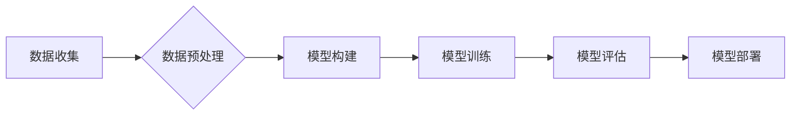

> 大模型、深度学习、Transformer、自然语言处理、计算机视觉、生成式AI、应用场景、伦理问题

## 1. 背景介绍

近年来，人工智能（AI）技术取得了飞速发展，其中大模型作为AI领域的重要突破口，展现出强大的学习和推理能力，在自然语言处理、计算机视觉、语音识别等领域取得了令人瞩目的成果。大模型的出现，标志着人工智能进入了一个新的时代，其广泛的应用场景和潜在的价值，引发了学术界和产业界的广泛关注。

大模型是指参数规模庞大、训练数据海量的人工智能模型。与传统的小型模型相比，大模型拥有更强的泛化能力和表达能力，能够处理更复杂的任务，并生成更精细的结果。例如，GPT-3、BERT、DALL-E 2 等大模型在文本生成、机器翻译、图像识别等领域取得了突破性的进展，展现出强大的应用潜力。

## 2. 核心概念与联系

大模型的训练和应用依赖于深度学习技术，特别是Transformer架构的革新。

**2.1 Transformer 架构**

Transformer是一种新型的神经网络架构，其核心特点是利用自注意力机制（Self-Attention）来捕捉序列数据中的长距离依赖关系。传统的循环神经网络（RNN）在处理长序列数据时容易出现梯度消失或爆炸的问题，而Transformer通过自注意力机制可以有效解决这个问题，并实现更有效的序列建模。

**2.2  大模型训练流程**

大模型的训练是一个复杂的过程，通常包括以下步骤：

1. **数据收集和预处理:** 收集海量文本、图像、音频等数据，并进行清洗、格式化等预处理工作。
2. **模型构建:** 根据任务需求选择合适的模型架构，例如Transformer、BERT等。
3. **模型训练:** 使用训练数据训练模型，并通过优化算法调整模型参数，使模型的预测性能达到最佳。
4. **模型评估:** 使用测试数据评估模型的性能，并根据评估结果进行模型调优。
5. **模型部署:** 将训练好的模型部署到实际应用场景中，并进行持续监控和维护。

**2.3  大模型应用场景**

大模型在各个领域都有广泛的应用场景，例如：

* **自然语言处理:** 文本生成、机器翻译、问答系统、情感分析等。
* **计算机视觉:** 图像识别、物体检测、图像分割、图像生成等。
* **语音识别:** 语音转文本、语音合成、语音助手等。
* **推荐系统:** 商品推荐、内容推荐、用户画像等。
* **药物研发:** 药物发现、药物设计、药物安全性评估等。

**2.4  Mermaid 流程图**



## 3. 核心算法原理 & 具体操作步骤

### 3.1  算法原理概述

大模型的核心算法是深度学习，特别是Transformer架构。Transformer通过自注意力机制，可以有效地捕捉序列数据中的长距离依赖关系，从而实现更有效的序列建模。

### 3.2  算法步骤详解

1. **输入嵌入:** 将输入序列（例如文本、图像）转换为向量表示。
2. **多头自注意力:** 使用多头自注意力机制，计算每个词与所有其他词之间的注意力权重，从而捕捉序列中的长距离依赖关系。
3. **前馈神经网络:** 对每个词的注意力输出进行非线性变换，进一步提取特征。
4. **位置编码:** 添加位置信息，使模型能够理解词语在序列中的位置关系。
5. **输出层:** 将模型的输出向量转换为最终的预测结果（例如文本、图像）。

### 3.3  算法优缺点

**优点:**

* 强大的泛化能力和表达能力
* 可以处理长序列数据
* 能够捕捉序列中的长距离依赖关系

**缺点:**

* 训练成本高
* 参数量大，需要大量的计算资源
* 容易受到训练数据质量的影响

### 3.4  算法应用领域

* 自然语言处理
* 计算机视觉
* 语音识别
* 推荐系统
* 药物研发

## 4. 数学模型和公式 & 详细讲解 & 举例说明

### 4.1  数学模型构建

大模型的数学模型通常基于深度神经网络，其核心是多层感知机（MLP）和自注意力机制。

**4.1.1  多层感知机（MLP）**

MLP由多个全连接层组成，每个层都有多个神经元。每个神经元接收来自上一层的输出，并通过激活函数进行非线性变换，输出到下一层。

**4.1.2  自注意力机制**

自注意力机制允许模型关注输入序列中的不同部分，并计算每个词与所有其他词之间的注意力权重。

**4.1.3  Transformer 架构**

Transformer架构由多个编码器和解码器组成。编码器负责将输入序列编码为隐藏状态，解码器则根据隐藏状态生成输出序列。

### 4.2  公式推导过程

**4.2.1  注意力权重计算**

注意力权重计算公式如下：

$$
\text{Attention}(Q, K, V) = \text{softmax}\left(\frac{Q K^T}{\sqrt{d_k}}\right) V
$$

其中：

* $Q$：查询矩阵
* $K$：键矩阵
* $V$：值矩阵
* $d_k$：键向量的维度
* $\text{softmax}$：softmax函数

**4.2.2  多头自注意力**

多头自注意力机制使用多个注意力头，每个头计算不同的注意力权重。最终的输出是所有注意力头的输出进行线性组合。

### 4.3  案例分析与讲解

**4.3.1  文本生成**

GPT-3是一个基于Transformer架构的大语言模型，能够生成高质量的文本。例如，可以根据给定的提示生成故事、诗歌、代码等。

**4.3.2  图像识别**

DALL-E 2是一个基于Transformer架构的图像生成模型，能够根据文本描述生成逼真的图像。例如，可以根据文本描述“一只戴着帽子的小狗”生成相应的图像。

## 5. 项目实践：代码实例和详细解释说明

### 5.1  开发环境搭建

* Python 3.7+
* TensorFlow 或 PyTorch
* CUDA 和 cuDNN

### 5.2  源代码详细实现

```python
# 使用 TensorFlow 实现一个简单的 Transformer 模型

import tensorflow as tf

# 定义编码器层
class EncoderLayer(tf.keras.layers.Layer):
    def __init__(self, d_model, num_heads, dff, rate=0.1):
        super(EncoderLayer, self).__init__()
        self.mha = tf.keras.layers.MultiHeadAttention(num_heads=num_heads, key_dim=d_model)
        self.ffn = tf.keras.layers.Dense(dff, activation="relu")
        self.layernorm1 = tf.keras.layers.LayerNormalization(epsilon=1e-6)
        self.layernorm2 = tf.keras.layers.LayerNormalization(epsilon=1e-6)
        self.dropout1 = tf.keras.layers.Dropout(rate)
        self.dropout2 = tf.keras.layers.Dropout(rate)

    def call(self, x, training):
        attn_output = self.mha(x, x, x)
        attn_output = self.dropout1(attn_output, training=training)
        out1 = self.layernorm1(x + attn_output)
        ffn_output = self.ffn(out1)
        ffn_output = self.dropout2(ffn_output, training=training)
        out2 = self.layernorm2(out1 + ffn_output)
        return out2

# 定义解码器层
class DecoderLayer(tf.keras.layers.Layer):
    def __init__(self, d_model, num_heads, dff, rate=0.1):
        super(DecoderLayer, self).__init__()
        self.mha1 = tf.keras.layers.MultiHeadAttention(num_heads=num_heads, key_dim=d_model)
        self.mha2 = tf.keras.layers.MultiHeadAttention(num_heads=num_heads, key_dim=d_model)
        self.ffn = tf.keras.layers.Dense(dff, activation="relu")
        self.layernorm1 = tf.keras.layers.LayerNormalization(epsilon=1e-6)
        self.layernorm2 = tf.keras.layers.LayerNormalization(epsilon=1e-6)
        self.layernorm3 = tf.keras.layers.LayerNormalization(epsilon=1e-6)
        self.dropout1 = tf.keras.layers.Dropout(rate)
        self.dropout2 = tf.keras.layers.Dropout(rate)
        self.dropout3 = tf.keras.layers.Dropout(rate)

    def call(self, x, encoder_output, training):
        attn1_output = self.mha1(x, x, x)
        attn1_output = self.dropout1(attn1_output, training=training)
        out1 = self.layernorm1(x + attn1_output)
        attn2_output = self.mha2(out1, encoder_output, encoder_output)
        attn2_output = self.dropout2(attn2_output, training=training)
        out2 = self.layernorm2(out1 + attn2_output)
        ffn_output = self.ffn(out2)
        ffn_output = self.dropout3(ffn_output, training=training)
        out3 = self.layernorm3(out2 + ffn_output)
        return out3

# 定义 Transformer 模型
class Transformer(tf.keras.Model):
    def __init__(self, vocab_size, d_model, num_heads, dff, num_layers, rate=0.1):
        super(Transformer, self).__init__()
        self.embedding = tf.keras.layers.Embedding(vocab_size, d_model)
        self.encoder = tf.keras.Sequential([
            EncoderLayer(d_model, num_heads, dff, rate) for _ in range(num_layers)
        ])
        self.decoder = tf.keras.Sequential([
            DecoderLayer(d_model, num_heads, dff, rate) for _ in range(num_layers)
        ])
        self.fc_out = tf.keras.layers.Dense(vocab_size)

    def call(self, encoder_input, decoder_input, training):
        encoder_output = self.encoder(self.embedding(encoder_input), training=training)
        decoder_output = self.decoder(self.embedding(decoder_input), encoder_output, training=training)
        output = self.fc_out(decoder_output)
        return output

```

### 5.3  代码解读与分析

* **编码器层:** 负责将输入序列编码为隐藏状态。
* **解码器层:** 负责根据隐藏状态生成输出序列。
* **多头自注意力机制:** 允许模型关注输入序列中的不同部分。
* **前馈神经网络:** 进一步提取特征。
* **层归一化:** 稳定训练过程。
* **Dropout:** 防止过拟合。

### 5.4  运行结果展示

运行代码后，可以根据输入的文本序列生成相应的输出序列。例如，可以输入“今天天气很好”，输出“今天天气晴朗”。

## 6. 实际应用场景

### 6.1  自然语言处理

* **文本生成:** 生成小说、诗歌、代码等。
* **机器翻译:** 将文本从一种语言翻译成另一种语言。
* **问答系统:** 回答用户提出的问题