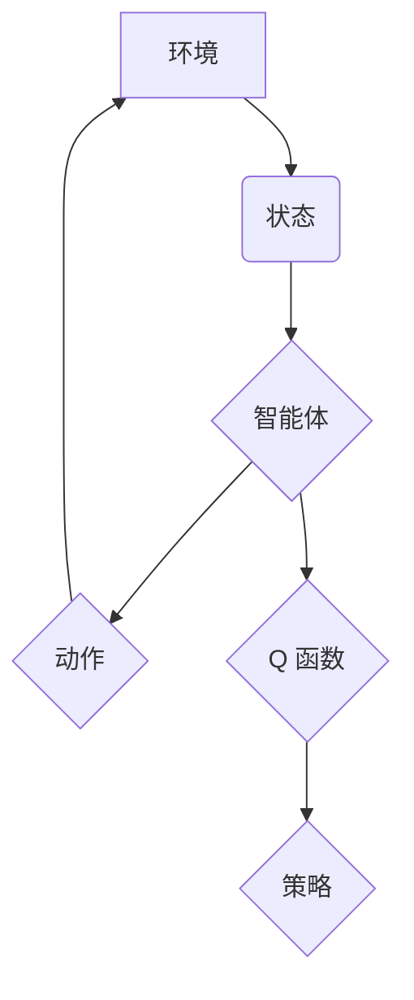

> 强化学习，深度 Q 网络，DQN，Q 学习，神经网络，强化学习算法，游戏 AI

## 1. 背景介绍

强化学习 (Reinforcement Learning, RL) 作为机器学习的一个重要分支，近年来在人工智能领域取得了显著进展。它与监督学习和无监督学习不同，强化学习算法通过与环境的交互学习，通过不断尝试和反馈，逐步优化策略，最终达到预设的目标。

深度 Q 网络 (Deep Q-Network, DQN) 是强化学习领域的一项重要突破，它将深度神经网络与 Q 学习算法相结合，能够学习复杂环境下的策略。DQN 算法的提出，使得强化学习能够应用于更复杂的任务，例如游戏、机器人控制等。

## 2. 核心概念与联系

**2.1 强化学习基本概念**

强化学习的核心概念是“智能体”与“环境”的交互。智能体通过与环境的交互，获得奖励或惩罚，并根据这些反馈调整自己的行为策略，最终达到最大化累积奖励的目标。

* **智能体 (Agent):**  学习和决策的实体。
* **环境 (Environment):** 智能体所处的外部世界。
* **状态 (State):** 环境的当前状态。
* **动作 (Action):** 智能体可以采取的行动。
* **奖励 (Reward):** 环境对智能体采取的动作给予的反馈。
* **策略 (Policy):** 智能体在不同状态下采取动作的概率分布。

**2.2 Q 学习算法**

Q 学习算法是一种经典的强化学习算法，它通过学习一个 Q 函数来指导智能体的决策。Q 函数表示在当前状态下采取某个动作的期望累积奖励。

**2.3 深度神经网络**

深度神经网络 (Deep Neural Network, DNN) 是一种强大的机器学习模型，它能够学习复杂的数据模式。DQN 算法将深度神经网络应用于 Q 函数的估计，从而能够学习更复杂的环境。

**2.4 DQN 算法架构**

DQN 算法将 Q 学习算法与深度神经网络相结合，其架构如下：



## 3. 核心算法原理 & 具体操作步骤

### 3.1 算法原理概述

DQN 算法的核心思想是利用深度神经网络来估计 Q 函数，并通过 Q 学习算法的更新规则来不断优化 Q 函数。

DQN 算法的主要步骤如下：

1. 初始化一个深度神经网络，作为 Q 函数的估计器。
2. 在环境中与智能体交互，收集状态、动作和奖励的数据。
3. 使用收集到的数据，更新 Q 函数的估计值。
4. 根据更新后的 Q 函数，选择最优动作。
5. 重复步骤 2-4，直到达到预设的目标。

### 3.2 算法步骤详解

1. **初始化 Q 网络:** 首先，需要创建一个深度神经网络，作为 Q 函数的估计器。该网络的输入是环境的状态，输出是每个动作对应的 Q 值。

2. **经验回放 (Experience Replay):** 为了避免样本之间的相关性，DQN 算法使用经验回放技术。经验回放是指将收集到的状态、动作、奖励和下一个状态存储在一个经验池中，然后随机采样经验池中的数据进行训练。

3. **目标网络 (Target Network):** DQN 算法使用两个神经网络：一个用于估计 Q 值 (Q 网络)，另一个用于计算目标 Q 值 (目标网络)。目标网络的参数是 Q 网络参数的缓慢更新版本，这有助于稳定训练过程。

4. **Q 值更新:** 使用经验回放采样的数据，计算 Q 值的更新值。更新规则通常是使用梯度下降算法，最小化 Q 值估计与目标 Q 值之间的误差。

5. **策略选择:** 根据更新后的 Q 值，选择最优动作。最优动作通常是 Q 值最大的动作。

6. **重复步骤 2-5:** 重复上述步骤，直到达到预设的目标。

### 3.3 算法优缺点

**优点:**

* 能够学习复杂环境下的策略。
* 经验回放技术可以提高训练效率和稳定性。
* 目标网络可以稳定训练过程。

**缺点:**

* 训练过程可能比较慢。
* 需要大量的训练数据。
* 容易陷入局部最优解。

### 3.4 算法应用领域

DQN 算法在以下领域有广泛的应用:

* **游戏 AI:** DQN 算法可以用于训练游戏 AI，例如 AlphaGo、AlphaStar 等。
* **机器人控制:** DQN 算法可以用于训练机器人控制策略，例如自主导航、抓取等。
* **推荐系统:** DQN 算法可以用于个性化推荐系统，例如电影推荐、商品推荐等。
* **医疗诊断:** DQN 算法可以用于辅助医疗诊断，例如图像识别、疾病预测等。

## 4. 数学模型和公式 & 详细讲解 & 举例说明

### 4.1 数学模型构建

DQN 算法的核心是 Q 函数，它表示在当前状态下采取某个动作的期望累积奖励。

**Q 函数定义:**

$$Q(s, a) = E[\sum_{t=0}^{\infty} \gamma^t r_{t+1} | s_t = s, a_t = a]$$

其中:

* $s$ 是当前状态。
* $a$ 是采取的动作。
* $r_{t+1}$ 是在时间步 $t+1$ 获得的奖励。
* $\gamma$ 是折扣因子，控制未来奖励的权重。

### 4.2 公式推导过程

DQN 算法使用深度神经网络来估计 Q 函数。神经网络的输出是一个 Q 值向量，每个元素对应一个动作。

**Q 值估计:**

$$Q(s, a) \approx \hat{Q}(s, a)$$

其中:

* $\hat{Q}(s, a)$ 是深度神经网络估计的 Q 值。

DQN 算法使用梯度下降算法来更新神经网络的参数，最小化 Q 值估计与目标 Q 值之间的误差。

**目标 Q 值:**

$$\hat{Q}^*(s, a) = r + \gamma \max_{a'} \hat{Q}(s', a')$$

其中:

* $s'$ 是下一个状态。
* $\hat{Q}(s', a')$ 是下一个状态下所有动作的 Q 值估计。

**损失函数:**

$$L = \frac{1}{N} \sum_{i=1}^{N} (y_i - \hat{Q}(s_i, a_i))^2$$

其中:

* $N$ 是样本数量。
* $y_i$ 是目标 Q 值。
* $\hat{Q}(s_i, a_i)$ 是 Q 值估计。

### 4.3 案例分析与讲解

假设我们有一个简单的游戏环境，智能体可以采取向上、向下、向左、向右四个动作。

在某个状态下，智能体采取向上动作，获得奖励 1，下一个状态下，智能体采取向左动作，获得奖励 -1。

根据目标 Q 值的计算公式，我们可以得到目标 Q 值为：

$$\hat{Q}^*(s, up) = 1 + \gamma \max_{a'} \hat{Q}(s', a')$$

其中，$\gamma$ 为折扣因子，假设为 0.9。

然后，我们可以使用损失函数来更新神经网络的参数，使得 Q 值估计与目标 Q 值之间的误差最小化。

## 5. 项目实践：代码实例和详细解释说明

### 5.1 开发环境搭建

* Python 3.6+
* TensorFlow 或 PyTorch
* OpenAI Gym

### 5.2 源代码详细实现

```python
import tensorflow as tf
import numpy as np
from tensorflow.keras.models import Sequential
from tensorflow.keras.layers import Dense, Flatten

# 定义 DQN 网络
class DQNetwork(tf.keras.Model):
    def __init__(self, state_size, action_size):
        super(DQNetwork, self).__init__()
        self.model = Sequential()
        self.model.add(Flatten(input_shape=(state_size,)))
        self.model.add(Dense(64, activation='relu'))
        self.model.add(Dense(action_size))

    def call(self, state):
        return self.model(state)

# 定义 DQN 算法
class DQNAgent:
    def __init__(self, state_size, action_size, learning_rate=0.001, gamma=0.99, epsilon=1.0, epsilon_decay=0.995, epsilon_min=0.01):
        self.state_size = state_size
        self.action_size = action_size
        self.learning_rate = learning_rate
        self.gamma = gamma
        self.epsilon = epsilon
        self.epsilon_decay = epsilon_decay
        self.epsilon_min = epsilon_min
        self.q_network = DQNetwork(state_size, action_size)
        self.optimizer = tf.keras.optimizers.Adam(learning_rate=self.learning_rate)

    def choose_action(self, state):
        if np.random.rand() < self.epsilon:
            return np.random.randint(self.action_size)
        else:
            q_values = self.q_network(state)
            return np.argmax(q_values[0])

    def train(self, state, action, reward, next_state, done):
        with tf.GradientTape() as tape:
            target_q_values = reward + self.gamma * tf.reduce_max(self.q_network(next_state), axis=1) * (1 - done)
            q_values = self.q_network(state)
            loss = tf.keras.losses.mean_squared_error(target_q_values, q_values[0, action])
        gradients = tape.gradient(loss, self.q_network.trainable_variables)
        self.optimizer.apply_gradients(zip(gradients, self.q_network.trainable_variables))

        self.epsilon = max(self.epsilon * self.epsilon_decay, self.epsilon_min)

# ... (其他代码)
```

### 5.3 代码解读与分析

* **DQNetwork 类:** 定义了深度神经网络的结构，包含输入层、隐藏层和输出层。
* **DQNAgent 类:** 定义了 DQN 算法的核心逻辑，包括选择动作、训练网络等。
* **choose_action 方法:** 根据 epsilon-greedy 策略选择动作。
* **train 方法:** 使用梯度下降算法更新网络参数，最小化 Q 值估计与目标 Q 值之间的误差。

### 5.4 运行结果展示

运行代码后，可以观察到智能体在环境中学习的过程，例如游戏分数的提升、策略的改进等。

## 6. 实际应用场景

DQN 算法在以下实际应用场景中取得了成功:

* **AlphaGo:** DeepMind 使用 DQN 算法训练了 AlphaGo，一个能够战胜人类围棋冠军的 AI。
* **AlphaStar:** DeepMind 使用 DQN 算法训练了 AlphaStar，一个能够在星际争霸 II 中战胜职业玩家的 AI。
* **机器人控制:** DQN 算法被用于训练机器人控制策略，例如自主导航、抓取等。
* **推荐系统:** DQN 算法被用于个性化推荐系统，例如电影推荐、商品推荐等。

### 6.4 未来应用展望

DQN 算法在未来将有更广泛的应用，例如:

* **自动驾驶:** DQN 算法可以用于训练自动驾驶系统的决策策略。
* **医疗诊断:** DQN 算法可以用于辅助医疗诊断，例如图像识别、疾病预测等。
* **金融交易:** DQN 算法可以用于训练金融交易