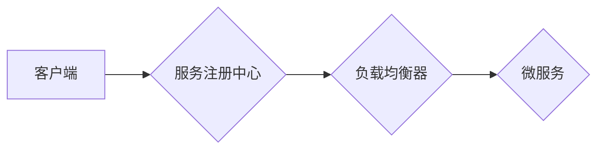

> 服务注册中心、负载均衡、微服务架构、服务发现、健康检查、故障转移、高可用性、弹性伸缩

## 1. 背景介绍

随着互联网技术的不断发展，传统的单体架构逐渐难以满足现代应用的需求。微服务架构应运而生，它将大型应用程序拆分成多个小型、独立的服务，每个服务负责特定的业务功能。这种架构模式带来了许多好处，例如：

* **提高开发效率:**  微服务可以独立开发和部署，缩短开发周期，提高开发效率。
* **增强系统可维护性:**  微服务独立部署，方便维护和升级，降低系统故障风险。
* **提高系统弹性:**  微服务可以独立伸缩，根据业务需求动态调整资源分配，提高系统弹性。

然而，微服务架构也带来了新的挑战，其中之一就是服务发现和负载均衡。在微服务架构中，服务之间需要相互发现，并根据一定的策略进行负载均衡，以确保应用程序能够正常运行。

## 2. 核心概念与联系

**服务注册中心**

服务注册中心是一个集中式的服务发现平台，它负责记录所有微服务的元数据信息，例如服务名称、地址、端口、健康状态等。微服务启动时，会向注册中心注册自身信息，其他微服务可以通过注册中心查询服务信息，并与之通信。

**负载均衡器**

负载均衡器是一个负责将请求分发到多个后端服务器的设备。它可以根据不同的策略，例如轮询、加权轮询、最少连接等，将请求分配到不同的服务器，以提高系统的吞吐量和可用性。

**服务注册中心与负载均衡器的联系**

服务注册中心和负载均衡器是微服务架构中不可或缺的组件，它们协同工作，实现服务发现和负载均衡。

* 服务注册中心提供服务信息，负载均衡器根据注册中心的信息，将请求分发到相应的微服务。
* 负载均衡器可以根据服务健康状态，剔除不可用的服务，并将请求转发到健康的服务器。

**Mermaid 流程图**



## 3. 核心算法原理 & 具体操作步骤

### 3.1  算法原理概述

服务注册中心和负载均衡器通常采用以下算法实现服务发现和负载均衡：

* **服务发现算法:**  常用的服务发现算法包括DNS解析、心跳机制、广播机制等。
* **负载均衡算法:**  常用的负载均衡算法包括轮询、加权轮询、最少连接、IP哈希等。

### 3.2  算法步骤详解

**服务发现算法 (心跳机制)**

1. 微服务启动时，向注册中心注册自身信息，并设置心跳间隔。
2. 微服务每隔一段时间发送心跳包到注册中心，证明自身在线状态。
3. 注册中心记录微服务的在线状态，并定期更新服务信息。
4. 客户端请求服务时，查询注册中心获取服务信息，并连接到在线的微服务。

**负载均衡算法 (轮询)**

1. 负载均衡器维护一个后端服务器列表。
2. 客户端请求到达负载均衡器时，负载均衡器根据轮询策略，选择一个后端服务器进行请求转发。
3. 请求转发完成后，负载均衡器将下一个请求转发到下一个后端服务器。

### 3.3  算法优缺点

**服务发现算法 (心跳机制)**

* **优点:**  简单易实现，实时性高。
* **缺点:**  容易受到网络抖动的影响，心跳包过多会增加网络负担。

**负载均衡算法 (轮询)**

* **优点:**  简单易实现，公平性好。
* **缺点:**  无法根据服务器负载进行动态调整，可能导致某些服务器过载。

### 3.4  算法应用领域

* **服务发现算法:**  广泛应用于微服务架构、云计算平台等场景。
* **负载均衡算法:**  广泛应用于网站、应用服务器、数据库等场景。

## 4. 数学模型和公式 & 详细讲解 & 举例说明

### 4.1  数学模型构建

假设有N个后端服务器，每个服务器的处理能力为P，请求的到达率为λ。

* **服务器负载:**  服务器负载可以表示为请求到达率除以服务器处理能力，即λ/P。
* **系统负载:**  系统负载可以表示为所有服务器负载的总和，即∑(λ/P)。

### 4.2  公式推导过程

* **目标:**  最小化系统负载，保证系统稳定运行。
* **策略:**  根据服务器负载，动态调整请求分配策略。

### 4.3  案例分析与讲解

假设有3个后端服务器，每个服务器的处理能力为1000请求/秒，请求的到达率为5000请求/秒。

* **服务器负载:**  每个服务器的负载为5000/1000=5。
* **系统负载:**  系统的负载为3*5=15。

如果采用轮询策略，每个服务器将接收相同的请求量，系统负载为15。

如果采用加权轮询策略，可以根据服务器负载进行权重分配，例如，负载较低的服务器分配更高的权重，可以降低系统负载。

## 5. 项目实践：代码实例和详细解释说明

### 5.1  开发环境搭建

* 操作系统: Ubuntu 20.04
* 编程语言: Go
* 工具: Docker, Kubernetes

### 5.2  源代码详细实现

```go
// 服务注册中心代码示例
package main

import (
\t"fmt"
\t"net/http"
)

type Service struct {
\tName string
\tAddress string
\tPort int
}

var services map[string]*Service

func init() {
\tservices = make(map[string]*Service)
}

func RegisterService(name string, address string, port int) {
\tservice := &Service{
\t\tName: name,
\t\tAddress: address,
\t\tPort: port,
\t}
\tservices[name] = service
}

func GetService(name string) *Service {
\treturn services[name]
}

func main() {
\thttp.HandleFunc("/services", func(w http.ResponseWriter, r *http.Request) {
\t\tfmt.Println("Get all services")
\t\tfor _, service := range services {
\t\t\tfmt.Fprintf(w, "%s:%d
", service.Address, service.Port)
\t\t}
\t})
\thttp.ListenAndServe(":8080", nil)
}
```

### 5.3  代码解读与分析

* 服务注册中心代码示例实现了简单的服务注册和查询功能。
* 服务注册中心使用一个map存储所有注册的服务信息。
* 客户端可以通过HTTP请求查询服务信息。

### 5.4  运行结果展示

启动服务注册中心后，可以使用curl命令查询服务信息：

```
curl http://localhost:8080/services
```

## 6. 实际应用场景

### 6.1  电商平台

电商平台通常采用微服务架构，每个服务负责特定的业务功能，例如商品管理、订单管理、支付管理等。服务注册中心和负载均衡器可以帮助电商平台实现服务发现和负载均衡，提高系统的可用性和性能。

### 6.2  社交媒体平台

社交媒体平台需要处理大量的用户请求，例如用户登录、发布动态、评论等。服务注册中心和负载均衡器可以帮助社交媒体平台实现服务发现和负载均衡，提高系统的吞吐量和可用性。

### 6.3  金融系统

金融系统对高可用性和安全性要求非常高。服务注册中心和负载均衡器可以帮助金融系统实现服务发现和负载均衡，提高系统的可靠性和安全性。

### 6.4  未来应用展望

随着微服务架构的普及，服务注册中心和负载均衡器将越来越重要。未来，服务注册中心和负载均衡器将朝着以下方向发展：

* **更智能化:**  利用机器学习等技术，实现更智能的负载均衡策略。
* **更安全:**  提供更完善的安全机制，保护服务和数据安全。
* **更易用:**  提供更友好的用户界面和操作体验。

## 7. 工具和资源推荐

### 7.1  学习资源推荐

* **书籍:**
    * 《微服务架构实践》
    * 《分布式系统设计与实践》
* **网站:**
    * https://microservices.io/
    * https://www.nginx.com/

### 7.2  开发工具推荐

* **服务注册中心:**
    * Consul
    * Eureka
    * ZooKeeper
* **负载均衡器:**
    * Nginx
    * HAProxy
    * Kubernetes

### 7.3  相关论文推荐

* **服务发现:**
    * "A Survey of Service Discovery Techniques in Distributed Systems"
* **负载均衡:**
    * "Load Balancing Techniques for Distributed Systems"

## 8. 总结：未来发展趋势与挑战

### 8.1  研究成果总结

服务注册中心和负载均衡器是微服务架构中不可或缺的组件，它们共同实现服务发现和负载均衡，提高系统的可用性和性能。

### 8.2  未来发展趋势

未来，服务注册中心和负载均衡器将朝着更智能化、更安全、更易用方向发展。

### 8.3  面临的挑战

* **复杂性:**  微服务架构的复杂性不断增加，服务注册中心和负载均衡器需要能够应对更复杂的场景。
* **安全性:**  服务注册中心和负载均衡器需要提供更完善的安全机制，保护服务和数据安全。
* **可扩展性:**  随着微服务架构的规模不断扩大，服务注册中心和负载均衡器需要能够满足更高的可扩展性要求。

### 8.4  研究展望

未来，我们将继续研究服务注册中心和负载均衡器的相关技术，探索更智能、更安全、更易用的解决方案。

## 9. 附录：常见问题与解答

### 9.1  常见问题

* **如何选择合适的服务注册中心和负载均衡器？**
* **如何配置服务注册中心和负载均衡器？**
* **如何解决服务注册中心和负载均衡器遇到的常见问题？**

### 9.2  解答

* **如何选择合适的服务注册中心和负载均衡器？**

选择合适的服务注册中心和负载均衡器需要根据具体的业务需求和环境进行评估。

* **如何配置服务注册中心和负载均衡器？**

服务注册中心和负载均衡器的配置方法因产品而异，请参考产品的官方文档进行配置。

* **如何解决服务注册中心和负载均衡器遇到的常见问题？**

常见问题可以通过查阅官方文档、社区论坛等方式进行解决。

作者：禅与计算机程序设计艺术 / Zen and the Art of Computer Programming


<end_of_turn>