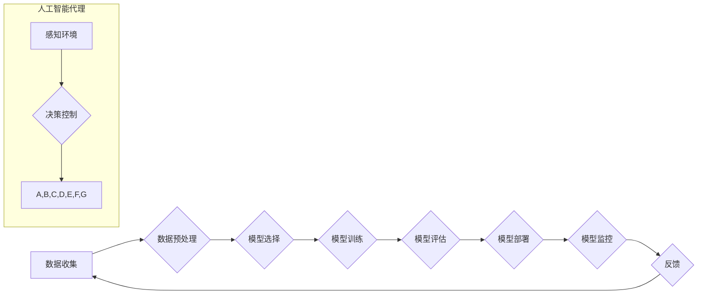

> 机器学习，流水线，人工智能代理，模型训练，部署，自动化，可扩展性

## 1. 背景介绍

在当今数据爆炸的时代，机器学习（ML）已成为人工智能（AI）的核心驱动力，推动着各个行业的技术革新。从图像识别到自然语言处理，从推荐系统到预测分析，机器学习算法在各个领域展现出强大的应用潜力。然而，将机器学习模型从实验室推向实际应用，面临着诸多挑战，例如模型训练的复杂性、部署的灵活性、维护的成本以及可扩展性的限制。

为了解决这些问题，机器学习流水线（ML Pipeline）应运而生。它提供了一种自动化、可重复和可扩展的流程，将机器学习模型的整个生命周期，从数据收集到模型部署和监控，整合在一起。同时，人工智能代理（AI Agent）作为一种能够自主学习、决策和执行任务的智能实体，为机器学习流水线提供了更智能化的控制和管理能力。

本文将深入探讨机器学习流水线与人工智能代理的集成，分析其核心概念、工作原理、算法实现以及实际应用场景，并展望其未来发展趋势和挑战。

## 2. 核心概念与联系

### 2.1 机器学习流水线

机器学习流水线是一个端到端的流程，用于构建、训练、部署和监控机器学习模型。它通常包含以下几个关键步骤：

* **数据收集和预处理:** 从各种数据源收集数据，并进行清洗、转换和特征工程等预处理操作，以确保数据质量和模型训练的有效性。
* **模型选择和训练:** 根据具体任务选择合适的机器学习算法，并使用训练数据训练模型参数，使其能够学习数据中的模式和规律。
* **模型评估和选择:** 使用测试数据评估模型的性能，并选择最优模型进行部署。
* **模型部署和监控:** 将训练好的模型部署到生产环境中，并持续监控模型的性能，及时进行调整和更新。

### 2.2 人工智能代理

人工智能代理是一种能够自主学习、决策和执行任务的智能实体。它通常具有以下特征：

* **感知能力:** 可以感知环境信息，例如传感器数据、文本信息、图像信息等。
* **决策能力:** 可以根据感知到的信息，做出合理的决策，选择最优的行动方案。
* **执行能力:** 可以执行决策结果，控制物理设备或软件系统。
* **学习能力:** 可以从经验中学习，不断改进决策和执行能力。

### 2.3 集成关系

将机器学习流水线与人工智能代理集成，可以实现以下优势：

* **自动化控制:** 人工智能代理可以自动控制机器学习流水线的各个步骤，例如数据预处理、模型训练、模型评估等，提高效率和准确性。
* **智能决策:** 人工智能代理可以根据实时数据和模型性能，智能地选择最优的模型和参数，优化模型效果。
* **动态调整:** 人工智能代理可以根据环境变化和用户需求，动态调整机器学习流水线的流程和参数，提高适应性和灵活性。
* **可扩展性:** 人工智能代理可以管理多个机器学习流水线，实现资源共享和任务分派，提高系统的可扩展性和可靠性。

**Mermaid 流程图**



## 3. 核心算法原理 & 具体操作步骤

### 3.1 算法原理概述

机器学习流水线与人工智能代理的集成，通常涉及以下核心算法：

* **强化学习 (Reinforcement Learning):** 用于训练人工智能代理，使其能够通过与环境交互，学习最优的决策策略。
* **迁移学习 (Transfer Learning):** 用于将预训练模型的知识迁移到新的任务或领域，提高模型的泛化能力。
* **联邦学习 (Federated Learning):** 用于在分布式数据环境下，训练模型，保护用户隐私。

### 3.2 算法步骤详解

**强化学习:**

1. **环境建模:** 建立机器学习流水线的环境模型，包括状态空间、动作空间和奖励函数。
2. **代理设计:** 设计人工智能代理，使其能够感知环境信息、做出决策和执行动作。
3. **策略训练:** 使用强化学习算法，例如Q学习或深度强化学习，训练代理的策略，使其能够在环境中获得最大奖励。
4. **策略部署:** 将训练好的策略部署到机器学习流水线中，使代理能够自动控制流水线流程。

**迁移学习:**

1. **源任务数据:** 使用预训练模型在源任务数据上进行训练，获得预训练模型。
2. **目标任务数据:** 使用目标任务数据进行微调，将预训练模型的知识迁移到目标任务。
3. **模型融合:** 将预训练模型和微调模型融合，获得最终的模型。

**联邦学习:**

1. **数据分发:** 将数据分散到不同的设备上，例如用户手机或服务器。
2. **模型训练:** 在每个设备上训练模型，并将模型参数上传到中央服务器。
3. **模型聚合:** 在中央服务器上聚合所有设备的模型参数，获得全局模型。
4. **模型更新:** 将全局模型更新到每个设备，并重复上述步骤。

### 3.3 算法优缺点

**强化学习:**

* **优点:** 可以学习复杂的决策策略，适应动态变化的环境。
* **缺点:** 训练过程复杂，需要大量的训练数据和计算资源。

**迁移学习:**

* **优点:** 可以提高模型的泛化能力，减少训练数据需求。
* **缺点:** 需要找到合适的源任务和目标任务，源任务数据质量对模型性能影响较大。

**联邦学习:**

* **优点:** 可以保护用户隐私，在分布式数据环境下训练模型。
* **缺点:** 模型训练速度较慢，需要协调多个设备的通信和计算。

### 3.4 算法应用领域

* **强化学习:** 自动驾驶、机器人控制、游戏 AI
* **迁移学习:** 自然语言处理、图像识别、医疗诊断
* **联邦学习:** 医疗数据分析、金融风险评估、个性化推荐

## 4. 数学模型和公式 & 详细讲解 & 举例说明

### 4.1 数学模型构建

强化学习的核心数学模型是**状态-动作-奖励 (SARSA)**模型。

* **状态 (State):** 环境的当前状态，例如机器人位置、游戏场景等。
* **动作 (Action):** 代理可以执行的动作，例如机器人移动、玩家选择操作等。
* **奖励 (Reward):** 代理执行动作后获得的奖励，例如完成任务、获得分数等。

### 4.2 公式推导过程

SARSA算法的目标是学习一个策略π(s,a)，该策略能够最大化代理在环境中获得的总奖励。

**Bellman方程:**

$$
V^{\pi}(s) = \max_a \left[ R(s,a) + \gamma \sum_{s'} P(s'|s,a) V^{\pi}(s') \right]
$$

其中:

* $V^{\pi}(s)$ 是状态 $s$ 下按照策略 $\pi$ 获得的期望总奖励。
* $R(s,a)$ 是执行动作 $a$ 在状态 $s$ 下获得的奖励。
* $\gamma$ 是折扣因子，控制未来奖励的权重。
* $P(s'|s,a)$ 是执行动作 $a$ 在状态 $s$ 下转移到状态 $s'$ 的概率。

**SARSA更新规则:**

$$
Q(s,a) \leftarrow Q(s,a) + \alpha [R(s,a) + \gamma Q(s',a') - Q(s,a)]
$$

其中:

* $Q(s,a)$ 是状态 $s$ 下执行动作 $a$ 的期望回报。
* $\alpha$ 是学习率，控制学习速度。
* $s'$ 是执行动作 $a$ 后转移到的下一个状态。
* $a'$ 是在下一个状态 $s'$ 下按照策略 $\pi$ 选择的动作。

### 4.3 案例分析与讲解

**自动驾驶案例:**

在自动驾驶场景中，机器学习模型可以用于识别道路标志、预测其他车辆的运动轨迹等。

* 状态: 车辆位置、速度、周围环境信息等。
* 动作: 加速、减速、转向等。
* 奖励: 安全行驶、到达目的地等。

通过强化学习算法，可以训练自动驾驶代理，使其能够在复杂道路环境中做出最优决策，实现安全、高效的驾驶。

## 5. 项目实践：代码实例和详细解释说明

### 5.1 开发环境搭建

* Python 3.7+
* TensorFlow 2.0+
* PyTorch 1.0+
* Jupyter Notebook

### 5.2 源代码详细实现

```python
# 强化学习示例代码 (使用 TensorFlow)

import tensorflow as tf

# 定义状态空间和动作空间
state_size = 4
action_size = 3

# 定义 Q 网络
model = tf.keras.Sequential([
    tf.keras.layers.Dense(64, activation='relu', input_shape=(state_size,)),
    tf.keras.layers.Dense(action_size)
])

# 定义损失函数和优化器
optimizer = tf.keras.optimizers.Adam(learning_rate=0.001)
loss_fn = tf.keras.losses.MeanSquaredError()

# 训练循环
for episode in range(1000):
    state = env.reset()
    done = False
    total_reward = 0

    while not done:
        # 选择动作
        action = tf.argmax(model(state)).numpy()

        # 执行动作并获取奖励和下一个状态
        next_state, reward, done, _ = env.step(action)

        # 更新 Q 值
        with tf.GradientTape() as tape:
            target_q = reward + gamma * tf.reduce_max(model(next_state))
            q_value = model(state)[action]
            loss = loss_fn(target_q, q_value)

        gradients = tape.gradient(loss, model.trainable_variables)
        optimizer.apply_gradients(zip(gradients, model.trainable_variables))

        # 更新状态
        state = next_state

        # 更新总奖励
        total_reward += reward

    print(f"Episode {episode+1}, Total Reward: {total_reward}")

```

### 5.3 代码解读与分析

* **环境搭建:** 使用OpenAI Gym等库搭建强化学习环境。
* **模型定义:** 使用TensorFlow或PyTorch定义Q网络，用于预测状态-动作对的期望回报。
* **损失函数:** 使用均方误差损失函数，最小化预测回报与目标回报之间的差异。
* **优化器:** 使用Adam优化器，更新Q网络的参数。
* **训练循环:** 迭代训练模型，更新Q网络的参数，直到达到预设的性能指标。

### 5.4 运行结果展示

训练完成后，可以评估模型的性能，例如在环境中进行测试，计算平均奖励等。

## 6. 实际应用场景

### 6.1 自动化运维

人工智能代理可以自动监控机器学习流水线，识别异常情况，并自动执行修复操作，提高运维效率和可靠性。

### 6.2 个性化推荐

机器学习流水线可以根据用户的行为数据，训练个性化推荐模型，为用户提供更精准的推荐结果。

### 6.3 医疗诊断辅助

机器学习流水线可以用于分析医学影像数据，辅助医生进行疾病诊断，提高诊断准确率和效率。

### 6.4 未来应用展望

* **边缘计算:** 将机器学习流水线部署到边缘设备，实现更低延迟、更高效率的应用