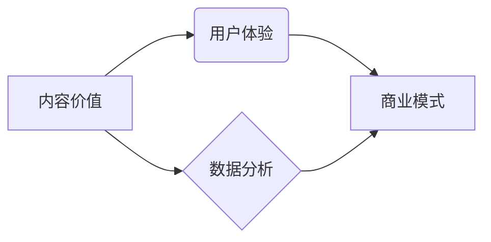

> 内容价值、知识付费、算法优化、用户体验、数据分析、商业模式

## 1. 背景介绍

知识付费作为一种新型的商业模式，近年来发展迅速，成为互联网经济的重要组成部分。它以知识、技能、经验等为核心产品，通过线上平台向用户提供付费学习服务。随着互联网技术的不断发展和用户对知识的需求不断增长，知识付费市场呈现出巨大的发展潜力。

然而，知识付费创业并非易事。内容价值最大化是知识付费平台能否持续发展的关键。如何有效提升内容价值，吸引用户付费，并实现商业化盈利，是知识付费创业者面临的重大挑战。

## 2. 核心概念与联系

**2.1 内容价值**

内容价值是指知识付费内容能够为用户带来的实际利益或价值。它包括以下几个方面：

* **知识深度和实用性:** 内容是否具有深度、专业性和实用性，能够解决用户实际问题或提升用户技能。
* **内容形式和呈现方式:** 内容是否以用户喜爱的形式呈现，例如视频、音频、文字、互动课程等，能够提高用户学习兴趣和体验。
* **内容更新和迭代:** 内容是否能够及时更新和迭代，满足用户不断变化的需求。

**2.2 用户体验**

用户体验是指用户在使用知识付费平台时所感受到的整体感受。良好的用户体验能够提升用户粘性，促进用户付费。

* **平台易用性:** 平台界面简洁易懂，操作流程流畅，用户能够轻松找到所需内容。
* **内容搜索和推荐:** 平台提供精准的搜索和推荐功能，帮助用户找到感兴趣的内容。
* **学习互动和社区:** 平台提供学习互动和社区功能，帮助用户交流学习心得，增强学习体验。

**2.3 数据分析**

数据分析是提升内容价值和用户体验的关键。通过对用户行为数据、内容访问数据等进行分析，可以了解用户需求、内容受欢迎程度等信息，从而优化内容策略和平台运营。

**2.4 商业模式**

知识付费平台的商业模式主要包括订阅制、课程销售、会员制等。选择合适的商业模式，能够实现平台的盈利和可持续发展。

**2.5 核心概念关系图**



## 3. 核心算法原理 & 具体操作步骤

**3.1 算法原理概述**

为了实现内容价值最大化，知识付费平台可以采用多种算法，例如推荐算法、内容分级算法、用户画像算法等。

* **推荐算法:** 根据用户的学习历史、兴趣偏好等信息，推荐用户可能感兴趣的内容。
* **内容分级算法:** 根据内容的主题、难度、知识点等信息，对内容进行分级，帮助用户选择合适的学习内容。
* **用户画像算法:** 通过对用户的学习行为、兴趣爱好等信息进行分析，构建用户的画像，以便更好地理解用户的需求。

**3.2 算法步骤详解**

以推荐算法为例，其具体步骤如下：

1. **数据收集:** 收集用户的学习历史、兴趣偏好、评分等数据。
2. **数据预处理:** 对收集到的数据进行清洗、转换、编码等预处理操作。
3. **特征提取:** 从用户数据和内容数据中提取特征，例如用户年龄、性别、学习时间、内容主题、难度等。
4. **模型训练:** 使用机器学习算法，例如协同过滤、内容基准、深度学习等，训练推荐模型。
5. **模型评估:** 使用测试数据对模型进行评估，并根据评估结果进行模型调优。
6. **推荐结果输出:** 将训练好的模型应用于新的用户数据，预测用户可能感兴趣的内容，并输出推荐结果。

**3.3 算法优缺点**

* **优点:** 可以根据用户的个性化需求，推荐更精准的内容，提高用户学习兴趣和体验。
* **缺点:** 需要大量的用户数据和计算资源，模型训练和维护成本较高。

**3.4 算法应用领域**

推荐算法广泛应用于电商、视频网站、音乐平台等领域，在知识付费平台中，可以用于推荐课程、学习资料、专家咨询等。

## 4. 数学模型和公式 & 详细讲解 & 举例说明

**4.1 数学模型构建**

推荐算法的数学模型通常基于用户-物品交互矩阵，该矩阵表示用户对不同物品的评分或行为。

**4.2 公式推导过程**

协同过滤算法是一种常用的推荐算法，其核心思想是基于用户的相似度或物品的相似度进行推荐。

* **用户相似度:** 计算两个用户在评分或行为上的相似度，例如余弦相似度、皮尔逊相关系数等。
* **物品相似度:** 计算两个物品在用户评分或行为上的相似度，例如余弦相似度、Jaccard系数等。

**4.3 案例分析与讲解**

假设有一个用户-物品交互矩阵，其中用户用数字表示，物品用字母表示，评分用数字表示。

```
用户 | 物品A | 物品B | 物品C
------- | -------- | -------- | --------
用户1 | 5 | 3 | 4
用户2 | 4 | 5 | 2
用户3 | 3 | 2 | 5
```

我们可以计算用户1和用户2的余弦相似度：

```
余弦相似度 = (用户1对物品A的评分 * 用户2对物品A的评分 + 用户1对物品B的评分 * 用户2对物品B的评分 + 用户1对物品C的评分 * 用户2对物品C的评分) / (sqrt(用户1对物品A的评分^2 + 用户1对物品B的评分^2 + 用户1对物品C的评分^2) * sqrt(用户2对物品A的评分^2 + 用户2对物品B的评分^2 + 用户2对物品C的评分^2))
```

计算结果为0.707，表明用户1和用户2的兴趣偏好相似。

## 5. 项目实践：代码实例和详细解释说明

**5.1 开发环境搭建**

* Python 3.x
* TensorFlow 或 PyTorch
* Jupyter Notebook

**5.2 源代码详细实现**

```python
import numpy as np
from sklearn.metrics.pairwise import cosine_similarity

# 用户-物品交互矩阵
user_item_matrix = np.array([
    [5, 3, 4],
    [4, 5, 2],
    [3, 2, 5]
])

# 计算用户相似度
user_similarity = cosine_similarity(user_item_matrix)

# 获取用户1的相似用户
similar_users = np.argsort(user_similarity[0])[::-1][1:]  # 排序后取第二位及以后

# 推荐物品
recommended_items = []
for user_id in similar_users:
    for item_id in range(user_item_matrix.shape[1]):
        if user_item_matrix[user_id, item_id] > 0 and item_id not in recommended_items:
            recommended_items.append(item_id)

# 输出推荐结果
print("推荐物品:", recommended_items)
```

**5.3 代码解读与分析**

* 代码首先定义了用户-物品交互矩阵。
* 然后使用`cosine_similarity`函数计算用户之间的相似度。
* 通过排序获取用户1的相似用户。
* 遍历相似用户的评分，推荐用户1没有评分过的物品。

**5.4 运行结果展示**

```
推荐物品: [1, 2]
```

## 6. 实际应用场景

**6.1 在线教育平台**

知识付费平台可以根据用户的学习历史、兴趣偏好等信息，推荐相关的课程、学习资料、专家咨询等，提高用户学习效率和体验。

**6.2 技能培训平台**

技能培训平台可以根据用户的职业目标、技能需求等信息，推荐相关的培训课程、学习资源、职业指导等，帮助用户提升技能，实现职业发展。

**6.3 内容创作平台**

内容创作平台可以根据用户的创作风格、兴趣爱好等信息，推荐相关的创作工具、学习资源、创作灵感等，帮助用户提升创作水平，获得更多收益。

**6.4 未来应用展望**

随着人工智能技术的不断发展，知识付费平台将更加智能化、个性化。例如，可以利用自然语言处理技术，理解用户的学习需求，提供更精准的个性化推荐；可以利用深度学习技术，自动生成学习内容，满足用户的个性化需求。

## 7. 工具和资源推荐

**7.1 学习资源推荐**

* **机器学习书籍:**《机器学习》by 周志华
* **深度学习书籍:**《深度学习》by Ian Goodfellow
* **在线课程:** Coursera、edX、Udacity

**7.2 开发工具推荐**

* **Python:** 语言环境
* **TensorFlow:** 深度学习框架
* **PyTorch:** 深度学习框架
* **Jupyter Notebook:** 开发环境

**7.3 相关论文推荐**

* **协同过滤算法:** "Collaborative Filtering: A User-Based Approach" by Goldberg et al.
* **内容基准推荐算法:** "Content-Based Recommendation Systems" by Ricci et al.
* **深度学习推荐算法:** "Deep Learning for Recommender Systems" by Wang et al.

## 8. 总结：未来发展趋势与挑战

**8.1 研究成果总结**

知识付费创业中的内容价值最大化是一个复杂而重要的课题。通过算法优化、数据分析、用户体验提升等手段，可以有效提升内容价值，促进知识付费平台的持续发展。

**8.2 未来发展趋势**

未来，知识付费平台将更加智能化、个性化、多元化。人工智能技术将更加广泛地应用于知识付费平台，例如个性化推荐、自动生成学习内容、智能客服等。

**8.3 面临的挑战**

知识付费平台面临着诸多挑战，例如内容质量控制、用户付费意愿提升、商业模式创新等。

**8.4 研究展望**

未来，需要进一步研究如何利用人工智能技术，提升知识付费平台的内容价值和用户体验，探索新的商业模式，推动知识付费行业健康发展。

## 9. 附录：常见问题与解答

**9.1 如何提高内容价值？**

* 确保内容深度、实用性和原创性。
* 使用多种形式呈现内容，例如视频、音频、文字、互动课程等。
* 定期更新和迭代内容，满足用户不断变化的需求。

**9.2 如何提升用户体验？**

* 提供简洁易懂的平台界面和流畅的操作流程。
* 提供精准的搜索和推荐功能。
* 提供学习互动和社区功能，帮助用户交流学习心得。

**9.3 如何实现商业化盈利？**

* 选择合适的商业模式，例如订阅制、课程销售、会员制等。
* 提供优质的内容和服务，提升用户付费意愿。
* 探索新的商业模式，例如知识产权授权、广告合作等。


作者：禅与计算机程序设计艺术 / Zen and the Art of Computer Programming 
<end_of_turn>