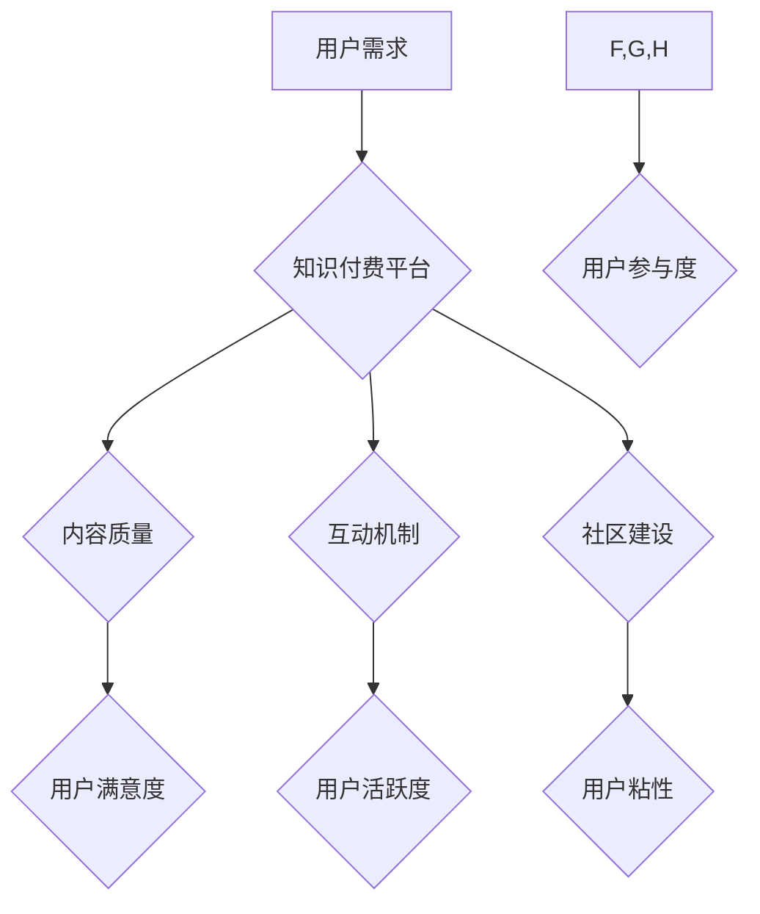

> 知识付费、用户参与度、社区建设、互动机制、内容运营、数据分析

## 1. 背景介绍

知识付费行业近年来发展迅速，从线上课程、付费咨询到会员体系，各种模式层出不穷。然而，随着市场竞争的加剧，如何提升用户参与度，打造用户粘性，成为知识付费创业者面临的共同挑战。

用户参与度是指用户在知识付费平台上主动参与、互动、贡献内容的程度。高用户参与度意味着用户对平台内容的认可和喜爱，也意味着平台能够更好地服务用户需求，形成良性循环。

## 2. 核心概念与联系

**2.1 知识付费平台用户参与度提升模型**

知识付费平台用户参与度提升是一个复杂系统，涉及用户行为、平台机制、内容质量等多方面因素。我们可以将其抽象为一个模型，以便更好地理解和分析用户参与度的提升策略。



**2.2 核心概念解析**

* **用户需求:** 用户参与知识付费平台的初衷是什么？他们希望获得什么样的知识和技能？
* **内容质量:** 平台提供的知识内容是否优质、实用、符合用户需求？
* **互动机制:** 平台是否提供有效的互动机制，例如评论、讨论、问答等，让用户能够与平台和其他用户进行交流？
* **社区建设:** 平台是否能够构建一个活跃的社区，让用户能够找到志同道合的朋友，共同学习和进步？
* **用户满意度:** 用户对平台内容和服务的满意程度如何？
* **用户活跃度:** 用户在平台上进行互动和学习的频率如何？
* **用户粘性:** 用户是否会持续使用平台，并推荐给其他用户？

## 3. 核心算法原理 & 具体操作步骤

**3.1 算法原理概述**

用户参与度提升策略的核心是通过数据分析和算法模型，精准识别用户需求，并提供个性化内容和互动体验。

**3.2 算法步骤详解**

1. **数据收集:** 收集用户行为数据，例如浏览记录、学习进度、互动行为等。
2. **数据清洗:** 对收集到的数据进行清洗和处理，去除无效数据和噪声。
3. **特征提取:** 从用户行为数据中提取特征，例如用户兴趣、学习习惯、参与度等。
4. **模型训练:** 利用机器学习算法，训练用户参与度预测模型。
5. **个性化推荐:** 根据用户特征和模型预测，为用户推荐个性化内容和互动活动。
6. **效果评估:** 定期评估模型效果，并根据反馈进行模型优化。

**3.3 算法优缺点**

* **优点:** 能够精准识别用户需求，提供个性化体验，提升用户参与度。
* **缺点:** 需要大量数据支持，模型训练和维护成本较高。

**3.4 算法应用领域**

* **内容推荐:** 为用户推荐个性化学习内容。
* **互动活动设计:** 设计符合用户兴趣的互动活动。
* **用户画像构建:** 建立用户画像，了解用户需求和行为特征。

## 4. 数学模型和公式 & 详细讲解 & 举例说明

**4.1 数学模型构建**

我们可以使用用户参与度评分模型来衡量用户参与度。该模型可以根据用户的学习进度、互动行为、社区贡献等因素进行综合评分。

**4.2 公式推导过程**

用户参与度评分 = (学习进度 * 学习质量权重) + (互动行为 * 互动活跃度权重) + (社区贡献 * 社区价值权重)

其中：

* 学习进度：用户完成的学习内容比例。
* 学习质量权重：平台对学习内容质量的评估。
* 互动行为：用户参与的互动活动数量和频率。
* 互动活跃度权重：平台对互动行为的重视程度。
* 社区贡献：用户对社区的贡献，例如回答问题、分享经验等。
* 社区价值权重：平台对社区贡献的评估。

**4.3 案例分析与讲解**

假设一个用户完成了 80% 的学习内容，学习质量评分为 4 分，参与了 5 次互动活动，互动活跃度评分为 3 分，并贡献了 2 个有价值的社区帖子，社区价值评分为 5 分。

则该用户的参与度评分为：

(0.8 * 4) + (5 * 3) + (2 * 5) = 3.2 + 15 + 10 = 28.2

## 5. 项目实践：代码实例和详细解释说明

**5.1 开发环境搭建**

* 操作系统：Windows/macOS/Linux
* 编程语言：Python
* 开发工具：PyCharm/VS Code
* 数据存储：MySQL/MongoDB

**5.2 源代码详细实现**

```python
# 用户参与度评分模型
def calculate_user_engagement_score(user_data):
    learning_progress = user_data['learning_progress']
    learning_quality_score = user_data['learning_quality_score']
    interaction_count = user_data['interaction_count']
    interaction_activity_score = user_data['interaction_activity_score']
    community_contribution = user_data['community_contribution']
    community_value_score = user_data['community_value_score']

    user_engagement_score = (learning_progress * learning_quality_score) + (interaction_count * interaction_activity_score) + (community_contribution * community_value_score)

    return user_engagement_score

# 示例数据
user_data = {
    'learning_progress': 0.8,
    'learning_quality_score': 4,
    'interaction_count': 5,
    'interaction_activity_score': 3,
    'community_contribution': 2,
    'community_value_score': 5
}

# 计算用户参与度评分
score = calculate_user_engagement_score(user_data)
print(f"用户参与度评分: {score}")
```

**5.3 代码解读与分析**

* `calculate_user_engagement_score()` 函数接收用户数据作为输入，并根据公式计算用户参与度评分。
* `user_data` 字典包含用户的学习进度、学习质量评分、互动行为、社区贡献等信息。
* 代码示例演示了如何使用 Python 语言实现用户参与度评分模型。

**5.4 运行结果展示**

运行代码后，会输出用户的参与度评分，例如：

```
用户参与度评分: 28.2
```

## 6. 实际应用场景

**6.1 内容推荐系统**

根据用户的参与度评分，推荐更符合用户兴趣和学习习惯的内容。

**6.2 互动活动设计**

针对不同参与度用户群，设计不同的互动活动，例如：

* 高参与度用户：组织线下交流活动、邀请专家分享经验。
* 中等参与度用户：提供线上讨论论坛、组织主题问答活动。
* 低参与度用户：推送个性化学习建议、提供学习进度跟踪功能。

**6.3 用户画像构建**

分析用户的参与度数据，构建用户画像，了解用户的学习习惯、兴趣爱好、需求特点等。

**6.4 未来应用展望**

随着人工智能技术的不断发展，用户参与度提升策略将更加智能化、个性化。未来，我们可以期待：

* 更精准的用户画像和需求预测。
* 更丰富的互动机制和个性化学习体验。
* 更智能的学习路径推荐和学习进度跟踪。

## 7. 工具和资源推荐

**7.1 学习资源推荐**

* **书籍:**
    * 《数据挖掘: 概念与技术》
    * 《机器学习》
    * 《深度学习》
* **在线课程:**
    * Coursera: 数据科学、机器学习
    * edX: 人工智能、数据分析
* **社区论坛:**
    * Stack Overflow
    * Kaggle

**7.2 开发工具推荐**

* **编程语言:** Python
* **数据分析工具:** Pandas, NumPy
* **机器学习库:** scikit-learn, TensorFlow, PyTorch
* **数据库:** MySQL, MongoDB

**7.3 相关论文推荐**

* 《基于用户行为分析的知识付费平台用户参与度提升策略研究》
* 《深度学习在知识付费平台用户参与度预测中的应用》

## 8. 总结：未来发展趋势与挑战

**8.1 研究成果总结**

本文介绍了知识付费平台用户参与度提升策略，包括核心概念、算法原理、代码实现以及实际应用场景。

**8.2 未来发展趋势**

* **更精准的用户画像和需求预测:** 利用大数据分析和人工智能技术，更精准地了解用户的学习需求和行为特征。
* **更丰富的互动机制和个性化学习体验:** 设计更具趣味性和互动性的学习内容和活动，提供更个性化的学习路径和学习体验。
* **更智能的学习路径推荐和学习进度跟踪:** 利用人工智能技术，智能推荐学习路径，并根据用户的学习进度进行动态调整。

**8.3 面临的挑战**

* **数据质量和隐私保护:** 确保数据质量和用户隐私安全。
* **算法模型的复杂性和维护成本:** 算法模型的训练和维护需要投入大量资源。
* **用户体验的持续优化:** 需要不断优化用户体验，才能保持用户参与度。

**8.4 研究展望**

未来，我们将继续深入研究知识付费平台用户参与度提升策略，探索更智能、更个性化的用户体验，为用户提供更优质的学习服务。

## 9. 附录：常见问题与解答

**9.1 如何提高用户参与度？**

* 提供优质、实用、符合用户需求的内容。
* 设计有效的互动机制，例如评论、讨论、问答等。
* 构建活跃的社区，让用户能够找到志同道合的朋友。
* 利用数据分析和算法模型，精准识别用户需求，提供个性化体验。

**9.2 如何评估用户参与度？**

* 学习进度
* 互动行为
* 社区贡献
* 用户反馈

**9.3 如何保护用户隐私？**

* 严格遵守数据隐私保护政策。
* 对用户数据进行匿名化处理。
* 不向第三方泄露用户个人信息。


作者：禅与计算机程序设计艺术 / Zen and the Art of Computer Programming 
<end_of_turn>