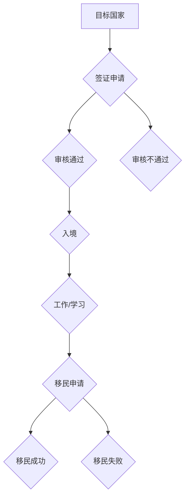

> 程序员，跨国发展，签证，移民，技术移民，绿卡，工作签证，海外就业，职业规划

## 1. 背景介绍

在全球化时代，科技人才的需求日益增长，程序员作为科技领域的核心力量，拥有着广阔的职业发展空间。许多程序员渴望将职业生涯拓展到国际舞台，寻求更优厚的薪资待遇、更先进的技术环境和更丰富的文化体验。然而，跨国发展并非易事，签证和移民政策是程序员海外发展的首要挑战。

本文将深入探讨程序员跨国发展的签证与移民策略，为有志于海外发展的程序员提供全面的指南，帮助他们顺利实现职业梦想。

## 2. 核心概念与联系

**2.1 签证与移民**

* **签证**：是一种允许外国人短期进入特定国家进行特定活动（如旅游、商务、学习等）的许可证。
* **移民**：是指永久或长期定居在另一个国家的过程，通常需要获得该国的永久居留权或公民身份。

**2.2 程序员跨国发展路径**

程序员跨国发展主要有以下几种路径：

* **技术移民**：通过技术专长和技能获得该国的永久居留权或公民身份。
* **工作签证**：获得该国雇主提供的工作签证，允许在该国合法工作一段时间。
* **留学移民**：通过留学获得该国的学位，并申请移民签证。

**2.3 相关政策与法规**

每个国家都有其独特的签证和移民政策，程序员需要了解目标国家的相关政策法规，并根据自身情况选择合适的申请途径。

**2.4 流程图**

## 3. 核心算法原理 & 具体操作步骤

**3.1 算法原理概述**

程序员跨国发展的签证和移民策略可以看作是一个复杂的算法，需要根据不同的输入参数（如国籍、学历、工作经验、技术技能等）进行计算和分析，最终输出最佳的解决方案。

**3.2 算法步骤详解**

1. **信息收集**: 收集目标国家的签证和移民政策信息，包括申请条件、所需材料、费用等。
2. **自身评估**: 评估自身的资质，包括学历、工作经验、技术技能、语言能力等。
3. **方案选择**: 根据自身情况和目标国家政策，选择合适的签证或移民方案。
4. **材料准备**: 准备签证或移民申请所需的材料，包括护照、签证申请表、学历证书、工作证明、语言成绩单等。
5. **提交申请**: 将准备好的材料提交到目标国家的签证或移民机构。
6. **审核等待**: 等待签证或移民机构的审核结果。
7. **后续操作**: 根据审核结果，进行后续操作，如补交材料、参加面试等。

**3.3 算法优缺点**

* **优点**: 能够根据不同的情况提供个性化的解决方案，提高成功率。
* **缺点**: 需要花费大量时间和精力进行信息收集和评估，且政策变化频繁，需要不断更新和调整。

**3.4 算法应用领域**

该算法可以应用于程序员跨国发展的各个阶段，包括签证申请、移民申请、工作机会搜索等。

## 4. 数学模型和公式 & 详细讲解 & 举例说明

**4.1 数学模型构建**

程序员跨国发展的成功率可以看作是一个函数，其输入参数包括程序员的资质、目标国家的政策和申请流程的复杂度等因素。

**4.2 公式推导过程**

由于程序员跨国发展的成功率受到多种因素的影响，难以用一个简单的公式进行精确计算。

**4.3 案例分析与讲解**

假设有两个程序员，A和B，都希望前往美国工作。A拥有硕士学位、5年的工作经验和优秀的英语水平，而B只有本科学位、2年的工作经验和较差的英语水平。根据美国的技术移民政策，A的成功率明显高于B。

## 5. 项目实践：代码实例和详细解释说明

**5.1 开发环境搭建**

程序员可以利用各种在线工具和平台来进行跨国发展规划，例如：

* **签证申请网站**: 提供签证申请流程、所需材料和费用等信息。
* **移民咨询平台**: 提供移民政策咨询、案例分析和申请服务。
* **海外求职网站**: 提供海外工作机会信息和招聘流程。

**5.2 源代码详细实现**

由于跨国发展策略涉及多个方面，无法用代码直接实现。

**5.3 代码解读与分析**

程序员需要根据自身情况和目标国家政策，结合各种工具和平台，制定个性化的跨国发展计划。

**5.4 运行结果展示**

最终的运行结果是程序员成功获得签证或移民身份，并顺利在目标国家工作或生活。

## 6. 实际应用场景

**6.1 案例分析**

许多程序员已经成功通过技术移民、工作签证或留学移民的方式，在海外发展取得了成功。

**6.2 经验分享**

程序员可以从其他人的经验中学习，了解跨国发展的挑战和机遇。

**6.3 未来应用展望**

随着科技发展和全球化进程的加速，程序员跨国发展的趋势将更加明显。

## 7. 工具和资源推荐

**7.1 学习资源推荐**

* **移民政策网站**: 提供目标国家的移民政策信息。
* **签证申请指南**: 提供签证申请流程和所需材料的详细指南。
* **海外求职网站**: 提供海外工作机会信息和招聘流程。

**7.2 开发工具推荐**

* **在线翻译工具**: 帮助程序员理解目标国家的语言。
* **简历制作工具**: 帮助程序员制作符合目标国家的简历。
* **视频会议工具**: 帮助程序员进行远程面试。

**7.3 相关论文推荐**

* **关于技术移民的论文**: 分析技术移民的政策、影响和趋势。
* **关于海外求职的论文**: 研究海外求职市场和程序员的竞争优势。

## 8. 总结：未来发展趋势与挑战

**8.1 研究成果总结**

程序员跨国发展是一个复杂的系统工程，需要综合考虑多个因素，并制定个性化的策略。

**8.2 未来发展趋势**

随着科技发展和全球化进程的加速，程序员跨国发展的趋势将更加明显。

**8.3 面临的挑战**

程序员跨国发展面临着签证和移民政策的复杂性、语言和文化差异、职业竞争等挑战。

**8.4 研究展望**

未来研究可以进一步探索程序员跨国发展的最佳实践、人工智能在跨国发展中的应用以及跨国发展对程序员个人和社会的影响。

## 9. 附录：常见问题与解答

**9.1 常见问题**

* 如何选择合适的签证或移民方案？
* 如何准备签证或移民申请材料？
* 如何应对签证或移民申请的审核？

**9.2 常见解答**

* 程序员需要根据自身情况和目标国家的政策，选择合适的签证或移民方案。
* 程序员需要仔细阅读签证或移民申请指南，并准备齐全的材料。
* 程序员需要积极配合签证或移民机构的审核，并及时解决问题。

作者：禅与计算机程序设计艺术 / Zen and the Art of Computer Programming 
<end_of_turn>