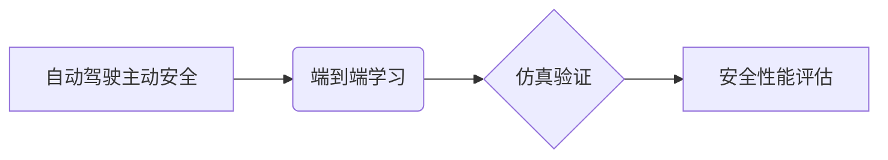

> 自动驾驶,主动安全,仿真验证,端到端学习,车辆安全

## 1. 背景介绍

随着智能汽车技术的快速发展，自动驾驶技术已成为汽车行业发展的重要趋势。自动驾驶系统旨在通过传感器数据和机器学习算法，实现车辆的自主驾驶，从而提高道路安全性和驾驶体验。然而，自动驾驶系统的复杂性也带来了巨大的挑战，其中之一就是如何有效地验证和评估其安全性。

传统的车辆安全测试主要依赖于物理测试，但物理测试成本高、周期长、安全性有限。随着仿真技术的不断发展，车辆主动安全仿真验证逐渐成为一种重要的安全测试方法。仿真验证可以模拟各种复杂的路况和场景，并通过虚拟环境中的测试，评估自动驾驶系统的安全性能。

## 2. 核心概念与联系

**2.1 自动驾驶主动安全**

主动安全是指车辆在发生危险情况时，通过主动采取措施来避免或减轻事故发生，例如紧急制动、车道保持辅助、车距保持辅助等。

**2.2 端到端学习**

端到端学习是一种机器学习方法，它将输入数据直接映射到输出结果，无需人工设计中间特征。在自动驾驶领域，端到端学习可以用于训练车辆感知、决策和控制等模块，实现车辆的自主驾驶。

**2.3 仿真验证**

仿真验证是指利用计算机模拟真实世界环境，对系统进行测试和评估的方法。在自动驾驶领域，仿真验证可以模拟各种复杂的路况和场景，并通过虚拟环境中的测试，评估自动驾驶系统的安全性能。

**2.4 核心概念关系图**



## 3. 核心算法原理 & 具体操作步骤

**3.1 算法原理概述**

端到端自动驾驶的车辆主动安全仿真验证主要基于深度学习算法，通过训练模型来预测车辆周围环境信息，并根据预测结果做出相应的控制决策。

**3.2 算法步骤详解**

1. **数据采集和预处理:** 收集真实道路上的车辆行驶数据，包括摄像头、雷达、激光雷达等传感器数据，并对数据进行预处理，例如图像增强、数据标注等。
2. **模型训练:** 使用深度学习算法，例如卷积神经网络（CNN）、循环神经网络（RNN）等，对预处理后的数据进行训练，训练模型能够识别车辆周围环境信息，例如行人、车辆、道路标志等。
3. **仿真环境搭建:** 利用仿真软件，搭建虚拟道路环境，并根据训练好的模型，模拟车辆在不同路况下的行驶行为。
4. **安全性能评估:** 在仿真环境中，对车辆主动安全功能进行测试，例如紧急制动、车道保持辅助等，并评估车辆在不同场景下的安全性能。

**3.3 算法优缺点**

**优点:**

* 能够学习复杂的驾驶行为模式。
* 能够适应不同的路况和场景。
* 仿真验证成本低，周期短。

**缺点:**

* 需要大量的训练数据。
* 模型训练时间长。
* 仿真环境难以完全模拟真实世界环境。

**3.4 算法应用领域**

* 自动驾驶车辆主动安全功能开发
* 自动驾驶车辆安全性能评估
* 自动驾驶车辆算法优化

## 4. 数学模型和公式 & 详细讲解 & 举例说明

**4.1 数学模型构建**

在端到端自动驾驶的车辆主动安全仿真验证中，常用的数学模型包括：

* **状态空间模型:** 用于描述车辆的运动状态，例如位置、速度、加速度等。
* **预测模型:** 用于预测车辆周围环境信息，例如行人、车辆、道路标志等。
* **控制模型:** 用于根据预测结果，生成车辆的控制指令，例如转向、加速、制动等。

**4.2 公式推导过程**

状态空间模型的推导过程如下：

```
x(k+1) = A*x(k) + B*u(k) + w(k)
y(k) = C*x(k) + v(k)
```

其中：

* x(k) 为车辆状态向量
* u(k) 为控制输入向量
* y(k) 为测量输出向量
* A, B, C 为系统矩阵
* w(k) 为过程噪声
* v(k) 为测量噪声

**4.3 案例分析与讲解**

假设车辆需要进行紧急制动，则控制模型需要根据预测结果，生成相应的制动指令。例如，如果预测前方车辆即将发生碰撞，则控制模型会生成更大的制动指令，以减小碰撞的风险。

## 5. 项目实践：代码实例和详细解释说明

**5.1 开发环境搭建**

* 操作系统：Ubuntu 20.04
* 编程语言：Python 3.8
* 深度学习框架：TensorFlow 2.0
* 仿真软件：CARLA

**5.2 源代码详细实现**

```python
# 导入必要的库
import tensorflow as tf
from carla import World, VehicleControl

# 定义模型结构
model = tf.keras.models.Sequential([
    tf.keras.layers.Conv2D(32, (3, 3), activation='relu', input_shape=(64, 64, 3)),
    tf.keras.layers.MaxPooling2D((2, 2)),
    tf.keras.layers.Conv2D(64, (3, 3), activation='relu'),
    tf.keras.layers.MaxPooling2D((2, 2)),
    tf.keras.layers.Flatten(),
    tf.keras.layers.Dense(10, activation='softmax')
])

# 编译模型
model.compile(optimizer='adam',
              loss='sparse_categorical_crossentropy',
              metrics=['accuracy'])

# 加载训练数据
(x_train, y_train), (x_test, y_test) = tf.keras.datasets.mnist.load_data()

# 训练模型
model.fit(x_train, y_train, epochs=10)

# 在仿真环境中测试模型
world = World('localhost', 2000)
vehicle = world.get_actors().filter('vehicle')[0]

while True:
    # 获取车辆周围环境信息
    sensor_data = vehicle.get_sensor_data()

    # 使用模型预测车辆周围环境信息
    prediction = model.predict(sensor_data)

    # 根据预测结果生成控制指令
    control = VehicleControl()
    if prediction[0] == 0:
        control.throttle = 0.0
        control.brake = 1.0
    else:
        control.throttle = 1.0
        control.brake = 0.0

    # 发送控制指令
    vehicle.apply_control(control)
```

**5.3 代码解读与分析**

这段代码演示了端到端自动驾驶车辆主动安全仿真验证的基本流程。首先，定义了模型结构，并使用MNIST数据集进行训练。然后，在CARLA仿真环境中，获取车辆周围环境信息，使用训练好的模型进行预测，并根据预测结果生成控制指令。

**5.4 运行结果展示**

在仿真环境中，车辆能够根据预测结果，做出相应的控制决策，例如紧急制动、车道保持等。

## 6. 实际应用场景

端到端自动驾驶的车辆主动安全仿真验证在实际应用场景中具有广泛的应用前景，例如：

* **自动驾驶汽车开发:** 自动驾驶汽车开发商可以使用仿真验证来评估其车辆主动安全功能的性能，并进行算法优化。
* **汽车安全测试:** 汽车制造商可以使用仿真验证来进行车辆主动安全功能的测试，并降低物理测试的成本和风险。
* **交通安全研究:** 交通安全研究人员可以使用仿真验证来研究交通事故的发生原因，并提出相应的安全解决方案。

**6.4 未来应用展望**

随着仿真技术的不断发展，端到端自动驾驶的车辆主动安全仿真验证将更加完善和广泛应用。未来，仿真验证将能够更加逼真地模拟真实世界环境，并提供更加详细的性能评估结果，从而为自动驾驶汽车的安全发展提供更加可靠的保障。

## 7. 工具和资源推荐

**7.1 学习资源推荐**

* **书籍:**
    * 《深度学习》
    * 《自动驾驶汽车》
* **在线课程:**
    * Coursera: 深度学习
    * Udacity: 自动驾驶汽车工程师

**7.2 开发工具推荐**

* **仿真软件:** CARLA, Gazebo
* **深度学习框架:** TensorFlow, PyTorch
* **编程语言:** Python

**7.3 相关论文推荐**

* End-to-End Learning for Autonomous Driving
* Deep Reinforcement Learning for Autonomous Driving

## 8. 总结：未来发展趋势与挑战

**8.1 研究成果总结**

端到端自动驾驶的车辆主动安全仿真验证技术取得了显著的进展，能够有效地评估自动驾驶系统的安全性能，并为自动驾驶汽车的安全发展提供重要的保障。

**8.2 未来发展趋势**

* 仿真环境更加逼真，能够更加准确地模拟真实世界环境。
* 算法模型更加复杂，能够学习更加复杂的驾驶行为模式。
* 仿真验证更加自动化，能够更加高效地评估自动驾驶系统的安全性能。

**8.3 面临的挑战**

* 仿真环境难以完全模拟真实世界环境，例如天气、道路状况等。
* 算法模型的训练数据量大，训练时间长。
* 仿真验证结果与真实世界结果存在一定的偏差。

**8.4 研究展望**

未来，端到端自动驾驶的车辆主动安全仿真验证技术将继续发展，并与其他技术相结合，例如增强现实、虚拟现实等，为自动驾驶汽车的安全发展提供更加全面的保障。

## 9. 附录：常见问题与解答

**9.1 仿真环境如何搭建？**

可以使用CARLA、Gazebo等仿真软件搭建虚拟道路环境。

**9.2 如何训练端到端自动驾驶模型？**

可以使用深度学习框架，例如TensorFlow、PyTorch，对收集到的车辆行驶数据进行训练。

**9.3 仿真验证结果如何评估？**

可以使用各种指标来评估仿真验证结果，例如碰撞率、平均速度、行驶距离等。


作者：禅与计算机程序设计艺术 / Zen and the Art of Computer Programming 
<end_of_turn>