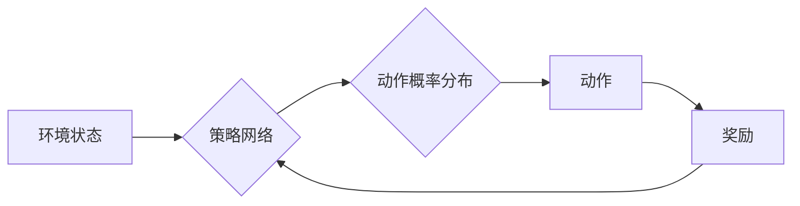

> 策略梯度、强化学习、深度学习、神经网络、价值函数、策略网络、梯度上升

## 1. 背景介绍

强化学习 (Reinforcement Learning, RL) 作为机器学习的一个重要分支，旨在训练智能体在与环境交互的过程中学习最优策略，以最大化累积奖励。策略梯度方法是强化学习中的一种重要算法，它通过直接优化策略网络的参数来学习最优策略，无需估计价值函数。

传统的强化学习算法，例如 Q-learning 和 SARSA，通常需要估计价值函数，而价值函数的估计往往比较复杂，并且容易陷入局部最优。策略梯度方法则直接优化策略网络的参数，避免了价值函数的估计，从而简化了算法的实现，并提高了算法的效率。

## 2. 核心概念与联系

策略梯度方法的核心概念是策略网络和梯度上升。

* **策略网络 (Policy Network)**：策略网络是一个神经网络，它将环境状态作为输入，输出一个动作概率分布。策略网络的参数决定了智能体的行为策略。

* **梯度上升 (Gradient Ascent)**：梯度上升是一种优化算法，它通过计算目标函数的梯度，不断调整参数，使得目标函数的值最大化。

策略梯度方法通过梯度上升算法，不断调整策略网络的参数，使得策略网络输出的动作概率分布能够最大化累积奖励。

**Mermaid 流程图**



## 3. 核心算法原理 & 具体操作步骤

### 3.1  算法原理概述

策略梯度方法的基本原理是利用策略网络输出的动作概率分布，计算策略网络参数的梯度，并通过梯度上升算法更新策略网络的参数。

策略梯度方法的核心公式是：

```
θ = θ + α ∇θ J(θ)
```

其中：

* θ：策略网络的参数
* α：学习率
* J(θ)：策略网络的目标函数，通常定义为累积奖励的期望值

∇θ J(θ)：策略网络目标函数的梯度

### 3.2  算法步骤详解

1. 初始化策略网络的参数 θ。
2. 在环境中与智能体交互，收集环境状态、动作和奖励的数据。
3. 计算策略网络的目标函数 J(θ)。
4. 计算策略网络目标函数的梯度 ∇θ J(θ)。
5. 更新策略网络的参数 θ：

```
θ = θ + α ∇θ J(θ)
```

6. 重复步骤 2-5，直到策略网络收敛。

### 3.3  算法优缺点

**优点：**

* 直接优化策略，无需估计价值函数。
* 可以处理连续动作空间。
* 能够学习复杂的策略。

**缺点：**

* 训练过程可能比较不稳定。
* 需要大量的训练数据。
* 算法参数的选择比较困难。

### 3.4  算法应用领域

策略梯度方法在强化学习领域有着广泛的应用，例如：

* 游戏 AI
* 机器人控制
* 自动驾驶
* 医疗诊断

## 4. 数学模型和公式 & 详细讲解 & 举例说明

### 4.1  数学模型构建

策略梯度方法的核心数学模型是策略网络和目标函数。

* **策略网络 (Policy Network)**：策略网络是一个神经网络，它将环境状态作为输入，输出一个动作概率分布。策略网络的参数可以表示为 θ。

* **目标函数 (Objective Function)**：目标函数通常定义为累积奖励的期望值，即：

```
J(θ) = E[∑t R(s_t, a_t)]
```

其中：

* R(s_t, a_t)：在状态 s_t 执行动作 a_t 得到的奖励
* E[]：期望值
* t：时间步长

### 4.2  公式推导过程

策略梯度方法的目标是最大化目标函数 J(θ)，可以使用梯度上升算法来实现：

```
θ = θ + α ∇θ J(θ)
```

其中：

* α：学习率

∇θ J(θ)：策略网络目标函数的梯度

策略网络目标函数的梯度可以表示为：

```
∇θ J(θ) = E[∇θ log π(a_t | s_t) * R(s_t, a_t)]
```

其中：

* π(a_t | s_t)：在状态 s_t 执行动作 a_t 的概率

### 4.3  案例分析与讲解

假设我们有一个简单的强化学习问题，智能体在一个环境中移动，目标是到达终点。环境状态可以表示为智能体的当前位置，动作可以表示为智能体向左、右、上、下移动。

策略网络可以是一个简单的多层感知机，输入为智能体的当前位置，输出为四个动作的概率分布。目标函数可以定义为到达终点的奖励，其他状态下奖励为 0。

使用策略梯度方法，我们可以通过梯度上升算法不断更新策略网络的参数，使得智能体能够学习到到达终点的最优策略。

## 5. 项目实践：代码实例和详细解释说明

### 5.1  开发环境搭建

本项目使用 Python 语言和 TensorFlow 深度学习框架进行开发。

需要安装以下软件包：

* Python 3.x
* TensorFlow 2.x
* NumPy
* Matplotlib

### 5.2  源代码详细实现

```python
import tensorflow as tf
import numpy as np

# 定义策略网络
class PolicyNetwork(tf.keras.Model):
    def __init__(self, state_dim, action_dim):
        super(PolicyNetwork, self).__init__()
        self.dense1 = tf.keras.layers.Dense(64, activation='relu')
        self.dense2 = tf.keras.layers.Dense(action_dim, activation='softmax')

    def call(self, state):
        x = self.dense1(state)
        return self.dense2(x)

# 定义环境
class CartPoleEnv:
    def __init__(self):
        self.env = gym.make('CartPole-v1')

    def reset(self):
        return self.env.reset()

    def step(self, action):
        observation, reward, done, info = self.env.step(action)
        return observation, reward, done, info

# 定义策略梯度算法
class PolicyGradient:
    def __init__(self, state_dim, action_dim, learning_rate):
        self.state_dim = state_dim
        self.action_dim = action_dim
        self.learning_rate = learning_rate
        self.policy_network = PolicyNetwork(state_dim, action_dim)
        self.optimizer = tf.keras.optimizers.Adam(learning_rate=self.learning_rate)

    def train(self, states, actions, rewards):
        with tf.GradientTape() as tape:
            logits = self.policy_network(states)
            log_probs = tf.math.log(logits)
            loss = -tf.reduce_mean(log_probs * rewards)
        grads = tape.gradient(loss, self.policy_network.trainable_variables)
        self.optimizer.apply_gradients(zip(grads, self.policy_network.trainable_variables))

# 主程序
if __name__ == '__main__':
    state_dim = 4
    action_dim = 2
    learning_rate = 0.01
    policy_gradient = PolicyGradient(state_dim, action_dim, learning_rate)

    env = CartPoleEnv()
    states = []
    actions = []
    rewards = []

    for episode in range(100):
        state = env.reset()
        done = False
        while not done:
            logits = policy_gradient.policy_network(tf.expand_dims(state, axis=0))
            action = tf.random.categorical(logits, num_samples=1)[0, 0]
            next_state, reward, done, info = env.step(action)
            states.append(state)
            actions.append(action)
            rewards.append(reward)
            state = next_state

        policy_gradient.train(tf.convert_to_tensor(states), tf.convert_to_tensor(actions), tf.convert_to_tensor(rewards))

    env.close()
```

### 5.3  代码解读与分析

* **策略网络 (PolicyNetwork)**：定义了一个简单的多层感知机作为策略网络，输入为环境状态，输出为动作概率分布。
* **环境 (CartPoleEnv)**：定义了一个 CartPole 环境，用于模拟智能体在环境中移动的过程。
* **策略梯度算法 (PolicyGradient)**：定义了一个策略梯度算法，包含了策略网络、优化器和训练方法。
* **主程序**:

    * 初始化策略网络、环境和算法参数。
    * 训练策略网络，收集环境状态、动作和奖励数据，并使用策略梯度算法更新策略网络参数。
    * 关闭环境。

### 5.4  运行结果展示

运行代码后，智能体将在 CartPole 环境中学习，并逐渐能够保持平衡。

## 6. 实际应用场景

策略梯度方法在强化学习领域有着广泛的应用，例如：

* **游戏 AI**: 训练游戏 AI 玩家，例如 AlphaGo 和 AlphaZero。
* **机器人控制**: 训练机器人控制策略，例如机器人导航和抓取。
* **自动驾驶**: 训练自动驾驶汽车的控制策略。
* **医疗诊断**: 训练医疗诊断系统，例如预测疾病风险和推荐治疗方案。

### 6.4  未来应用展望

随着深度学习和强化学习技术的不断发展，策略梯度方法在未来将有更广泛的应用场景，例如：

* **个性化推荐**: 训练个性化推荐系统，根据用户的行为和偏好推荐更合适的商品或服务。
* **金融投资**: 训练金融投资策略，例如股票交易和风险管理。
* **自然语言处理**: 训练自然语言处理模型，例如机器翻译和文本生成。

## 7. 工具和资源推荐

### 7.1  学习资源推荐

* **书籍**:
    * Reinforcement Learning: An Introduction by Richard S. Sutton and Andrew G. Barto
    * Deep Reinforcement Learning Hands-On by Maxim Lapan
* **在线课程**:
    * Deep Reinforcement Learning Specialization by DeepLearning.AI
    * Reinforcement Learning by David Silver (University of DeepMind)

### 7.2  开发工具推荐

* **TensorFlow**: 深度学习框架
* **PyTorch**: 深度学习框架
* **OpenAI Gym**: 强化学习环境库

### 7.3  相关论文推荐

* **Reinforcement Learning: An Introduction** by Richard S. Sutton and Andrew G. Barto
* **Deep Reinforcement Learning with Double Q-learning** by Hasselt et al.
* **Proximal Policy Optimization Algorithms** by Schulman et al.

## 8. 总结：未来发展趋势与挑战

### 8.1  研究成果总结

策略梯度方法在强化学习领域取得了显著的成果，例如在游戏 AI、机器人控制和自动驾驶等领域取得了突破性的进展。

### 8.2  未来发展趋势

* **更有效的算法**: 研究更有效的策略梯度算法，例如提高收敛速度、稳定性以及泛化能力。
* **更强大的模型**: 使用更强大的深度学习模型，例如 Transformer 和 Graph Neural Networks，来构建更复杂的策略网络。
* **更丰富的环境**: 开发更丰富的强化学习环境，例如模拟真实世界的复杂场景。

### 8.3  面临的挑战

* **样本效率**: 策略梯度方法通常需要大量的训练数据，如何提高样本效率仍然是一个挑战。
* **稳定性**: 策略梯度方法的训练过程可能比较不稳定，如何提高算法的稳定性也是一个重要的研究方向。
* **可解释性**: 强化学习模型的