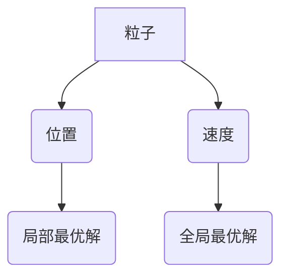

> 粒子群算法，PSO，优化算法，机器学习，人工智能，代码实例，Python

## 1. 背景介绍

在现代科学与工程领域，优化问题无处不在。从工程设计到金融预测，从机器学习到药物研发，优化问题都扮演着至关重要的角色。如何高效地解决这些复杂优化问题一直是研究者们孜孜以求的目标。

粒子群算法(Particle Swarm Optimization，PSO) 作为一种基于群体智能的进化算法，近年来在解决各种优化问题方面展现出强大的潜力。它模拟了鸟群或鱼群觅食的行为，通过粒子间的协作和信息共享，不断逼近最优解。

## 2. 核心概念与联系

**2.1 核心概念**

* **粒子(Particle):**  PSO算法的核心单元，每个粒子代表一个候选解，并拥有两个属性：位置和速度。
* **位置(Position):** 粒子在搜索空间中的坐标，表示一个可能的解。
* **速度(Velocity):** 粒子在搜索空间中的移动方向和速度，决定了粒子在搜索空间中的移动轨迹。
* **全局最优解(Global Best):** 所有粒子中找到的最优解。
* **局部最优解(Personal Best):** 每个粒子自身找到的最优解。

**2.2 联系图**



**2.3 算法流程**

PSO算法的基本流程如下：

1. 初始化粒子群，每个粒子随机生成位置和速度。
2. 计算每个粒子的适应度值，即该粒子对应的解的优劣程度。
3. 更新每个粒子的速度和位置，根据其自身历史最佳位置和全局最佳位置。
4. 重复步骤2和3，直到达到终止条件，例如最大迭代次数或目标精度。

## 3. 核心算法原理 & 具体操作步骤

**3.1 算法原理概述**

PSO算法的核心思想是通过粒子间的协作和信息共享，引导粒子群向全局最优解收敛。每个粒子在搜索过程中，不仅会根据自身的历史最佳位置调整方向，还会参考全局最佳位置，从而避免陷入局部最优解。

**3.2 算法步骤详解**

1. **初始化粒子群:** 随机生成粒子群，每个粒子拥有一个位置向量和一个速度向量。位置向量表示一个候选解，速度向量表示粒子的移动方向和速度。
2. **计算适应度值:**  对于每个粒子，计算其对应的适应度值，即该粒子对应的解的优劣程度。适应度值通常是目标函数的负值，即目标函数越小，适应度值越大。
3. **更新粒子速度和位置:**  根据以下公式更新每个粒子的速度和位置:

    * **速度更新公式:**

    $$v_{i,d}(t+1) = w \cdot v_{i,d}(t) + c_1 \cdot r_1 \cdot (p_{i,d}(t) - x_{i,d}(t)) + c_2 \cdot r_2 \cdot (g_{d}(t) - x_{i,d}(t))$$

    * **位置更新公式:**

    $$x_{i,d}(t+1) = x_{i,d}(t) + v_{i,d}(t+1)$$

    其中:

    * $v_{i,d}(t)$: 粒子 $i$ 在维度 $d$ 上的速度在时间 $t$ 时刻
    * $x_{i,d}(t)$: 粒子 $i$ 在维度 $d$ 上的位置在时间 $t$ 时刻
    * $p_{i,d}(t)$: 粒子 $i$ 在维度 $d$ 上的个人最佳位置
    * $g_{d}(t)$: 全局最佳位置在维度 $d$ 上
    * $w$: 惯性权重，控制粒子的速度衰减
    * $c_1$: 自信度系数，控制粒子对自身历史最佳位置的吸引力
    * $c_2$: 社会系数，控制粒子对全局最佳位置的吸引力
    * $r_1$, $r_2$: 随机数，均匀分布在 [0, 1] 之间

4. **重复步骤2-3:** 重复步骤2和3，直到达到终止条件，例如最大迭代次数或目标精度。

**3.3 算法优缺点**

**优点:**

* 简单易实现
* 具有较强的全局搜索能力
* 适应性强，可以应用于各种优化问题

**缺点:**

* 容易陷入局部最优解
* 收敛速度较慢
* 参数选择对算法性能影响较大

**3.4 算法应用领域**

PSO算法广泛应用于以下领域:

* **机器学习:** 参数优化、神经网络训练
* **人工智能:** 智能控制、机器人导航
* **工程设计:** 结构优化、路径规划
* **金融预测:** 股票价格预测、风险管理
* **图像处理:** 图像分割、目标检测

## 4. 数学模型和公式 & 详细讲解 & 举例说明

**4.1 数学模型构建**

PSO算法的数学模型可以描述为一个多维空间中的粒子群运动过程。每个粒子在搜索空间中移动，其速度和位置由以下公式决定:

* **速度更新公式:**

$$v_{i,d}(t+1) = w \cdot v_{i,d}(t) + c_1 \cdot r_1 \cdot (p_{i,d}(t) - x_{i,d}(t)) + c_2 \cdot r_2 \cdot (g_{d}(t) - x_{i,d}(t))$$

* **位置更新公式:**

$$x_{i,d}(t+1) = x_{i,d}(t) + v_{i,d}(t+1)$$

其中:

* $v_{i,d}(t)$: 粒子 $i$ 在维度 $d$ 上的速度在时间 $t$ 时刻
* $x_{i,d}(t)$: 粒子 $i$ 在维度 $d$ 上的位置在时间 $t$ 时刻
* $p_{i,d}(t)$: 粒子 $i$ 在维度 $d$ 上的个人最佳位置
* $g_{d}(t)$: 全局最佳位置在维度 $d$ 上
* $w$: 惯性权重，控制粒子的速度衰减
* $c_1$: 自信度系数，控制粒子对自身历史最佳位置的吸引力
* $c_2$: 社会系数，控制粒子对全局最佳位置的吸引力
* $r_1$, $r_2$: 随机数，均匀分布在 [0, 1] 之间

**4.2 公式推导过程**

PSO算法的公式推导过程主要基于以下几个假设:

* 粒子在搜索空间中以随机的方式移动。
* 粒子的速度和位置受到自身历史最佳位置和全局最佳位置的影响。
* 粒子的速度衰减率由惯性权重控制。

基于这些假设，我们可以推导出速度更新公式和位置更新公式。

**4.3 案例分析与讲解**

假设我们想要使用PSO算法优化一个简单的目标函数:

$$f(x) = x^2$$

其中 $x$ 是一个实数变量。

我们可以将PSO算法应用于该目标函数的优化，并观察其收敛过程。

## 5. 项目实践：代码实例和详细解释说明

**5.1 开发环境搭建**

本项目使用Python语言进行开发，需要安装以下库:

* NumPy: 用于数值计算
* Matplotlib: 用于数据可视化

可以使用以下命令安装这些库:

```bash
pip install numpy matplotlib
```

**5.2 源代码详细实现**

```python
import numpy as np
import matplotlib.pyplot as plt

# 定义目标函数
def objective_function(x):
    return x**2

# 定义PSO算法
def pso(x_bounds, num_particles, max_iterations, inertia_weight, cognitive_coefficient, social_coefficient):
    # 初始化粒子群
    particles = np.random.uniform(x_bounds[0], x_bounds[1], size=(num_particles, 1))
    velocities = np.zeros((num_particles, 1))
    personal_bests = particles.copy()
    best_fitness = np.inf

    # 迭代优化
    for iteration in range(max_iterations):
        # 计算适应度值
        fitness = objective_function(particles)

        # 更新个人最佳位置
        for i in range(num_particles):
            if fitness[i] < objective_function(personal_bests[i]):
                personal_bests[i] = particles[i]

        # 更新全局最佳位置
        global_best = personal_bests[np.argmin(fitness)]
        global_fitness = objective_function(global_best)

        # 更新粒子速度和位置
        for i in range(num_particles):
            velocities[i] = inertia_weight * velocities[i] + cognitive_coefficient * np.random.rand() * (personal_bests[i] - particles[i]) + social_coefficient * np.random.rand() * (global_best - particles[i])
            particles[i] = particles[i] + velocities[i]

        # 更新最佳解
        if global_fitness < best_fitness:
            best_fitness = global_fitness

    return global_best, best_fitness

# 设置参数
x_bounds = [-5, 5]
num_particles = 50
max_iterations = 100
inertia_weight = 0.7
cognitive_coefficient = 1.5
social_coefficient = 1.5

# 执行PSO算法
best_x, best_fitness = pso(x_bounds, num_particles, max_iterations, inertia_weight, cognitive_coefficient, social_coefficient)

# 打印结果
print(f"最佳解: {best_x}")
print(f"最佳适应度: {best_fitness}")

# 可视化结果
plt.plot(objective_function(np.linspace(x_bounds[0], x_bounds[1], 100)))
plt.plot(best_x, objective_function(best_x), 'ro')
plt.xlabel("x")
plt.ylabel("f(x)")
plt.title("PSO算法优化结果")
plt.show()
```

**5.3 代码解读与分析**

* **目标函数定义:**  `objective_function(x)` 函数定义了需要优化的目标函数。
* **PSO算法定义:** `pso()` 函数实现了PSO算法的核心逻辑，包括粒子初始化、适应度计算、个人最佳位置更新、全局最佳位置更新、粒子速度和位置更新。
* **参数设置:**  `x_bounds` 设置了搜索空间的范围，`num_particles` 设置了粒子群的大小，`max_iterations` 设置了最大迭代次数，`inertia_weight` 设置了惯性权重，`cognitive_coefficient` 和 `social_coefficient` 设置了认知系数和社会系数。
* **算法执行:**  调用 `pso()` 函数执行PSO算法，并获取最佳解和最佳适应度。
* **结果展示:**  打印最佳解和最佳适应度，并使用Matplotlib绘制目标函数图像和最佳解位置。

**5.4 运行结果展示**

运行代码后，会输出最佳解和最佳适应度，并绘制目标函数图像和最佳解位置。

## 6. 实际应用场景

PSO算法在实际应用中展现出强大的潜力，以下是一些具体的应用场景:

* **机器学习:**

    * **参数优化:** PSO算法可以用于优化机器学习模型的参数，例如神经网络的权重