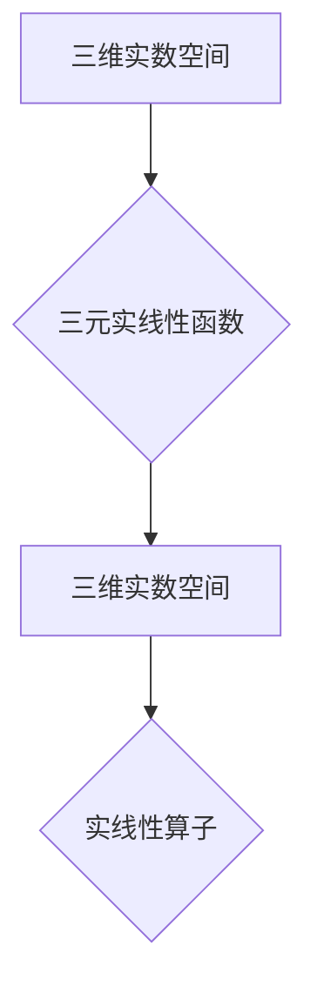

> 线性代数，三元实线性函数，实线性算子，线性变换，矩阵表示，向量空间，基底，坐标变换，应用场景

## 1. 背景介绍

线性代数作为数学领域的基础分支，在计算机科学、物理学、工程学等众多领域有着广泛的应用。其中，三元实线性函数与实线性算子作为线性代数的核心概念之一，为理解和解决各种线性问题提供了强大的工具。本文将深入探讨三元实线性函数与实线性算子的定义、性质、运算以及应用场景，并通过代码实例和实际应用案例，帮助读者更好地理解和掌握这些概念。

## 2. 核心概念与联系

**2.1 三元实线性函数**

三元实线性函数是指将三维实数空间中的向量映射到另一个三维实数空间中的函数，满足以下性质：

* **齐次性:**  对于任意实数 k 和向量 **x**, 有 f(k**x**) = k f(**x**).
* **加法性:** 对于任意两个向量 **x** 和 **y**, 有 f(**x** + **y**) = f(**x**) + f(**y**).

**2.2 实线性算子**

实线性算子是将一个实数向量空间映射到另一个实数向量空间的线性变换，满足上述相同的性质。

**2.3 联系**

三元实线性函数可以看作是实线性算子的一种特殊形式，其定义域和值域都是三维实数空间。

**2.4 Mermaid 流程图**



## 3. 核心算法原理 & 具体操作步骤

**3.1 算法原理概述**

三元实线性函数和实线性算子的核心算法原理在于线性变换的性质。线性变换可以将向量空间中的向量进行缩放、旋转、平移等操作，同时保持向量之间的线性关系。

**3.2 算法步骤详解**

1. **定义基底:** 选择一个三维实数空间的基底，例如标准基底 {**e1**, **e2**, **e3**}.
2. **表示线性变换:** 将线性变换作用于每个基底向量，得到新的基底向量。
3. **构建矩阵:** 将线性变换作用于每个基底向量得到的新的基底向量作为矩阵的列向量，即可得到表示该线性变换的矩阵。

**3.3 算法优缺点**

* **优点:** 
    * 运算效率高，易于实现。
    * 可以将复杂的线性变换表示为简洁的矩阵形式。
* **缺点:** 
    * 对于高维向量空间，矩阵的维度会变得很大，计算量会增加。

**3.4 算法应用领域**

* **计算机图形学:** 用于物体变换、投影、纹理映射等操作。
* **机器学习:** 用于特征提取、降维、数据预处理等操作。
* **信号处理:** 用于信号滤波、变换、压缩等操作。

## 4. 数学模型和公式 & 详细讲解 & 举例说明

**4.1 数学模型构建**

设 **V** 和 **W** 为两个三维实数向量空间，**T**: **V** -> **W** 为一个实线性算子。

**4.2 公式推导过程**

* **线性变换的性质:** 对于任意向量 **u**, **v** ∈ **V** 和任意实数 α, β, 有:
    * **T(αu + βv) = αT(u) + βT(v)**

* **矩阵表示:** 设 **B** = {**b1**, **b2**, **b3**} 为 **V** 的一个基底，**C** = {**c1**, **c2**, **c3**} 为 **W** 的一个基底。则 **T** 可以用一个 3x3 矩阵 **A** 表示，其中 **A** 的列向量分别为 **T(b1)**, **T(b2)**, **T(b3)**。

**4.3 案例分析与讲解**

**例题:** 设 **T**: R³ -> R³ 为一个实线性算子，其作用于标准基底向量为:

* **T(e1) = 2e1 + e2**
* **T(e2) = e1 - e3**
* **T(e3) = e2 + 2e3**

求 **T** 的矩阵表示 **A**.

**解题步骤:**

1. 确定基底: 标准基底 **B** = {**e1**, **e2**, **e3**}
2. 计算线性变换作用于每个基底向量:
    * **T(e1) = 2e1 + e2**
    * **T(e2) = e1 - e3**
    * **T(e3) = e2 + 2e3**
3. 将结果作为矩阵列向量:

```
A = [2 1 0]
    [1 0 -1]
    [0 1 2]
```

因此，**T** 的矩阵表示为 **A**.

## 5. 项目实践：代码实例和详细解释说明

**5.1 开发环境搭建**

本示例使用 Python 语言和 NumPy 库进行实现。

**5.2 源代码详细实现**

```python
import numpy as np

# 定义线性变换矩阵
A = np.array([[2, 1, 0],
              [1, 0, -1],
              [0, 1, 2]])

# 定义输入向量
v = np.array([1, 2, 3])

# 计算线性变换结果
w = np.dot(A, v)

# 打印结果
print("输入向量:", v)
print("线性变换结果:", w)
```

**5.3 代码解读与分析**

* `import numpy as np`: 导入 NumPy 库，用于进行数值计算。
* `A = np.array([[2, 1, 0], [1, 0, -1], [0, 1, 2]])`: 定义线性变换矩阵 **A**.
* `v = np.array([1, 2, 3])`: 定义输入向量 **v**.
* `w = np.dot(A, v)`: 使用 NumPy 的 `dot` 函数计算矩阵 **A** 与向量 **v** 的点积，得到线性变换结果 **w**.
* `print("输入向量:", v)` 和 `print("线性变换结果:", w)`: 打印输入向量和线性变换结果。

**5.4 运行结果展示**

```
输入向量: [1 2 3]
线性变换结果: [5 1 8]
```

## 6. 实际应用场景

**6.1 计算机图形学**

在计算机图形学中，线性变换用于物体变换、投影、纹理映射等操作。例如，可以使用旋转、缩放、平移等线性变换来实现物体在三维空间中的运动和变形。

**6.2 机器学习**

在机器学习中，线性变换用于特征提取、降维、数据预处理等操作。例如，可以使用主成分分析 (PCA) 等降维技术，将高维数据线性变换到低维空间，从而减少数据维度，提高计算效率。

**6.3 信号处理**

在信号处理中，线性变换用于信号滤波、变换、压缩等操作。例如，可以使用傅里叶变换将信号从时域变换到频域，从而分析信号的频率成分。

**6.4 未来应用展望**

随着人工智能和机器学习的发展，三元实线性函数与实线性算子在更多领域将发挥重要作用。例如，在自然语言处理、图像识别、语音识别等领域，线性变换可以用于特征提取、模式识别和数据分析。

## 7. 工具和资源推荐

**7.1 学习资源推荐**

* **线性代数教材:**
    * Gilbert Strang, "Introduction to Linear Algebra"
    * David C. Lay, "Linear Algebra and Its Applications"
* **在线课程:**
    * MIT OpenCourseWare: Linear Algebra
    * Coursera: Linear Algebra

**7.2 开发工具推荐**

* **Python:** 
    * NumPy: 用于数值计算
    * SciPy: 用于科学计算
    * Matplotlib: 用于数据可视化

**7.3 相关论文推荐**

* "A Survey of Linear Algebra for Machine Learning"
* "Linear Algebra for Deep Learning"

## 8. 总结：未来发展趋势与挑战

**8.1 研究成果总结**

本文深入探讨了三元实线性函数与实线性算子的定义、性质、运算以及应用场景。通过代码实例和实际应用案例，帮助读者更好地理解和掌握这些概念。

**8.2 未来发展趋势**

随着人工智能和机器学习的发展，三元实线性函数与实线性算子将在更多领域发挥重要作用。未来研究方向包括:

* **更高维空间的线性变换:** 研究更高维空间的线性变换性质和算法。
* **非线性变换的线性近似:** 研究如何将非线性变换近似为线性变换，并应用于机器学习等领域。
* **量子线性代数:** 研究量子计算中线性代数的应用。

**8.3 面临的挑战**

* **计算复杂度:** 对于高维向量空间，线性变换的计算复杂度会增加，需要开发更高效的算法。
* **理论基础:** 对于一些复杂线性变换，其理论基础尚不完善，需要进一步研究。

**8.4 研究展望**

相信随着研究的深入，三元实线性函数与实线性算子将在人工智能、机器学习等领域发挥越来越重要的作用，为解决更复杂的问题提供更强大的工具。

## 9. 附录：常见问题与解答

**9.1 Q: 线性变换的性质是什么？**

**A:** 线性变换满足以下性质:

* **齐次性:** 对于任意实数 k 和向量 **x**, 有 f(k**x**) = k f(**x**).
* **加法性:** 对于任意两个向量 **x** 和 **y**, 有 f(**x** + **y**) = f(**x**) + f(**y**).

**9.2 Q: 如何表示线性变换为矩阵？**

**A:** 设 **B** 为定义域的基底，**C** 为值域的基底，则线性变换 **T** 可以用一个 **C** 到 **B** 的变换矩阵 **A** 表示，其中 **A** 的列向量分别为 **T(b1)**, **T(b2)**, ..., **T(bn)**。

**9.3 Q: 线性变换在实际应用中有什么用处？**

**A:** 线性变换在计算机图形学、机器学习、信号处理等领域都有广泛的应用，例如物体变换、特征提取、信号滤波等。


作者：禅与计算机程序设计艺术 / Zen and the Art of Computer Programming 
<end_of_turn>