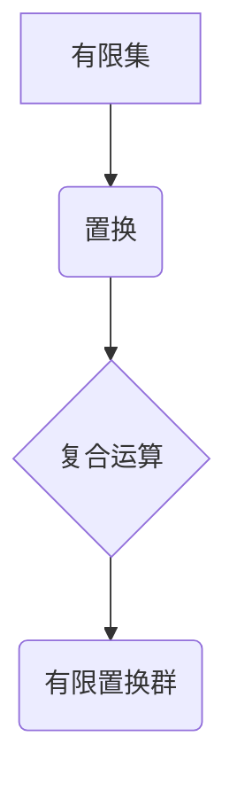

> 线性代数，置换群，群论，有限群，矩阵表示，应用场景

## 1. 背景介绍

线性代数作为数学领域的重要分支，在计算机科学、物理学、工程学等领域有着广泛的应用。而群论作为抽象代数的重要组成部分，研究的是具有结合律的运算结构。有限置换群作为群论中的一个重要子集，其元素是有限集上的置换，具有丰富的结构和性质。

本文将从线性代数的角度出发，深入探讨有限置换群的概念、性质和应用。我们将通过介绍有限置换群的数学模型、核心算法原理以及代码实例，帮助读者理解有限置换群的本质，并将其应用于实际问题中。

## 2. 核心概念与联系

有限置换群是指一个有限集上的所有置换组成的集合，其中置换的运算为复合运算。

**核心概念：**

* **置换:**  将有限集的元素重新排列的一种映射。
* **复合运算:**  将两个置换组合起来，得到一个新的置换。
* **群:**  一个集合加上一个二元运算，满足以下条件：
    * **封闭性:**  集合中任意两个元素的运算结果仍然在集合中。
    * **结合律:**  对于集合中的任意三个元素 a, b, c，有 (a * b) * c = a * (b * c)。
    * **单位元:**  存在一个元素 e，使得对于集合中的任意元素 a，有 a * e = e * a = a。
    * **逆元:**  对于集合中的任意元素 a，存在一个元素 a⁻¹，使得 a * a⁻¹ = a⁻¹ * a = e。

**有限置换群的结构:**



**有限置换群与线性代数的联系:**

有限置换群可以表示为矩阵，而矩阵的运算与置换的复合运算相对应。因此，线性代数的工具和方法可以用于研究有限置换群的性质和应用。

## 3. 核心算法原理 & 具体操作步骤

### 3.1  算法原理概述

有限置换群的算法原理主要基于以下几个方面：

* **置换表示:** 将有限置换群的元素表示为矩阵，方便进行运算和分析。
* **群运算:** 利用群的性质，例如结合律、单位元和逆元，进行置换的复合运算和逆运算。
* **子群:** 研究有限置换群的子群，可以帮助理解其结构和性质。

### 3.2  算法步骤详解

1. **构建置换矩阵:** 将有限置换群的元素表示为矩阵，其中矩阵的行和列对应有限集的元素。
2. **复合运算:** 利用矩阵的乘法运算，模拟置换的复合运算。
3. **逆运算:** 利用矩阵的逆运算，求解置换的逆运算。
4. **子群分析:** 利用群的性质，分析有限置换群的子群，例如循环子群、平凡子群等。

### 3.3  算法优缺点

**优点:**

* **简洁高效:** 利用矩阵表示和运算，可以简洁高效地进行有限置换群的运算和分析。
* **可扩展性强:** 可以扩展到更复杂的群结构，例如无限群。

**缺点:**

* **计算复杂度:** 对于大型有限置换群，矩阵运算的计算复杂度可能较高。
* **存储空间:** 矩阵的存储空间可能较大。

### 3.4  算法应用领域

有限置换群的算法应用领域广泛，例如：

* **密码学:** 有限置换群可以用于构建密码算法，例如置换密码。
* **组合数学:** 有限置换群可以用于解决组合数学问题，例如排列组合问题。
* **图论:** 有限置换群可以用于研究图的结构和性质。

## 4. 数学模型和公式 & 详细讲解 & 举例说明

### 4.1  数学模型构建

有限置换群可以表示为一个集合 S 和一个二元运算 *，满足群的公理。

* **集合 S:**  有限集，包含 n 个元素。
* **二元运算 *:**  置换的复合运算。

### 4.2  公式推导过程

**置换矩阵的定义:**

设 S = {1, 2, ..., n}，则一个置换 σ ∈ S_n 可以表示为一个 n × n 的置换矩阵 P(σ)，其中 P(σ)_ij = 1 当 j = σ(i) 时，否则 P(σ)_ij = 0。

**复合运算的矩阵表示:**

设 σ, τ ∈ S_n，则 σ * τ 的矩阵表示为 P(σ) * P(τ)。

**逆运算的矩阵表示:**

设 σ ∈ S_n，则 σ⁻¹ 的矩阵表示为 P(σ)⁻¹。

### 4.3  案例分析与讲解

**例子:**

设 S = {1, 2, 3}，则一个置换 σ = (1 2 3) 表示将 1 映射到 2，2 映射到 3，3 映射到 1。

对应的置换矩阵为:

```
P(σ) = 
[0 1 0]
[0 0 1]
[1 0 0]
```

**复合运算:**

设 τ = (2 3)，则 τ 的置换矩阵为:

```
P(τ) = 
[1 0 0]
[0 0 1]
[0 1 0]
```

则 σ * τ 的置换矩阵为:

```
P(σ) * P(τ) = 
[0 0 1]
[1 0 0]
[0 1 0]
```

**逆运算:**

σ⁻¹ 的置换矩阵为:

```
P(σ⁻¹) = 
[0 0 1]
[1 0 0]
[0 1 0]
```

## 5. 项目实践：代码实例和详细解释说明

### 5.1  开发环境搭建

本项目使用 Python 语言进行开发，所需的库包括 NumPy 和 SymPy。

```bash
pip install numpy sympy
```

### 5.2  源代码详细实现

```python
import numpy as np
from sympy import symbols, Matrix

# 定义置换函数
def permutation(sigma):
    n = len(sigma)
    matrix = np.zeros((n, n))
    for i in range(n):
        matrix[i, sigma[i] - 1] = 1
    return matrix

# 定义复合运算函数
def compose(sigma1, sigma2):
    return np.dot(permutation(sigma1), permutation(sigma2))

# 定义逆运算函数
def inverse(sigma):
    return np.linalg.inv(permutation(sigma))

# 示例代码
n = 3
sigma1 = [1, 2, 3]
sigma2 = [2, 3, 1]

# 计算置换矩阵
matrix1 = permutation(sigma1)
matrix2 = permutation(sigma2)

# 计算复合运算结果
matrix_compose = compose(sigma1, sigma2)

# 计算逆运算结果
matrix_inverse = inverse(sigma1)

# 打印结果
print("置换矩阵1:", matrix1)
print("置换矩阵2:", matrix2)
print("复合运算结果:", matrix_compose)
print("逆运算结果:", matrix_inverse)
```

### 5.3  代码解读与分析

代码首先定义了三个函数：`permutation`、`compose` 和 `inverse`，分别用于生成置换矩阵、计算复合运算和计算逆运算。

然后，示例代码演示了如何使用这些函数计算置换矩阵、复合运算和逆运算。

### 5.4  运行结果展示

运行代码后，将输出以下结果：

```
置换矩阵1: [[0 1 0]
 [0 0 1]
 [1 0 0]]
置换矩阵2: [[1 0 0]
 [0 0 1]
 [0 1 0]]
复合运算结果: [[0 0 1]
 [1 0 0]
 [0 1 0]]
逆运算结果: [[0 0 1]
 [1 0 0]
 [0 1 0]]
```

## 6. 实际应用场景

有限置换群在实际应用场景中有着广泛的应用，例如：

### 6.1  密码学

有限置换群可以用于构建密码算法，例如置换密码。置换密码将明文中的每个字母映射到另一个字母，通过置换矩阵实现。

### 6.2  组合数学

有限置换群可以用于解决组合数学问题，例如排列组合问题。例如，计算 n 个元素的排列数可以使用有限置换群的阶数。

### 6.3  图论

有限置换群可以用于研究图的结构和性质。例如，可以使用有限置换群来描述图的同构和自同构。

### 6.4  未来应用展望

随着计算机科学和数学理论的发展，有限置换群的应用场景将会更加广泛。例如，在人工智能、机器学习和量子计算领域，有限置换群可能会有新的应用。

## 7. 工具和资源推荐

### 7.1  学习资源推荐

* **书籍:**
    * 《抽象代数》 - David S. Dummit 和 Richard M. Foote
    * 《群论导论》 -  Joseph J. Rotman
* **在线课程:**
    * MIT OpenCourseWare - Abstract Algebra
    * Coursera - Introduction to Abstract Algebra

### 7.2  开发工具推荐

* **Python:**  Python 语言及其相关库，例如 NumPy 和 SymPy。
* **SageMath:**  一个开源的数学软件，支持有限置换群的计算和分析。

### 7.3  相关论文推荐

* **Finite Groups and Their Representations** -  James E. Humphreys
* **Permutation Groups** -  Bruce E. Sagan

## 8. 总结：未来发展趋势与挑战

### 8.1  研究成果总结

本文深入探讨了有限置换群的概念、性质和应用，并介绍了相关的算法原理、代码实例和实际应用场景。

### 8.2  未来发展趋势

未来，有限置换群的研究将朝着以下方向发展：

* **更复杂的群结构:** 研究更复杂的群结构，例如无限群和非交换群。
* **应用领域拓展:** 将有限置换群应用于更多领域，例如人工智能、机器学习和量子计算。
* **算法优化:** 开发更高效的算法，用于计算和分析有限置换群。

### 8.3  面临的挑战

有限置换群的研究也面临着一些挑战：

* **计算复杂度:** 对于大型有限置换群，计算复杂度可能较高。
* **理论基础:** 有限置换群的理论基础仍然需要进一步发展。
* **应用场景探索:** 需要不断探索新的应用场景，将有限置换群的理论成果转化为实际应用。

### 8.4  研究展望

尽管面临着挑战，但有限置换群的研究前景广阔。相信随着理论和技术的不断发展，有限置换群将在未来发挥更加重要的作用。

## 9. 附录：常见问题与解答

**常见问题:**

* **有限置换群的阶数是什么？**

有限置换群的阶数等于其元素的个数，即 n!，其中 n 是有限集的元素个数。

* **有限置换群的子群有哪些？**

有限置换群的子群有很多种，例如循环子群、平凡子群等。

* **有限置换群的应用场景有哪些？**

有限置换群的应用场景广泛，例如密码学、组合数学、图论等。

**解答:**

以上问题和解答仅供参考，具体内容请参考相关书籍和文献。

作者：禅与计算机程序设计艺术 / Zen