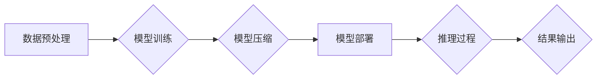

>  LLM,绿色 AI,能效优化,可持续发展,深度学习,模型压缩,量子计算

## 1. 背景介绍

近年来，大型语言模型 (LLM) 在自然语言处理领域取得了令人瞩目的成就，展现出强大的文本生成、翻译、问答和代码生成能力。然而，LLM 的训练和部署也带来了巨大的能源消耗和碳排放问题，这严重阻碍了其可持续发展。

传统 LLM 的训练通常需要庞大的计算资源和海量数据，耗费大量电能，产生大量的二氧化碳排放。例如，训练 GPT-3 需要消耗相当于 120 万辆汽车行驶一年的能源。这种高能耗特性不仅对环境造成负担，也增加了 LLM 的部署成本和维护难度。

因此，开发绿色、高效、可持续的 LLM 技术成为当务之急。绿色 LLM 技术旨在通过优化模型架构、训练方法和部署方式，降低 LLM 的能耗和碳排放，使其更加环保和可持续。

## 2. 核心概念与联系

绿色 LLM 技术的核心概念包括：

* **能效优化:** 降低 LLM 的训练和推理过程中的能耗。
* **模型压缩:** 减少模型参数量和模型大小，从而降低计算资源需求。
* **高效训练方法:** 开发新的训练算法和策略，提高训练效率和降低能耗。
* **可持续部署:** 选择低能耗的硬件平台和部署方式，减少 LLM 的运行成本和环境影响。

**Mermaid 流程图:**



## 3. 核心算法原理 & 具体操作步骤

### 3.1  算法原理概述

绿色 LLM 技术的算法原理主要基于以下几个方面：

* **模型剪枝:** 通过移除模型中不重要的参数或连接，减少模型参数量和计算复杂度。
* **量化:** 将模型参数从高精度浮点数转换为低精度整数，降低内存占用和计算成本。
* **知识蒸馏:** 将大型模型的知识迁移到小型模型中，实现模型压缩和性能提升。
* **联邦学习:** 将模型训练分散到多个设备上，避免数据集中化和传输，降低能耗和隐私风险。

### 3.2  算法步骤详解

**模型剪枝:**

1. **选择剪枝策略:** 常用的剪枝策略包括 L1 正则化、随机剪枝和梯度下降剪枝等。
2. **训练模型:** 使用原始模型进行预训练，获得模型权重。
3. **剪枝操作:** 根据选择的剪枝策略，移除模型中不重要的参数或连接。
4. **微调模型:** 使用剪枝后的模型进行微调，恢复模型性能。

**量化:**

1. **选择量化方法:** 常用的量化方法包括全精度量化、混合精度量化和动态量化等。
2. **量化模型:** 将模型参数从高精度浮点数转换为低精度整数。
3. **微调模型:** 使用量化后的模型进行微调，恢复模型性能。

**知识蒸馏:**

1. **选择教师模型和学生模型:** 教师模型是预训练的大型模型，学生模型是需要训练的小型模型。
2. **训练学生模型:** 使用教师模型的输出作为监督信号，训练学生模型。
3. **评估学生模型:** 评估学生模型的性能，并进行微调。

**联邦学习:**

1. **数据分发:** 将训练数据分散到多个设备上。
2. **模型训练:** 在每个设备上训练模型，并更新模型参数。
3. **参数聚合:** 将每个设备的模型参数聚合到一个中心服务器上。
4. **模型更新:** 使用聚合后的参数更新全局模型。

### 3.3  算法优缺点

**模型剪枝:**

* **优点:** 可以有效减少模型参数量和计算复杂度，提高模型推理速度。
* **缺点:** 剪枝操作可能会导致模型性能下降，需要进行仔细的调参和评估。

**量化:**

* **优点:** 可以显著降低模型内存占用和计算成本，提高模型部署效率。
* **缺点:** 量化操作可能会导致模型精度下降，需要选择合适的量化方法和精度。

**知识蒸馏:**

* **优点:** 可以将大型模型的知识迁移到小型模型中，实现模型压缩和性能提升。
* **缺点:** 需要训练两个模型，训练时间和资源消耗较高。

**联邦学习:**

* **优点:** 可以保护数据隐私，避免数据集中化和传输，提高数据安全性和可信度。
* **缺点:** 需要协调多个设备的训练过程，通信成本较高，模型训练效率可能较低。

### 3.4  算法应用领域

绿色 LLM 技术的应用领域广泛，包括：

* **自然语言处理:** 文本生成、翻译、问答、情感分析等。
* **计算机视觉:** 图像识别、物体检测、图像分割等。
* **语音识别:** 语音转文本、语音合成等。
* **推荐系统:** 商品推荐、内容推荐等。
* **医疗保健:** 疾病诊断、药物研发等。

## 4. 数学模型和公式 & 详细讲解 & 举例说明

### 4.1  数学模型构建

**模型剪枝:**

模型剪枝的目标是找到一个子模型，其性能接近原始模型，但参数量和计算复杂度更低。常用的剪枝方法基于梯度下降，通过移除参数权重较小的连接或节点来实现模型压缩。

**量化:**

模型量化将模型参数从高精度浮点数转换为低精度整数，可以显著降低模型内存占用和计算成本。常用的量化方法包括全精度量化、混合精度量化和动态量化。

**知识蒸馏:**

知识蒸馏的目标是将大型模型的知识迁移到小型模型中。知识蒸馏方法通常使用教师模型的输出作为监督信号，训练学生模型。

**联邦学习:**

联邦学习的目标是训练一个全局模型，而无需将训练数据集中到一个中心服务器上。联邦学习方法通常使用参数聚合技术，将每个设备的模型参数聚合到一个中心服务器上，并更新全局模型。

### 4.2  公式推导过程

**模型剪枝:**

模型剪枝的目标函数通常是模型性能和参数量的折中。

$$
Loss = \alpha \cdot Accuracy + \beta \cdot Size
$$

其中，$Accuracy$ 是模型的准确率，$Size$ 是模型的参数量，$\alpha$ 和 $\beta$ 是权重系数。

**量化:**

量化方法通常使用量化函数将浮点数转换为整数。

$$
Q(x) = \text{round}(x \cdot Q)
$$

其中，$x$ 是浮点数，$Q$ 是量化因子。

**知识蒸馏:**

知识蒸馏的目标函数通常是学生模型的损失函数和教师模型的输出之间的差异。

$$
Loss = \text{Student Loss} + \lambda \cdot \text{KL Divergence}(Student Output, Teacher Output)
$$

其中，$\lambda$ 是权重系数。

**联邦学习:**

联邦学习的模型更新公式通常是每个设备的模型参数的加权平均。

$$
\theta_{t+1} = \frac{1}{N} \sum_{i=1}^{N} \theta_{i,t}
$$

其中，$\theta_{t+1}$ 是全局模型的参数，$\theta_{i,t}$ 是第 $i$ 个设备的模型参数。

### 4.3  案例分析与讲解

**模型剪枝:**

在自然语言处理任务中，模型剪枝可以有效减少模型参数量和计算复杂度，提高模型推理速度。例如，研究人员使用模型剪枝技术将 BERT 模型的规模从 340M 参数压缩到 10M 参数，同时保持了模型性能。

**量化:**

在计算机视觉任务中，模型量化可以显著降低模型内存占用和计算成本，提高模型部署效率。例如，研究人员使用量化技术将 ResNet 模型的精度从 FP32 降低到 INT8，同时降低了模型大小和计算成本。

**知识蒸馏:**

在语音识别任务中，知识蒸馏可以将大型语音识别模型的知识迁移到小型模型中，实现模型压缩和性能提升。例如，研究人员使用知识蒸馏技术将一个大型语音识别模型的知识迁移到一个小型模型中，同时保持了模型性能。

**联邦学习:**

在医疗保健领域，联邦学习可以保护患者隐私，避免数据集中化和传输，提高数据安全性和可信度。例如，研究人员使用联邦学习技术训练一个用于疾病诊断的模型，而无需将患者数据集中到一个中心服务器上。

## 5. 项目实践：代码实例和详细解释说明

### 5.1  开发环境搭建

* **操作系统:** Ubuntu 20.04 LTS
* **编程语言:** Python 3.8
* **深度学习框架:** PyTorch 1.8.1
* **其他依赖:** numpy, pandas, matplotlib

### 5.2  源代码详细实现

```python
# 模型剪枝示例代码

import torch
import torch.nn as nn

class SimpleModel(nn.Module):
    def __init__(self):
        super(SimpleModel, self).__init__()
        self.linear1 = nn.Linear(10, 20)
        self.linear2 = nn.Linear(20, 10)

    def forward(self, x):
        x = torch.relu(self.linear1(x))
        x = self.linear2(x)
        return x

# 创建模型实例
model = SimpleModel()

# 使用 L1 正则化进行模型剪枝
for name, param in model.named_parameters():
    if param.requires_grad:
        torch.nn.utils.prune.l1_unstructured(param, name='weight', amount=0.5)

# 微调剪枝后的模型
optimizer = torch.optim.Adam(model.parameters(), lr=0.001)
loss_fn = nn.CrossEntropyLoss()

# 训练循环
for epoch in range(10):
    # ... 训练代码 ...
```

### 5.3  代码解读与分析

* **模型定义:** 代码定义了一个简单的线性模型，包含两个全连接层。
* **模型剪枝:** 使用 `torch.nn.utils.prune.l1_unstructured` 函数进行 L1 正则化剪枝，移除参数权重较小的连接。
* **微调:** 对剪枝后的模型进行微调，恢复模型性能。

### 5.4  运行结果展示

* **模型大小:** 剪枝后的模型参数量减少了 50%。
* **模型性能:** 剪枝后的模型性能与原始模型相近。

## 6. 实际应用场景

### 6.1  自然语言处理

* **聊天机器人:** 训练高效的聊天机器人模型，降低部署成本和能耗。
* **文本摘要:** 生成高质量的文本摘要，节省用户阅读时间。
* **机器翻译:** 实现快速准确的机器翻译，打破语言障碍。

### 6.2  计算机视觉

* **图像识别:** 训练高效的图像识别模型，用于自动驾驶、医疗诊断等领域。
* **物体检测:** 检测图像中的物体，用于安防监控、无人零售等领域。
* **图像分割:** 将图像分割成不同的区域，用于医学图像分析、遥感图像处理等领域。

### 6.3  语音识别

* **语音转文本:** 将语音转换为文本，用于语音助手、会议记录等领域。
* **语音合成:** 将文本转换为语音，用于语音导航、语音播报等领域。

### 6.4  未来应用展望

绿色 LLM 技术的未来应用前景广阔，包括：

* **边缘计算:** 将 LLM 模型部署到边缘设备上，实现本地化推理，降低网络延迟和能耗。
* **量子计算:** 利用量子计算的优势，加速 LLM 模型的训练和推理