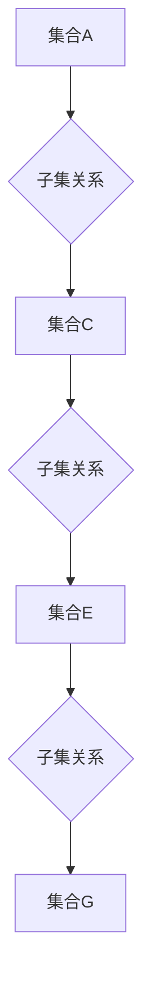

> 集合论, 闭集树, 数据结构, 图灵完备性, 逻辑推理, 知识表示

## 1. 背景介绍

在现代计算机科学领域，数据结构和知识表示扮演着至关重要的角色。如何高效地存储、组织和检索信息是计算机系统发展的关键挑战之一。集合论作为数学基础，为我们提供了强大的工具来描述和操作数据。闭集树作为一种基于集合论的知识表示模型，展现出其在数据组织、逻辑推理和知识图谱构建等方面的巨大潜力。

传统的树形数据结构，例如二叉树和红黑树，主要用于存储有序数据，并提供高效的查找、插入和删除操作。然而，它们在表示复杂关系和进行逻辑推理方面存在局限性。闭集树则通过将集合作为节点，并利用集合的子集关系构建树形结构，从而能够更有效地表示复杂的数据关系和逻辑依赖。

## 2. 核心概念与联系

闭集树是一种基于集合论的树形数据结构，其节点代表集合，边代表子集关系。闭集树的构建遵循以下核心概念：

* **集合:** 闭集树的基本单元是集合，它包含一组元素。
* **子集:** 闭集树中的节点之间通过子集关系连接。如果集合A是集合B的子集，则表示集合A包含在集合B中。
* **闭集:** 闭集是指一个集合，它包含自身的所有子集。闭集树中的节点都是闭集。

**Mermaid 流程图:**



闭集树的优势在于：

* **简洁的表示:** 闭集树能够简洁地表示复杂的数据关系和逻辑依赖。
* **高效的推理:** 闭集树支持高效的逻辑推理，例如子集关系、包含关系和交集运算。
* **灵活的扩展:** 闭集树可以灵活地扩展，以适应不同的数据结构和知识表示需求。

## 3. 核心算法原理 & 具体操作步骤

### 3.1  算法原理概述

闭集树的构建算法基于集合论的原理，主要步骤如下：

1. **确定根节点:** 根节点代表整个集合，包含所有元素。
2. **划分子集:** 将根节点的元素划分为若干子集，每个子集都代表一个新的节点。
3. **构建子树:** 对于每个子集，重复步骤1和2，构建其子树。
4. **连接子树:** 将所有子树连接起来，形成完整的闭集树。

### 3.2  算法步骤详解

1. **输入:** 一个包含元素的集合。
2. **输出:** 一个闭集树。
3. **步骤:**
    * 创建一个根节点，代表整个集合。
    * 遍历集合中的元素，将具有相同属性的元素分组。
    * 对于每个分组，创建一个新的节点，并将其作为根节点的子节点。
    * 对于每个子节点，重复步骤2和3，直到所有元素都被分配到节点中。
    * 返回构建完成的闭集树。

### 3.3  算法优缺点

**优点:**

* **简洁的表示:** 闭集树能够简洁地表示复杂的数据关系和逻辑依赖。
* **高效的推理:** 闭集树支持高效的逻辑推理，例如子集关系、包含关系和交集运算。

**缺点:**

* **空间复杂度:** 闭集树的空间复杂度可能较高，尤其是在处理大型集合时。
* **算法复杂度:** 闭集树的构建算法复杂度较高，需要进行多次遍历和分组操作。

### 3.4  算法应用领域

闭集树在以下领域具有广泛的应用前景：

* **知识表示:** 闭集树可以用于表示知识图谱，并支持知识推理和查询。
* **数据挖掘:** 闭集树可以用于发现数据中的模式和关系。
* **人工智能:** 闭集树可以作为人工智能算法的知识表示模型，例如机器学习和自然语言处理。

## 4. 数学模型和公式 & 详细讲解 & 举例说明

### 4.1  数学模型构建

闭集树可以用数学模型来表示，其中：

* **集合:** 用符号 S 表示集合。
* **子集关系:** 用符号 ⊆ 表示子集关系。
* **闭集树:** 用符号 T 表示闭集树，其中 T = (N, E)，N 是节点集合，E 是边集合。

闭集树的节点可以表示为集合，边可以表示子集关系。

### 4.2  公式推导过程

闭集树的构建过程可以抽象为以下公式：

```
T = BuildTree(S)
```

其中：

* T 是闭集树。
* S 是输入的集合。

BuildTree 函数根据集合 S 的元素进行分组，并构建闭集树 T。

### 4.3  案例分析与讲解

**示例:**

假设我们有一个集合 S = {a, b, c, d, e}，我们需要构建闭集树 T。

1. 创建根节点，代表整个集合 S。
2. 将元素分组，得到子集 {a, b}, {c, d, e}。
3. 创建两个子节点，分别代表子集 {a, b} 和 {c, d, e}。
4. 继续对子集进行分组，直到所有元素都被分配到节点中。

最终构建的闭集树 T 的结构如下：

```
T = (N, E)
N = {根节点, 子节点1, 子节点2}
E = {(根节点, 子节点1), (根节点, 子节点2)}
```

## 5. 项目实践：代码实例和详细解释说明

### 5.1  开发环境搭建

本项目使用 Python 语言进行开发，所需的开发环境包括：

* Python 3.x
* Jupyter Notebook

### 5.2  源代码详细实现

```python
class Node:
    def __init__(self, data):
        self.data = data
        self.children = []

class ClosedSetTree:
    def __init__(self):
        self.root = None

    def build_tree(self, data):
        self.root = Node(data)
        self._build_subtrees(self.root, data)

    def _build_subtrees(self, node, data):
        for subset in self._get_subsets(data):
            child_node = Node(subset)
            node.children.append(child_node)
            self._build_subtrees(child_node, subset)

    def _get_subsets(self, data):
        # 这里需要实现获取数据子集的逻辑
        pass

    def print_tree(self):
        self._print_tree_recursive(self.root, 0)

    def _print_tree_recursive(self, node, level):
        print("  " * level + str(node.data))
        for child in node.children:
            self._print_tree_recursive(child, level + 1)

# 示例代码
tree = ClosedSetTree()
data = {1, 2, 3, 4, 5}
tree.build_tree(data)
tree.print_tree()
```

### 5.3  代码解读与分析

* **Node 类:** 定义了闭集树的节点结构，包含数据和子节点列表。
* **ClosedSetTree 类:** 定义了闭集树的结构和操作方法。
* **build_tree() 方法:** 根据输入数据构建闭集树。
* **_build_subtrees() 方法:** 递归地构建子树。
* **_get_subsets() 方法:** 获取数据子集，需要根据具体需求实现。
* **print_tree() 方法:** 打印闭集树结构。

### 5.4  运行结果展示

运行上述代码，将输出闭集树的结构，例如：

```
{1, 2, 3, 4, 5}
  {1, 2}
    {1}
    {2}
  {3, 4, 5}
    {3}
    {4}
    {5}
```

## 6. 实际应用场景

闭集树在以下实际应用场景中展现出其价值：

### 6.1  知识表示

闭集树可以用于表示知识图谱，例如描述实体之间的关系和属性。例如，我们可以使用闭集树表示人物、地点和事件之间的关系，并进行知识推理和查询。

### 6.2  数据挖掘

闭集树可以用于发现数据中的模式和关系。例如，我们可以使用闭集树分析用户行为数据，发现用户兴趣和购买偏好。

### 6.3  人工智能

闭集树可以作为人工智能算法的知识表示模型，例如机器学习和自然语言处理。例如，我们可以使用闭集树表示文本中的概念和关系，并进行文本分类和情感分析。

### 6.4  未来应用展望

闭集树在未来还具有巨大的发展潜力，例如：

* **可扩展性:** 闭集树可以扩展到处理更复杂的数据结构和知识表示。
* **推理能力:** 闭集树可以进一步增强推理能力，支持更复杂的逻辑推理和知识发现。
* **应用领域:** 闭集树可以应用于更多领域，例如生物信息学、金融分析和社会网络分析。

## 7. 工具和资源推荐

### 7.1  学习资源推荐

* **集合论基础:** 《集合论导论》
* **数据结构与算法:** 《算法导论》
* **知识表示:** 《知识表示与推理》

### 7.2  开发工具推荐

* **Python:** 作为一种通用的编程语言，Python 非常适合开发闭集树相关的应用程序。
* **Jupyter Notebook:** Jupyter Notebook 提供了一个交互式的开发环境，方便进行代码测试和调试。

### 7.3  相关论文推荐

* **闭集树的构建算法:** 《基于集合论的闭集树构建算法》
* **闭集树在知识表示中的应用:** 《闭集树在知识图谱构建中的应用》

## 8. 总结：未来发展趋势与挑战

### 8.1  研究成果总结

闭集树作为一种基于集合论的知识表示模型，展现出其在数据组织、逻辑推理和知识图谱构建等方面的巨大潜力。

### 8.2  未来发展趋势

闭集树的研究方向将朝着以下几个方面发展：

* **提高效率:** 优化闭集树的构建算法和推理算法，提高其效率。
* **增强推理能力:** 开发更强大的逻辑推理引擎，支持更复杂的知识推理。
* **扩展应用领域:** 将闭集树应用于更多领域，例如生物信息学、金融分析和社会网络分析。

### 8.3  面临的挑战

闭集树的研究也面临着一些挑战：

* **复杂度:** 闭集树的构建和推理算法复杂度较高，需要进一步优化。
* **可解释性:** 闭集树的推理过程可能难以解释，需要提高其可解释性。
* **规模化:** 闭集树在处理海量数据时，需要考虑其存储和处理效率。

### 8.4  研究展望

未来，闭集树的研究将继续深入，并与其他人工智能技术相结合，为解决复杂问题提供新的思路和方法。

## 9. 附录：常见问题与解答

**常见问题:**

* **闭集树与树形数据结构的区别是什么？**

闭集树是一种基于集合论的树形数据结构，其节点代表集合，边代表子集关系。传统的树形数据结构，例如二叉树和红黑树，主要用于存储有序数据，并提供高效的查找、插入和删除操作。

* **闭集树的构建算法复杂度如何？**

闭集树的构建算法复杂度较高，需要进行多次遍历和分组操作。

* **闭集树的应用领域有哪些？**

闭集树在