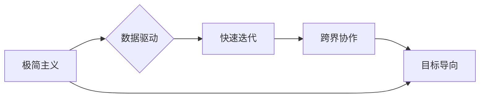

> 马斯克，高效能团队，团队构建，领导力，创新，协作，沟通，目标驱动，文化建设

## 1. 背景介绍

在当今科技飞速发展的时代，拥有高效能团队已成为企业竞争力的关键因素。马斯克，这位科技界的传奇人物，以其创办的 SpaceX、特斯拉等公司，不断突破科技边界，实现惊人的成就。他的成功离不开他独特的团队管理理念，即“马斯克的小团队哲学”。

马斯克的小团队哲学强调团队成员的专业能力、高度的责任感、强烈的使命感以及高效的协作能力。他相信，只有拥有这样一群充满激情和智慧的团队成员，才能在激烈的竞争环境中脱颖而出，创造出颠覆性的创新成果。

## 2. 核心概念与联系

马斯克的小团队哲学的核心概念包括：

* **极简主义:** 剔除不必要的繁琐流程和冗余环节，专注于核心目标的实现。
* **数据驱动:** 基于数据分析和科学决策，不断优化团队工作流程和策略。
* **快速迭代:** 鼓励快速尝试和实验，从失败中学习，不断改进产品和服务。
* **跨界协作:** 打破部门壁垒，鼓励不同领域专家之间的合作，激发创新思维。
* **目标导向:** 明确团队目标，并将其分解为具体的行动计划，确保每个人都朝着共同的目标努力。

**核心概念架构图:**

## 3. 核心算法原理 & 具体操作步骤

马斯克的小团队哲学并非一套固定的算法，而是基于一系列原则和实践，通过不断迭代和优化，形成了一种高效的团队管理模式。

### 3.1  算法原理概述

马斯克的小团队哲学的核心原理是：

* **聚焦核心价值:** 团队成员必须认同公司的核心价值观，并将其融入到日常工作中。
* **赋予团队成员自主权:** 鼓励团队成员独立思考、自主决策，并为自己的工作负责。
* **建立开放透明的沟通机制:** 鼓励团队成员之间坦诚沟通，及时反馈信息，共同解决问题。
* **营造积极向上的团队氛围:** 鼓励团队成员互相支持、互相学习，共同成长。

### 3.2  算法步骤详解

1. **明确团队目标:** 团队领导需要清晰地定义团队的目标，并将其分解为具体的行动计划。
2. **招募优秀人才:** 团队需要招募具备专业技能、高度责任感和强烈使命感的优秀人才。
3. **建立高效的沟通机制:** 团队需要建立开放透明的沟通机制，鼓励团队成员之间坦诚沟通，及时反馈信息。
4. **赋予团队成员自主权:** 团队领导需要信任团队成员，赋予他们自主决策的权力，并为他们的工作负责。
5. **鼓励创新和实验:** 团队需要鼓励团队成员进行创新和实验，从失败中学习，不断改进工作流程和产品。
6. **持续评估和优化:** 团队需要定期评估团队工作成果，并根据实际情况进行调整和优化。

### 3.3  算法优缺点

**优点:**

* 能够激发团队成员的积极性和创造力。
* 能够提高团队的效率和执行力。
* 能够促进团队成员之间的协作和沟通。

**缺点:**

* 需要团队领导具备较强的领导力和管理能力。
* 需要团队成员具备较高的责任感和自我管理能力。
* 需要团队成员之间建立良好的信任关系。

### 3.4  算法应用领域

马斯克的小团队哲学适用于各种类型的团队，包括科技公司、创业公司、非营利组织等。

## 4. 数学模型和公式 & 详细讲解 & 举例说明

马斯克的小团队哲学虽然不是一个严格的数学模型，但我们可以用一些数学概念来描述其核心原理。例如，我们可以用“团队效能”来衡量团队的整体表现，并将其定义为：

**团队效能 = 团队成员能力 * 团队协作效率 * 团队目标达成率**

其中：

* **团队成员能力:** 指团队成员的专业技能、知识水平和经验。
* **团队协作效率:** 指团队成员之间沟通协作的效率。
* **团队目标达成率:** 指团队完成目标任务的比例。

通过优化以上三个因素，可以提高团队的整体效能。

## 5. 项目实践：代码实例和详细解释说明

为了更好地理解马斯克的小团队哲学，我们可以通过一个实际项目来进行实践。假设我们是一个开发团队，需要开发一个新的移动应用程序。

### 5.1  开发环境搭建

首先，我们需要搭建一个合适的开发环境，包括开发工具、代码库、测试环境等。

### 5.2  源代码详细实现

接下来，我们需要编写应用程序的源代码。在代码编写过程中，我们需要遵循以下原则：

* **代码简洁易读:** 编写代码时，需要注重代码的结构和可读性，以便其他团队成员能够理解和维护代码。
* **代码模块化:** 将代码分解成多个独立的模块，以便于维护和扩展。
* **代码测试:** 在编写代码的同时，需要进行单元测试和集成测试，确保代码的正确性和稳定性。

### 5.3  代码解读与分析

在代码编写完成后，我们需要进行代码解读和分析，确保代码能够满足项目需求，并进行必要的优化。

### 5.4  运行结果展示

最后，我们需要将应用程序部署到测试环境中，进行测试和调试，并最终发布到应用商店。

## 6. 实际应用场景

马斯克的小团队哲学在实际应用场景中得到了广泛的应用，例如：

* **SpaceX:** 马斯克带领SpaceX团队，突破了火箭发射和太空探索的技术瓶颈，实现了人类首次商业太空旅行。
* **特斯拉:** 马斯克带领特斯拉团队，推动了电动汽车的普及，并加速了新能源汽车产业的发展。
* **Neuralink:** 马斯克创办的Neuralink公司，致力于开发脑机接口技术，为人类健康和福祉带来新的希望。

## 7. 工具和资源推荐

### 7.1  学习资源推荐

* **《Elon Musk: Tesla, SpaceX, and the Quest for a Fantastic Future》:** 这本书详细介绍了马斯克的生平和商业理念。
* **《Zero to One: Notes on Startups, or How to Build the Future》:** 这本书探讨了创业和创新方面的核心原则。
* **《The Lean Startup》:** 这本书介绍了快速迭代和数据驱动的创业方法。

### 7.2  开发工具推荐

* **GitHub:** 用于代码托管和协作开发的平台。
* **Jira:** 用于项目管理和任务跟踪的工具。
* **Slack:** 用于团队沟通和协作的平台。

### 7.3  相关论文推荐

* **"The Impact of Team Structure on Team Performance"**
* **"The Role of Leadership in Team Effectiveness"**
* **"The Importance of Communication in Teams"**

## 8. 总结：未来发展趋势与挑战

马斯克的小团队哲学为高效能团队的构建提供了宝贵的经验和启示。未来，随着科技的不断发展，团队管理理念也将不断演进。

### 8.1  研究成果总结

马斯克的小团队哲学的核心在于：

* **聚焦核心价值:** 团队成员必须认同公司的核心价值观，并将其融入到日常工作中。
* **赋予团队成员自主权:** 鼓励团队成员独立思考、自主决策，并为自己的工作负责。
* **建立开放透明的沟通机制:** 鼓励团队成员之间坦诚沟通，及时反馈信息，共同解决问题。
* **营造积极向上的团队氛围:** 鼓励团队成员互相支持、互相学习，共同成长。

### 8.2  未来发展趋势

未来，高效能团队的构建将更加注重以下方面：

* **人工智能技术的应用:** 人工智能技术可以帮助团队成员更高效地协作和沟通，并提供更精准的数据分析和决策支持。
* **虚拟现实和增强现实技术的应用:** 虚拟现实和增强现实技术可以帮助团队成员更好地进行远程协作和沉浸式体验。
* **跨文化团队的管理:** 随着全球化进程的加速，跨文化团队的管理将成为一个重要的挑战和机遇。

### 8.3  面临的挑战

高效能团队的构建面临着以下挑战：

* **人才短缺:** 优秀的团队成员是高效能团队的基础，但优秀的团队成员往往供不应求。
* **文化差异:** 不同文化背景的团队成员之间可能存在沟通和理解上的障碍。
* **组织结构的僵化:** 一些传统的组织结构可能不利于高效能团队的运作。

### 8.4  研究展望

未来，我们需要进一步研究高效能团队的构建机制，探索人工智能、虚拟现实和增强现实等新技术的应用，以及跨文化团队管理的最佳实践，为构建更加高效、创新和充满活力的团队提供更有效的解决方案。

## 9. 附录：常见问题与解答

**常见问题:**

* 如何招募优秀人才？
* 如何建立高效的沟通机制？
* 如何赋予团队成员自主权？
* 如何鼓励创新和实验？

**解答:**

* 招募优秀人才需要注重人才的专业技能、知识水平、经验和价值观。
* 建立高效的沟通机制需要建立开放透明的沟通平台，鼓励团队成员之间坦诚沟通，及时反馈信息。
* 赋予团队成员自主权需要信任团队成员，赋予他们自主决策的权力，并为他们的工作负责。
* 鼓励创新和实验需要营造一个鼓励尝试和学习的氛围，并为失败提供支持和帮助。

作者：禅与计算机程序设计艺术 / Zen and the Art of Computer Programming 
<end_of_turn>